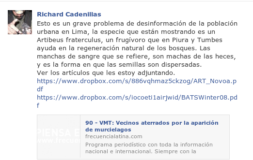
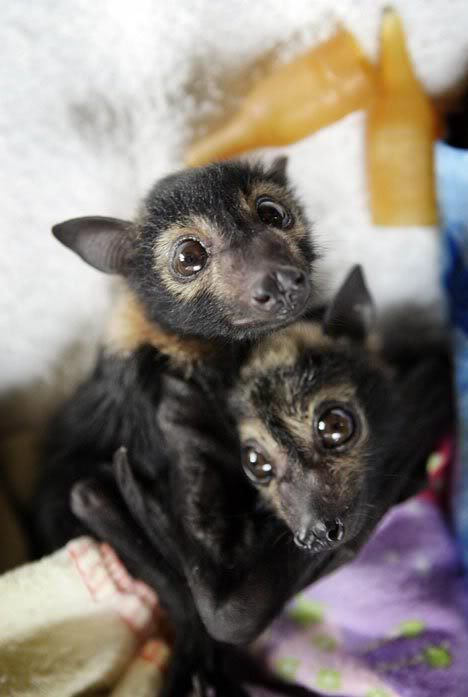
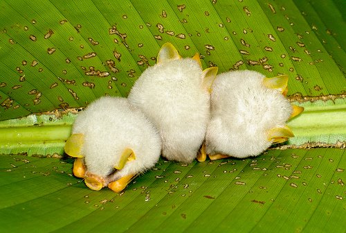
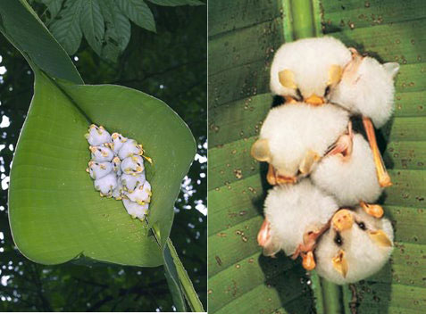
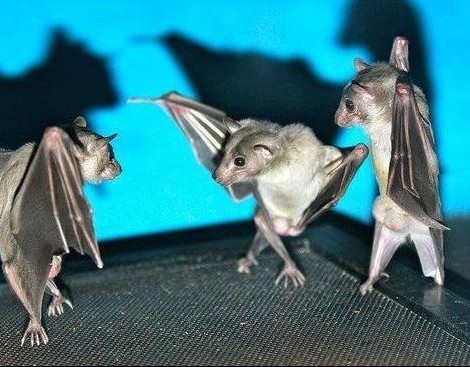

# El ataque de los murciélagos invasores

###Ya se enteraron de la más reciente amenaza que afecta a los limeños?

Según [una noticia de Frecuencia Latina](http://www.frecuencialatina.com/90/noticias/vmt-vecinos-aterrados-por-la-aparicion-de-murcielagos/)

> Vecinos de Villa María de Triunfo están aterrados por la aparición de gran
cantidad de  murciélagos.
> Habría un nido de murciélagos en un árboles frutal, son atraídos a la fruta y vuelan de noche.

Los vecinos están reclamando a la municipalidad desde hace 2 meses, están
aterrados, tienen miedo de dormir. 

> Había bastantes murciélagos, uno voló por arriba y un conejito apareció
muerto.
> Hay bastantes gotas de sangre sobre las paredes de las casas y las señoras
están cansadas de limpiar las manchas de sangre.

Una señora dice:

> El murciélago estaba en mi pared. Lo maté y boté a la basura

Hubiera sido chévere si Frecuencia Latina indagaba un poquito en la Internet.
Buscaba un poco de información en Wikipedia y hubiera aprovechado la
oportunidad para despejar las dudas de los televidentes, **informar sobre la vida
de los murciélagos y no solo sobre la vida de Tilsa Lozano**. 

Podía preguntar a algún especialista del [Museo de Historia Natural de la Av. Arenales](http://museohn.unmsm.edu.pe/Buckup/divisiones/zoologia/mastozoologia/mastozoologia.php?val=8)
donde hay científicos que justamente tienen un proyecto titutalo:

> Situación actual de los murciélagos amenazados de la ciudad de Lima.

"Keep calm!" que aquí en Utero.pe te diremos "todo lo que siempre quisiste saber sobre
murciélagos pero nunca te animaste a preguntar".

* *Por qué esos científicos tienen un proyecto con ese título?*  
Por que hay murciélagos que están considerados como especies amenazadas.
  [Incluso varias se han extinguido](http://es.wikipedia.org/wiki/Chiroptera#Amenazas_y_conservaci.C3.B3n).

* *Ay, pero los murciélagos son malos, chupan sangre y se posan sobre mi pared y se murió un conejito*  
Según los últimos conteos, [existen 1,116 especies de murciélagos en el mundo](http://www.departments.bucknell.edu/biology/resources/msw3/browse.asp?id=13800001),
y *solo 3 especies se alimentan de sangre*. [Estas tres especies son conocidas como vampiros](http://es.wikipedia.org/wiki/Desmodontinae).

* *Y qué comen el resto de 1,113 especies de murciélagos?*  
Comen [insectos, frutas, toman néctar de las flores y algunas son tan bacanes que hasta comen peces!](http://es.wikipedia.org/wiki/Chiroptera#Alimentaci.C3.B3n).

* *Aishh, pero estos murciélagos botan manchas de sangre sobre mi pared, deben ser vampiros*  
Cómo sabe que son manchas de sangre? porque son de color rojizo? Si estos
murciélagos fueran vampiros, no estarían siendo atraídas por las frutas. En el
Facebook, el biólogo Richard Cadenillas dice que lo que está viendo *"son
manchas de las heces, esa es la forma en que las semillas son dispersadas"*.

Fijése bien en esas manchas, es probable que encuentre bolitas pequeñas que
resulten ser semillas.

* *Y el conejito que se murió, no es culpa del murciélago?*  
Estos murciélagos comen fruta, entonces es probable que el conejito murió por
otras causas. Talvez del susto de ver pasar a un murciélago?

* *Entonces estos murciélagos no hacen daño?*  
Los murciélagos que comen árboles frutales sirven como dispersores de semillaṣ.
Ya que el árbol frutal no puede dispersar sus semillas por sí mismo, recibe
ayuda del murciélago. Los murciélagos insectívoros eliminan plagas y moscas.
Los nectarívoros se encargan de polinizar plantas. Mirar en Wikipedia, la
sección que dice [Beneficios para el hombre](http://es.wikipedia.org/wiki/Chiroptera#Beneficios_para_el_hombre).

* *Ay, pero igual los murciélagos me asustan, son bien feos*  
Feos? los murciélagos son espectaculares, son los únicos mamíferos con la
capacidad de volar! Han modificado sus "manos" y desarrollado membranas entre
los "dedos" que le permite imitar lo que conocemos como "alas".
Los murciélagos tienen radares incorporados que les permiten "ver" basándose en
la decodificación de los sonidos que rebotan desde los objetos y son captados
por sus orejas (fenómeno conocido como
        [ecolocación](http://es.wikipedia.org/wiki/Chiroptera#Ecolocaci.C3.B3n)).

* *Serán chéveres, pero son feos de apariencia y me asustan*  
Usted ha visto un murciélago con detenimiento? Aquí te dejo un galería de
murciélagos. Si luego de verla sigues diciendo que son feos, te voy a regalar
un espejo esta navidad para que sepas lo que es ser feo.

