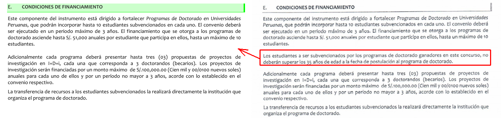
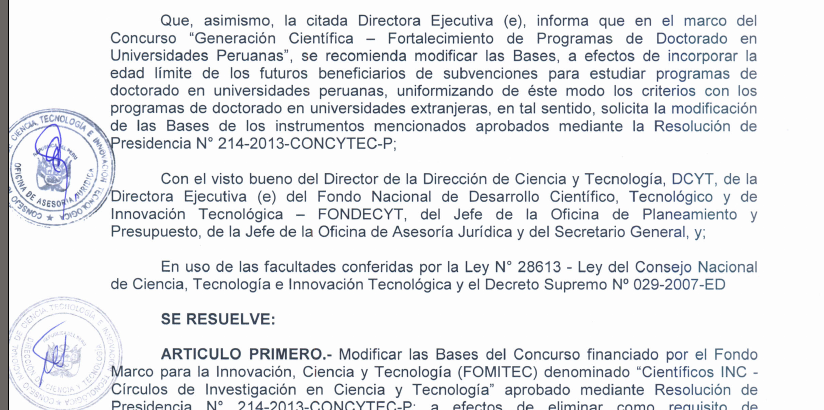
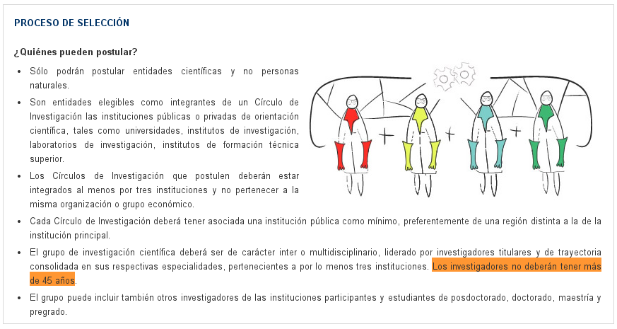
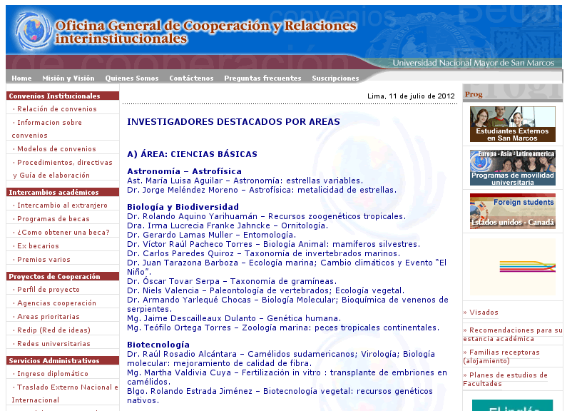

En un post anterior opiné que me parecía criticable que se limite la
postulación de jóvenes a becas de mastría y doctorado en base a edad. Es
lamentable ver que jóvenes con potencial no puedan postular por haber
nacido, por ejemplo, con un mes de anticipación. Si te demorabas 1
mesesito más en el vientre de tu madre la hacías linda... El proyecto
original sobre la obtención de becas doctorales fue elaborado en
colaboración por la PCM y CONCYTEC y **no estipulaba nigún límite de
edad**. Pero el documento que fue finalmente aprobado es igualito, con
una excepción. Se incluye el límite de 35 años para los postulantes.
Quiénes insertaron este parrafito allí en la sección **Condiciones de
Financiamiento**?

Aquí está el documento **firmado por la presidenta de CONCYTEC,
Dra. Gisella Orjeda**, donde se aprueba el programa de becas,
[Resolución de Presidencia
022-2014-CONCYTEC-P](http://portal.concytec.gob.pe/images/stories/images2014/portal/areas-institucion/fondecyt/cienciactiva/rp_022_2014_p.pdf) y
**donde se recomienda modificar las bases e incluir el límite de edad**,
para estar alineados a los estándares internacionales.

Más malas noticias
==================

Pero los límites de edad que pone CONCYTEC también afecta a los
investigadores curtidos y experimentados que ya tienen doctorado y
post-doctorado. CONCYTEC tiene un reciente programa de financiamiento
llamado [**Científicos
INC**](http://portal.concytec.gob.pe/index.php/fondecyt-becas/cienciactiva/cientificos-inc-subvenciones-para-formacion-de-circulos-de-investigacion-en-ciencia-y-tecnologia.html).
Este programa es espectacular ya que:

> El esquema de financiamiento de este programa permitirá subvencionar
> hasta por S/ 1,5 millones de nuevos soles a cada Círculo de
> Investigación, por un lapso de tres años de actividad.

El dinero que se otorga es de una cantidad seria. Y como debe ser, se
espera que la investigación se realice de manera seria y de alto nivel.
Por eso los proyectos son:

> [orientados] a fomentar el trabajo colaborativo, de preferencia inter
> o multidisciplinario, de los investigadores del país a fin de acelerar
> el desarrollo científico y tecnológico promoviendo proyectos de
> investigación interinstitucionales.

Por fin los profesores universitarios (los cuales son la principal masa
de científicos que tiene el Perú) pueden tener financiamiento decente.
Apliquen todos! Pero (déjà vu) hay un pequeño detalle. CONCYTEC pone
como [límite 45
años](http://portal.concytec.gob.pe/index.php/cienfitificos-inc-proceso-de-seleccion.html)
a los investigadores que pueden aplicar a este programa de
financiamiento. Si eres un investigador con experiencia, publicaciones y
reconocido en tu campo, pero tienes 46 años o más, piña no puedes
postular y ni sueñes ser un **Científico Inc.** 

Este límite de edad es discriminatorio (se selecciona excluyendo, [fuente:
RAE](http://buscon.rae.es/drae/srv/search?val=discriminar)). Pero lo que
me cuesta entender es por qué se selecciona en base a la edad. Sobre
todo por qué poner el límite tan bajo de 45 tiernos años. Meritocracia
te necesitamos ya! Pregunto si CONCYTEC sabe quiénes son los que tienen
mayor producción científica en las facultades? Los que publican la mayor
cantidad de artículos científicos **no son los más chibolos** de la
plana docente. Tú amiguito que estas estudiando una carrera científica a
nivel de pregrado, detente un rato y mira tus profes. Quiénes son los
que producen más ciencia? Los jefes de práctica? Los profesores
auxiliares o los profesores principales con más de 20 años de
experiencia docente y de investigación? Supongo que estas becas deben ir
hacia lo mejor de lo mejor que tiene cada facultad y basta ver la [lista
de investigadores
destacados](http://www.unmsm.edu.pe/coop/contenidobd1a.html?pag1=27) por
áreas que ha publicado la **Oficina General de Cooperación y Relaciones
interinstitucionales** (de la UNMSM) para saber quienes son los capos de
cada facultad. 

Yo siendo biólogo conozco a todos los que figuran en la sección **Biología y
Biodiversidad**. Todos ellos han sido mis profes, y **NINGUNO tiene
menos de 45 años!** La media de edades debe ser estar entre 55 y 60.
Parece contradictorio que por un lado se quiera fomentar ciencia de alto
nivel pero se deje de lado a los que están más calificados.

Y los jóvenes investigadores?
-----------------------------

**"Los viejos a la tumba, los jóvenes a la obra?"** En principio este
proyecto de CONCYTEC me parece bien pensado porque:

> El esquema de financiamiento de este programa facilitará recursos
> públicos para la creación de 12 grupos (Círculos de Investigación)
> compuestos por un **director de proyecto, quien actuará como
> investigador principal, y no menos de dos investigadores por
> institución participante**, quienes desarrollarán investigaciones en
> determinadas áreas del proyecto durante tres años.

En esas condiciones tranquilamente pueden acomodar al profe más capo de
todos como investigador principal e incluir a cuadros jóvenes como
investigadores colaboradores. **Así funciona la ciencia en todo el
mundo**. Juntas al científico experimentado con los científicos novatos
en un mismo proyecto para que los jóvenes ganen experiencia y sean bien
guiados. Es por eso que cuando haces tu tesis debes tener
obligatoriamente un asesor experimentado. Pero tal como está la
situación, los profesores tendrán que pensar en jubilarse a los 46 años?
De allí solo dedicarse a la docencia? No entiendo. 

Creo que algunos
futbolistas tienen carreras profesionales más largas y se retiran a los
58 años como el Chorrillano Palacios por ejemplo (no te vayas Chorri!).
