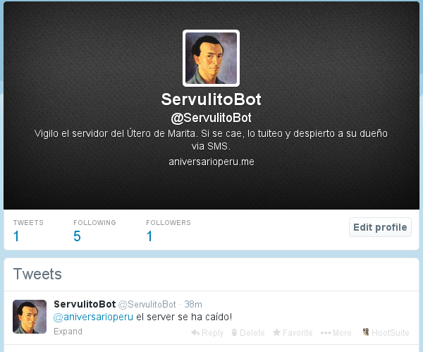
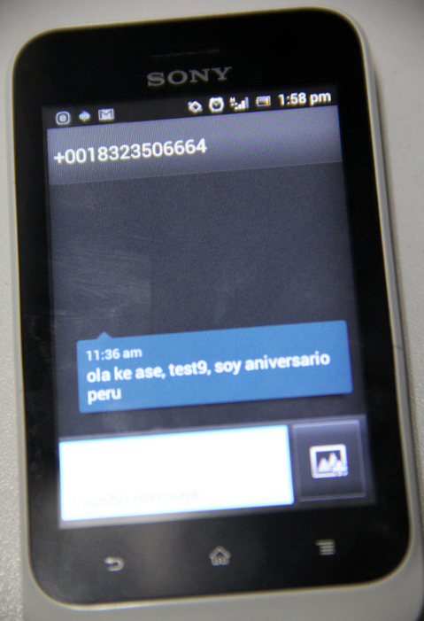

# ServulitoBot, vigilante del servidor del uterope

Ya algunos lectores de este blog se deben haber dado cuenta que el servidor que
alberga al uterope se cae de cuando en vez. Esto ocurre generalmente cuando hay
apagón en la zona de Miraflores... (hmmm).
Además ya van dos días consecutivos que el servidor del uterope está caído en altas horas
de la madrugada, justo cuando me apresto a leer las noticias del día.

Si bien durante el día nuestros lectores son amables en hacer notar a 
[Ocram](https://twitter.com/ocram) y
    [Ernesto](https://twitter.com/ernestocabralm) (el Uteam) de este tipo de fallas técnicas, nadie se da cuenta si
    el servidor se cae en la madrugada. Yo me doy cuenta, pero es inútil
    avisarles por tuiter ya que a las 3:00am están durmiendo plácidamente.

Entonces, hay la necesitad de diseñar un método, de preferencia automático, que
despierte al Uteam en las madrugadas cuando el servidor del uterope está caído.

Se me ocurrió algo gracias al tuit del amixer [Paul Gutierrez](https://twitter.com/pivange):

https://twitter.com/pivange/status/435867712107991040

Tanto Ocram como Ernesto cometieron el craso error de darme sus números
de teléfono celular. Entonces he creado un tuiter bot llamado
[@ServulitoBot](https://twitter.com/ServulitoBot) que hace lo siguiente:

* Se activa cada hora y se fija si la web <http://utero.pe> está funcionando
  con normalidad.
* Si el servidor se ha caído. [@ServulitoBot](https://twitter.com/ServulitoBot)
  inmediatamente envía un mensaje de
  texto al celular de Ocram y Ernesto. No importa si es de día o de madrugada,
  igual envía el SMS avisando que el servidor necesita ser encendido.
* [@ServulitoBot](https://twitter.com/ServulitoBot) también enviará un mensaje via tuiter (*mention*) y un *dm* a
  cada uno de nuestros amixers.

Con mi, por ahora, amixer [Miguel Guerra](https://twitter.pe/miguelguerrape)
estuvimos haciendo ensayo tras ensayo hasta que finalmente logramos hacer que 
[@ServulitoBot](https://twitter.com/ServulitoBot) logre funcionar como
queríamos.

Aquí uno de los mensajes de texto a modo de prueba que
[@ServulitoBot](https://twitter.com/ServulitoBot) envió al celular de Miguel:

[@ServulitoBot](https://twitter.com/ServulitoBot) tiene su cuenta de tuiter,
está escrito en el lenguaje de programación Python y hace uso de las interfases
API de Twitter y Plivo (el servicio de SMS).

[@ServulitoBot](https://twitter.com/ServulitoBot) es el nuevo miembro del
uterope y estará cumpliendo servicios desde el día de hoy.

Pero tú también puedes tener tu propio clon de @ServulitoBot! Este bot es 
[*open access*](http://en.wikipedia.org/wiki/Open_access) y está **disponible sin
costo alguno para todos ustedes** desde esta dirección web
<https://github.com/aniversarioperu/servulitobot>.

Las instrucciones de cómo instalar, configurar y correr este bot están en la
página web mencionada.

