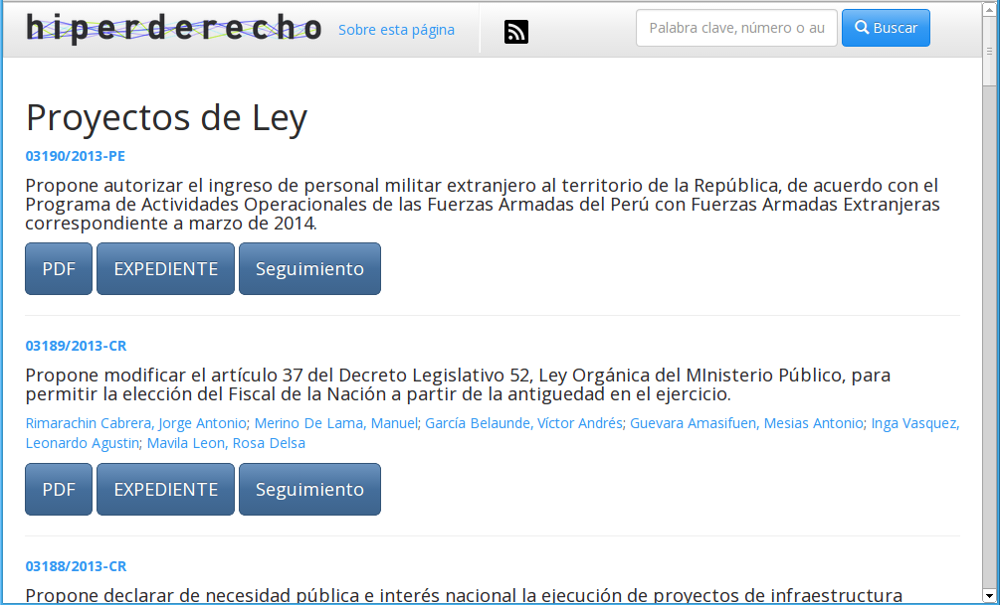

Organizando los proyectos de ley del Congreso
=============================================

Los amigos de [Hiperderecho han
presentado](http://www.hiperderecho.org/2014/02/presentamos-proyectosdeley-pe/)
hace poco su aplicación web <http://proyectosdeley.pe>:

> Proyectosdeley.pe es una aplicación web que muestra en forma ordenada
> y accesible los proyectos de ley presentados en el Congreso peruano.
> Es nuestro primer intento de abrir la información estatal usando
> creativamente la tecnología para promover la transparencia.

Ya que el proyecto es público, se me ocurrió contarles rápidamente cómo
es que logré programar esta aplicación web.

Este proyecto trata de presentar la información sobre los proyectos de
ley producidos por el Congreso en una interfase amigable e intuitiva.

Características técnicas
=======================

*Open Source*
-------------

Esta aplicación ha sida escrita en el lenguaje de programación Python.
Es un software muy simple ya que consiste en una colección de scripts
que se encargan de extraer, parsear, indexar la información y generar
las páginas webs además del buscador de proyectos.

Hiperderecho ha sido muy amable en publicar el código fuente de esta
aplicación de manera pública (*open source*) en su cuenta de Github:
<https://github.com/hiperderecho/proyectos_de_ley>. Esto permite que
cualquier interesado pueda tener su propia instalación de Proyectos de
Ley. Además cualquier programador puede aumentar, mejorar y corregir
componentes de este software.

Uso de librerías *open source*
------------------------------

Para evitar reinventar la rueda, decidí usar librerías disponibles *open
source* que me ayudaron a agregar características y funciones al
proyecto.

Por ejemplo cada proyecto de ley tiene un **identificador único** que
consiste en letras y números de manera parecida a los URL de Youtube.
Esto es posible debido al uso de la librería **short\_url**. Esta
librería acepta una dirección URL normal, larga y la convierte en una
dirección URL corta, como esta: <http://proyectosdeley.pe/p/4dyqed>.
Esta librería está disponible aquí
<https://pypi.python.org/pypi/short_url> y es relativamente fácil
enchufarla a cualquier aplicación que use Python.

Otra librería muy útil es la llamada **BeautifulSoup**. Esta librería es
de crucial importancia para ProyectosDeLey. Se usa para extraer
información desde páginas web que contienen datos sin organización
formal. Lo ideal es que las páginas web del Congreso contengan una
interfase (API) que se encargue de publicar la información de una manera
estructurada y que sea fácilmente entendida por las computadoras. En el
caso de nuestro Congreso esto no funciona así. El Congreso publica sus
páginas web en un formato que es entendible para humanos pero no para
computadoras.

Aquí es cuando **BeautifulSoup** hace su entrada. Esta librería permite
extraer la información de las páginas destinadas para que sean leídas
por humanos. Lo que hace es procesar las páginas web en búsqueda de
información que sea entendible y procesable por computadoras. Este
proceso se conoce como [***web
scraping***](http://en.wikipedia.org/wiki/Data_scraping) y no es lo
ideal, pero es lo único que se puede hacer en el caso de nuestro
Congreso. La alternativa sería contratar a alguien para que se ponga a
copiar y pegar la información en hojas Excel.

Librerías adicionales son las siguientes:

-   **requests**: Manera fácil de descargar páginas web.
-   **dataset**: Interfase para utilizar la base de datos SQLite.
-   **PyRSS2Gen**: Simple generador de *RSS feeds*.

Uso de una base de datos
------------------------

Una vez que la información sobre los proyectos de ley ha sido descargada
(título, autores, fecha de publicación, etc.) es necesario almacenar los
datos localmente para poder ser indexados y encontrados por el motor de
búsqueda. Toda esta información es continuamente almacenada en una base
de datos relacional SQLite. Esta base de datos contiene la información
organizada en filas, columnas y tablas relacionadas entre sí y
almacenadas de manera indexada.

SQLite cae a pelo para este proyecto ya que toda la base de datos es
contenida en un único archivo DB. Además que solo existe un agente
introduciendo información (el script mismo) y numerosos agentes
extrayendo información (usuarios visitantes del sitio web). Si este
proyecto hubiera tenido múltiples agentes introduciendo información
hubiera sido necesario utilizar otra base de datos (posiblemente MySQL).

El nombre SQLite puede hacer pensar que esta es una base de datos misia,
pero en realidad [puede almacenar hasta 140
Terabytes](http://sqlite.org/limits.html) de información! Realmente
increíble.

Otra ventaja es la portabilidad. Si quieres copiar la base de datos,
todo lo que debes hacer es copiar el archivo DB (**leyes.db** en este
caso) y listo! Si usas MySQL tienes que hacer database dumps y luego
imports para copiar bases de datos.

Auto activación
---------------

El software de Proyectosdeley se activa solito cada 3 horas y empieza a
buscar proyectos nuevos que hayan sido colgados en la web del
Congreso. Si los hay, los descarga, parsea y los guarda indexados en la
base de datos local.

Cuando ya no hay más proyectos por descargar o procesar, empieza a
generar los archivos HTML que puedes ver si visitas el sitio web.
También genera las páginas web para cada congresista que haya sido autor
de al menos un proyecto de ley.

También se generan los nuevos items del RSS feed para que los puedas ver
en tu agregador de preferencia y no tengas que estar visitando
<http://proyectosdeley.pe> a cada rato.

Todo esto lo hace automáticamente, solito! No se requiere que ninguna
persona meta mano. Esta web ya viene funcionando más de 3 meses sin
presentar problema alguno.

El software de Proyectosdeley no solo está escrito en el lenguaje
Python. **Existe un 15% del software que ha sido escrito en el lenguaje
JavaScript**. Los componentes en JavaScript se encargan de darle
interactividad a la interfase web. O sea, la principal función es
embellecer el proyecto. JavaScript es muy bueno para agregar pequeños
efectos web como transparencias, cambios de color, efectos **fade in**,
**fade out**, paginación, reubicación de la pantalla web (entre otras
cosas más) que pueden ser imperceptibles pero hacen que la interacción
de los usuarios con la web sea más agradable.

Pero más importante es la combinación de JavaScript con Python para
producir el motor de búsqueda de proyectos que tiene incluido el sitio
web.

Este buscador es muy simple pero te permite encontrar proyectos según el
título, autores, o código de proyecto. Esta es una ventaja porque la web
del congreso no te permite buscar proyectos. Podrías buscarlos en
Google, pero hay que notar que no todos los proyectos han sido indexados
por Google. En cambio en Proyectosdeley están indexados todos los
proyectos generados por el Congreso desde el año 2011 (más de 3 mil
proyectos hasta la fecha).

TL;DR
-----

El sitio web <http://proyectosdeley.pe> es muy chévere para encontrar
los proyectos generados por nuestro Congreso. Este post hace un pequeño
recuento de algunos aspectos técnicos.
