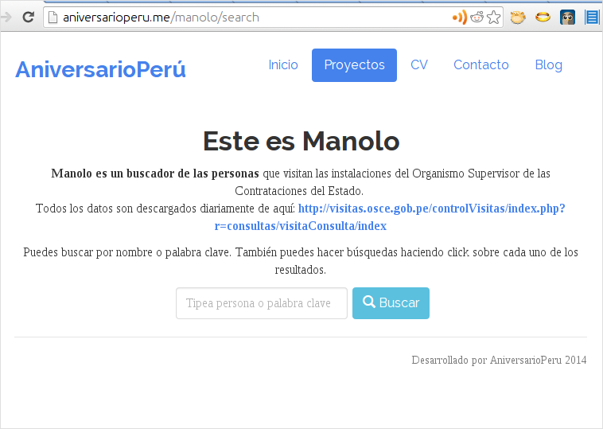
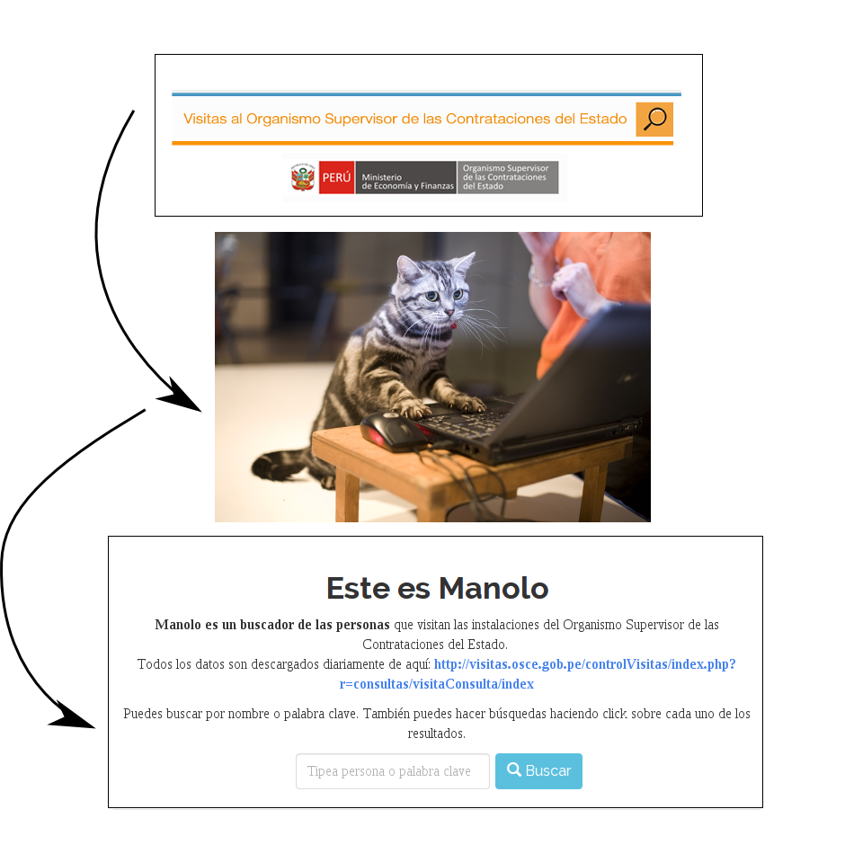

# Manolo, buscador de lobistas

Presento un buscador de personas que ingresan las oficinas del **Organismo
Supervisor de las Contrataciones del Estado**.
<http://aniversarioperu.me/manolo/>

# Motivación
Tú conoces a mi amigo Manolo? Manolo está enamorado de una de las secretarias
que trabaja en el Organismo Supervisor de las Contrataciones del Estado. Manolo
tiene el problema que uno de sus patas lo quiere atrasar.

Mi amigo sabe que todo aquel que visita el Organismo de Contrataciones debe
registrarse dejando su **nombre, DNI, motivo de visita, empleado público que lo
recibe, hora de ingreso, salida y fecha**. Toda esta información está
disponible en la Internet en esta dirección:
<http://visitas.osce.gob.pe/controlVisitas/index.php?r=consultas/visitaConsulta/index>

El problema es que la interfaz no es muy amigable y sólo se pueden buscar
visitantes a la institución por día. Seleccionas cualquier día del menú y veras
todos los visitantes que de esa fecha. Si quieres saber cuántas veces ha visitado
el lugar una determinada persona, debes buscar día por día, página por página,
   revisar línea por línea en búsqueda de la persona de interés.

Obviamente este tipo de búsqueda es muy tedioso, aburrido, inexacto (se presta
a errores de conteo) además que toma demasiado tiempo hacer una simple
búsqueda.

Para ayudar a mi chochera decidí construir un simple buscador de personas que
visitan dicha institución estatal. La función de este buscador simple:
**Tipeas un nombre y aparecerán en pantalla todas las veces que la persona
tenga ingresos registrados al Organismo de Contrataciones.**

# Funcionamiento
Este buscador consiste en una serie de muy simples *scripts* que a diario
descargan la información directamente de la página web del control de visitas
del Org. de Contrataciones.

Ya que esta institución no provee ninguna interfaz 
([API](http://en.wikipedia.org/wiki/Application_programming_interface)) 
para descargar los
datos, es necesario hacer un rudo y crudo *screen scraping* (tratar de cosechar
los datos a la mala). Todos los datos son indexados y almacenados una base de
datos local ([SQLite](http://en.wikipedia.org/wiki/SQLite) es ideal para estos
fines).

Toda la información es presentada a los usuarios usando un simple motor de
búsqueda local. Simplemente tipeas un nombre (completo o en parte) y haces
clic en **Buscar**. Listo!

A manera de bonus, puedes hacer búsquedas haciendo clic en cualquiera de los
resultados. Por ejemplo si haces clic en el resultado **REUNIÓN DE TRABAJO**
obtendrás una lista de todas las personas que visitan el lugar con la misma
intención.

# Posibles aplicaciones
Es tan fácil buscar personas en este buscador que Manolo podrá ubicar
rápidamente a su competencia y averiguar si este individuo visita a la
secretaria de sus amores todos los días, de vez en cuando, a qué horas la
visita, etc.

Pero se me ocurrió que además es posible que  lobistas puedan
monitorear a la competencia y ver si están perdiendo contratos por culpa de sus
enemixers.

También es posible que periodistas puedan utilizar esta herramienta para pillar
lobistas que caigan en evidente conflicto de interés. Por ejemplo podrían
buscar si la pareja de algún flamante ministro o ministra es visitante asiduo
de esta institución estatal. Nadie quiere que estas situaciones ocurran porque
habría el potencial caer en corrupción.

Entonces todos tienen potencial de ganarse con esta herramienta: Manolo,
lobistas, periodistas, el pueblo peruano si es que se detectan actos de
corrupción. Todos ganan menos la secretaria. Es que Manolo no es buen partido.

# Quejas
Según la página del control de visitas del Org. de Contrataciones
puedes buscar visitantes desde el año 2004, pero solo hay datos
disponibles desde fines del 2012. Será que durante el 2011 y casi todo el 2012
no se registraba a los visitantes?

Por qué el grupo de informática del Estado hace un buscador de visitas que
dificulta la labor de Manolo? Si el buscador del Estado fuera más chévere yo no
tendría que haber programado esta aplicación web para mi amigo.

# Un buscador para el Congreso?
Ya tú sabes que en el Útero de Marita hacemos *software open source* y te
puedes bajar el código fuente de este buscador desde [mi cuenta de Github](https://github.com/aniversarioperu/manolo).
Si eres programador puedes adaptar este buscador para aplicarlo a otra lista
de visitas que tenga alguna otra institución del Estado. Por ejemplo **el
Congreso de la República**. Hay tantos congresistas que debe llegar harta gente
interesante buscando entrevistarse con ellos.

No sé si el Congreso tenga un libro de registros ya que nunca he visitado el
Congreso. Mi mamá me tiene prohibido visitar lugares de mala reputación. Tampoco sé
si este registro está en Internet. Alguien sabe? Sería chévere
tener un buscador de visitas de personas que llegan al Congreso.

# Cómo se llama este buscador?
Ya que esta aplicación web puede ser útil para fines más loables que vigilar la
competencia de Manolo, y ya que fue a él a quien se le ocurrió la idea de
fabricar este buscador, he decidido bautizar a este buscador con el nombre de
Manolo.

Así que, Manolo Pajares, si estás leyendo, te dedico este buscador.

Esta es la dirección web de **Manolo, buscador de personas**:
<http://aniversarioperu.me/manolo/>

