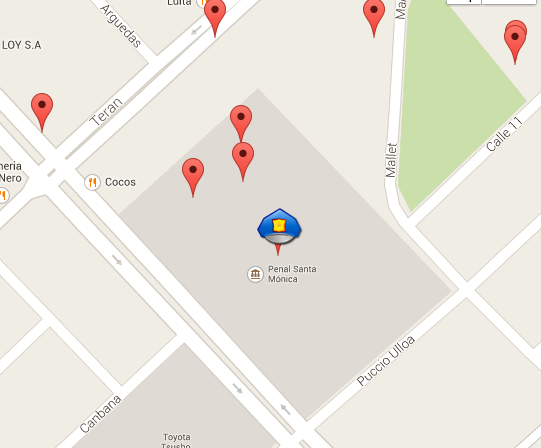
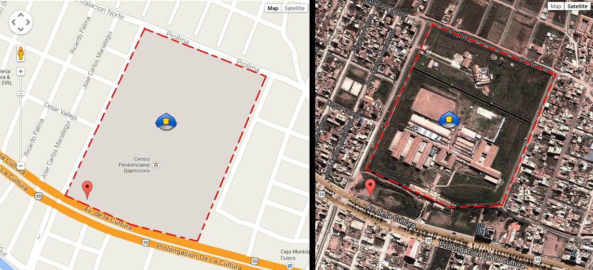
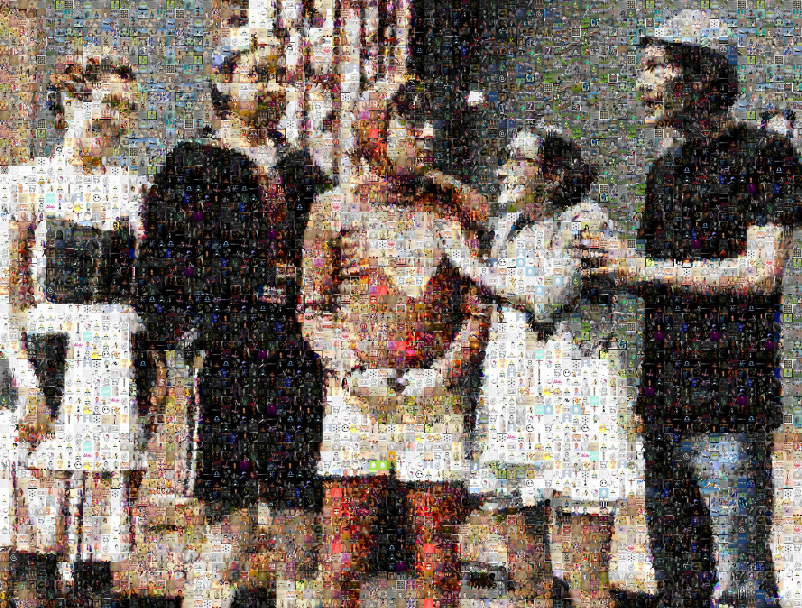
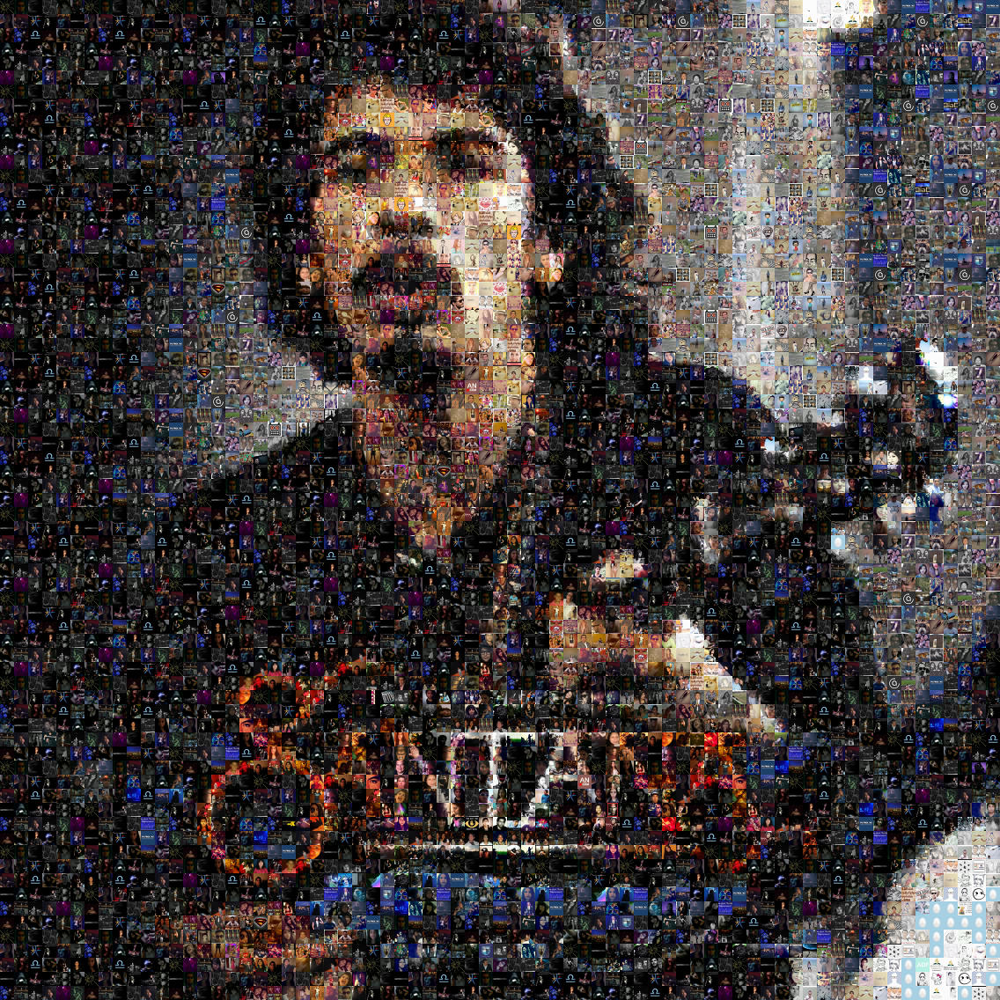
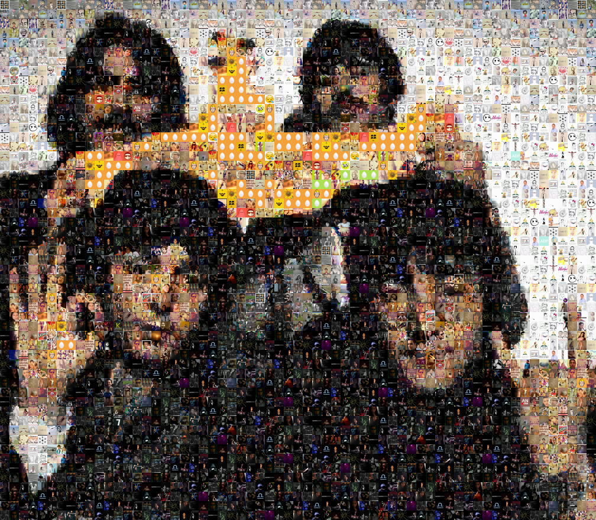

Te acuerdas de ArturitoBot?

En [un post anterior](http://aniversarioperu.utero.pe/2014/02/11/vigilando-las-carceles-del-peru-desde-twitter/) te presenté
[@ArturitoBot](https://twitter.com/ArturitoBot), un bot de tuiter, que tiene
como función monitorear las cárceles del Perú en busca de tuits que hayan sido
emitidas desde adentro de las prisiones.

@ArturitoBot colecta tuits que hayan sido emitidos en las cercanías de cada
(prisión en el radio de 1km). Toda esta info es almacenada en una base de datos local. Y si algún
tuit fue emitido desde adentro de la cárcel, @ArturitoBot retuiteará dicho
tuit.

@ArturitoBot ha ido encontrando algunos tuits (son pocos pero son). Si bien
algunos son normales como éste emitido desde el penal de Lurigancho.

https://twitter.com/Minsa_Peru/statuses/443403299761700864

Otros tuits son algo extraños. Por ejemplo este emitido desde el Penal Santa
Mónica:

https://twitter.com/adolfo24450/status/443022396938018817

En realidad hay varios tuits que han sido emitidos desde dentro del Penal Santa
Mónica:

También hay un par de falsos positivos. Pero no son culpa de @ArturitoBot. Son
mi culpa debido a que hice una mala delimitación del perímetro de alguna de las
cárceles.
@ArturitoBot usa el famoso algoritmo llamado
**[Ray-casting algorithm](http://rosettacode.org/wiki/Ray-casting_algorithm)** que ese
usa para averiguar si algún punto está dentro de los confines de un polígono.
En este caso cada prisión es representada por un polígono y @ArturitoBot hace sus cálculos para
averiguar si el tuit cae dentro de alguno de los polígonos.

Mi error fue guiarme de una la vista "Map" en GoogleMaps para delimitar el
polígono que engloba a cada cárcel. Debí haber hecho este procedimiento en la
vista "Satellite" de GoogleMaps.

En el caso del Centro Penitenciario Qqenccoro en Cusco, @ArturitoBot encontró
un falso positivo. Si ves el mapa en la forma "Map" pareciera que el tuit
salió desde el interior de la cárcel. Pero si lo ves en la vista satelital te
das cuesta que esto no fue así:

Pero ya el software de @ArturitoBot ha ido mejorando poco a poco. Ahora borra
tuits antiguos para que no saturen al visión en el mapa. Aquí puedes ver el
mapa completo además de los últimos tuits que este bot ha retuiteado:
<http://aniversarioperu.me/arturitobot/>

# Qué hacer con 4 mil avatars de twitter?
Si bien @ArturitoBot borra tuits antiguos, quedan guardados en el disco duro
los avatars de aquellos tuits que han sido colectados en las proximidades de
cada cárcel (además de los que se emitieron desde dentro de las cárceles).

Hasta ahora @ArturitoBot **ha descargado más de 4 mil avatars**. Estuve pensando
duro qué hacer con estos avatars antes de eliminarlos del disco duro.    

Encontré un blog que describía una manera de generar imágenes a manera de
mosaicos conformados por imágenes más pequeñas. Este software se llama
metapixel y es relativamente sencillo generar mosaicos. Aquí el [blog para más
información](http://fsckin.com/2007/12/09/generate-awesome-photomosaics-on-linux-with-metapixel/).

Entonces me puse a probar un rato y a generar algunas imágenes:

](images/senna_output.jpg)

