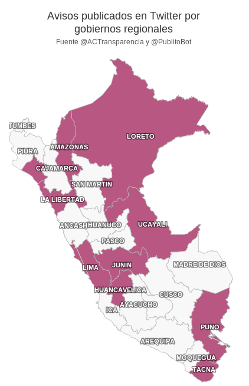

# Reporte de publicidad municipal restringida en Twitter via PublitoBot

El día de ayer, la A.C. Transparencia entregó al Jurado Nacional de Elecciones
su segundo reporte sobre la publicidad estatal restringida por parte de
las autoridades municipales y regionales.

Ya que estamos en campaña electoral, toda publicidad estatal está prohibida ya
sea en medios escritos o digitales y virtuales, lo cual incluye las redes
sociales (Ley Orgánica de Elecciones - Ley No 26859, artículo 192).

En este segundo reporte, Transparencia tuvo la asistencia de un bot para tuiter
desarrollado en colaboración con este útero y este servidor (Yoni).
Este bot se llama
[@PublitoBot](https://twitter.com/PublitoBot) y monitorea las cuentas de tuiter de municipalidades y regiones en
búsqueda de palabras clave en cada tuit que delaten publicidad estatal.

Curiosamente estas son épocas de inauguraciones y entregas de obras como
cancha. Las cuales son anunciadas por las municipalidades usando tuiter. Esto
cae dentro de la restricciones de la ley 26859 y por lo tanto no está
permitido.

Este reporte solo incluye los tuits emitidos del 15 al 31 de Mayo.
[@PublitoBot](https://twitter.com/PublitoBot) hizo un primer filtro de tuits con sospechoso contenido y
Transparencia se encargó de verificar si estos tuits en realidad infringían la
ley.

En [este link](http://www.slideshare.net/ACTransparencia/segundo-reporte-sobre-publicidad-estatal-redes-sociales) está el reporte de Transparencia y a continuación algunos de los
hallazgos:

# Tabla de posiciones a nivel nacional
En el ranking de autoridades municipales y regionales, vemos que la
Municipalidad Metropolitana de Lima gana por goleada. [@PublitoBot](https://twitter.com/PublitoBot) y
Transparencia detectaron 63 tuits infractores.

http://jsfiddle.net/aniversarioperu/UhCtW/

# Distritos en Lima y Callao infractores
Se encontró que no todos los distritos limeños están faltando a la ley. Son
solo una minoría.

http://jsfiddle.net/aniversarioperu/c9Jsq/

# Regiones infractoras
A nivel nacional, aproximadamente la mitad de las cuentas de tuiter de los
gobiernos regionales han realizado publicidad estatal a pesar de la
prohibición.

# Notas curiosas
Transparencia encontró que algunas municipalidades se dieron cuenta de la
vigilancia de [@PublitoBot](https://twitter.com/PublitoBot) y comenzaron a evitar usar las palabras clave que usa
este bot para detectar tuits sospechosos. Es que la lista [está publicada
aquí](https://github.com/aniversarioperu/publibot/blob/master/keywords.txt)
(doh!).

Estas cuentas de tuiter decidieron colocar las palabras clave como
"Inauguración", "entrega", etc. dentro de imágenes que empezaron a ser
compartidas por tuiter. De esta manera evadían los ojos vigilantes de
[@PublitoBot](https://twitter.com/PublitoBot). Sin embargo, comenzaron a utilizar los hashtags
**#callaoLoHizo** y **#entregamosResultados** para compartir las
fotos.
Entonces se agregaron estos hashtags a la lista de palabras clave de
[@PublitoBot](https://twitter.com/PublitoBot) y este pudo detectar también esos tuits.

Transparencia también detectó que los logotipos de las cuentas de tuiter han
estado cambiando de coloración con el paso del tiempo. Parece que ahora los
logos han adquirido colores muy similares a los usados por los candidatos y
agrupaciones políticas. [@PublitoBot](https://twitter.com/PublitoBot) es ciego para los colores y no se ha dado
cuenta de esto.

# Acerca de @PublitoBot
[@PublitoBot](https://twitter.com/PublitoBot) es fruto de la colaboración de AC Transparencia y este útero. El
código fuente de este bot está en la red social Github para que los amixers
geeks puedan agregarle funcionalidad si lo desean. El tener el código fuente de
manera libre ha permitido que los amixers Nicolas Valcarcel
[@nxvl](https://twitter.com/nxvl), Breno Colom
[@breno](https://twitter.com/breno) y
Javier Olaechea [@puercopop](https://twitter.com/puercopop) hayan podido contribuir con código y sugerencias para mejorar
el funcionamiento de [@PublitoBot](https://twitter.com/PublitoBot).

* Aquí está el código fuente <https://github.com/aniversarioperu/publibot/>
* Aquí está la página donde aparecen los tuits sospechosos pillados por
@PublitoBot <http://aniversarioperu.me/publitobot/>
* Esta es la cuenta de Twitter de @PublitoBot <https://twitter.com/PublitoBot>

# Sección Geek
[@PublitoBot](https://twitter.com/PublitoBot) usa el API de Twitter para capturar **todos** los tuits que sean
emitidos por las cuentas bajo vigilancia. Además [@PublitoBot](https://twitter.com/PublitoBot) toma capturas de
pantalla de **todos** los tuits en caso las municipalidades vayan a borrar
alguno. Los metadatos de cada tuit son almacenados en una base de datos local
SQLite y el filtro de palabras clave es aplicado a este nivel. Los tuits que
contengan las palabras clave son retuiteados (máximo 5 retuits por hora) y
todos los tuits pillados se muestran en la página web de [@PublitoBot](https://twitter.com/PublitoBot) 
<http://aniversarioperu.me/publitobot/>.
El filtro de palabras clave es retroactivo, si se agregan palabras clave,
   estas se aplicarán a tuits pasados, no solo a los tuits nuevos.

La lista completa de tuits filtrados están en esta dirección
<http://aniversarioperu.me/publitobot/cherry_tweets.json>. OJO que están en
formato JSON (un objeto JSON por cada línea) y el archivo pesa 1.6MB.

Por ejemplo este es un tuit en formato JSON:
{
    "status": "Autoridades de Santiago de Surco entregan #HabilitaciónUrbanaDeOficio
        a vecinos de la Urb. Los Portales de Surco http://t.co/eN3u1WjKrr",
    "tweet_id": "477622264008294400",
    "created_at": "Jun 14, 2014",
    "screen_name": "munisurco_",
    "orig_status": "Autoridades de Santiago de Surco entregan #HabilitaciónUrbanaDeOficio
        a vecinos de la Urb. Los Portales de Surco http://t.co/eN3u1WjKrr"
}
