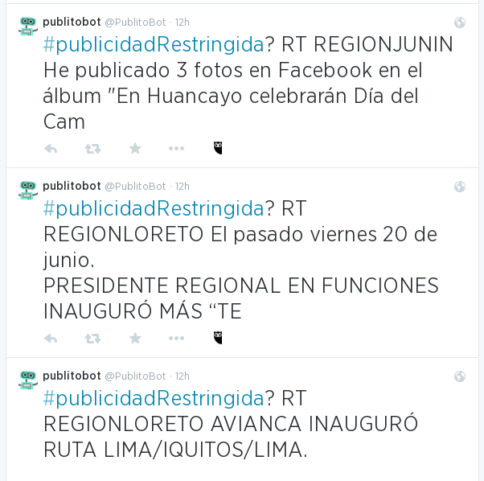
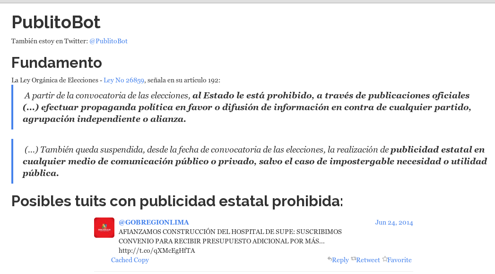

# PublitoBot anuncia su retiro

PublitoBot se jubilará 2 semanas antes de las elecciones municipales 2014.

Estos últimos días he recibido varias quejas sobre el funcionamiento de nuestro
bot @PublitoBot quien tiene lo siguiente en su bio de tuiter:

> "monitoreo las cuentas twitter de autoridades municipales
en búsqueda de publicidad estatal".

Han llovido hartas críticas, algunas críticas han sido amables, otras no tanto
y también ha habido trolls!

Estuve esperando que se acumulen las críticas para poder categorizarlas. Ya
pasaron varios días y el tipo de críticas ha comenzado a ser repetitivo.

## Clasificando los críticos de @PublitoBot

Creo que se pueden dividir en tres grupos:

### 1. Grupo desinformado que no sabe del tema y quiere que le digan cómo son las cosas
Tuits característicos de este grupo son parecidos a estos:

> que tiene de malo este tuit de la municipalidad XX ?

> por qué PublitoBot acusa de publicidad restringida ?

> PublitoBot es un programa no se le debe dejar que acuse a tal municipalidad

Ya se ha explicado hasta la saciedad en un programa televisivo donde se
entrevistó a personal de transparencia, dos columnas en el diario La República,
un informe de Transparencia (y sus dos anexos) y dos posts en este blog uterino.

Tales tuits indican que estos críticos no pudieron revisar ninguno de estos
medios informativos.

En todos estos medios se ha explicado que @PublitoBot se fija si hay ciertas
palabras claves que indiquen que el tuit consiste en publicidad estatal.
Si capta algún tuit sospechoso lo retuitea (máximo 5 por hora). Luego viene el
personal humano de Transparencia y verifica si en realidad puedan ser
considerados como publicidad, prepara un informe y lo envía al Jurado Nacional
de Elecciones donde jueces (que también son humanos) decidirán si es correcto
hacer caso al informe de Transparencia. También decidirán si amerita sanción.

Estos usuarios tampoco se han dado cuenta que @PublitoBot no está acusando.
TODOS los retuits de @PublitoBot tienen el **signo de interrogación** ya que
está preguntando si cada tuit es o no es publicidad restringida. @PublitoBot no
puede saberlo, no es humano.

Supuse que era explícito que el **signo de interrogación** se usa para
preguntar algo en caso de desconocimiento. @PublitoBot **no está acusando**
está preguntando a los humanos del público en general si ese tuit debe o no
debe ser considerado como publicidad restringida.

Estos usuarios tampoco llegaron a divisar que en la página web de @PublitoBot
dice bien claro, con letras bien grandes **Posibles tuits con publicidad
restringida**:

### 2. Grupo que tiene un diferente concepto sobre qué es publicidad municipal
Tuits característicos son:

> este tuit por qué es #publicidadRestringida si están anunciando un taller ?

> cómo me voy a enterar de desvíos de tránsito si PublitoBot no quiere que lo
hagan

La Ley Orgánica de Elecciones dice bien claro (esto está bien grande en la
        página web de @PublitoBot y siempre aparece en los informes de
        Transparencia).
>  A partir de la convocatoria de las elecciones, **al Estado le está
prohibido, a través de publicaciones oficiales (...) efectuar propaganda
política en favor o difusión de información en contra de cualquier partido,
    agrupación independiente o alianza.**

> (...) También queda suspendida, desde la fecha de convocatoria de las
elecciones, la realización de **publicidad estatal en cualquier medio de
comunicación público o privado, salvo el caso de impostergable necesidad o
utilidad pública**.

La ley dice que las municipalidades pueden comunicar obras, acciones o eventos
siempre y cuando sea de **impostergable necesidad**.

Es de impostergable necesidad que la municipalidad anuncie que va a **tener un
taller** sobre redacción este fin de semana?

Es de impostergable necesidad que la municipalidad anuncie **una exposición de
pinturas ?**.

Si leíste el informe de Transparencia y sus anexos verás que tuits de este tipo
han sido considerados por ellos como publicidad estatal. Será el criterio e
interpreción de Transparencia, el cual puede diferir de algunos ciudadanos.

Esto fue explicado clarito por personal de Transparencia en cierto programa de
noticias que pasan de lunes a viernes. Si no lo viste, puedes ver la grabación
en Youtube. No quiero hacer publicherry pero el nombre de ese programa comienza
con **E** y termina con **nContacto**.

### 3. Grupo al que no le gusta que @PublitoBot tenga falsos positivos
Algunos tuiteros piden que se mejore el uso de palabras clave que usa
@PublitoBot con el fin de disminuir o evitar el número de tuits que son
filtrados por esta herramienta.

Estos son tuits característicos de este grupo:

> por qué @PublitoBot tiene falsos positivos ?

> @PublitoBot es un fail, debería haber un humano entregue tuits filtrados a
@PublitoBot y evitar falsos positivos.

> aquí aquí hay un tuit que no es publicidad. ya ves @PublitoBot se equivocó,
    es un fail.

> que jubilen a @PublitoBot para que deje de equivocarse #FAIL

Creo que este tipo de quejas se debe a poca familiaridad con el funcionamiento
de los bots. Poca familiaridad con el funcionamiento de las TIC 
(tecnologías de la información y comunicación) en general.

#### Me explico:
Hay varios tipos de bots. 

* Están los bots que tienen **tareas que pueden ser 
ejecutadas con 100% de precisión**.
Por ejemplo mi #narcoindultoBot que se encarga de tuitear y recordarnos el
narcoindulto del día:

https://twitter.com/AniversarioPeru/status/479994646408740865

La tarea de ese bot es tomar una lista de #narcoindultos por fechas y hacer
una comparación con el día y mes de la fecha actual. Si las dos fechas son
iguales en día y mes. Es decir, si se da cuenta que:

> **20-06**-2009 corresponde con **20-06**-2014

entonces emitirá el tuit. No hay pierde. No hay margen de error. Precisión al
100%.

* En cambio parece que el otro tipo de bot no es muy familiar para los amixers
  tuiteros. Es un bot que por más bueno que sea, nunca llegará a una precisión
  del 100%. Es un bot que inevitablemente tendrá margen de error. Nunca será
  perfecto.
  En esta categoría de bots se encuentran los que deben hacer la compleja tarea
  de leer un texto, una oración, una pregunta y tratar de entender lo que el
  interlocutor quiere decir. Deben entender el contexto el significado y la
  intención que va encerreada en unas cuantas palabras que puedan formar una
  frase u oración.

Hacer que un programa de computadora, un algoritmo o un bot lleguen a este
nivel de comprensión es una tarea muy compleja. Tan compleja que hay una rama
de las Ciencias de la Computación que tratan de estudiar este tema. Esa rama se
llama **"Procesamiento de lenguajes naturales"**.

Muchos estuvieron compartiendo vía redes sociales la noticia que por fin una
computadora era tan buena para procesar el lenguaje que pudo engañar a varias
personas y hacerles creer que los textos que emitía eran producidos por un
humano. "Por fin una máquina pasó el Test de Turing" dijeron los titulares.
Aunque muchos tienen serias dudas al respecto.

Como ven hacer que una máquina pueda entender lo que va en un tuit para decidir
si es publicidad, chisme o aviso de urgente necesidad es complejo. No es
pichanguita.

# Todos los modelos son erróneos
Alguien me preguntará cómo es que hacen los científicos para diseñar
computadoras que entiendan el lenguaje de humanos. Pues aplican **modelos
estadísticos**. Un modelo es una serie de parámetros que usa el bot para tratar
de hacer su labor. Ya que el bot no puede saber cómo son las cosas, solo le
queda guiarse por estos modelos. Es posible que los modelos que use el bot no
hayan previsto encontrarse con un interlocutor que use muletillas, o use
replana cuando escribe. Entonces es posible que el bot falle y no pueda
"entender" el sentido o significado de un texto.

Es por eso que las mujeres y hombres de ciencia que usan modelos estadísticos a
diario saben que por definición **TODOS lo modelos tienen margen de error**.
Por eso tienen una probabilidad posterior que indica el nivel de
exactitud, el nivel del margen de error de cada uno. Y por lo tanto **SIEMPRE**
habrá la posibilidad de cometer errores.

Es inevitable que los modelos tengan márgenes de error ya que tratan de ser una
representación de la realidad. Siempre serán una cruda aproximación de la
realidad y por lo tanto **siempre** tendrán márgenes de error.

En este caso, podríamos contratar a un equipo de lingüistas y programadores que
se encarguen de crear un modelo para @PublitoBot. Pero por más capos que sean
los miembros de este equipo, siempre habrá la posibilidad que @PublitoBot
cometa errores. Siempre tendrá falsos positivos. Ya que por definición sabemos
que los modelos son imperfectos.

Y ya sabemos que en tuiter nadie perdona. Basta que algún *comunity manager*
cometa un error en un tuit para que le hagan *bullying*, sea víctima de burlas,
       memes y los tuiteros en masa pidan su cabeza en bandeja de plata.

Por eso cuando estuve planeando la manera de programar a @PublitoBot decidí que
de nada valía crearle un modelo que sea del 99.99% de exactitud por que siempre
habrán críticos ya sea por:

* desconocimiento.
* diferencias de criterio en lo que pueda ser considerada como publicidad
  restringida.
* margen de error, inherente de la naturaleza de las cosas que no llega a ser
  entendido por todos.

# Las acusaciones de @PublitoBot afectan la reputación de las municipalidades
Ya expliqué que @PublitoBot no está acusando, esa función le toca al Jurado
Nacional de Elecciones.
@PublitoBot no es más que una herramienta que hace un poco más facil la tarea
de verificar las cuentas de tuiter de varias decenas de Municipalidades y
Gobiernos Regionales de todo el territorio peruano.

No veo por qué deba creerse que una herramienta que funciona sin influencia
humana que filtra tuits deba verse al mismo nivel que un acto difamatorio que
vulnere la reputación y buena imagen de los Gobiernos Regionales y
Municipalidades peruanas.

Resulta curioso que casi el 100% de quejas de @PublitoBot se debe a que ha 
filtrado tuits correspondientes a la Municipalidad Metropolitana de Lima.
@PublitoBot está monitoreando en total 62 gobiernos regionales y
municipalidades.
Para hacer las cosas de manera transparente y facilitar auditorías a mi
trabajo, he publicado el código fuente y las palabras
clave en la Internet. Todo está  de
manera pública para que TODOS vean y examinen y auditen y mejoren a este bot.
Esto está publicado desde el 12 de Mayo en esta dirección web
<https://github.com/aniversarioperu/publibot>.
