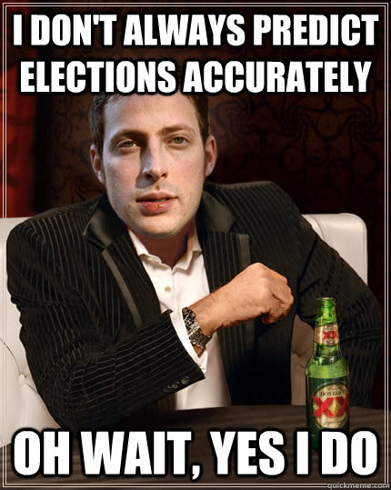
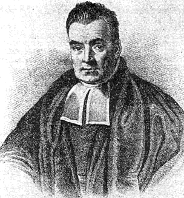
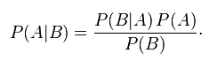
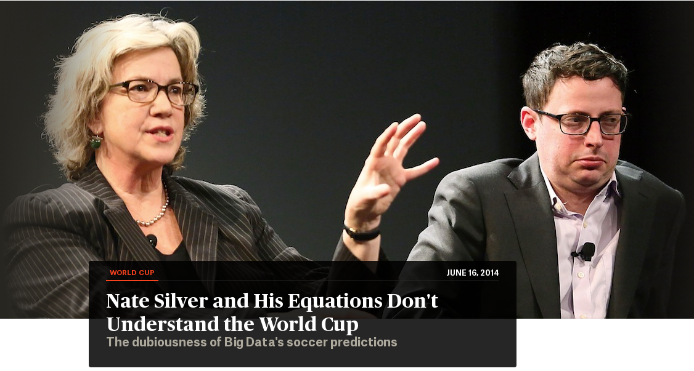
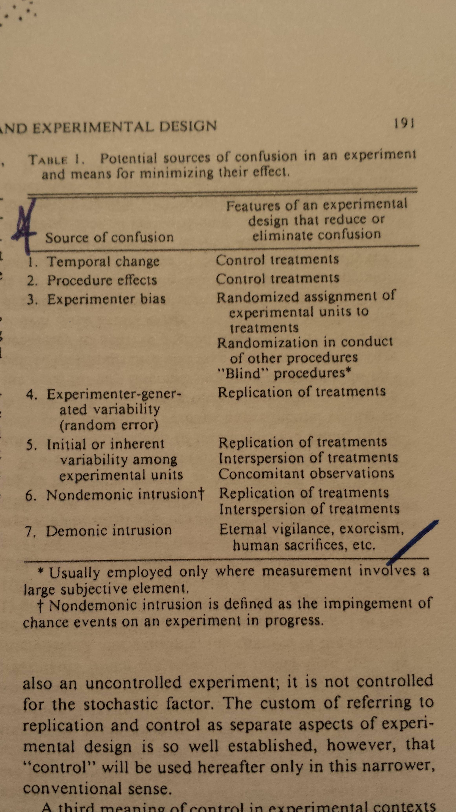

# Las predicciones futbolísticas de Nate Silver

## Cuál es la relación entre un monje, el mundial de fútbol, efectos demoníacos y Nate Silver?

Nate Silver y su web FiveThirtyEigth se [atrevieron a predecir el ganador del
mundial de fútbol](http://utero.pe/2014/06/09/brasil-ganara-la-copa-mundial-segun-fivethirtyeight-la-pagina-estadistica-mas-prestigiosa-del-momento/) de este año.

Nate Silver es un monstruo de las estadísticas que 
obtuvo la fama luego de estimar con asombrosa
precisión los resultados de las elecciones presidenciales de USA del 2008.
Nate Silver, armado con su algoritmo hecho en casa, logró predecir
correctamente el ganador en 49 de 50 estados gringos.

Mucha gente admira a Nate Silver ya que ha logrado utilizar las matemáticas
para poder hacer predicciones comparables a las del brujo Hayimi,
@espejomx, Rosita Chung, el brasileño dos Santos, etc.
La diferencia es que Nate Silver usa **fundamentos científicos diseñados hace
casi 300 años** en combinación con datos estadísticos y simulaciones matemáticas
ejecutadas por potentes computadoras.

## Que pase el monje

Nate Silver debe su fama al monje inglés que nació en 1701 y murió en 1761.
Este monje presbiteriano se llamó [Thomas Bayes](http://es.wikipedia.org/wiki/Thomas_Bayes).
Al parecer Thomas Bayes tenía mucho tiempo libre y le robaba horas al rezo para
hacer especulaciones matemáticas. A veces se le ocurrían cosas interesantes las
cuales escribía en un cuaderno. Una de estas cosas fue un teorema que permitía
solucionar un problema de probabilidades. Lamentablemente Thomas Bayes falleció
antes de poder publicar teorema ya que en esa época no habían blogs.
Luego de su muerte, sus amixers sabían de la importancia de los escritos del
reverendo Bayes y
     decidieron llevar sus escritos a la Royal Society y leer ante los miembros
     reunidos las especulaciones matemáticas del amigo Thomas.

## El teorema Bayesiano
Algunos fans vieron la importancia del teorema propuesto por Thomas Bayes y
decidieron bautizarlo como **teorema Bayesiano**.
Este teorema fue pensado como método para poder actualizar la probabilidad de
ciertas creencias conforme va apareciendo mayor información.

### Un ejemplo
Digamos que estás con tus amixers y quieren ir a cenar. Se te antoja comer
comida italiana en porciones generosas con un buen postre y un café espresso
excepcional, además que sea barato. Salen a la calle y ven
un restaurante en la esquina con algunos comensales. Entonces tú te pones a
pensar y dices:

* Es hora punta y hay pocos comensales. Quizá la comida no es muy buena.

Sin darte cuenta le asignas una **baja probabilidad** de salir satisfecho luego de
cenar en tal restaurante (digamos 30%).

Pero supongamos que tu amigo ya ha comido en tal restaurante y dice que sirven
bien taipá. Entonces tú automáticamente actualizas la probabilidad de
satisfacción en base a la nueva información disponible y favorable. Digamos 
que ahora la probabilidad de satisfacción gastronómica subió a 40%.

Luego te enteras que ese restaurante pertenece a uno de los miles de
restaurantes que tiene Gastón Acurio. Actualizas tu probabilidad en base a la
nueva información y la nueva probabilidad se dispara hasta llegar a 80%.

Con una probabilidad (posterior) de 80% decides ir corriendo al restaurante a
devorar una potencial cena satisfactoria.

Este tipo de ejercicio mental ocurre en varios casos cotidianos y es lo que
trata de captar formalmente el teorema Bayesiano.

Tienes una probabilidad inicial (**prior probability**) que es modificada en
base a nuevos datos para obtener una **probabilidad posterior**.
Si bien esto se puede hacer mentalmente, el mérito de Thomas Bayes fue lograr
formalizar este proceso mediante la creación de una fórmula:

* A es la proposición de ir o no ir al restaurante y B es la evidencia nueva
  que te hace cambiar de parecer en caso sea favorable o desfavorable.
* La fórmula es lo que postuló Bayes. Dijo que se puede usar para actualizar tu
  proposición A en base a la nueva evidencia B.

Por lo tanto:

* P(A) es la probabilidad inicial (**prior**).
* P(A|B) es la probabilidad posterior que usas para decidir ir a tal
  restaurante luego de tomar en cuenta la evidencia B.
* P(B|A)/P(B) es el soporte a favor o en contra de la nueva evidencia B sobre
  la proposición A.

La probabilidad inicial (**prior**) es muy importante y afectará grandemente el
resultado final de la fórmula. El **prior** puede ser muy fuerte (30%) o puede
ser flexible (por ejemplo un rango entre 10 y 50%). Se supone que el **prior**
es la cantidad de información disponible que tenemos antes de ver información
nueva disponible.
Una de las críticas al método es que los priors pueden ser muy subjetivos. Al
escoger un rango de valores se trata de minimizar este aspecto subjetivo.

## Los datos que usa Nate Silver
La información que ofrece Nate Silver, además del comportamiento curioso de
recalcular sus predicciones luego de cada partido del mundial, evidencian que
está usando estadísticas Bayesianas. El teorema de nuestro amixer
Thomas Bayes es fundamental para Nate Silver

Según la web de ESPN (los empleadores de Nate Silver), el algoritmo SPI usa
los siguientes datos:

* competitividad de cada jugador
* cálculo de la competitividad de los equipos basado en la de sus jugadores
* rankeo según la cantidad de partidos ganados

Y algunas otras variables como estimación de capacidades de ofensa y defensa de
cada equipo.

## Variables interesantes
Una de las variables que se incluyen en los cálculos es la distancia que hay
entre cada país y la sede de la copa del mundo. El equipo de Nate Silver
ha encontrado que puede haber cierta influencia en los resultados ya que
jugadores que viajan largas distancias llegarán con "jet lag" y eso puede
afectar su rendimiento.

> We had a lot of debate about whether to include a “strong” adjustment for
east-west distance traveled

Ese "strong adjustment" debe referirse a la necesidad de modificar fuertemente
la **probabilidad prior** para otorgar menor probabilidad inicial a aquellos
equipos que pasan mala noche viajando toda la madrugada en avión.

Parte de los cálculos se basan en estimar las probabilidades que cada equipo
meta más goles que su oponente durante los partidos. Además es necesario darle
un peso extra (inflar) a la posibilidad de empates ya que es cosa común en el
fútbol.
Este modelo lo llaman ["regresión Poisson bivariada inflada y diagonal"](http://www.stat-athens.aueb.gr/~karlis/Bivariate%20Poisson%20Regression.pdf)
(archivo PDF).

La gente responsable de este modelo dice es "fácilmente programable en
cualquier programa estadístico (!)".

## Problema inherente al método Bayesiano

Nate Silver está siendo trolleado harto ya que no todas las predicciones 
de su modelo Bayesiano se han cumplido cabalmente.
Si bien estos problemas son inherentes al método, no es que el método sea malo,
   o que Nate Silver sea un fail. 
Hay que reconocer que predecir los resultados de los partidos de fútbol en el
mundial es un problema muy diferente (y más difícil) que
predecir el resultado de elecciones presidenciales.

Nate Silver [admite que uno de sus
problemas](http://fivethirtyeight.com/features/its-brazils-world-cup-to-lose/)
es la poca muestra estadística disponible para poder obtener información.
El número de partidos enfrentados en mundiales entre dos países solo son
unos cuantos mientras que la cantidad de votantes de un estado de USA son
muchos más. En el último hay más muestra, más individuos y menos probabilidad
que eventos inesperados tengan una fuerte influencia en el resultado.

## Efectos demoníacos

Los que hacen modelos tienen que incluir en sus cálculos cualquier variable que
pueda causar algún efecto en el resultado. Sin embargo, a veces hay eventos
totalmente inesperados que no fueron incluidos y pueden llegar a tener un valor
determinante. Estos son los llamados **efectos demoníacos**.

En el fútbol los efectos demoníacos que lleguen a definir los resultados
pueden ser:

* que el árbitro te cobre un penal indebido.
* que un delantero se tire a la piscina y engañe al árbitro.
* que lesionen a tu goleador.
* que previo al partido, el árbitro se haya encontrado un sobre debajo de la
  mesa donde estuvo almorzando, etc.

Todos estos efectos son posibles de ocurrir pero es muy difícil meterlos en tu
algoritmo y por lo tanto puede que tu modelo se vea como fallido ya que no pudo
"predecir el resultado de tal partido".

En el caso de votantes, es menos probable que efectos demoníacos
tengan mayor influencia. Digamos que un votante se enferma y no puede votar.
Esto tendrá poco o nulo resultado sobre una elección presidencial.

Además **a algunos les parece que el hecho de recalcular las probabilidades
luego de cada partido es un acto de trampita** para poder acertar al 
resultado final. Pero esto es parte de la naturaleza del método Bayesiano.
Luego de cada partido se tiene evidencia nueva y fresquita que **debe ser
tomada en cuenta** para actualizar la probabilidad posterior del resultado
final.

Al final del día uno se da cuenta que las predicciones Bayesianas no son
mágicas, aunque a veces lo parezcan. Además que una gran cantidad de datos,
excelente modelos matemáticos y potentes computadoras no hacen posible que los
humanos puedan lograr predecir el futuro. Solo se logra tener una aproximación
acertada o desacertada al resultado de algún evento de interés. No nos hace
videntes como @espejomx, Hayimi, Dos Santos, etc.
