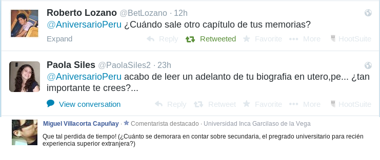

Las memorias de AniversarioPerú - Parte 2

[En un post
anterior](http://aniversarioperu.utero.pe/2014/06/28/las-memorias-de-aniversarioperu-parte-1/)
    comencé a escribir mis memorias 
    ([Memorias Parte 1](http://aniversarioperu.utero.pe/2014/06/28/las-memorias-de-aniversarioperu-parte-1/)).
Pensé que nadie iba a leer el post pero he recibido comentarios de lectores que
están esperando ansiosamente que continúe con más entregas.

Si no leíste, aquí está el primer episodio:

* [Memorias Parte 1](http://aniversarioperu.utero.pe/2014/06/28/las-memorias-de-aniversarioperu-parte-1/).

# El profesor de Razonamiento Verbal
Creo que la parte de la vida escolar será relevante en un próximo capítulo,
entonces avanzaré la historia hasta la época pre-universitaria.

Luego de terminar la secundaria uno entra en dilemas existenciales y trata de
decidir qué hacer con la vida. En mi caso el dilema pasó rápido ya que tengo un
tío ingeniero que siempre me insistía en
que yo también debía ser universitario.

Me asombré mucho la primera vez que vi a un señor llegando a su casa
para pedirle una firma para el proyecto que había elaborado. Mi
tío revisaba el plano, apretaba botones en su calculadora, leía y releía los
símbolos, números y gráficos del plano y luego de 1 hora ponía su firma,
    estampaba su sello y recibía el pago de 50 dólares!
Mi tío se reía de mi cara de asombro, me decía que él era ingeniero calculista
y que cuando uno estudia en la universidad la gente te paga plata por tu firma.

Me compré la idea de ser universitario rápidamente. 

Fue una mañana de Enero cuando tomé la combi para ir al centro de Lima 
a buscar academia
pre-universitaria. Se suponía que iba a ir con mi pata Jorge pero cuando fui a
su casa a recogerlo su mamá me dijo que aún estaba durmiendo. Yo quería que me
acompañe porque no quería ir solo al centro de Lima mientras llevaba una fuerte
suma de dinero en el bolsillo (40 soles para matricularme en la academia).

Me matriculé en esa academia que queda a unas cuadras de las Nazarenas. Aquella
que dice ser para las clases populares. Había harta gente. Tuve que hacer dos
colas, me inscribí, pagué, y luego de dos horas ya era alumno
pre-universitario!
Mi pata Jorge llegó en la tarde pero ya no habían vacantes. Más monse.

Esa academia me gustaba porque te daban harta información y también se podía
ganar becas mensuales al tener buenas notas en los simulacros.
Estudié allí por varios meses hasta que decidieron reducir el número de 
becas a la mitad y solo alcancé media beca. Pero seguí estudiando en casa.

Pero lo notable de esa etapa fue que **el profesor de Razonamiento Verbal marcó mi vida**.
Este
profe era un flaco que se aburría en sus clases. Enseñar el significado de las
palabras a un grupo de chibolos que no pasarían la prueba PISA debe ser aburrido
para cualquiera.
Cuando se aburría al extremo nos contaba episodios de su vida. Mi pata Pedro lo
trolleaba cada vez que el profe contaba sus aventuras. Pedro quería seguir
aprendiendo el significado de las palabras.

Pero un día el profe nos contó algo tan impactante que hasta Pedro se quedó
escuchando y no trolleó.
Nos contó que su hermano estudiaba en el extranjero.
Se había ganado una beca para estudiar el doctorado en
Hungría. Nos contó que la beca le había pagado el pasaje de avión, gastos de
estudios y encima le pagaban un sueldo mensual. Su hermano ya llevaba
estudiando 4 años gratis y encima le pagaban sueldo! como si estuviera
trabajando! Increíble.

Todos quedamos con la boca abierta mientras el profe contaba que su hermano
enviaba fotos donde aparecía abrazando y besando a su enamorada Húngara.
Al parecer cambiaba de enamorada cada año.
Nuestro profe tenía su propia teoría al respecto. Él especulaba que en
Hungría era novedoso ver a un estudiante peruano y que las chicas se sentían
atraídos por su hermano al verlo tan peculiar. Nuestro profe dijo que quizás su
hermano era percibido como un huaco que las chicas querían coleccionar (podrá
        ser políticamente incorrecto, pero eso dijo).

Me marcó el descubrir que en otros países me podían pagar por
estudiar. Yo no tenía talento ni gracia, era malo para los deportes, nulo en
apreciación artística, no tenía ni un cobre en el bolsillo ... yo también quería
que me paguen por estudiar.

Quizá también me marcó el enterarme que podía intentar ser profeta fuera de mi
patria.
Dios no me otorgó ni simpatía ni carisma, las chicas no me daban bola. Pensé
que quizá en otros países podía dejar de ser #foreveralone.

Debe ser que esto último causó mayor impacto. Cuando uno tiene 16
años las hormonas brotan hasta por las orejas. O quizá las dos cosas
combinadas, no recuerdo bien.

Ese día, saliendo de la academia, tomé la combi, arranqué una hoja de mi
cuaderno y escribí con lapicero azul, bien grande:

> ## Objetivos a cumplir para estudiar en el extranjero
>
> 1. Ingresar a la universidad
> 2. Aprender inglés
> 3. Ganar beca para el extranjero
> 4. Conseguir enamorada

continuará...

