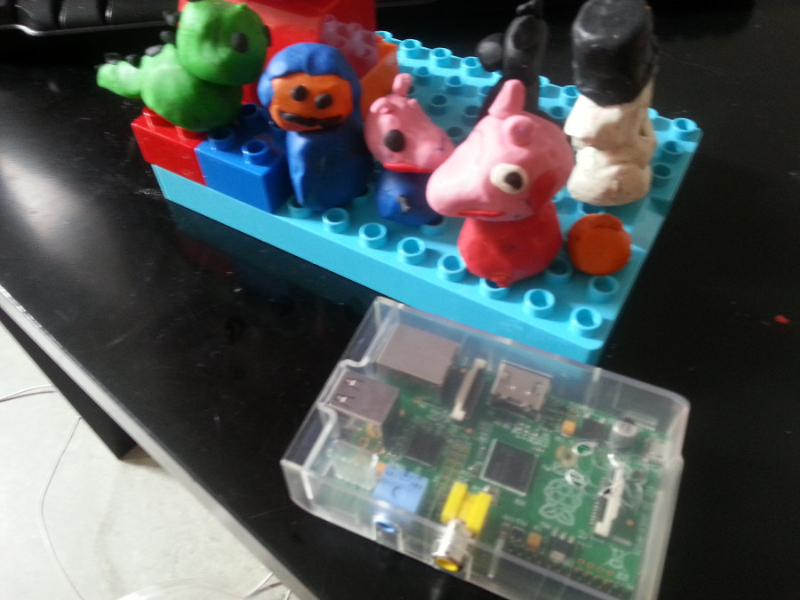
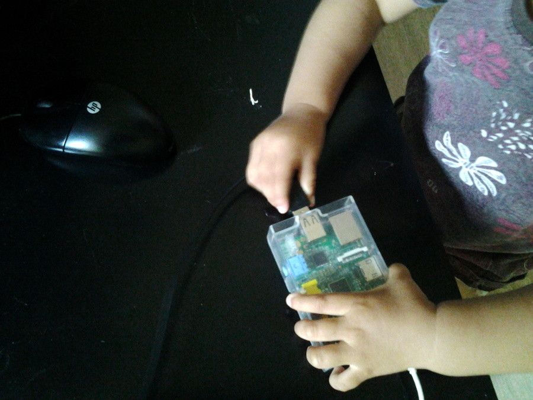
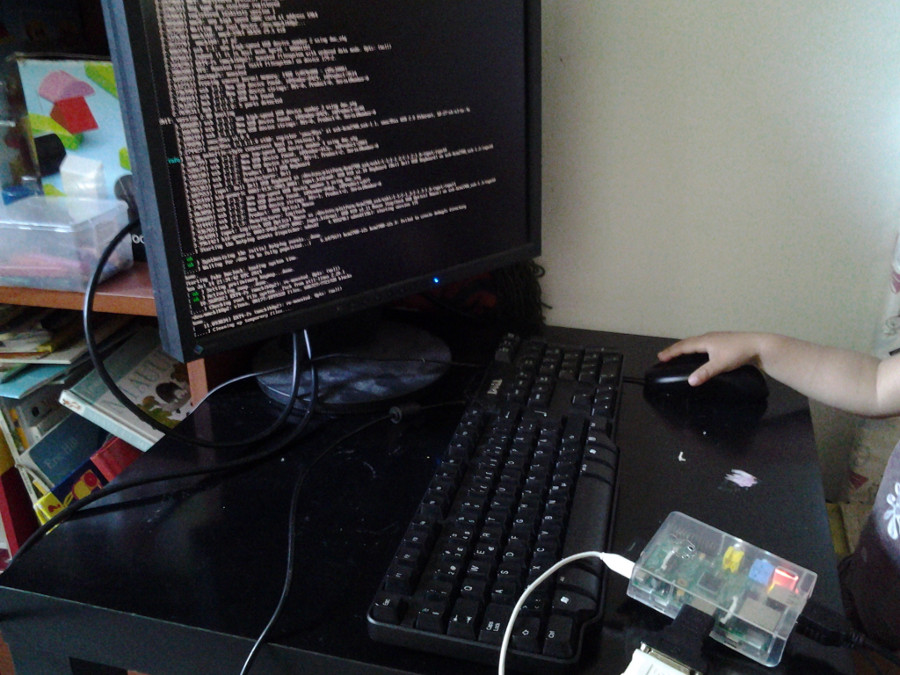
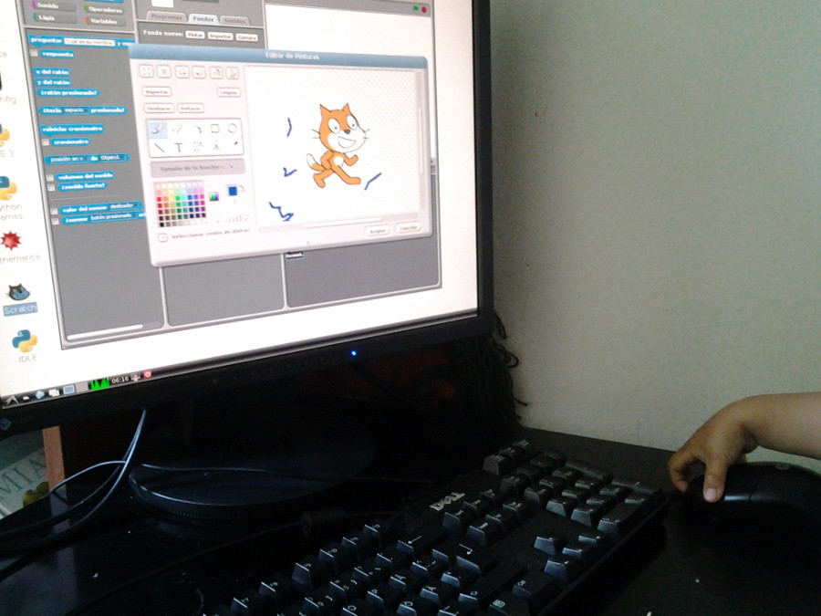
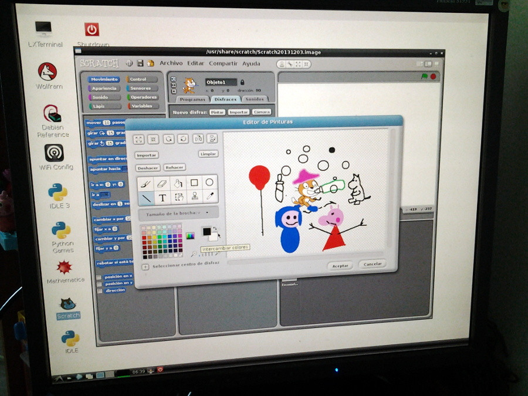

# Mira lo que hizo esta niña con una Raspberry pi

Me he dado cuenta que los dibujos animados resultan demasiado adictivos para mi
hija.
Si bien puede dividir su tiempo para entretenerse realizando diversas
actividades como dibujar y pintar
con lápices de colores, crayolas y témperas, armar rompecabezas, usar
plastilina, hojear libros y balancearse en el columpio, creo que no tendría
problemas de
pasarse horas de horas viendo su dibujo favorito: Peppa pig.

Fuente Wikimedia

A pesar que aún no tiene edad para dejar por completo los pañales, es toda una
experta usando el Smartphone de su mamá. Ya aprendió a desbloquearlo, sabe
pasar las pantallas haciendo "swipe" con el dedo hasta encontrar el ícono de
YouTube.
Si te descuidas un rato se apodera del teléfono y se pone a mirar Peppa pig. 
Luego
distraerla y convencerla que deje el celular para hacer otra actividad no es
cosa fácil.

Así que decidimos tomar acciones radicales.

# La Raspberry pi
Hace un par de meses le compré una computadora llamada Raspberry pi. Esta
computadora consiste en una tarjeta madre muy pequeña (del tamaño de una
        tarjeta de crédito) y es desarrollada por la Fundación del mismo
nombre. 
Esta es una computadora de bajo costo, dirigida a niños para 
que sea utilizada con fines educativos.
La fundación la vende a 40$ aproximadamente, pero también la puedes conseguir
en Amazon o si estás en
Lima, en <http://paruro.pe> (aunque encontrarás precios más elevados).

Entonces cuando mi hija pide con insistencia ver Peppa Pig, le decimos que sólo
se puede ver desde la Raspberry pi. Acto seguido retiramos esta pequeña
computadora y cables de su caja, y ella misma se ofrece de
voluntaria para hacer todas las conexiones.
Se le pueden enchufar mouse, teclado y monitor viejos a la Raspberry pi. La
fuente de poder viene de un cable que perteneció a un Kindle, y va conectado a un
transformador rescatado de una vieja cámara de vídeos Nikon.

Con la práctica ha logrado poder hacer todas las conexiones en poco tiempo,
aunque aún necesita algo de ayuda.

Una vez que la Raspberry pi ha cargado es necesario hacer *login* tipeando el
usuario *pi* y una contraseña. Una vez logeada tiene acceso a la consola de
Linux (esta Raspberry pi corre una versión modificada de Debian Linux). Para
salir de la consola e ingresar a la interfaz gráfica es necesario iniciar
el *servidor X*, lo cual se logra tipeando el
comando *startx*.

# Componentes de la Raspberry pi
Yo me quedé sorprendido al ver que a pesar de su pequeño precio y tamaño,
la
Raspberry pi es chiquita pero poderosa. Viene con Python 2.7 y 3.3 además de la
versión más reciente de Ruby. Tiene varios programas educativos que parecen
juegos.

Una vez que hemos entrado a la interfaz gráfica siempre pide entrar al juego
del gato. Este juego es en realidad
[Scratch](http://es.wikipedia.org/wiki/Scratch_(lenguaje_de_programaci%C3%B3n)),
el cual es un programa diseñado para que niños puedan aprender a programar sin
necesidad de tipear comandos. El chiste es usar comandos como *avanzar*,
          *retroceder*, *girar*, etc. que se ven como si fueran  piezas de
          rompecabezas. Los niños van construyendo su algoritmo mediante la
          unión de estos *rompecabezas*. Cuando corren el programa, todos los
          comandos serán ejecutados por un gato.
También es posible ponerle sonidos al gato y diseñarles disfraces. Para crear
disfraces se puede entrar a un editor de imágenes similar al *Paint* de
Windows.
Esto es lo que más le gusta, dibujar y pintar cosas sobre el gato. Ella solo
puede hacer algunos trazos con el mouse, pero le gusta que le ayude dibujar sus 
personajes favoritos de la televisión y cuentos.

Luego de dibujar un rato ya se habrá olvidado de Peppa pig y estará lista para
salir al parque a corretear y subirse al columpio.

Si bien aún no puede intentar programar, me doy por satisfecho que se vaya
enterando que las computadoras son complicadas y que necesitas conectarle una
fuente eléctrica, conectar artefactos que sirvan para introducir órdenes a la
computadora (mouse y teclado), además de tener que conectarle un dispositivo
gráfico (un monitor o el televisor).

Creo que hacer este ejercicio le debe resultar más educativo que el utilizar un
smartphone. Estos teléfonos inteligentes ya tienen todo incluido en una tableta
aparentemente mágica (no tiene fuente de poder aparente ya que tiene la batería
        incluida). No se le ve el teclado ni el mouse y el monitor ya viene
incluido. Será tecnología muy avanzada pero creo que también le será útil el 
darse cuenta que no todas las computadoras son así.

Cuando era niño me gustaba visitar a mi amigo Pedro. Su papá le había comprado
un [Commodore 64](http://es.wikipedia.org/wiki/Commodore_64) y yo me quedaba asombrado como podría conectarlo a su televisor,
   enchufarle dos palancas de mando y poder jugar un juego básico de tanques que
   disparaban.
En ese tiempo la tecnología era tan rudimentaria que estábamos obligados a
entender el funcionamiento del Commodore para poder utilizarlo.

Creo que aquí cae a pelo la Raspberry pi. Al estar *obligada* a utilizarla, sin
darse cuenta aprenderá lo que es una consola de comandos de Linux. Aprenderá
que la interfaz gráfica de muchas computadoras se activan mediante el
funcionamiento del Server X. Conforme pasen los años se pueden ir introduciendo
nuevos conceptos. Por ejemplo la Raspberry pi viene con una copia de Minecraft
server. Debe ser muy educativo tener que configurar tu propio servidor para
jugar Minecraft.

La idea es evitar tener una generación de niños que saben poco o nada de
computación a pesar
de ser tromes usando Facebook, Youtube, Microsoft Word y Excel. Ser experto en
Facebook, YouTube y MemesGenerator no te hace conocedor de computadoras.

Aquí hay un texto escrito por un profesor de colegio que argumenta que los
niños y jóvenes de ahora no saben usar las computadoras a pesar que son
considerados "nativos digitales": [Kids can't use
computers](http://coding2learn.org/blog/2013/07/29/kids-cant-use-computers/).
