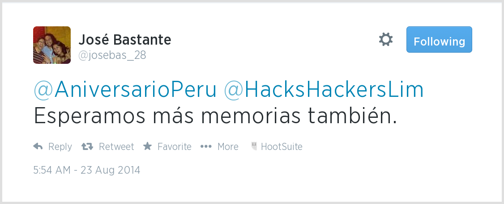

Las memorias de AniversarioPerú - Parte 3

Me satisface saber que mi serie de memorias tiene un lector!

A pedido del público aquí va la siguiente entrega. Si no leíste, aquí están 
los episodios anteriores:

* [Memorias Parte 1](http://aniversarioperu.utero.pe/2014/06/28/las-memorias-de-aniversarioperu-parte-1/).
* [Memorias Parte 2](http://aniversarioperu.utero.pe/2014/07/17/las-memorias-de-aniversarioperu-parte-2/).

## Artículo 45.1 de la nueva Ley Universitaria 30220

> Grado de Bachiller: requiere haber aprobado los
estudios de pregrado, así como la aprobación
de un trabajo de investigación y el conocimiento
de un idioma extranjero, de preferencia inglés o
lengua nativa.

# Estar en la universidad es una cosa de locos
Una de las cosas que me sorprendió siendo cachimbo es que casi todos los 
laboratorios estaban llenos de alumnos realizando prácticas. Los alumnos que
 habían ingresado el año anterior estaban metidos en los laboratorios de 
 Botánica, Biología General y de Genética. Yo les tenía envidia al 
 verlos muy entretenidos abriendo frascos, mirando por el microscopio, 
 alimentando a los ratones, prensando muestras vegetales, 
 etc. Algunos se llevaban tan bien con los profes que llegaban a tutearse 
 mutuamente. Yo me quedaba con la boca abierta y pensaba "estos deben ser 
 capos".
 
Entonces yo también quería ser practicante de algún laboratorio. Durante el 
primer semestre me pasé tasando a mis profes. Traté de averiguar qué tipo de
 investigación realizaban, en qué revistas científicas publicaban sus estudios 
 y ver su la línea de investigación me resultaba interesante.
 
Una vez que escogí el laboratorio objetivo me presenté donde la profesora 
jefa y  le dije "quiero ser practicante de su laboratorio". Me aceptaron al toque y 
ese mismo día me puse mi mandil blanco y me apresté a realizar mi primera 
labor: **lavar frascos**. Lavé y lavé frascos por varios días hasta que ya 
no habían más frascos sucios. Emocionado me apresté a realizar mi segunda 
labor: **desempolvar y forrar libros con vinifán**.

Al comienzo yo pensé que me habían aceptado solo para hacer labores de 
ceniciento pero luego pensándolo bien me di cuenta que yo siendo estudiante 
de primer año de Biología no estaba en capacidad de hacer investigación 
científica, ni en capacidad de colaborar significativamente en los proyectos
 de investigación. Recién había llevado algunos cursos generales como Lengua
  Española y Introducción a la Historia de la Ciencia.
  La única manera de contribuir era hacer ese tipo de labores del tipo 
  doméstico. Labores que son necesarias y que se tienen que hacer 
  siempre en todos los laboratorios.
  
Estar dentro del laboratorio es bien chévere. Se conoce bastante gente. Por 
ejemplo estaban los estudiantes más antiguos que yo y me agarraban de lorna.
 Pero lo bueno era que habían varios tesistas. Conversar con ellos era 
 interesante y podía ver cómo hacían sus experimentos y colecta de datos.
  A veces la profesora no encontraba aula para dictar sus clases de maestría
   y decidía dictarla dentro de laboratorio. Entonces entraban los 3 o 4 
   gatos de la maestría y la profa hacía su clase. Era bacán porque yo podía
    estirar la oreja y ganarme con la clase.
 
A veces llegaban extranjeros a visitar a la profesora y coordinar sus 
proyectos de investigación conjuntos. Yo trataba de comunicarme con mi 
deplorable manejo del idioma inglés. Los gringos eran buena gente y me 
tenían paciencia al escucharme. Contestaban mis preguntas y me preguntaban 
por mis actividades en el laboratorio. Yo no tenía mucho que ofrecer ya que 
no hay nada de interesante en meter los libros al congelador para que se 
mueran todas las polillas y dejen de comérselos.

Pero ya conforme pasan los años, uno lleva más cursos, 
uno va leyendo algunos libros y se va familiarizando con el quehacer del 
laboratorio. Era muy común que estudiantes a partir del tercer año 
participen activamente en los proyectos de investigación e incluso presenten
 los resultados en la conferencia científica que todos los años se organiza 
 en la UNMSM. Todos nos sentíamos orgullosos cuando nuestro nombre aparecía 
 impreso en en libro de resúmenes de las conferencias.
 
Los estudiantes más capos aportaban tanto al proyecto que merecían ser 
incluidos en la lista de autores de la publicaciones científicas
 que el   laboratorio llegaban a publicar en revistas extranjeras y en el 
 idioma  inglés. 
 Es realmente notable que un estudiante no graduado llegue a ser 
coautor de alguna publicación científica.

Pero lástima que yo terminé los cinco años de carrera y no había sido  
coautor de nada, ni había expuesto en la conferencia anual de la facultad ni 
nada. En  mi laboratorio se hacía investigación pero no mucha y solo la 
realizaba la profesora con algún tesista. Entonces terminé la universidad y
no había podido ganar mucha experiencia que digamos, sentía que no había 
hecho nada durante los cinco años.

Entonces ni bien terminó el último ciclo agarré el teléfono y llamé a la 
jefa de laboratorio:

- Aló? profa. Habla Aniversario Perú.
- Hola hijito qué milagro.

- Profa ya pe, quiero hacer una tesis.
- Ya pues, ven el lunes para escoger tu tema de tesis.

Quizá fueron las ganas de hacer algo en el ámbito científico. O quizá fue el
 temor de enfrentarme al mercado laboral sin tener diploma de bachiller ni 
 nada. Sea como fuere, se me ocurrió que mi siguiente paso debía ser hacer 
 la tesis.
 En esa época el bachillerato era automático. Se pagaba una fuerte suma de 
 dinero para hacer varios trámites y luego de unos meses salía el dichoso 
 diploma de bachiller en Biología. La tesis que yo comencé a hacer serviría 
 para obtener el título de Biólogo.
 
## Haciendo la tesis
Hacer la tesis me demoró dos años. Tuve que ir al campo a colectar mi 
material. Leer un montón de literatura. Primero leí los clásicos: Darwin, 
Hennig, Mayr, Simpson,  MacArthur & Wilson, luego solo a Wilson.
Y luego me puse a leer literatura más moderna.
 Lo bueno es que el  profe que 
te asesora te recomienda lecturas, te presta libros y regala fotocopias.

Durante el tiempo que estuve haciendo la tesis volvieron a aparecer los 
gringos y para ese entonces tanta lectura me permitía hacer mejores 
preguntas, y por fin poder hablar de cuestiones metodológicas y debatir los 
pros y los contras de las diversas corrientes del acontecer biológico.
 
Si bien la tesis me tomó bastante tiempo, viendo en retrospectiva creo que 
fue una excelente inversión de tiempo. Leer tanto,  colectar y revisar tanto
material biológico me permitió ser un potencial experto en una muy 
pequeñísima área de la biología. Bueno, cuando terminas tu tesis eres 
experto de tu tema, no?

Empaparme de este conocimiento fue crucial para poder conseguir una beca en 
el extranjero, ya que me permitió...

continuará...

PD. Creo que la nueva ley, al exigir un trabajo de investigación para ser 
bachiller, está legislando sobre cosas que ya se vienen haciendo desde hace 
tiempo (al menos en Biología).
 Ya sea trabajo de investigación o tesis (de 
manera posterior), creo que es importante que los estudiantes traten de 
dominar al menos un tema de su carrera universitaria.
