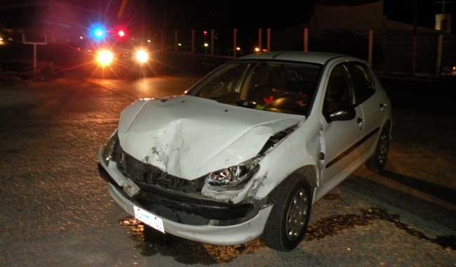

# Las memorias de AniversarioPerú - Parte 6

Si no leíste, aquí están los episodios anteriores:

* [Memorias Parte 1](http://aniversarioperu.utero.pe/2014/06/28/las-memorias-de-aniversarioperu-parte-1/).
* [Memorias Parte 2](http://aniversarioperu.utero.pe/2014/07/17/las-memorias-de-aniversarioperu-parte-2/).
* [Memorias Parte 3](http://aniversarioperu.utero.pe/2014/08/28/las-memorias-de-aniversarioperu-parte-3/).
* [Memorias Parte 4](http://aniversarioperu.utero.pe/2014/09/18/las-memorias-de-aniversarioperu-parte-4/).
* [Memorias Parte 5](http://aniversarioperu.utero.pe/2014/10/02/las-memorias-de-aniversarioperu-parte-5/).

# Punto de quiebre
Es costumbre que en estos viajes con fines de colecta sean los científicos
extranjeros los que costeen los gastos de la contraparte peruana. Se supone que
es una colaboración binacional entre dos países y es de esperarse que, en este
caso, el estudiante peruano no tenga que gastar dinero durante la expedición.

Una noche antes del viaje mientras metía hacía mi mochila le conté a mi madre
que al día siguiente me iba de expedición científica:

- Amá, han venido unos gringos de USA y me van a llevar de viaje a Oxapampa. Me
han dicho que me van a pagar mis gastos, me van a dar hospedaje y alimentar.
- Vas a viajar solo con dos gringos? Y si te violan?
- No creo, más bien yo estoy yendo para cuidarlos. Además les voy a
servir de guía y traductor ya que ellos no hablan castellano.
- Tú vas a ser guía? Pero tú ni siquiera conoces Lima, menos vas a conocer el 
camino a Oxapampa.

Punto para mi madre. En esa época no había smartphones, no había Whatsapp ni
Google Maps. Pero encontré una guía telefónica y arranqué los planos de Lima
que estaban al final. Entonces con mapas y mochila lista ya me sentía listo y
expedito para el viaje.

Los gringos habían alquilado un auto Mazda para su travesía en el Perú profundo.
Ni bien bajaron del avión, antes de salir del aeropuerto ya habían sido abordados
por una empresa que alquila autos y les hicieron firmar el contrato de varias hojas
en idioma castellano.

Los gringos parecían caídos del palto pero tenían su maña. Cuando nos
encontramos en la UNMSM para iniciar la expedición, aquel fatídico día,
encontré que el auto estaba repleto de cajas con *comida* (caramelos,
chocolates, galleta soda, galleta de vainilla, galleta coronitas, papitas lays,
etc). Para mi sorpresa no tenían mayores problemas para manejar el auto en Lima
y habían podido agenciarse *buenas provisiones* para el viaje.
Parecía que habían vaciado alguna sucursal de las tiendas Santa Isabel.

Además la maletera estaba llena de equipo de colecta, trampas, focos, cables,
redes, un grupo electrógeno, galoneras, botas, mochilas, ropa, cuerdas, y
varias cosas más.
Habían varias cosas que no entraban en la maletera y varias cajas con golosinas
estaban en parte del asiento trasero del auto y solo quedaba un espacio
reducido para sentar a una persona.

Entonces decidí que sería más comodo ir de copiloto (puesto que yo llevaría el
mapa y señalaría el camino a seguir):

- *Mister, you in the back, me in the front*.

Y así fue como partimos al Perú profundo. Íbamos tranquilos por lo que era la
Avenida Grau (antes que construyeran la vía expresa Grau) 
hasta que unos choferes de combis nos lisureaban y nos gritaban:

- Por aquí no. Te van a poner multa. Fuera de acá oe.

Luego de un buen tramo de seguir recibiendo gritos me di cuenta que estabamos
circulando por el carril central que estaba destinado solo para el transporte
público.
Pasado mi roche temporal los gringos decidieron tanquear el auto en un grifo
en plena Avenida Nicolás Ayllón.
Mientras llenaban el combustible el gringo que iba atrás decidió estirar las
piernas con su cámara Pentax colgando del cuello y aprovechar para tomar
algunas fotos. Lo que más le impresionó fueron las jabas para fruta apiladas
a manera de torres hasta una altura de tres o cuatro pisos.

Yo examinaba los planos una y otra vez tratando de encontrar nuestra ubicación
geográfica. De milagro logré guiarlos por el camino correcto y luego de un rato
ya estábamos en la carretera Central.

El trayecto se hizo intersante una vez que pasamos Chosica. Avanzabamos unos
kilómetros y hacíamos parada para colectar arañas y observar pajaritos. En cada
parada siempre encontrábamos niños que se acercaban con curiosidad a investigar
lo que hacíamos y se quedaban maravillados de ver las arañas e insectos que
caían en las redes.
Los gringos aprovechaban para repartir caramelos.

Y así estábamos en el auto, avanzando y parando, hasta que a eso de las 4pm
ya habíamos pasado San Mateo y comenzaba el camino empinado y supuestamente
debería hacer algo de frío, por la altitud y por que ya estaba atardeciendo.
Pero en el auto hacía calor, abrimos las ventanas y aún así hacía más calor. El
camino se hacía más empinado y hacía más calor. Los gringos se comenzaron a
incomodar por el calor. Seguimos por un par de kilómetros más y el calor se
hizo insoportable hasta que de pronto y sin previo aviso el auto murió.

El último suspiero del auto fue un sonido
proveniente del motor semejante al sonido que hace un lomo de res cuando lo 
tiran a una parrilla bien caliente.
Su última exhalación fue un álito similar al olor del aceite quemado.

El auto se detuvo a un lado de la pista, demasiado cerca de la cuneta, y se
negó a arrancar otra vez. Levantar el capó nos reveló que el auto no podría ser
resucitado. Habían varias mangueras huérfanas que obviamente debían pertencer a
algún lugar pero ahora solo colgaban del motor hasta casi tocar el piso.

Nunca supe si la falla mecánica fue culpa de alguna manguera del radiador mal
colocada o alguna otra falla. El viaje había sido tranquilo y no habíamos
exigido al auto. Lo cierto es que el gringo que manejaba nunca se fijó en el
indicador de temperatura del motor. Quizá hubieramos podido parar antes que se
sobrecaliente y llegar a algún mecánico para arreglar el sobrecalentamiento del
vehículo. Yo no sabía ni michi de autos y no se me ocurrió investigar el
sobrecalentamiento.
Al fin de cuentas los tres éramos caídos del palto.

Ya se ocultaba el sol y estábamos botados cerca de Casapalca. Hacía frío.
Solo me quedó tirar dedo a los autos que pasaban. Paró un colectivo lleno de
gente y me sugirió que trate de remolcar el auto hasta La Oroya.

Luego de un buen rato paró una Toyota pick up con dos mineros que se dirigían a
su base en Doe Run. Los mineros llevaban una cadena y aceptaron de buena manera
remolcarnos. 
Ya eran más de las 6pm, me subí al Toyota y avanzábamos despacito hasta que la cadena se rompió en
Ticlio.
Uno de los mineros
tuvo que empeñar su DNI para que un kiosko le preste un perno grandote con dos
tuercas. Ya con la cadena parchada seguimos avanzando pero ya un poco más
rápido ya que pasando Ticlio el camino ya no es de subida.

Lo malo que ir de bajada era que el auto siendo remolcado agarraba velocidad, y
siendo este un auto automático,

