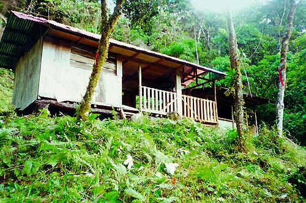

# Las memorias de AniversarioPerú - Parte 7

Si no leíste, aquí están los episodios anteriores:

* [Memorias Parte 1](http://aniversarioperu.utero.pe/2014/06/28/las-memorias-de-aniversarioperu-parte-1/).
* [Memorias Parte 2](http://aniversarioperu.utero.pe/2014/07/17/las-memorias-de-aniversarioperu-parte-2/).
* [Memorias Parte 3](http://aniversarioperu.utero.pe/2014/08/28/las-memorias-de-aniversarioperu-parte-3/).
* [Memorias Parte 4](http://aniversarioperu.utero.pe/2014/09/18/las-memorias-de-aniversarioperu-parte-4/).
* [Memorias Parte 5](http://aniversarioperu.utero.pe/2014/10/02/las-memorias-de-aniversarioperu-parte-5/).
* [Memorias Parte 6](http://aniversarioperu.utero.pe/2014/10/09/las-memorias-de-aniversarioperu-parte-6/).

# Iniciando la búsqueda de becas de postgrado
Pasados los sustos iniciales (ver [capítulo anterior](http://aniversarioperu.utero.pe/2014/10/09/las-memorias-de-aniversarioperu-parte-6/))
este viaje no resultó tan malo y no hubieron demasiados contratiempos
adicionales.

Nos presentamos en la oficina de INRENA para dejar constancia de poseer permiso
de colecta de arañas e insectos en el Parque Yanachaga-Chemillén. La
jefa del parque nos ayudó bastante al facilitarnos su camioneta 4x4 para
cargar los bultos y hacer el ingreso en una zona conocida como el Refugio El
Cedro.

Ya teníamos todos los bultos bien acomodados sobre la camioneta pero faltaba un
detalle. No había rastro del guardaparque que iba a conducir el vehículo. Los
vigilantes de la sede de INRENA me aconsejaron que lo vaya a buscar en la
Ferretería Loechle. Solo me dijeron que pregunte por **"el choclo"**.

Tomé mi mototaxi y llegué al toque a la Ferretería Loechle:

> - Señora, señora, busco al guardaparque que se le conoce como "el choclo".
> - Ah, tú buscas a Claus Loechle. Claussss! acá te buscaannn!

Al rato salió el oxapampino de apelativo "el choclo". Lo saludé y al toque me
di cuenta que no le podrían haber puesto mejor apelativo.

"El choclo" tenía una habilidad envidiable para conducir la camioneta sobre un
lecho seco de un río, avanzar por suelo pantanoso y sortear rocas y troncos
caídos. Avanzaba despacio pero seguro. A pesar que el terreno era horrible 
daba la impresión que "el choclo" lograba que la camioneta baile ballet sobre
los obstáculos. Esto contrastaría bastante cuando, muchos años después,
me tocara otro chofer que se metía a lo bestia y logró romper los dos muelles traseros de otra camioneta.

Avanzamos hasta donde se pudo, hasta un punto que queda a una altitud de
aproximadamente 1800 metros sobre el nivel del mar. Luego, solo teníamos que
cargar todos los bultos hasta el refugio, el cual queda a 2400 msnm.

El refugio era bien básico. Cuatro paredes de tablones de madera, dos
ambientes, techo de
calamina y amplias ventanas. En lugar de vidrio había malla para evitar la
entrada de mosquitos.
Ya que no había agua corriente, ni ducha, ni electricidad, ni baño, era
imposible bañarse. El chorro agua que bajaba de una quebrada cercana estaba
bien helada. Así que tuvimos que pasar 2 semanas sin bañarnos.

Pero valió la pena, los muestreos estuvieron buenos y regresamos con bastante
información. El regreso a Lima fue sin contratiempos. Los gringos se regresaron
a su país y yo me puse a procesar los datos para avanzar con mi tesis.

A pesar de ser caídos del palto, los gringos eran buena gente. Yo les conté de
mi anhelo de hacer un postgrado en el extranjero. Me dijeron que escoger una
universidad extranjera no es fácil. No es necesario que la universidad sea del
top 10 como Oxford, Cambridge, Harvard, Stanford, etc. Lo importante es que
la universidad sea buena y talvez lo más importante es fijarse en quién
podría ser mi futuro asesor de una futura tesis de maestría o doctorado.

Pasaron algunos meses y la profa se sienta a mi costado.

>- Hola hijito, ya ha pasado más de un año y no terminas la tesis? Qué has
estado haciendo? *rasking balls*?
>- No profa, es que la tesis está difícil, pero creo que la tendré lista en
cuatro meses.
>- Cuatro meses?! Y ya buscaste beca para el extranjero?
>- No profa, pero el lunes a primera hora me pongo a buscar beca para maestría.
>- Ay hijito. La maestría no vale nada. Los gringos la consideran como un
entrenamiento nomás. Si quieres ingresar a la ligas mayores debes hacer de
frente el doctorado.
>- Eso se puede?
>- Claro pes hijito. Además el doctorado en Europa te demorará 4 o 5 años. Si lo
haces en EEUU te demorará hasta 7 años. Y aquí en Perú son 2 años de maestría
más 2 años de doctorado. Podrás convalidar sin problemas cuando regreses.

Y así fue como inicié la búsqueda de una beca. Este proceso fue de ensayo y
error y aprendí bastante de las metidas de patas que cometí. Hubiera querido
que alguien con experiencia me hubiera dado algunos tips que tanto necesité en
ese momento.

En el próximo capítulo trataré esta etapa. Continuará...
