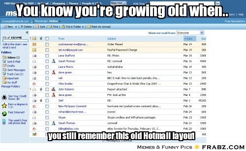

# Las memorias de AniversarioPerú - Parte 8

# Consiguiendo beca para un sueño
Si no leíste, aquí están los episodios anteriores:

* [Memorias Parte 1](http://aniversarioperu.utero.pe/2014/06/28/las-memorias-de-aniversarioperu-parte-1/).
* [Memorias Parte 2](http://aniversarioperu.utero.pe/2014/07/17/las-memorias-de-aniversarioperu-parte-2/).
* [Memorias Parte 3](http://aniversarioperu.utero.pe/2014/08/28/las-memorias-de-aniversarioperu-parte-3/).
* [Memorias Parte 4](http://aniversarioperu.utero.pe/2014/09/18/las-memorias-de-aniversarioperu-parte-4/).
* [Memorias Parte 5](http://aniversarioperu.utero.pe/2014/10/02/las-memorias-de-aniversarioperu-parte-5/).
* [Memorias Parte 6](http://aniversarioperu.utero.pe/2014/10/09/las-memorias-de-aniversarioperu-parte-6/).
* [Memorias Parte 7](http://aniversarioperu.utero.pe/2014/10/23/las-memorias-de-aniversarioperu-parte-7/).

Tuve que ponerme las pilas y comenzar la búsqueda de becas al toque.
Este fue un proceso de ensayo y error ya que metí la pata varias veces.

Creo que te contaré la historia de dos maneras:

## Versión corta
Me gané una beca al enviar un email.

## Versión larga
Es posible que me demore un par de posts en detallar la versión larga.
Comencemos:

Ahora hay
vías adicionales para conseguir becas de postgrado (por ejemplo postulando a
una de las becas que otorga Concytec). También puedes postular a becas que
ofrecen instituciones como la Fulbright y similares.

A mi me daba una flojera terrible  postular a la Fulbright. Supongo
que le tengo alergia a la tramitología.
Decidí ahorrarme intermediarios ("the middlemen") y escribir emails
directamente a las universidades extranjeras.

Los gringos caídos del palto me habían aconsejado que no era estrictamente
necesario postular a las mejores universidades del mundo (Cambridge, Oxford,
Harvard, etc). Me aconsejaron que quizá lo más importante es escoger asesor
de postgrado antes que universidad de postgrado.

Entonces como yo ya llevaba buen tiempo haciendo la tesis para titularme de
Biólogo, ya había leído y releído artículos científicos recientes relacionados
con mi tema.
Si te fijas, en los artículos científicos siempre va el email y universidad a
la que pertenecen los autores.
Entonces me senté en la computadora del laboratorio y escribí el email. Algo
parecido a esto:

> Subject: Greetings from Peru

> Dear Professor X,
  I am a peruvian student and would like to study PhD.

> Sincerely yours,

> Yoni Pacheco

Al día siguiente, emocionado abrí mi cuenta de correo Hotmail y no pude creer
mis ojos al ver que me habían respondido!
Me habían respondido! al primer intento! Comencé a leer el email y mi cuerpo
comenzó a sudar y ruborizar.

Recuerdo que la respuesta fue algo así (traducción libre).

> Hey,

> Rescaté tu email de mi carpeta de SPAM. No pudiste poner un peor mensaje en el
*subject* del email?

> Gracias por decirme *professor* pero no lo soy. Soy estudiante de PhD.
> Y te felicito mucho que quieras estudiar un PhD pero no te puedo ayudar.
> Escríbele a algún *professor* y detalla con claridad qué es lo que estás
pidiendo!

> chau

Qué roche. Qué roche.

Luego de ese roche tremendo tuve que calcular mis movimientos con mayor
cuidado. Planificar con tiempo cada paso. Tratar de anticipar la respuesta del
enemigo. Casi, casi como si estuviera en una partida de ajedrez contra la
muerte.

Agarré un cuaderno y escribí un título bien grande:

# Hacer lista de asesores potenciales
Busqué los artículos científicos que había leído y me parecían más
interesantes, los que tenían relación directa con mi trabajo de tesis y los que
tenían una relación ligeramente distante con mi tema de tesis.

Copié a mano todos los autores que encontré con sus emails y universidad de
procedencia. Hice dos listas:

## Lista de autores que investigan el mismo tema de mi tesis
Te recomiendo hacer la lista tomando en cuenta que:

* si tú estudias ecología de pajaritos, debes escribir a gente que estudie ecología
  de pajaritos
* si estudias fluctuaciones poblacionales de peces, debes escribir a gente que
  estudie fluctuaciones poblacionales de peces
* si estudias fisiología de alpacas, debes escribir a gente que estudie
  fisiología de alpacas
* etc, etc

## Lista de autores que investigan un tema parecido al de mi tesis
También es bueno ampliar el círculo de potenciales asesores:

* si estudias ecología de pajaritos, escribir a gente que estudie
  comportamiento de pajaritos, morfología de pajaritos, ecología de reptiles,
  ecología de mamíferos, ecología teórica
* si estudias fluctuaciones poblacionales de peces, debes escribir a gente que
  estudie poblaciones de moluscos, poblaciones de pingüinos, poblaciones de aves
  marinas
* si estudias fisiología de alpacas, debes escribir a gente que estudie
  fisiología de otros camélidos, fisiología de otros mamíferos domésticos,
  fisiología humana

Luego de este ejercicio tendrás entre 20 y 30 personas en total (si tienes más
es mucho mejor!).

Luego hay que depurar la lista. Debes buscar en internet si estos posibles
asesores son *professors* o son *post-docs* o estudiantes de PhD. Si son
estudiantes de PhD los puedes eliminar de la lista. Además, es útil si logras
darte una idea del status de tu potencial asesor:

* es reputado en su área?
* publica varios artículos por año?
* es científico recontra-super-hiper-archi famoso?
* es una persona de avanzada edad? próxima a jubilarse?
* es una persona muy joven que recién comienza su vida académica de manera
independiente? o sea, acaba de inaugurar su grupo de investigación?

## El problema de los *professors* super famosos
Si bien conseguirse un asesor así tiene muchas ventajas ya que esos profes
siempre tienen harto dinero para enviarte a conferencias, pagarte cursos de
postgrado en cualquier lado, inagotable dinero para gastar durante la
investigación. Tienen el problema de estar siempre ultra ocupados. Siempre están
viajando y si tienes suerte lo podrás ver unos cuantos días al mes. Estos
*professors* de nivel super-star tienen un gran laboratorio lleno de gente y es
muy probable que no tengan mucho tiempo para asesorarte. Si decides irte con
este asesor debes ser consciente que tendrás que ser un estudiante
independiente que no necesite mucha guía ni ayuda.

## El problema de los *professors* en edad de jubilación
Por lo general hacen poca investigación. Aún pueden tener estudiantes pero ya
están pensando en disfrutar sus años libres de carga académica y no tienen
tanto empeño en la vida académica como en sus años mozos.
Algunos incluso no han podido adaptarse a los cambios de tecnología o
nuevos paradigmas en la ciencia y es probable que hagas investigación en un
tema algo deslucido.

## El problema de los *professors* que son muy jóvenes
Estos *professors* tienen abundante energía e ímpetu. Por lo general no tienen
estudiantes a su mando, o solo tienen uno, entonces tienen todo el tiempo del
mundo para ti. Aún no son famosos y no viajan mucho. Siempre están disponibles.
Lo malo es que tienen poco financiamiento y el dinero siempre escaseará. 
En el mejor de los casos te podrá enviar a una conferencia internacional durante tus
estudios. Tendrás que buscártelas por tu cuenta (lo cual es
enteramente posible).

# La hora de escribir el email
Una vez que tienes tu lista debes comenzar a enviar los emails. El peor, sí
PEOR error que puedes cometer es hacer copy/paste y enviarle a todos el mismo
email. Nunca, pero nunca hagas este tipo de SPAM.

Escribir cada email es cosa seria que demanda mucho esfuerzo y trabajo, mucha
meditación. En mi opinión, escribir un buen email te debe tomar entre 2 o 3
días. Sí, escribir un email de 3 párrafos te debe demorar entre 2 o 3 días. Hay
que pensar en todo, desde la cuenta de email a usar, el *subject*, el texto,
    etc, etc.

En el siguiente post trataré el asunto de cómo escribir emails. Continuará...
