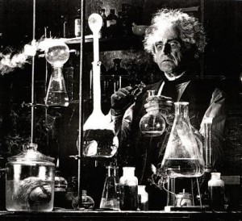

# Las memorias de AniversarioPerú - Parte 10

Si no leíste, aquí están los episodios anteriores:

* [Memorias Parte 1](http://aniversarioperu.utero.pe/2014/06/28/las-memorias-de-aniversarioperu-parte-1/): Los inicios
* [Memorias Parte 2](http://aniversarioperu.utero.pe/2014/07/17/las-memorias-de-aniversarioperu-parte-2/): El profesor de Razonamiento Verbal
* [Memorias Parte 3](http://aniversarioperu.utero.pe/2014/08/28/las-memorias-de-aniversarioperu-parte-3/): Estar en la uni es una cosa de locos
* [Memorias Parte 4](http://aniversarioperu.utero.pe/2014/09/18/las-memorias-de-aniversarioperu-parte-4/): Haciendo el trabajo de investigación/tesis
* [Memorias Parte 5](http://aniversarioperu.utero.pe/2014/10/02/las-memorias-de-aniversarioperu-parte-5/): En solo un mes, hablas inglés
* [Memorias Parte 6](http://aniversarioperu.utero.pe/2014/10/09/las-memorias-de-aniversarioperu-parte-6/): Punto de quiebre
* [Memorias Parte 7](http://aniversarioperu.utero.pe/2014/10/23/las-memorias-de-aniversarioperu-parte-7/): Iniciando la búsqueda de becas de postgrado
* [Memorias Parte 8](http://aniversarioperu.utero.pe/2014/10/30/las-memorias-de-aniversarioperu-parte-8/): Consiguiendo beca para un sueño
* [Memorias Parte 9](http://aniversarioperu.utero.pe/2014/11/13/las-memorias-de-aniversarioperu-parte-9/): Hay que ser atractivo
* [Memorias Parte 10](http://aniversarioperu.utero.pe/2014/12/12/las-memorias-de-aniversarioperu-parte-10/): Tu choteo es mi progreso

# Queremos investigación

## Artículo 79 de la nueva [Ley Universitaria 30220](http://leyuniversitaria.pe/ley-30220/)
> Los docentes universitarios **tienen como funciones la investigación**, el 
  mejoramiento continuo y permanente de la enseñanza, la proyección social y la
  gestión universitaria, en los ámbitos que les corresponde.

Años después de terminar el doctorado, mientras tomaba unas chelas con quien
había sido mi asesor doctoral, le pregunté cómo así se había decidido
tan rápido aceptarme como estudiante.

Me dijo que fueron puntos a mi favor haber mencionado a la
profa que siempre dice "Ay, hijito", quien era entonces asesora de mi tesis de
biólogo. También fue importante incluir como referencias a los gringos caídos
del palto.

Luego que enviara el email donde hice primer contacto, mi futuro asesor
doctoral había enviado emails a la profa y a los gringos
indagando por mí.
Y yo ni enterado.

Los *professors* buscan principalmente dos cosas en sus potenciales
estudiantes:

* que sean motivados, chamberos y que puedan llevar a término una investigación
  científica. Es decir, si son capaces de hacer un trabajo de investigación,
  por ejemplo tesis para titulación, es muy probable que puedan concluir una
  tesis doctoral.
* que sean capaces de funcionar socialmente dentro del futuro laboratorio. Que
  no sean locos calatos que se pongan a acosar a las chicas, y/o que se pongan
  a pelear con otros miembros de laboratorio.

[Abro paréntesis]
En la facultad de biología de esta universidad europea se comentaba la leyenda
del **"loco gas"**. Un estudiante que le gustaba pasearse por los laboratorios
para dejar las llaves abiertas de las cañería de los [mecheros Bunsen](http://es.wikipedia.org/wiki/Mechero_Bunsen).
También era muy comentada la leyenda del **"loco tijera"**, un estudiante de
postgrado que le gustaba pasearse
por los pasillos de la facultad de Química, siempre amenanzante con una tijera
el mano.

Ya son curtidos en estas cosas.
[Cierro paréntesis]

Los gringos le respondieron a este profe diciendo que yo era bien bueno, full chamba y
colaborador. Además de tener un excelente sentido del humor.

Quizá lo más importante fue la positiva recomendación de la profa que siempre
dice "Ay, hijito". Esta profa publicaba regularmente sus investigaciones, y ya
que el profe europeo hace investigación en casi la misma área, ya había leído
sus publicaciones científicas.

La biología es bastante amplia y muchos biólogos se especializan en investigar
una sección reducida de esta ciencia. Entonces, la mayoría de biólogos es
miembro de una tácita cofradía internacional de reducido número de miembros. La
mayoría se conoce personalmente ya que asiste con regularidad a las
conferencias científicas internacionales que se dan cada cierto tiempo. En el
peor de los casos
no te conocen personalmente, pero al menos han leído las investigaciones que
publicas, ya que para todos es una necesidad leer todo lo que publican nuestros
coleguitas.
Entonces es fácil evaluar la calidad de lo que uno investiga y publica. Y es
así que mi asesor doctoral confió en la buena recomendación que había hecho la
profa. La profa es miembro de las ligas mayores. Es considerada un miembro
importante y valioso de su gremio de biólogos.
Ya que la profa hace buena ciencia, los *professors* le van a creer cuando diga
que uno de sus estudiantes pulpines tiene potencial para hacer buena ciencia.
Los *professors* en ningún momento pensarán que la profa les está engañando,
también pueden ser caídos del palto para ciertas cosas.

Es más, sería muy dañino si la profa envía un estudiante monse diciendo que es
estudiante capo. Para la próxima vez no le van a creer cuando quiera
recomendar a otro de sus estudiantes. El resultado sería muy perjudicial para
el resto de estudiantes pulpines del Perú.

Por eso es muy conveniente que cuando seas biólogo pulpín y escojas asesor para
tu tesis de biólogo escojas a algún profe que hace investigación y que además
publica en revistas internacionales.
Si tu profe solo "publica" en libros de resúmenes de congresos nacionales,
te hará perder tu tiempo y tú debes salir corriendo.
Si la comunidad científica internacional no conoce a tu asesor "ni de pelea de
perros" te será mucho más difícil escalar en el mundo académico.

Por eso creo que es importante que se especifique que la función de los
docentes universitarios es investigar. No es por capricho o por ser malos. **Es
necesario que los profes investiguen ya que esto beneficiará mucho a los
estudiantes y tesistas**.

## Consiguiendo financiamiento

Un día de Octubre me llega un email del profe diciendo:

> - Creo que este año no lograré conseguiré financiamiento para traer
estudiantes. Recién comienzo mi carrera y nunca he supervisado estudiantes de
doctorado. Pero estuve conversando con mi colaborador, quien tiene dinero de
sobra y está feliz de usar ese dinero para costear tu beca doctoral por el
periodo de 4 años.

Cuando conocí en persona a este colaborador me enteré que la Academia de
Ciencias de su país le daba financiamiento todos los años. Este colaborador
era tan capo que todos los años postulaba por financiamiento y
siempre le daban! Luego paraba en aprietos ya que le era difícil conseguir
estudiantes para que se gasten el dinero. No es raro que reciban medio millón de
euros en financiamiento. Ese dinero les alcanza para los gastos de su
investigación y además siempre incluye un porcentaje para pagar el sueldo de
uno o más estudiantes de doctorado (esta es la dichosa beca doctoral).

Por eso era un alivio para él que mi profe había decidido tomarme como
estudiante. Le ahorrábamos el trabajo de encontrar estudiantes por su cuenta.
Ya que este colaborador me iba a financiar se convertiría en mi coasesor de
tesis doctoral.

## Una revelación inesperada

Yo andaba con la felicidad pintada en el rostro al saber que ya tenía asegurada
la beca. Pero la felicidad estuvo en peligro cuando días después recibiera un email
del profe diciendo que la facultad le había dicho que él no estaba autorizado a
tener estudiantes de doctorado.

Resulta que además de ser miembro de la plana docente de la universidad,
a pesar que dictan clases, 
además de ser doctores, los
profes tienen que pasar por una serie de evaluaciones para que obtengan el
estatus de "docente". Una vez que son "docentes" ya pueden supervisar tesis
doctorales.

Tienen que presentar proyectos de investigación, pasar entrevistas personales,
dar una clase modelo y luego de aprobar todo satisfactoriamente recién se les
llama "docentes" y recién pueden tener estudiantes doctorales.

Mi profe no era "docente". Luego de unos días envió otro email diciendo había
iniciado su proceso de acreditación docente, que duraría unos meses y que ya
tendría tal estatus antes que yo llegue a Europa. Entonces todo bien. No
problema. Ufff.

## Comenzando los trámites
Entre emails que iban y venían yo le había explicado al profe que solo tenía
conmigo mi cartón de Bachiller y que en unos meses estaría sustentando mi tesis
para optar el título de biólogo. Le pregunté si era posible estudiar el
doctorado saltándome la maestría. Le dije que averigüe si en su facultad era
posible estudiar el doctorado teniendo únicamente el grado de Bachiller.

Resulta que cada departamento de las universidades tienen cierto nivel de
autonomía y son ellos quien establecen los parámetros utilizados para aceptar
estudiantes.

Felizmente la respuesta fue positiva pero condicionada a que mis estudios de
pregrado hayan sido lo suficientemente amplios, que me hayan dado una buena
base para pasar de frente al doctorado.

Tuve que ir a la Universidad de San Marcos a tramitar mis certificados de
estudios donde figuraban los cursos que había cursado junto con las notas. El
profe me dijo que no era necesario traducirlos ya que la escuela académica
europea le había dicho el idioma Español es idioma oficial de la Unión Europea,
que los envíe tal como estaban. 

Les envié los certificados escaneados y una traducción libre de los nombres de
los cursos que hice yo mismo, todo por email. Además me cuidé de incluir mis buenas
calificaciones obtenidas en cada curso. Lo cual no sirvió de mucho ya que ellos
solo tienen dos calificaciones: aprobado y desaprobado. No les importó mis
calificaciones. Chezz.

Me contestaron con luz verde. Yeeeeeee! Luego me enteraría que la mayoría de 
compañeros del doctorado tampoco tenían maestría. Solo la tenían aquellos que
habían llegado de otras universidades, de otros países.
Supongo que ahora el asunto debe estar  más estandarizado entre países europeos
debido al [Proceso Bolonia](http://es.wikipedia.org/wiki/Proceso_de_Bolonia),
el cual estaba en discusión mientras yo terminaba mis estudios por esos lares.

Pero no me iban a aceptar en el programa de doctorado tan fácil. Me pusieron la
condición que yo debía hacer una tesis de grado, equivalente a la que hacen los
estudiantes de aquella universidad cuando terminan el pregrado. Allá comienzan
a hacer "practicas preprofesionales" durante el pregrado, durante el verano,
hacen trabajo de
laboratorio, procesan datos, etc. Esto les llega a servir cuando les toque
hacer la tesis de grado. Hacen un poco más de colecta de datos, análisis,
      escriben la tesis, la sustentan y listo. Ya pueden postular al programa
      de doctorado.

Yo tenía que hacer lo mismo. Si bien San Marcos me dio una buena base, ellos
querían ver me desenvolvimiento en canchas europeas. Esta tesis la debía hacer
en 6 meses, ellos iban a costear mis pasaje de avión e iba a recibir un sueldo
mensual para pagar alquiler de departamento, comida, pasajes y extras. Me
dijeron que si al terminar esos 6 meses, yo consideraba que era mejor regresar
a Perú (si extrañaba mucho a mi mamá), podía regresar con un pequeño diploma
bajo el brazo. Sin drama, sin llanto, haríamos rotura amical.

Yo acepté al toque. Esa situación era mucho mejor a la que podía esperar en
Perú. En esa época no había trabajo para los biólogos, aún no comenzaba la
fiebre de los metales y pasarían años hasta que el Estado comience a exigir
estudios de impacto ambiental a las empresas mineras. Todos los biólogos que
conocía recién tuvieron sus primeros ingresos decentes gracias a la demanda por
estudios de impacto ambiental.

Hasta que un día entra la profa al laboratorio con una carta con estampillas y
sellos:

> Toma hijito, ya llegó tu pasaje para Europa.

Continuará...

