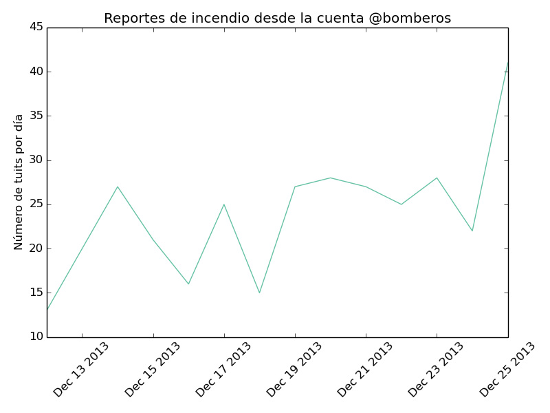

# Feliz navidad, con incendio, para todos

Viendo el tuiter me doy cuenta que [@bomberos](https://twitter.com/bomberos) e **incendio** son *trending
topic* a tempranas horas de este 25 de Diciembre.

Muchos tuiteros reportan alta actividad de los bomberos por incendios
causados supuestamente por los fuegos pirotécnicos.

Pero, es cierto que hay un número inusualmente alto de incendios reportados hoy
25 de Diciembre? no serán quejas infundadas de caviares anti-piroténicos?

Para averiguar necesitamos datos puros y duros. Es posible analizar los tuits
emitidos por la cuenta [@bomberos](https://twitter.com/bomberos) y plotear el número de incendios reportados
por día a lo largo del tiempo, digamos durante el mes de Diciembre.

Usando el cliente de tuiter "t", te puedes descargar todos los 3200 tuits más
recientes de los [@bomberos](https://twitter.com/bomberos)

> t timeline -l -c -n 3200 bomberos > tuits.txt

Podemos seleccionar sólo aquellos que incluyan la palabra 
**INCENDIO**:

> cat tuits.txt | grep INCENDIO > tuits_incendio.txt

Y podemos hacer el gráfico del número reportes de incendios por día durante el
mes de Diciembre usando Python y Matplotlib (ver sección geek):

Como ves se reportan alrededor de 25 incendios por día durante casi todo el mes
de Diciembre. Pero hoy **día de la navidad**, del niño manuelito, **día de reventar
mamaratas** se van registrando hasta 40 tuits con reportes de incendio. **Hay un
incremento de poco más del 50% en el número de incendios**.

Chequea el timeline de la cuenta [@bomberos](https://twitter.com/bomberos) si no me crees.

Feliz navidad!

# Sección geek
Tuits conteniendo la palabra *INCENDIO*

https://gist.github.com/aniversarioperu/8123519

Código para plotear tuits:

https://gist.github.com/aniversarioperu/8123536
