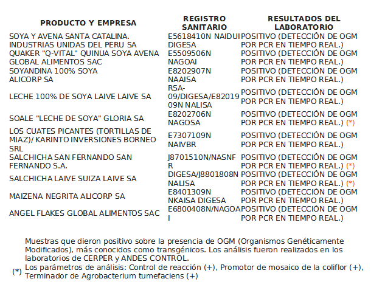
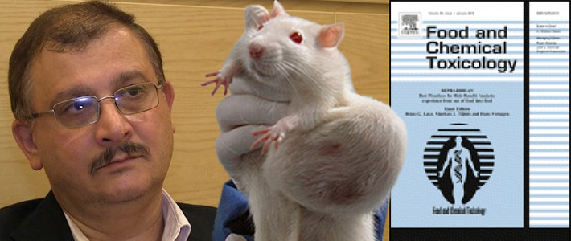
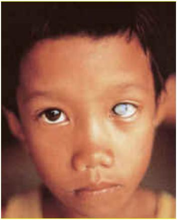
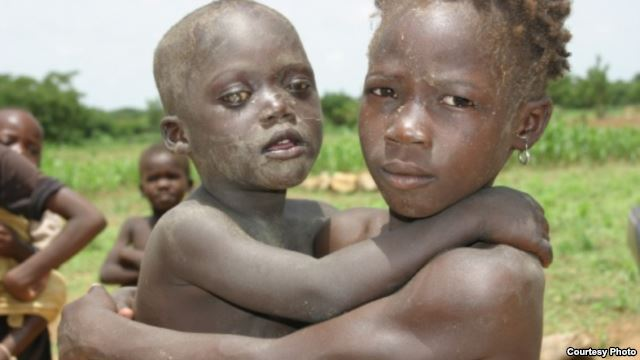

Veo en el tuiter que hay algo de pánico en la población al descubrirse que, sin
saberlo, estamos consumiendo alimentos transgénicos. Horrible oye!

Esta es la lista proporcionada via tuiter por
[@suriel]((https://twitter.com/suriel):

Algunos se han alarmado al revelarse tan cruda realidad. Otros no parecen estar
tan alarmados:

https://twitter.com/miguelmorachimo/status/419214631912349696

Parte del temor se basa en posibles efectos secundarios sobre la salud de los
que consumimos estos tipos de alimentos. Pero también hay temores que la gente
desarrolle alergias, que haya transferencia genética de plantas a animales,
pérdida de la biodiversidad, uso de herbicidas e insecticidas,
propiedad intelectual, empobrecimiento de agricultores, regulación y
un largo etc. (ver la [lista completa de controversias aquí](http://en.wikipedia.org/wiki/Genetically_modified_food_controversies))

También están los que se oponen por razones aparentemente alarmistas. Dicen que
comer [transgénicos causa autismo y cáncer](http://www.healthinducedautism.com/genetically-modified-foods-gmo.html).
El problema que de ese tipo de páginas web es que no citan la literatura donde se
demuestra la conexión entre comer transgénicos y desarrollar autismo (o tener
hijos con autismo). Lo mismo para cáncer.

Si queremos ser serios, es necesario sostener cada afirmación con la cita
bibliográfica correspondiente del estudio o reporte científico donde se reporte
la conexión entre transgénicos y enfermedades humanas.

# Si comemos transgénicos vamos a mutar?
Es precisamente esto lo que el bando anti-transgénico ha querido hacer creer a
la gente. Dicen que causa cáncer.
Llegaron a publicar un artículo científico, por un italiano de
apellido [Séralini y colaboradores](http://www.sciencedirect.com/science/article/pii/S0278691512005637), donde daban
supuesta evidencia que ratas de laboratorio adquieren cáncer al cosumir
alimentos transgénicos.

Los anti-transgénicos estaban saltando en un pie de alegría, porque por fin
tenían un artículo científico que podían utilizar como soporte a sus
argumentos.

Pero lamentablemente la comunidad científica tuvo que criticar duramente este
estudio. Los palos cayeron con todo, vía blog, y sobre todo via
revistas científicas.
Científicos de todo el mundo llegaron a la conclusión que este estudio tenía
serias deficiencias y además el estudio **[era ilícito, anti científico y con
falta de ética](http://www.gmwatch.org/index.php/news/archive/2013/15184-journal-retraction-of-seralini-study-is-illicit-unscientific-and-unethical)**.

Las principales críticas fueron que los autores usaron un número muy reducido de ratas, tan reducido que no se podían hacer estadísticas con sus datos. Otra crítica fue que habían escogido una raza de ratas que naturalmente tienen predisposición a desarrollar cáncer.

O sea es bien rochoso que la comunidad de tus colegas tengan tal apreciación
crítica de tu trabajo. El roche fue tan grave que la revista donde se publicó
este estudio tuvo que "retraer" el artículo. O sea la revista dijo "perdón por
publicar este mamotreto y hagan de cuenta que nunca se publicó".
[Aquí la retracción](http://www.sciencedirect.com/science/article/pii/S0278691512005637).

# Si como transgénicos mi hijo será autista?
He estado buscando en Google Scholar algún artículo científico que muestre esta
conexión. Pero no hay. En Google solo hay páginas web que afirman eso pero no
muestran evidencia. Y como ya sabemos, queremos ver evidencia! queremos datos
duros y puros!

# Qué es un alimento u organismo transgénico?
[Según Wikipedia](http://en.wikipedia.org/wiki/Genetically_modified_organism),
un organismo transgénico es aquel al que se le ha modificado
su ADN (o sea sus genes) usando técnicas modernas. **Esta modificación implica
transferir genes de una especie en otra especie**. Estos organismos pueden ser
micro organismos, insectos, plantas y animales.

Pero mucha gente cree que los organismos transgénicos son recientes, que los ha
creado Monsanto y que aún no ingresan al Perú. Bueno, ingresan como soya en tu
rico sillao que usas en el chifa, pero aún no se cultivan transgénicos en el
Perú. Y el [gobierno ha firmado la moratoria de 10 años](http://www.larepublica.pe/04-11-2011/congreso-le-puso-freno-por-10-anos-al-ingreso-de-transgenicos-al-pais) para que nadie, pero
nadie, cultive transgénicos en esta hermosa tierra del sol.

Bueno pex, amixer Gastón Acurio. En el Perú se cultivan transgénicos desde
hace mucho pero mucho tiempo.

# Transgénicos cultivados en el Perú
El primer cultivador de transgénicos que se puede identificar es Don Fermín
Tangüis.
Acuérdate que en los años 1910-1911 los algodoneros estaban tristes porque una
plaga de hongos atacaba y mataba a las plantas de algodón. Fermín Tangüis
experimentó **haciendo cruces entre diferentes especies de algodón** para
obtener un mutante intermedio que sea inmune a la plaga. Para esto hizo **un
cruce entre una especie de algodón Egipcio y el algodón peruano y tuvo éxito**.
Obtuvo el algodon Tangüis, tan preciado por los hipsters de la época.

# Otros ejemplos de transgénicos
Tú amigo(a) si tienes miedo de comer transgénicos debes dejar de comer chifa ya
que **el rico sillao se hace de soya transgénica**.

También debes dejar de comer plátano, de la isla, de seda, son malos. También
han sido genéticamente modificados. Estas plantas son tan aberrantes que tienen
sus semillas totalmente atrofiadas y no pueden reproducirse normalmente. Solo
se reproducen por clonación.
Te reto a que comas el plátano original, sin manipulación genética. Pero
cuidado que se vaya romper tu amalgama al morder las semillas que sí son funcionales.

El amigo [@_BryanLucero](https://twitter.com/_BryanLucero) me recuerda que **en
un sentido amplio todos los organismos somos genéticamente modificados**. Pero
aquellos que están en discusión y son **controversiales son los organismos
transgénicos producidos por técnicas modernas como la biotecnología e
ingeniería genética**.

Pero #amigoDateCuenta que un transgénico será transgénico así se haya creado
con última tecnología o con métodos tradicionales como cruces y selección
artificial. Además que la naturaleza está generando por sí sola transgénicos
todos los días! Por ejemplo sabías que 
[naturalmente
ha habido transferencia de genes entre vacas y
serpientes](http://phenomena.nationalgeographic.com/2013/01/01/how-a-quarter-of-the-cow-genome-came-from-snakes/).

# Son los transgénicos necesariamente malos?
Te dejo un ejemplo para que tú decidas.

Uno de los problemas graves de los niños pobres de cierta parte del Asia y
África es que no
tienen suficiente ingesta de vitamina A. La vitamina A es tan esencial que
estos niños al carecer por completo de ella han perdido la visión. [Entre 250
mil y medio millón de niños cada año quedan
ciegos](http://en.wikipedia.org/wiki/Vitamin_A_deficiency) en el mundo por
deficiencia de vitamina A. Mira lo que les pasa a estos niños:

Alguien puede decir: pues que coman sus zanahorias y tomates! Bueno pues, estos
son niños que si tienen suerte podrán comer un puñado de arroz al día.
Impensable poder acceder a verduras y legumbres.

Por esta razón un grupo de científicos estaba cultivando un primer lote de
arroz transgénico que tenía incluído un gen para producir vitamina A ya que el
arroz común y corriente no tiene esta vitamina. Ya que el grano de arroz se
tornaba de un color amarillento debido a la presencia del pigmento
beta-caroteno se le llamó **Golden Rice**. El beta-caroteno es el pigmento que da el color a la zanahoria.
Tu te comes el [beta-caroteno y tu cuerpo lo parte en dos para originar vitamina
A](http://es.wikipedia.org/wiki/Caroteno).

Lamentablemente los científicos no pudieron terminar con sus ensayos con este
arroz ya que gente anti-transgénicos [invadió el terreno y quemó todas las
plantas de arroz](http://www.slate.com/blogs/future_tense/2013/08/26/golden_rice_attack_in_philippines_anti_gmo_activists_lie_about_protest_and.html).

La excusa para quemar estas plantas era que los transgénicos causan alergias.
Yo creo que deberían de haber preguntado a las madres de estos niños para saber
si prefieren tener hijos ciegos o con alergias (pero falta probar que los transgénicos causen alergias).

# Es factible y rentable cultivar transgénicos en el Perú?
No soy economista ni agricultor. Pero veo que Argentina y Brasil aprovechan
tener territorios planos, miles de kilómetros y kilómetros de terreno plano que usan
para cultivar su soya transgénica... Supongo que según la
ley de las escalas, puedes vender productos baratos si es que produces una
tremenda cantidad de tus verduras. Y hay que vender barato porque creo que los
transgénicos son considerados **commodities**.

En el Perú tenemos tales extensiones de terrenos planos? El desierto es una
tripa, la sierra es muy escarpada, el altiplano es bien plano y bien grande
pero hace mucho frío y no crecen muchas plantas de interés. La selva peruana?
será plana pero el terreno es pobre y solo soporta un cultivo y luego debe
abandonarse.

Si el territorio peruano no es rentable para cultivar *commodities*
(transgénicos) quizás sea más rentalbe producir productos *premium* (orgánicos)
    y venderlos caros ya que los hipsters de ahora tienen preferencia por lo
    natural y exclusivo.
