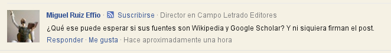
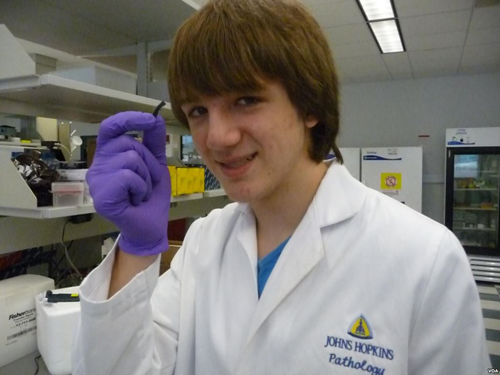

# Ay, no uses Wikipedia

He notado que varios comentaristas tienen serias objeciones a que se use
Google Scholar para obtener información. Pero parece que hay mayor cantidad de
anticuerpos a un post si este contiene enlaces a páginas de Wikipedia.

Bueno pues, en este post te voy a contar la historia de Jack Andraka. Pero
primero una breve introducción.

# Qué es Google Scholar?

Es un proyecto de Google que consiste en ser un buscador web especializado en
literatura científica en varios formatos, y diversas áreas de investigación. Como sabemos, los
científicos publican los resultados de sus investigaciones en revistas
científicas. Google Scholar los indexa y pone a tu disposición 
enlaces de los artículos científicos y en muchos casos incluye el PDF para que
lo descargues y leas. Todo gratis nomás.

Google Scholar es como Google, pero más especializado.

Por lo tanto **Google scholar no es la fuente de información, la fuente son los artículos científicos allí
indexados.**

Si consideras que buscar información en Google Scholar es malo, entonces
consideras que leer ciencia es malo, usar ciencia es malo. Si quieres dar
la espalda a la ciencia, no puedes ya que la ciencia está metida en la vida diaria. A
menos que decidas vivir debajo de una piedra...

# Wikipedia tiene información confiable?

## Vandalismo
Talvez el hecho que cualquier persona pueda editar Wikipedia y que haya tanto
vandalismo (gente que deliberadamente incluye errores o sin sentido) hace que
el público desconfíe de la información que aparece en la rica wiki.

Wipedia tiene software diseñado para detectar vandalismo y avisar a algún
editor humano (son los [wikibots](http://en.wikipedia.org/wiki/Category:Wikipedia_anti-vandal_bots))
para que tome acción. Además, existe
una [unidad especializada de editores en Wikipedia que luchan activamente y
borran todo el vandalismo que puedan encontrar](http://en.wikipedia.org/wiki/Wikipedia:Counter-Vandalism_Unit).

## Objetividad
Al ser una enciclopedia, la rica Wikipedia se esfuerza [en evitar presentar
opiniones](http://en.wikipedia.org/wiki/Wikipedia:What_the_Good_article_criteria_are_not#.284.29_Neutral).
Toda afirmación debe estar sutentada por una referencia publicada
en otro lugar, sea medio físico o virtual (ver: *[citing
        sources](http://en.wikipedia.org/wiki/Wikipedia:Citing_sources)*).
Si esta y otras condiciones no se cumplen, algún editor notará el hecho y
procederá a corregir, o abrir un canal de discusión para ese punto en
particular.
Los puntos controversiales tienen un protocolo establecido para resolverse,
    incluyen varias instancias donde los bandos contrarios exponen sus
    argumentos, se discuten y hay hasta votación para decidir aprovar o rechazar la
    edición en disputa.

## Confiabilidad
Todos cometemos errores, incluso Wikipedia. Varios estudios han medido el
porcentaje de errores de Wikipedia y comparado con otras fuentes tradicionales.
Estos estudios han encontrado que la cantidad de errores encontrados en Wikipedia son
[comparables con la venerable Enciclopedia Británica](http://news.bbc.co.uk/2/hi/technology/4530930.stm).
Claro que la Enciclopedia Británica [no está de acuerdo con este resultado](http://www.nature.com/nature/journal/v438/n7070/full/438900a.html). 

Pese a los errores, Wikipedia tiene la ventaja ya que éstos pueden ser
corregidos rápidamente ni bien si detectan. En contraste podrás encontrar
correcciones a la Enciclopedia Británica en una posterior edición de sus versión
impresa (si es que no usas la versión online).

# Es bueno estudiar usando Wikipedia y Google Scholar?

Te cuento brevemente la historia de un chibolo llamado [Jack Andraka](http://en.wikipedia.org/wiki/Jack_Andraka). Luego de
[perder un familiar cercano víctima del cáncer de páncreas](http://www.bradaronson.com/jack-andraka/), decidió investigar
la posibilidad de tener un método eficaz para la detección de este mal.

Se dió cuenta que muchas personas sucumben a este mal debido a la falta de un
método que sea rápido, barato y altamente sensible que pueda detectar fases
tempranas de la enfermedad.

Este adolescente de 15 años se embarcó en el desarrollo de un método de
detección temprano de cáncer de páncreas. Ya que no tenía una buena biblioteca
en su colegio, adivinen a dónde 
tuvo que que recurrir en búsqueda de información? [Pues a Wikipedia y
Google Scholar!](http://bit.ly/1dK9u9I)

Wikipedia es una excelente fuente de información introductoria a muchos temas.
Una vez que decides profundizar en un tema tienes que dirigirte a Google Scholar para
podeer leer la fuente primaria de la ciencia (lo artículos científicos mismos).

Bueno, Jack llegó a desarrollar un método de detección temprana **baratísimo** ($0.03 dólares
        comparados con el método tradicional que cuesta 800 dólares,
        **rapidísimo** (168 veces más rápido), y **400 veces más sensible** que
        otros métodos.

Jack Andraka ganó el primer premio de una feria científica organizada por Intel
y actualmente está trabajando con un laboratorio para masificar la producción y
venta de este método.

Su método es sorprendentemente simple. Jack averiguó que las células
pancreáticas cancerosas tienen una exagerada producción de una proteína
(conocida como mesotelina). Por lo tanto la presencia de mesotelina en sangre
puede ser usada como un "**biomarcador**" para diagnosticar la enfermedad. 
Jack ya había encontrado la pista de la enfermedad, solo faltaba diseñar la trampa. Para esto
usó nanotubos de carbono combinados con papel filtro bañados en un anticuerpo
específico para la mesotelina.

Ya tú sabes que un antígeno (en este caso la mesotelina) reacciona con su
respectivo anticuerpo.

Entonces la detección consiste en tomar una muestra de sangre del paciente para
introducir el papel con nanotubos y anticuerpos. Si hay presencia de
mesotelina, esta reacciona con los anticuerpos y deforman los nanotubos. Los
nanotubos deformados tienen conductividad eléctrica diferente que puede ser
medida con un sensor eléctrico. A más mesotelina, más deformación y mayor
diferencia en la señal eléctrica.

El uso de nanotubos de carbono en combinación con papel filtro es lo que hace
que este método sea revolucionario.

###Existen críticas al trabajo de Jack
Una crítica es que ni su método ni resultados
ha sido publicado en ninguna revista científica. Esto es de esperarse ya que el
método ha sido patentado por Jack y un laboratorio comercial lo tiene en
proceso de producción. Debe ser un secreto corporativo por ahora.

Otra crítica es que investigadores independientes [no han encontrado diferencias
significativas en la cantidad de mesotelina producida por pacientes saludables
y afectados por el cáncer pancréatico](http://www.degruyter.com/view/j/cclm.2012.50.issue-4/cclm.2011.816/cclm.2011.816.xml).
Solo el tiempo y estudios adicionales dilucidarán esta controversia.

# Conclusión

Ya ves, usar Wikipedia y Google Scholar como herramientas en la búsqueda de
información no es tan malo. Lo malo sería copiar y pegar texto de Wikipedia en
tus tareas, trabajos de la universidad, o trabajo de difusión de información.
Tus profes, jefes y lectores no son tontos, se darán cuenta de un copy/paste.

Estas herramientas deben ser un punto de inicio, un lugar de referencia para
encontrar fuentes de información adicionales y para que te ayuden en la elaboración de
tu tarea.

Entonces ya sabes, amiguito escolar. Si tu profe te dice que no hagas tu tarea
usando Wikipedia, explícale quien es Jack Andraka y lo que ha logrado hacer.

Aquí te dejo el momento que Jack Andraka ganó el primer premio en la feria
científica de Intel.

http://www.youtube.com/watch?v=tG2cH_glRQU
