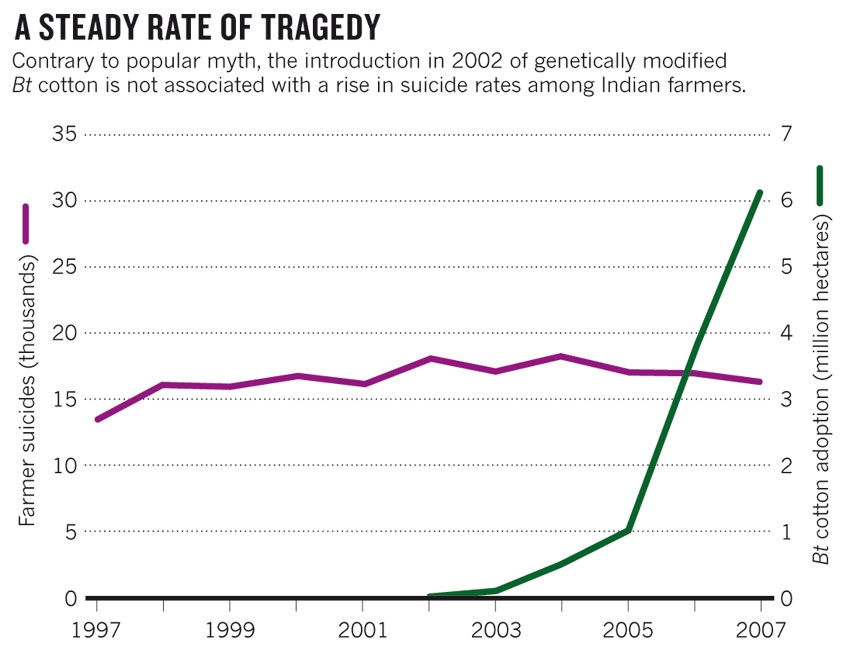
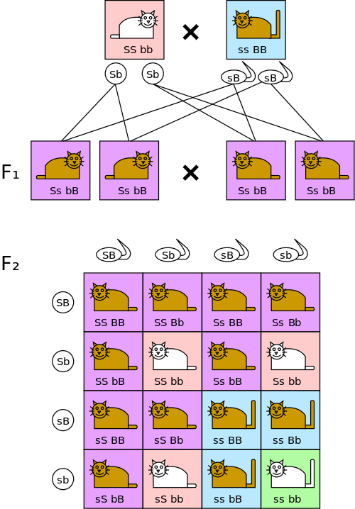

# Mito de los suicidios masivos en India causados por el cultivo de algodón transgénico

Un mito recurrente es que los agricultores de la India comenzaron a suicidarse
masivamente luego que iniciaran el cultivo de algodón transgénico. La causa
sería que las semillas eran muy caras, los cultivos fracazaron y al verse en
extrema deudas decidieron acabar con sus vidas.

El diario [Daily
Mail](http://www.dailymail.co.uk/news/article-1082559/The-GM-genocide-Thousands-Indian-farmers-committing-suicide-using-genetically-modified-crops.html)
(el **Ajá** del Reino Unido) ha dicho que **los organismos
genéticamente modificados están causando un genocidio** [sic] en la India.

Si esto fuera cierto deberían meter presos a esos organismos genéticamente
modificados.

Afortunadamente los hechos no son tan alucinantes.

Buscando en Google aquellas páginas web publicadas entre el rango de fechas Jan
1, 1997 - Dec 31, 1998 (antes de la introducción de transgénicos al país) ya se
reporta numerosos suicidios de agricultores el la India.

Esta es una de las páginas (publicada el 30 de Octubre de 1998):
http://www.thecornerhouse.org.uk/resource/food-health-hope

> Today in India, the numbers of farmers committing suicide is growing all the
time as more and more indebted, despairing rural dwellers are driven to the
wall.

Buena parte de la agricultura en la India no está tecnificada. Uno de sus
problemas es que dependen como fuente de agua de las poco predecibles [lluvias
Monzónicas](http://en.wikipedia.org/wiki/Monsoon).
Si tienen un buen Monzón todos son felices, agricultores tienen hartos ingresos
y la economía se acelera. En año de [Mozón débil las cultivos fracasan, hay
escasez, suben los precios, aparecen especuladores, los
agricultores no pueden pagar sus
deudas](http://www.bbc.co.uk/news/world-asia-india-22750169) que obtuvieron
para la siembra, caen en pobreza extrema y muchos se suicidan.

# Qué dicen los datos

No es que yo tenga una
[fijación psico-sexual con los gráficos](http://aniversarioperu.wordpress.com/2013/10/21/no-hacer-mal-uso-de-las-estadisticas-para-atacar-qali-warma/)...
de todos modos aquí te muestro uno:

Si fuera cierto que la causa de miles de suicidios en la India se debe a que
cultivan transgénicos, se debería ver un aumento significativo de suicidios según aumentaba
el número de hectáreas de tierra cultivada con algodón transgénico.

Pero el gráfico te dice que [el número de suicidios se ha mantenido masomenos
constante](http://www.nature.com/news/case-studies-a-hard-look-at-gm-crops-1.12907).
Obviamente los transgénicos no son la causa, las causas deben ser
otras. En un artículo reciente de Keith Kloor
([@keithkloor](https://twitter.com/keithkloor)) aparecen algunas posibles
causas (descargas el [PDF de aquí](http://www.superpunch.net/2014/01/the-gmo-suicide-myth.html)).
Esto posible que esto sea originado por la falta adecuada de crédito barato, sobre
dependencia en prestamistas usureros, altos gastos financieros, además de
una combinación con problemas interpersonales y familiares.

# Cómo va el negocio de algodón transgénico en la India?
Ahora los agricultores de la India son más pobres? tiene más billete?

Luego del incio del cultivo de algodón transgénico Bt en la India, la
prestigiosa revista Science [1] emitió en el 2003 un reporte donde comparaban la cantidad de
algodón producidos por hectárea en tierras cultivadas con algodón tradicional
(híbrido) versus algodón transgénico.

Los resultados muestran que cada hectárea cultivada con algodón transgénico
producía hasta 50% más kilos de algodón. Sin embargo los autores mencionan que
la evaluación se realizó en el año 2001 y era muy temprano para afirmar
categóricamente la rentabilidad de este algodón transgénico.

Un estudio posterior publicado en el 2012, reporta un seguimiento a
plantaciones de algodón transgénico durante los años 2002 y 2008, concluyendo
que estos cultivos mostraron un rendimiento superior (24%) y aumento de
ganancias en un 50% para agricultores pequeños [2].

Al parecer es tan rentable que los fabricantes de algodón peruanos sienten que
no pueden competir con el algodón barato de la India y [están pidieron que se
prohíba su importación](http://www.larepublica.pe/08-04-2009/sni-y-empresarios-de-gamarra-enfrentados). Están chocando con los confeccionadores de ropa de
[Gamarra ya que quieren aprovechar en usar el algodón Indio](http://www.larepublica.pe/22-09-2011/gamarra-evalua-paro-por-prohibir-importacion-de-algodon-de-la-india) para bajar sus
costos de producción. Al parecer la industria algodonera peruana ha sido dejada
en *off side* y ha perdido competitividad.

# Es verdad que ahora los agricultores de la India ya no pueden producir semillas y tienen que comprarlas todas?

Sí. Pero esto es lo que siempre han estado haciendo. Antes que se inicie la
moda transgénica en la India, lo agricultores TAMBIÉN tenían que comprar sus
semillas a empresas transnacionales.
Los algodones que tradicionalmente se cultivaban son todos híbridos [1]. Producto
del cruce de dos especies diferentes con el fin de obtener una mezcla de
caracteres deseables debido al vigor híbrido.
**El famoso algodón Suvin, joya de la India, variedad considerada como
órganica, es un algodón híbrido!** [3]

Ese es justamente el problema. Tú no puedes cultivar una siguiente generación
de híbridos porque si los cruzas entre ellos, su descendencia pierde las
características tan deseables. Todo es por culpa de la ley de Gregorio Mendel.

# Que pase el monje, Gregorio Mendel!
[Gregorio Mendel](http://es.wikipedia.org/wiki/Gregor_Mendel) fue un monje que un buen día de 1856 se le antojó descubrir las leyes
de la genética haciendo cruces de arvejitas en su monasterio.
Todos los genetistas alabamos a Gregorio Mendel y consideramos esta área 
como genética Mendeliana. 

Rápidamente te explico la genética Mendeliana. Si tienes una planta de fibra
larga y de color gris y la cruzas con una planta de fibra corta pero de color
blanco, y si los genes se comportan a
la manera Mendeliana, tendrás plantas hijitas (híbridos) con fibra larga y blanca.

Pero ay de ti si te atreves a cruzar dos plantas hijitas híbridas. Tendrás todo
tipo de combinaciones, incluyendo variedades indeseables: plantas de fibras
largas y grises, de fibras cortas y blancas, fibras cortas y grises, etc.

Mira este ejemplo pero con gatitos pusheen:

Entonces los agricultores siempre han estado comprando semillas a empresas [1].
Si bien las semillas transgénicas son mas caras que las semillas orgánicas
tradicionales. Los agricultores se ahorran al tener que rociar menor cantidad
de insecticidas, además que cada hectárea les genera más producto [1].

# Más mitos sobre transgénicos
Según algunos comentaristas este pechito recibe pago de Monsanto para escribir
estos posts sobre transgénicos.
Bueno, con un par más de posts ya tendremos suficiente dinero para que el blog
Útero de Marita compre al Grupo El Comercio con todo y su 80%.

Entonces se me ha ocurrido tratar de expliar porqué el miedo a los transgénicos
se basa en mitos sin fundamento.

Viendo un debate sobre transgénicos en la tele entre el ex-teniente alcalde
Eduardo Zegarra y Miguel Santillana, me doy cuenta que el señor Zegarra es una
excelente fuente de mitos!

El mito que comer transgénicos da cancer a ratas de laboratoratorio ya fue
refutado en un post anterior en este blog ([ya llegaron los transgénicos)[http://aniversarioperu.utero.pe/2014/01/03/ya-llegaron-los-transgenicos/].
Eduardo Zegarra menciona como envidencia un estudio que ha sido tirado por los
suelos por la comunidad internacional de científicos debido a serias
deficiencias metodológicas.

Seguiremos informando por este mismo canal.

# Referencias
* [1] Qaim, Matin, and David Zilberman. "Yield effects of genetically modified crops in developing countries." Science 299.5608 (2003): 900-902.
[PDF](http://www.ask-force.org/web/BioEconomy/Qaim-Zilberman-Yield-Effects-2003.pdf).
* [2] Kathage, Jonas, and Matin Qaim. "Economic impacts and impact dynamics of Bt (Bacillus thuringiensis) cotton in India."
Proceedings of the National Academy of Sciences 109.29 (2012): 11652-11656.
[link para descarga] (http://www.pnas.org/content/109/29/11652)
* [3] Speciality Cotton (Organic, Suvin and ELS). Ministry of Textile -
  Government of India. [PDF](http://www.texmin.nic.in/policy/Fibre_Policy_Sub_%20Groups_Report_dir_mg_d_20100608_8.pdf).

