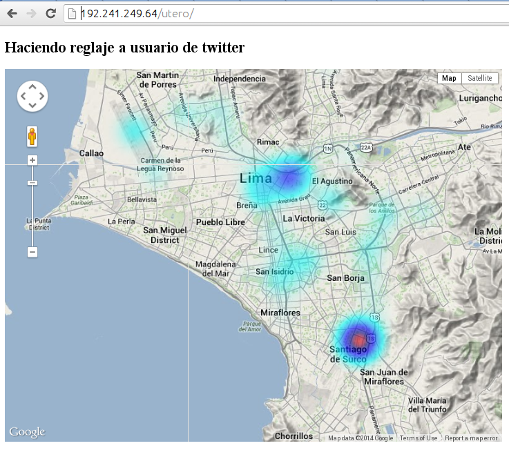
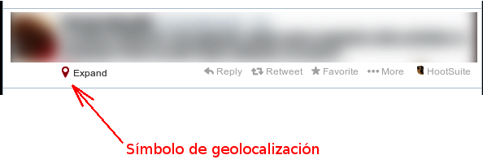

# Haciendo reglaje a usuario de twitter
En un post reciente, mi enemixer Miguel Guerra les había advertido de
[los peligros de tener la opción de georeferenciado activada en sus
cuentas de
tuiter](http://hack.utero.pe/2014/02/03/un-usuario-de-twitter-podria-ser-victima-de-acoso/).
Miguel nos contó que un usuario maligno puede utilizar herramientas
disponibles en la web para hacer barridos de la ciudad buscando usuarios
cercanos. Estos usuarios podrían estar retirando dinero de un cajero,
saliendo de una discoteca, siendo potenciales presas fáciles de un
malechor. Miguel recomendó desactivar la opción de geolocalización a tu
cuenta de tuiter para que evites riesgos innecesarios. Algunos amigos
lectores se asustaron ante tal revelación y han seguido la recomendación
de Miguel. Otros amixers aún tienen activada esta opción en sus cuentas
de tuiter. Parece que no se han asustado tanto. Bueno, en este post
trataré de asustarte un poquito más. Usando las coordenadas geográficas
de cada tuit, he hecho un reglaje a un tuitero famoso.

Metodología
===========

He escrito un pequeño programita en el lenguaje Python que utiliza la
interfase de Twitter conocida por los nerds como API versión 1.1. En
palabras simples mi programita hace lo siguiente:

-   Recibe la orden de buscar tuits georeferenciados de un usuario en
    particular.
-   Se comunica con Twitter, y pide los 3200 tuits más recientes.
-   Para cada tuit, extrae las coordenadas latitud y longitud.
-   También extrae la fecha y hora en que fue emitido cada tuit.
-   Estos datos son almacenados en un archivo en la computadora local.

Una vez con los datos listos, puse todos los puntos sobre un mapa usando
Google Maps.

Resultado
=========

Aterrador. Esta es una captura de pantalla, pero si haces click a la
imagen puedes ir a la versión interactiva de este Google Map. 

Como puedes ver, en este mapa figuran todos los
movimientos de este usuario. Al parecer esta persona tuitea de todos
lados de Lima y siempre anuncia su ubicación geográfica. Ya que este
este un *heatmap*, se puede apreciar rápidamente cuáles son los lugares
favoritos de este ciudadano. Obviamente que uno de ellos es su casa y el
otro es su lugar de trabajo. Puedes ver que este ciudadano también
**visita mucho San Isidro, debe ser empresario**. También **visita el
aeropuerto Jorge Chávez, debe ser empresario con plata**. También visita
a menudo el Cerro San Cosme, **debe hacer labor social ya que, como
hemos especulado, tiene plata**. Ojo, que este mapa ha sido generado
usando solo las coordenadas geográficas de tus tuits. Pero**también
tengo las fechas y horas**. Es posible saber mas o menos qué días y a
qué horas estás en el Cerro San Cosme. Se puede saber qué días viajas
(supongo que son los fines de semana ya que al parecer trabajas en el
centro de Lima). Si eres empresario con plata, debes tener cuidado y
desactivar la opción de geolocalización de una vez! Es más, **debes
borrar todos tus tuits pasados!** Para un marca es muy fácil tenderte
una emboscada con toooooda la información personal que alegremente haces
pública. **No es necesario que hagas "Check-in" en Foursquare para que
tus tuits anuncien tu ubicación geográfica**. Fíjate en el timeline de
tu cuenta y tus amixers, si ves un ícono parecido a este, ya fuiste,
eres vulnerable a que te hagan reglaje:

Tuit conteniendo coordenadas geográficas (te das cuenta por el
ícono)[/caption] **Por razones obvias no voy a revelar la identidad de
este usuario. Pero si estas leyendo, ya tu sabes que se trata de ti**.
Para finalizar, creo que no tiene mucho sentido que publique el código
de programación que he usado para colectar estos datos ya que cualquier
hacker ético y no ético puede repetir este ejercicio en un par de horas
y empezar a hacer reglajes por doquier. P.S. Este post no tiene como
función dar ideas a los marcas. El objetivo es hacerte recapacitar y
convencerte que no es bueno que hagas pública tu información personal.
Todo es por tu bien. atte. Tu amigo, AniversarioPeru.
