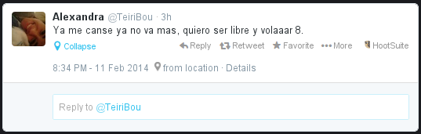
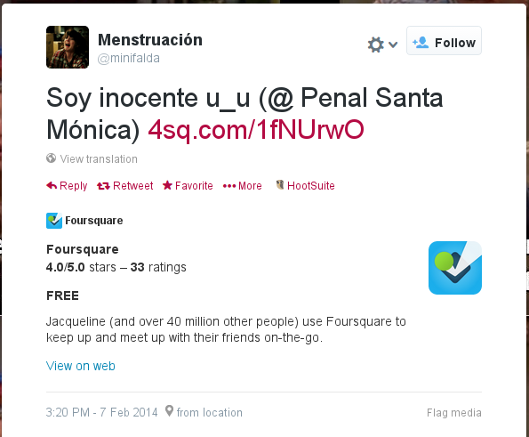

# Vigilando las cárceles del Perú desde Twitter

Se supone que las personas privadas de su libertad pueden comunicarse desde la
cárcel si usan el teléfono público que pone a su disposición el INPE.

También sabemos que es un problema grave el que muchos presos se las
ingenien para agenciarse teléfonos celulares que son utilizados para
extorsionar gente con el cuento del familiar secuestrado o familiar preso.

En teoría ningún preso podría usar un teléfono celular desde el interior de la
cárcel. También debería ser imposible que los presos usen twitter desde la
cárcel (a menos que seas Alberto Fujimori, claro está).

Ya en varios posts en este blog uterino hemos comentado los peligros de tener
tu cuenta de twitter con la opción de geolocalización activada. Si tus tuits
incluyen las coordenadas geográficas de tu ubicación puedes ser vulnerable de
sufrir [seguimientos](http://hack.utero.pe/2014/02/03/un-usuario-de-twitter-podria-ser-victima-de-acoso/)
y [reglajes](http://aniversarioperu.utero.pe/2014/02/04/haciendo-reglaje-a-usuario-de-twitter/).

# Usando Twitter para buenos fines
Se me ocurrió averiguar si en alguna de las 64 cárceles que existen
en el Perú hay algún preso que está indebidamente usando twitter. Claro que
existe una muy pequeña probabilidad que algún preso haya podido
agenciarse de un smartphone, y que además use tuiter, y además tenga la opción
de geolocalización activada.

Si bien la probabilidad de pillar a alguno es pequeña, no se pierde mucho
intentando.

Para hacer estas averiguaciones he programado un bot para twitter que se
encarga de vigilar todas las cárceles del Perú en busca de presos que estén
tuiteando.

Este bot está activo desde hace unas semanas y esto es lo que hace:

* Cada hora se comunica con el API de Twitter y pide los tuits más recientes
  que tengan coordenadas geográficas **y que además hayan sido emitidos en las
  proximidades de cada una de las cárceles del Perú**. Para eso mi bot envía
  las coordenadas de cada cárcel a Twitter y pide recibir los tuits emitidos en
  un radio de 1km partiendo del centro de cada cárcel.
* Los tuits son almacenados en una base de datos local.
* Todos los tuits colectados se proyectan sobre un Google Map para examinar si
  es que se han emitido tuits desde dentro de las instalaciones de cada cárcel.

Durante la primera semana de funcionamiento, este bot colectó bastantes tuits,
pero ninguno de mucha importancia. Pero el día de hoy ha encontrado un par de
tuits que fueron emitidos desde el interior del Penal Santa Mónica en
Chorrillos:

La usuaria [@TeiriBou](https://twitter.com/Teiribou) tuiteó desde el interior
de este penal. Ella es interna? visita? trabajadora del INPE? Revisando su
timeline uno encuentra un tuit interesante:

Al toque puedes pensar que se trata de una interna. Pero revisando las
coordenadas de sus otros tuits uno se da cuenta que tiene libertad de
movimiento por la zona de Chorrillos y Surco. Falsa alarma.

El otro tuit que salió desde Santa Mónica parece ser prometedor:

La usuario [@minifalda](https://twitter.com/minifalda) ha hecho un check-in en
foursquare dentro del penal. Y encima dice "Soy inocenteeeeee". Pero si revisas
su timeline te darás cuenta que debe ser una joven que fue a visitar a alguien
al penal y además tiene buen sentido del humor.

# Pregunta
Si bien estas usuarias no son internas, pero han tuiteado desde dentro del
penal. Supongo que en horario de visita. Pero... está permitido ingresar al
penal con smartphones?

# Acerca del bot
Este bot está en fase beta, digamos que es *proof of concept* de **las cosas que
se pueden hacer con el uso de las TIC** (tecnologías de la información y
comunicación) y en particular Twitter. 

Mi bot va a estar activo las 24 horas del día haciendo su patrullaje. Y si
encuentra tuits emitidos desde dentro de las cárceles peruanas los retuiteará usando su propia cuenta de tuiter.
**Todos denle *follow*** a [@ArturitoBot](https://twitter.com/arturitobot)!

Este bot aún está incompleto porque no he podido conseguir las coordenadas
geográficas de todas las cárceles peruanas. Solo he podido encontrar las
coordenadas de 20 cárceles. Aunque aún no he buscado todas por falta de tiempo.

[Aqui está la lista](https://github.com/aniversarioperu/arturitobot/blob/master/README.md),
si tienes las coordenadas de alguna de ellas te agradeceré
bastante si me las envías.

[Aquí está el Google Map](http://horis.me/arturitobot/) donde puedes revisar si
con el paso del tiempo aparencen tuits sospechos y revisar a quién pertenecen.

Además este bot es *open source* y todo el código de programación está
disponible en [mi cuenta de Github](https://github.com/aniversarioperu/arturitobot).
Lo puedes descargar, modificar, utilizar a tu antojo. Aprovecha que es gratis ;-)
