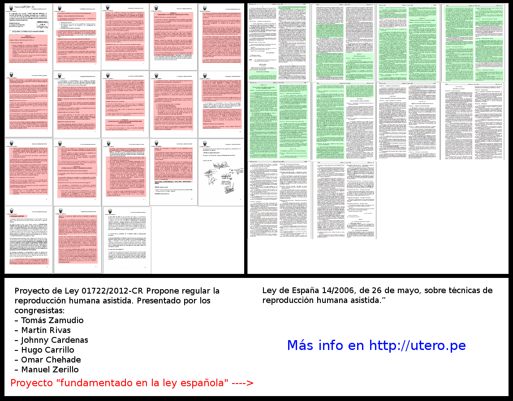

Un pajarito me datea del caso de un proyecto de ley de nuestro Congreso que es
**casi casi idéntico a una ley de España**.
He revisado los dos documentos y hay coincidencias en (aprox.) 99% del texto.
Esto parece ser un *copy/paste* con algunas pequeñas ediciones.

# La oración mágica
**PERO!!!** este caso no es plagio ya que el proyecto de ley peruano tiene la
siguiente oración en la sección de **Exposición de Motivos**:

> "La presente iniciativa tiene como fundamento la **Ley 14/2006** de 26 de mayo, sobre técnicas de reproducción
> humana asistida de la Legislación Española".

Pero 99% del documento es idéntico a la ley española. Incluso con la numeración
de artículos e incisos es idéntica. Se supone que este es un proyecto de ley
pero ya tiene artículos e incisos como si fuera ley publicada.

# Leyendo el proyecto
Las clásicas secciones de **"Efectos de la vigencia de la norma sobre la
legislación nacional"** y "**Análisis de
beneficio"** me parecen muy familiares. Tengo la sospecha que tienen una
usada plantilla para poner estas secciones en varios proyectos.

Al ***fundamentarse*** en otros documentos pueden generarse secciones
contradictorias. En el proyecto de ley peruano por un lado dice **"Derógese toda
ley en contra de este proyecto"** y por otro
lado dice **"Este proyecto de ley no afecta las leyes actuales peruanas"**.
Paradojas te da la vida.

Por un lado dice **"Este proyecto de ley no causa gasto al erario nacional
porque no existe inversión que genere
gastos al fisco..."**, pero más antes dice que el Ministerio de Educación debe
**crear una "Comisión Nacional de Reproducción Humana Asistida"** para que
evalúe los casos de las mujeres que quieran hacerse el procedimiento.

Esto lo dicen solo porque España ya tiene su comisión y en la Ley que ellos
publicaron se pide que esta comisión actúe evaluando casos.

# Es este caso un plagio?
No es plagio ya que citan a la fuente. Claro que han hecho un *frigging*
*copy/paste* e incluso se han copiado parte de la mismísima exposición de motivos.
Las contribución de los congresistas y sus asesores del congreso se reduce a ediciones en 2 o 3 líneas.

# Ejemplos adicionales que no son plagios
Siguiendo la lógica de los autores de este proyecto de ley podemos razonar de
la siguiente manera:

* Jaimito está dando examen bimestral en su colegio, se copia el 99% del examen
  de su compañero y su profesora no lo desaprueba porque Jaimito no plagió. Puso esta nota
  al final del examen: **"El presente examen tiene como fundamento el examen de
  mi compañerito de carpeta"**.
* Tú amigo universitario quieres graduarte haciendo un *copy/paste* del 99% de
  una tesis española descargada de la Internet. El jurado no te puede acusar de
  plagiador ya que no plagiaste al poner en las referencias bibliográficas lo
  siguiente: **"La presente tesis tiene como fundamento una tesis que encontré en
  la internet"**.
* Eres congresista de la República y tus asesores producen hartos proyectos de
  ley para que [algunas ONG](http://reflexionenelcongreso.blogspot.fi/2014/03/actualizacion-del-ranking-de-eficacia.html) 
  te consideren como el congresista más productivo. No está mal que estos
  cientos de proyectos sean *copy/paste* de leyes de otros países ya que todos
  llevan un *disclaimer* parecido a este:

> "La presente iniciativa tiene como fundamento la **Ley 14/2006** de 26 de mayo, sobre técnicas de reproducción
> humana asistida de la Legislación Española".

# Casos similares?
Ya hemos visto varios ejemplos donde proyectos de ley generados por un exceso
del uso de las teclas CTRL+C y CTRL+V hacen que los electores se pongan de mal
humor. Por ejemplo un [post en este blog](http://aniversarioperu.utero.pe/2014/01/25/el-curioso-caso-del-proyecto-de-ley-del-congresista-urquizo/).

Creo que un causa debe ser que los congresistas y sus asesores están motivados
por ver quién genera el mayor número de proyectos. Al parecer la métrica
**mayor número de proyectos = mayor productividad congresal**. Desde hace rato
que se debe usar otro tipo de medición de la productividad de cada congresista.
Yo propongo que el mejor congresista sea aquel que coma menos pollo.

# El proyecto en cuestión
Aquí les dejo los links:

* [Original [PDF]](http://t.co/3Xtwq3z1H0) "España la Ley 14/2006, de 26 de mayo, sobre técnicas de reproducción
  humana asistida." 
* [Proyecto de Ley 01722/2012-CR](Propone regular la reproducción humana asistida.)
   **Propone regular la reproducción humana asistida**. Presentado por los
   congresistas:
    * Tomás Zamudio
    * Martín Rivas
    * Johnny Cardenas
    * Hugo Carrillo
    * Omar Chehade
    * Manuel Zerillo

