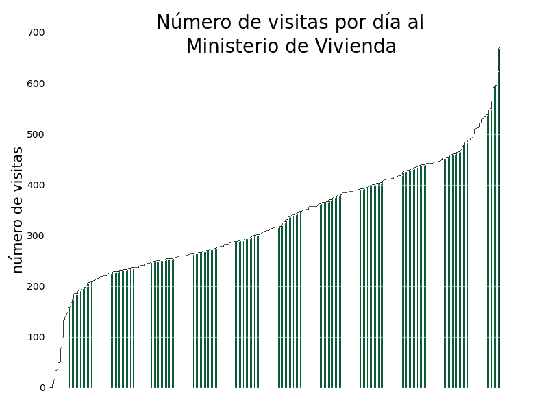
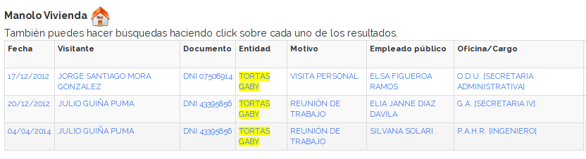
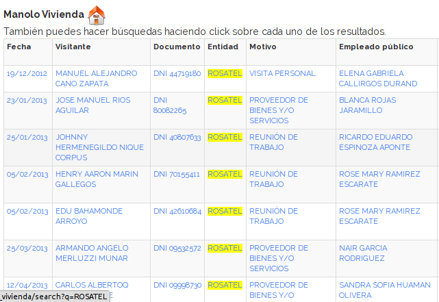
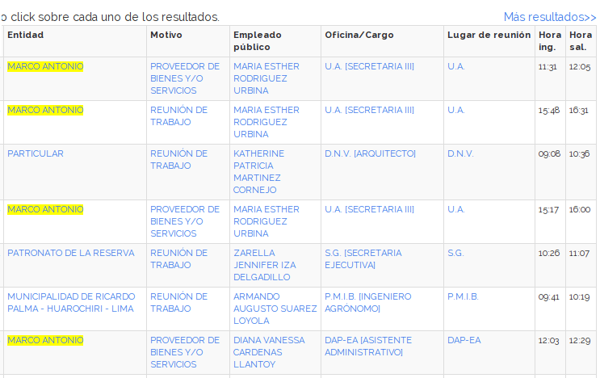
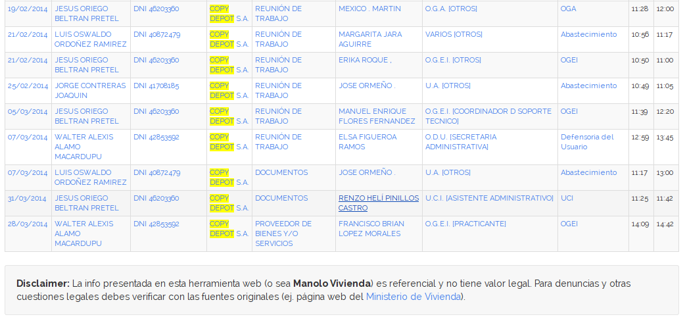

# Manolo Vivienda, buscador de visitas al Ministerio de Vivienda

Hace unas semanas presentamos en este útero un aplicativo web llamado ["Manolo, buscador de
lobistas"](http://aniversarioperu.utero.pe/2014/03/08/manolo-buscador-de-lobistas/).
Este aplicativo es en realidad un buscador amigable para encontrar rápidamente
personas que visitan la Oficina de Contrataciones del Estado.

Sería chevere tener clones de **Manolo** para cada una de las entidades del
Estado, ya que eso lo exige la ley.

La resolución ministerial 203-2012-PCM dice así 
[[link PDF](http://www.peru.gob.pe/docs/PLANES/133/PLAN_133_R.M_N%C2%B0_203-2012-PCM_-_Modifican_Directiva_sobre_2013.pdf)]:

> Que, en aras de mejorar los niveles de transparencia
de la función pública, resulta importante que **las entidades
de todos los niveles de gobierno implementen el Registro
de Visitas en Línea** y se incorpore en el Portal de
Transparencia Estándar a través de un ícono que facilite
su acceso al ciudadano;

> Artículo 2o.- Asistencia Técnica
La Presidencia del Consejo de Ministros, a través de
la Oficina Nacional de Gobierno Electrónico e Informática
(ONGEI), brindará asistencia técnica a las entidades para
la implementación del Registro de Visitas en Línea y la
difusión de su contenido en el Portal de Transparencia
Estándar.

Lamentablemente algunas entidades del Estado aún no tienen disponible el
registro de vistas en línea.

https://twitter.com/FabiolaTorres/status/442370658644008960
https://twitter.com/FabiolaTorres/status/442372039077556224

Alguien debería pasar una copia de la Resolución Ministerial 203-2012-PCM al
Congreso para que se pongan las pilas.

# Hemos clonado a Manolo
Ya que el código fuente de este aplicativo es *opensource*, es posible clonar a
Manolo y tener un buscador para cada entidad estatal. Así que hemos realizado un
primer clon y hemos creado a **Manolo Vivienda** [*it's alive!!!!!111!!*].

Aquí en link para que conozcas a Manolo Vivienda:
<http://aniversarioperu.me/manolo_vivienda/>

Este clon es realmente necesario ya que harta gente visita el Ministerio de
Vivienda. El registro de visitantes solo tiene información a partir de
Diciembre del 2012 y el número máximo de visitantes en un solo día ha sido 670
(ocurrido hace poquito, el 31 de Marzo del 2014).

Entonces esperamos que **Manolo Vivienda** haga que puedas buscar gente
rapidito. Tipeas un nombre y te aparecerá todas las veces que esa persona ha
visitado el ministerio. 

El [buscador del
Ministerio](http://geo.vivienda.gob.pe/Visitas/controlVisitas/index.php?r=consultas/visitaConsulta/index)
es bien monse ya que para buscar una persona tienes
que buscar día por día, página por página, persona por persona hasta encontrar el nombre que
buscas.

# Visitas interesantes al Ministerio de Vivienda
Una ventaja de tener este tipo de buscador es que rápidamente se pueden
encontrar visitas interesantes:

## Tortas Gaby
Debo felicitar a la gente del ministerio por tener tan buen gusto en cuestión
de tortas:

http://aniversarioperu.me/manolo_vivienda/search?q=TORTAS%20GABY

## Rosatel
Hay que estar contentos por las trabajadoras del Ministerio ya que no es raro
que reciban envíos florales de Rosatel (39 visitas).

http://aniversarioperu.me/manolo_vivienda/search?q=rosatel

## Marco Antonio
Representantes de la persona jurídica de nombre "Marco Antonio" han visitado el
ministerio 121 veces. Es curioso que por lo general visitan féminas.

## Copy Depot
Para terminar, la empresa favorita del amixer
[@jsudaka](https://twitter.com/jsudaka), COPY DEPOT S.A., ha visitado el
    ministerio 44 veces. La visita más reciente fue hace poquito, el 28 de
    Marzo:

# Cómo hacer más clones de Manolo
Sería chevere si te animas ha hacer buscadores para el resto de ministerios. El
código fuente de este *software* es *opensource* y estamos usando una licencia
muy permisiva. La licencia WTFPDL versión 1.

> Copyright © 2014 AniversarioPeru <aniversarioperu1@gmail.com>
This work is free. You can redistribute it and/or modify it under the
terms of the Do What The Fuck You Want To Public Digital License,
as published by Michael Seemann. See the COPYING file for more details.

> This program is free software. It comes without any warranty, to
the extent permitted by applicable law. You can redistribute it
and/or modify it under the terms of the Do What The Fuck You Want
To Public Digital License, Version 1, as published by Michael Seemann. See
http://www.WTFPDL.net/ for more details.

Aquí puedes descargarte el código fuente de Manolo Vivienda:
<https://github.com/utero/manolo_vivienda> 

y aquí está el buscador en línea para que te diviertas de lo lindo buscando
personas <http://aniversarioperu.me/manolo_vivienda/>
