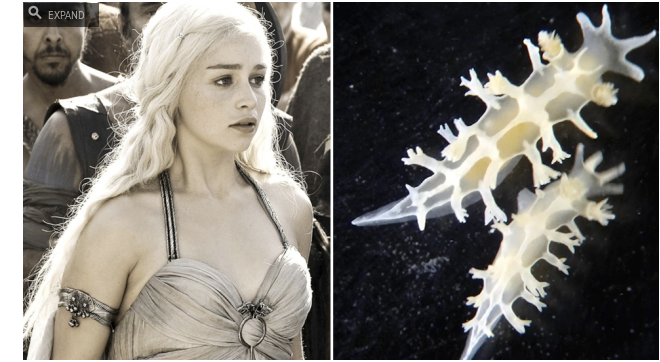
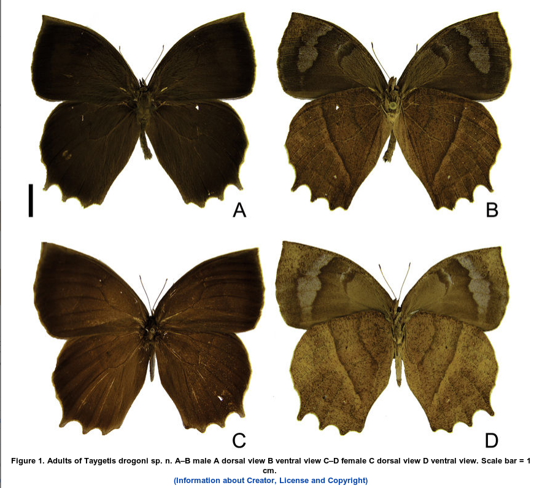

# Game Of Thrones y especies taxonómicas

Aprovecho la coyuntura para mencionar la influencia que tiene Game Of Thrones en
la actividad científica, especialmente en el campo de la descripción de especies 
nuevas para la ciencia.

Cuando naturalistas, científicos y aficionados descubren alguna entidad biológica
como plantas, animales, etc. tienen como deber hacer una descripción formal para
la ciencia. Esta descripción debe incluir un listado detallado de las
características morfológicas de los organismos, además de indicar su lugar de
origen, datos sobre comportamiento (si los hubiera), fotos y/o dibujos.

Y es de suma importancia asignarle un nombre a tal especie nueva. Por lo
general los nombres son en latín, o latinizados. En los viejos tiempos los
científicos usaban el idioma latín para escribir sus artículos, y chatear entre
ellos. 

El nombre completo de una especie incluye varias partes. El primer nombre se le 
conoce como nombre genérico, el segundo nombre es el nombre específico. Según las
normas del Código Internacional de Nomenclatura Zoológica, el nombre genérico
siempre se debe escribir con la primera letra en mayúscula y el nombre específico
siempre en minúsculas.

Por ejemplo la especie humana es:

    *Homo sapiens* Linnaeus, 1758

Además para que un nombre científico se considere completo debe incluir el
apellido del autor que describió a la especie y el año de publicación. Es
recomendable que los nombres genérico y específico vayan en cursivas.

**A veces encontrar nombres para las especies es un poco difícil** y hay que
buscar inspiración de personajes mitológicos, históricos, o personajes de las
series de televisión estén causando furor.

La serie **Game of Thrones** además de inspirar conversatorios también ha
inspirado nombres de especies nuevas para la ciencia:

# *Tritonia khaleesi* de Vasconcelos *et al*., 2013 
El sitio [web Gizmodo](http://sploid.gizmodo.com/new-species-of-sea-slug-named-after-khaleesi-from-game-1493155765)
divulgó que científicos brasileños habían descrito una babosa
marina (*sea slug*), pariente de los caracoles, con el nombre *Tritonia khaleesi* en honor al personaje
**Daenerys Targaryen**. Le pusieron este nombre ya que *Tritonia* es un animal de
coloración pálida, casi plateada que hace recordar al personaje de la
serie.

Aquí el artículo original [Vasconcelos *et al.*, 2013](http://journals.cambridge.org/action/displayAbstract?fromPage=online&aid=9214522).

> A new species of the family Tritoniidae is described from the tropical South
Atlantic Ocean. The animal was found off north-east Brazil. Tritonia khaleesi sp.
nov. is up to 12 mm long, with a slender white body, of which the notum is covered
with one broad white band extending from between the eyes and veil to the tail;
veil with 4 velar appendages; retractable white rhinophores; rhinophoral sheath
with fleshy extension; seven pairs of branchial plumes; the anus is located
between the 3rd and 4th gills on the right side, and the genital opening is under
the 2nd gill. Internally, T. khaleesi sp. nov. is distinguished from other
tritoniids by jaws with 10–14 rows of denticles on the inner lips, absence of
stomach plates and the radular formula 32 × 2–5.1.1.1.2–5 teeth. Tritonia khaleesi
sp. nov. is the only Tritonia that possesses a unicuspid rachidian tooth as an
adult.

# *Taygetis drogoni* Siewert *et al*., 2013
Científicos brasileños (sí, otra vez) decidieron darle el nombre de uno de los
dragones de **Daenerys Targaryen** a una especie nueva de mariposa oriunda de los
estados de Minas Gerais y São Paulo.

En la sección **etymology** del artículo original mencionan que el nombre
**drogoni** se refiere a **Drogon**, uno de los tres dragones que son hijos del
personaje más popular de la novela **A Song of Ice and Fire** de George R. R.
Martin.

Los científicos le agregaron la letra **"i"** al nombre Drogon ya que el Código
Internacional de Nomenclatura Zoológica ordena que los **nombres que que sean 
sustantivos en el caso genitivo (la declinación del latín que indica relación,
cualidad, posesión u origen) y que pertenezcan a individuos del sexo masculino deben terminar en
"i"** ([Artículo 31.1.2 del CNZ](http://www.nhm.ac.uk/hosted-sites/iczn/code/index.jsp?article=31&nfv=true)).

Supongo que en libro se debe indicar que el dragón Drogon es machito y no
hembrita.

Aquí una foto de *Taygetis drogoni* adultos:

Aquí dibujos de sus genitales masculinos (a la izquierda) y femeninos (a la
derecha) para que te rompas el ojo:

Aquí el [artículo original](http://bit.ly/1fdALF5).
