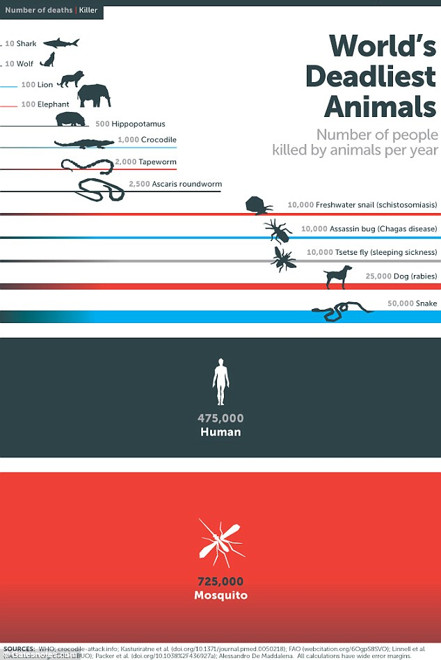
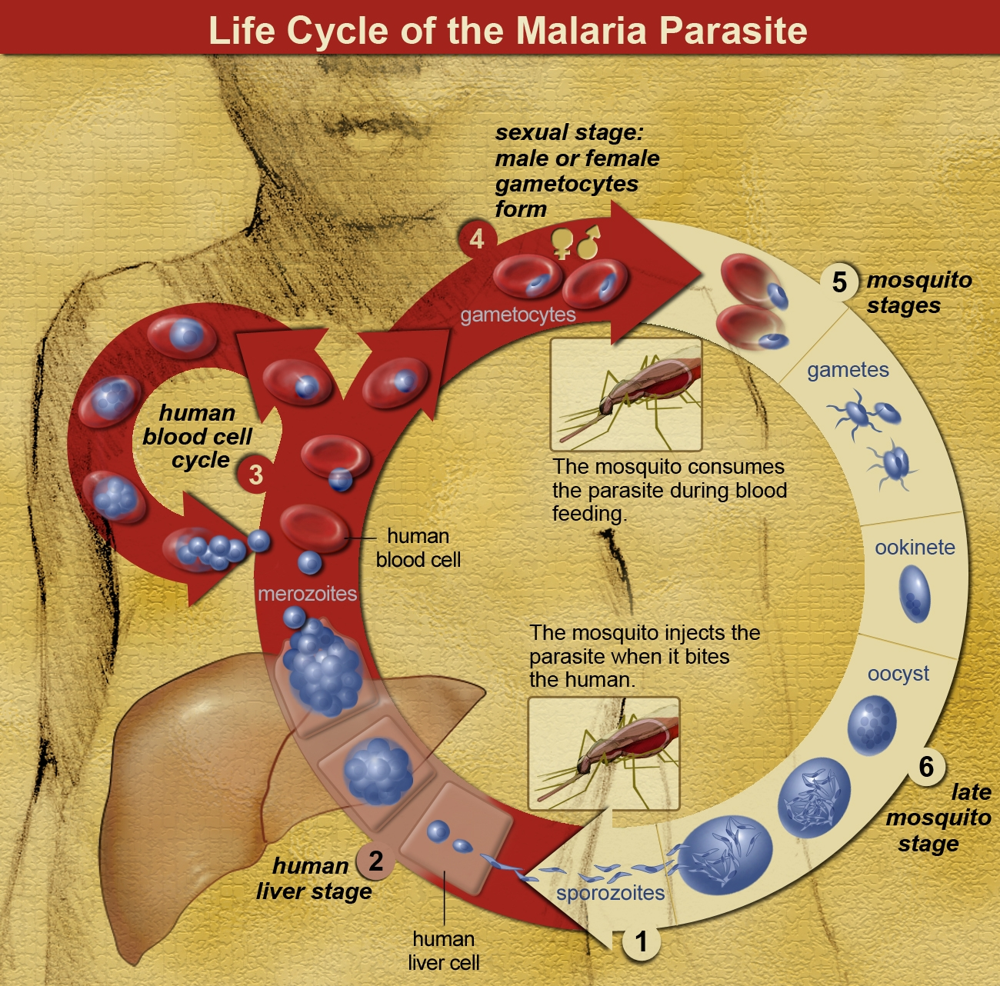

# Oie Bill Gates, los mosquitos no son tan asesinos como crees

Bill Gates tiene un blog, y su post más reciente ha rebotado bastante en las
redacciones locales e internacionales. Sabemos bien que Bill Gates es un 
monstruo en computación, pero desde hace unos años se dedica a la filantropía
con el fin de "**mejorar la salud y reducir la extrema pobreza**" en el mundo.

En su blog, Bill Gates presenta datos y una infografía donde hace una
comparación de los animales que matan más humanos por año y concluye que **los
que matan más gente son los mosquitos**, matan más personas que tiburones,
leones, etc. Incluso matan más gente que nosotros mismos.

> Nosotros matamos menos

Esto se explica ya que los mosquitos son transmisores de patógenos que causan
varias enfermedades siendo la más grave **malaria**. Malaria mata más de 600
mil personas al año!

La infografía de Bill Gates lo muestra clarísimo, mira:

A simple vista el gráfico llama la atención ya que pocos esperarían que los
mosquitos sean considerados como asesinos (**killers** es el término de la
infografía). Uno sospecharía que algo debe estar mal en los datos, o los
gráficos.

El microbiólogo 
[Jonathan Eisen](http://phylogenomics.blogspot.com/2014/05/love-work-of-billgates-but-mosquitoes.html),
de la Universidad de California en Davis, también tiene un blog y nos cuenta
que Bill Gates está errado al considerar a los mosquitos como tan malvados
asesinos. Los mosquitos no te matan, solo te pican para tomar unas gotas de
sangre de tu cuerpo. El que te mata es el microorganismo que dejan en tu
torrente sanguíneo luego que se han saciado con tu sangre.

Eisen argumenta que el post de Bill Gates confunde vector con patógeno. Vector
es aquel organismo que lleva un patógeno que te causará una enfermedad si es
que logra que el patógeno entre en tu organismo.

Por lo tanto debemos recordar que **vector** no es lo mismo que **patógeno**.

# Vector != patógeno
Si te ataca un tiburón blanco y mueres, se puede considerar una muerte más para
el equipo de los tiburones. Si te muerde una cobra y te inyecta veneno y
falleces, **punto para las cobras**. Si te pica un mosquito, morirás debido a
la picadura? punto para los mosquitos? No necesariamente. Depende si el
mosquito es portador (**vector**) del parásito que causa la malaria
(**patógeno**). Si eso es así y no
recibes tratamiento, es posible un fatal desenlace. Yo he trabajado aaaaaños en
la Amazonía peruana y he sido picado hasta la saciedad por hartos mosquitos y
no he contraído malaria. Tampoco he muerto ;-)

# Comparando vectores
El profesor Eisen indica que si vamos a comparar aquellos vectores que
transmiten patógenos que causan mayor número de muertes de humanos debemos
considerar que los humanos nos llevamos el primer lugar.

Nosotros humanos también podemos actuar como vectores de patógenos. Por ejemplo
el número de muertes causas por la transmisión de enfermedades entre humanos va
como sigue:

* VIH/SIDA: 1.78 millones por año.
* Tuberculosis: 1.34 millones por año.
* Gripe: 250-500,000 1.34 millones por año.
* Infección adquirida en hospitales: >100,000
* Sífilis: 100,000
* Sarampión: 600,000

*Fuente [Eisen blog](http://phylogenomics.blogspot.com/2014/05/love-work-of-billgates-but-mosquitoes.html)*

En esta comparación de vectores, es evidente que los humanos *matamos* mucha, 
pero mucha más gente que los mosquitos.
Pero los verdaderos causantes de las enfermedades son
los patógenos que pueden ser:

* virus (gripe, rabia, sida, sarampión).
* bacterias (tuberculosis).
* protozoarios (malaria).

Tiene razón Bill Gates al preocuparse tanto por los mosquitos ya que hay muchas
muertes al año causadas por malaria. Es admirable que dedique sus esfuerzos
para combatir este mal. Si bien la infografía y la caracterización de los
mosquitos como asesinos (*killers*) sirve mucho para llamar la atención de la
gente, debemos siempre ver las noticias con ojo crítico. **Siempre es buena una
dosis saludable de escepticismo**.

# Cómo actúa la malaria
## Causantes
Los causantes malaria son varias especies de organismos unicelulares que han
sido clasificados dentro del género *Plasmodium*. Estos no son bacterias ni
virus, pertenecen al gran grupo de los
**[protozoarios](http://es.wikipedia.org/wiki/Protozoo)**:

* *Plasmodium falciparum*
* *Plasmodium vivax*
* *Plasmodium ovale*
* *Plasmodium malariae*

Si el mosquito que te pica te transmite *Plasmodium ovale* o su primo cercano
*Plasmodium malariae* desarrollarás una malaria leve que es raramente fatal. Si
el mosquito te transmite *P. falciparum* o *P. vivax* estarás en serios
problemas.

## Síntomas
Si has viajado a la Selva y te sientes mal, sientes como si tuvieras una gripe
medio extraña ya que los síntomas se parecen pero no son igualitos a una gripe
(dolor de cabeza, fiebre, vómitos, dolor en articulaciones y más importante
 **tiemblas incontrolablemente cada dos o tres días**) es posible que tengas
malaria. Debes ir a tu centro de salud más cercano. Allí te tomarán una o dos
gotas de sangre (pinchazo en el dedo) para tratar de identificar cuál de los
*Plasmodium* tienes en tu cuerpo y proceder con el tratamiento adecuado.

## Por qué el mosquito transmite malaria?
Los protozoarios del género ***Plasmodium* son parásitos** que no pueden vivir
solos. Dependen de obtener nutrientes y alojamiento en otras especies. Tienen
casa y comida gratis y lo único que hacen es causar estragos y enfermedades.
**Se la llevan fácil**.

El ciclo de vida del *Plasmodium* es muy curioso. Depende del mosquito y de
alguna especie de animal vertebrado para vivir. El mosquito al picarte
introduce su aparato bucal modificado en algún capilar tuyo. Para que no te des
cuenta que te está picando, este mosquito segrega un poco de saliva conteniendo
un analgésico. La saliva entra en contacto con tu sangre y lamentablemente 
viene cargada de *Plasmodium*.

El *Plasmodium* entra a tu torrente sanguíneo y se aloja en el hígado donde se
reproduce dentro de tus células hepáticas.
Cosa curiosa que esta reproducción es del **tipo asexual** (como si fueran
#foreveralone) y producen miles pero miles de *Plasmodium* modificados.
Estos *Plasmodium* tienen la capacidad de invadir tus glóbulos rojos y
reproducirse asexualmente otra vez. En periodos de 2 o 3 días hay tantos
*Plasmodium* dentro de cada glóbulo rojo que estos se rompen en masa y se libera
harto producto de desecho de los *Plasmodium*. Esto es tan feo que tu cuerpo
reacciona con movimientos incontrolables. Esto lo conocen como tembladera o
fiebre tersiana.

Algunos de estos *Plasmodium* liberados de tus glóbulos rojos se modifican para
convertirse en gametos (mejor conocidos como gametocitos). Los gametocitos están
allí en tu sangre circulando, esperando que te pique un mosquito para que al
beber tu sangre se lleve unos cuantos gametocitos.

Estos gametocitos de *Plasmodium* al ser ingeridos por el mosquito llegan al
tubo digestivo donde maduran y comienza la *reproducción sexual*. Sí, los
*Plasmodium* tienen reproducción sexual y asexual (son unos virtuosos). Esta
reproducción sexual consta en la fusión de dos gametocitos los cuales se
convierten en un *Plasmodium* modificado que se desplaza hasta las glándulas
salivales del mosquito. Este pinche *Plasmodium* estará allí en las glándulas
salivales esperando que el mosquito encuentre su próxima víctima y se alimente
de sangre para ser transmitidos a otro individuo humano.

Aquí te dejo una infografía del ciclo biológico del *Plasmodium*:

