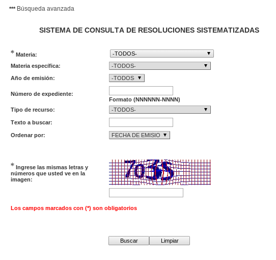

El portal [LaLey.pe](http://laley.pe/) reporta que el Poder Judicial ha
decidido poner a disposición de la ciudadanía [más de 29 mil sentencias de la
Corte
Suprema](http://laley.pe/not/1408/pj-publico-en-su-portal-web-mas-de-29-mil-sentencias-de-la-corte-suprema/). Yeeeeeeeeeeeeee.

Es loable que las entidades del Estado se esfuercen en liberar datos e
información que nos pertenecen a TODOS los peruanos ya que se ha gastado
nuestro dinero en la generación de esa info.

Pero tanta belleza no pueder ser verdad. Si vas la página web del Poder
Judicial [y te aprestas a descargar datos](http://jurisconsulta.pj.gob.pe/jurisWeb/faces/busquedaCasacionesSistematizadas.jsp) verás algo realmente "curioso". Que el
buscador web tiene un CAPTCHA y debes ingresar las letras y números que
aparecen en la imagen antes de hacer click en "buscar".

CAPTCHA es este sistema de letras y número que aparecen en una imagen borrosa
específicamente diseñado para solo sean humanos los que puedan interpretar la
imagen y poder usar el servicio:

Entonces este buscador web ha sido diseñado con la premeditación para que sólo
sea posible usar de manera manual. No se puede automatizar la descarga de las
resoluciones mediante el uso de bots.

Si descargar cada resolución requiere hacer 5 clicks, por 29 mil resoluciones,
   hacen necesarios unos 145 mil clicks para descargar toda la info.

   Esto no sería necesario si el Poder Judicial no hubiera puesto el CAPTCHA.
   Son 29 mil sentencias "liberadas" por el
   [@Poder_Judicial_](https://twitter.com/Poder_Judicial_) pero no se puede cosechar la info.
El uso del CAPTCHA tiene sentido 
si vas a subir datos, pero no para descargar datos públicos que nos pertenecen
a todos.

Si van a liberar la info al público en general sería ideal si hubiera un API, o
proveer un *database dump*, o al menos no poner CAPTCHAs y ya los nerds se
encargarán de arreglárselas para descargar los datos. Pero esto no se puede ya
que el CAPTCHA no hace posible cosechar los datos de manera automatizada.

Por otro lado, existen empresas dedicadas a resolver CAPTCHAS. Uno puede hacer
un software que
envíe los CAPTCHA a la empresa para que sus empleados lo resuelvan y envien la
solución de regreso a tu software y te puedas descargar lo que necesitas. Pero
estos servicios no son gratuitos y realmente no deberíamos tener que usarlos en
este caso en particular.

El Poder Judicial debe saber que los datos serían más útiles y serían liberados
de verdad si permiten que computadoras y bots puedan cosechar los datos de
manera fácil.
Se podría hacer un análisis de texto de las resoluciones y encontrar patrones
interesantes en el tiempo. Se podría contar el número de resoluciones emitidas
por año a favor y en contra y quizá se pueda encontrar algún patrón
interesante.

Se podría aplicar un buscador del tipo "fuzzy" que permita buscar variaciones
de palabras.
Es decir si quieres buscar "sentenciado" la base de datos te podrá buscar
además por "sente**ciada**", "senten**ció**", "senten**ciados**".
 Se podría cruzar toda la información de sentenciados con la lista de candidatos a las próximas elecciones municipales y etc, etc, etc.

En este útero hemos desarrollado herramientas que permiten buscar de manera
fácil las personas que visitan las instalaciones de la Oficina de
Contrataciones del Estado y del Ministerio de Vivienda
("[Manolo](http://aniversarioperu.utero.pe/2014/03/08/manolo-buscador-de-lobistas/)"
 y "[Manolo
vivienda](http://aniversarioperu.utero.pe/2014/04/05/manolo-vivienda-buscador-de-visitas-al-ministerio-de-vivienda/)"). Todo esto gracias a que en esos casos fue posible descargar
los datos de manera automatizada.

"Liberar" datos públicos poniendo trabas como el CAPTCHA es el oxymoron de
moda.
