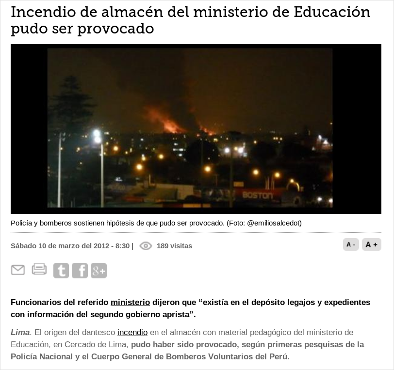

# El útero libera datos estatales en masa

La [ley Nº 27806](http://www.peru.gob.pe/normas/docs/LEY_27806.pdf)
 (modificada con la Ley N° 27927) dice:

> Toda la información que posea el Estado se presume pública, salvo
las excepciones expresamente previstas por el artículo 15

El artículo 15 dice que **las excepciones son cuestiones militares, de 
inteligencia, información correspondiente a la defensa nacional, etc.**

Por eso es laudable que instituciones como el Congreso, Ministerios y demás
estén publicando en sus sitios webs información estatal como Proyectos de Ley,
registro de visitas, normas y leyes, archivo fotográfico, etc.
Las instituciones han invertido dinero en desarrollar software que sirve como 
buscadores de información en la web.

Sin embargo, en posts pasados me he quejado que los buscadores no siempre
son
los más adecuados y que pueden ser mejorados
([aquí](http://aniversarioperu.utero.pe/2014/03/08/manolo-buscador-de-lobistas/),
[aquí](http://aniversarioperu.utero.pe/2014/04/05/manolo-vivienda-buscador-de-visitas-al-ministerio-de-vivienda/),
y [aquí](http://aniversarioperu.utero.pe/2014/05/27/el-poder-jucidial-libera-29-mil-sentencias-pero-con-truco/)).

# Tener un buscador de información estatal no es suficiente
Si bien los buscadores web que tienen las instituciones del Estado son útiles
para encontrar información. También es necesario que el Estado encuentre la
manera de liberar sus datos de manera masiva. Sería ideal si adicionalmente
pusieran toda la base de datos lista para descargar a un solo click de
distancia.

La ciudadanía está volviéndose más sofisticada y ahora tiene la capacidad
de procesar datos de manera masiva.
Un ejemplo es la reciente iniciativa i[@HacksHackersLim](https://twitter.com/HacksHackersLim) que es un grupo de
periodistas que se han unido con hackers éticos para procesar
datos públicos en búsqueda de historias periodísticas.

https://www.youtube.com/watch?v=0ZPDJlHSe6g

Si bien los buscadores son útiles para búsqueda manual de información
para un sector de la ciudadanía. Sería muy útil para
el conjunto de hackers y periodistas que el Estado libere
datos en masa en formato abierto.

Hace poco el Congreso [liberó su archivo fotográfico](http://fotografia.congreso.gob.pe/Wf_ListadoFotografico.aspx). Miles de fotos y texto
acompañante (metadatos) pueden ser descargados utilizando su buscador web.
Pero solo se puede descargar foto por foto. Y no es posible descargar todos los
metadatos.

Sería un golazo de taquito
si el Congreso libera todo el texto, etiquetas, palabras clave
que tienen asociadas a cada foto.
Es decir los **metadatos**.

Entonces sería papayita hacer un análisis del texto en 
búsqueda de patrones y combinaciones de nombres interesantes.
Se podría filtrar toda la info en búsqueda de aquellas fotos
que sean importantes o relevantes para el tema de investigación.

Así uno puede ir directamente a la foto que está buscando.
De otra manera habría que ver foto por foto, revisar cientos
para ver si alguna puede ser útil.

# Cuál es el temor de permitir la descarga de datos en masa?
Si según la ley vigente los datos son públicos y están siendo publicados
en la internet.
Cuál es el problema de permitir que usuarios puedan bajarse los miles de
documentos que tienen en sus servidores de un solo cocacho?
En estos tiempos que está de moda el uso de #bigdata necesitamos que
computadoras nos ayuden en la lectura de datos e información y para eso
necesitamos tener todos los datos a la mano.

Quizá tengan temor que miles de peruanos descarguen masivamente datos
de sus servidores y pueda subir la cuenta del ancho de banda de las instituciones
estatales? O quizá tengan miedo que ciudadanos hambrientos de información
estatal vayan a causar involuntariamente un ataque [DDoS](http://es.wikipedia.org/wiki/Ataque_de_denegaci%C3%B3n_de_servicio)?
Un ataque DDoS es cuando tantas personas visitan una misma página web que
el servidor se satura y comienza a negar acceso a la página a personas adicionales.
Esto ocurre cuando cientos de miles de conexiones ocurren al mismo tiempo y se
ejecuta utilizando un pelotón de computadoras manipuladas al unísono por los
hackers. Cosa poco probable para el caso de información estatal peruana no?

# El Estado podría liberar datos masivamente de manera barata y fácil
Liberar los metadatos de sus bases de datos es lo más fácil que hay.
Los administradores informáticos pueden descargar
toda su base de datos con la ayuda de unos cuantos clicks y
colgarlas en su servidor propio.
También pueden usar algún servidor comercial gratuito 
como Google Drive, MEGA, usar torrents, etc.

No les tomaría ni 10 minutos hacerlo. Lo cual es nada comparado
al tiempo que demora hacer un buscador como el que
tienen en su web.

# Es justo y necesario
Creo que la ciudadanía debería demandar que el Estado libere masivamente
sus datos. Si al menos un pequeño porcentaje de la ciudadanía se da el trabajo
de descargar los datos y guardarlos en sus discos duros, se estaría creando
un sistema de copias de seguridad de datos estatales.
Para el Estado sería muy barato tener copia de seguridad en los discos duros
de sus ciudadanos. Deberíamos aprovechar ahora que la mayoría de datos pueden
ser digitalizados fácilmente compartidos y almacenados. Es nuestro derecho y
debería ser nuestro deber.

Ya sabemos lo que pasa con los documentos estatales cuando nadie está mirando.

# El útero libera datos estatales
Ya que en este útero no solo criticamos y a veces ponemos manos a la obra. He
decidido liberar la información estatal que he descargado durante los últimos
meses. A partir de esta información pude encontrar algunas cosas interesantes que
he publicado en posts pasados (ejemplo  [post de #narcoindultos](http://aniversarioperu.utero.pe/2013/12/18/periodismo-de-datos-capitulo-02/)).
Y también es información que pretendo utilizar para posts futuros.

Estos podrían ser los **utero-leaks**, pero no son ya que la información
no es secreta ni clasificada. Es información pública que nos pertenece a todos.

Cosechar estos datos me ha tomado algo de tiempo (incluyendo el pago de una buena
suma de dinero a las empresas de electricidad) y los he juntado y colgado en
la red para que los interesados los descarguen.

En el tuiter me he enterado que hay varios amixers esperando estos datos y
también espero que los amigos de [@HacksHackersLim](https://twitter.com/HacksHackersLim) puedan encontrarles utilidad.

Estoy liberando un total de 58,906 archivos lo que ocupa 12 Gigabytes en mi
disco duro.

Los datos liberados son estos:

* Censo poblacional del INEI del 2007. Datos para distritos del Perú en formato
original MS Excel. Además convertí todos los datos a formato abierto CSV.
* Normas Jurídicas del Ministerio de Justicia emitidas durante el 2do gobierno aprista.
El formato original es PDF. Además convertí todos los PDF a formato TXT.
* Las sentencias de la Corte Suprema del Poder Judicial. Se supone que son 29mil sentencias para el
año 2013. Pero solo existen 8,452 resoluciones con número de expediente correspondiente al 2013.
Supongo que hay un buen lote de expedientes con serie 2012 que han sido publicados en el 2013
(supongo que los descargaré eventualmente). El formato original es PDF que consiste en su mayoría
en hojas escaneadas de mala calidad. He pasado OCR a todos los archivos y los resultados son
utilizables pero no óptimos.

Realicé la descarga de ciertos documentos de manera primitiva con el comando ``curl``.
Para descargar las sentencias de la Corte Suprema usé el excelente software Scrapy
que hace que el proceso de escrapear páginas web sea todo un deleite. En este link
están los scripts que utilicé con Scrapy <https://github.com/aniversarioperu/scrapy_pj>

Todos los archivos están en la web MEGA y puedes descargar haciendo un par de clicks.
Pero ojo que los archivos son paquetes comprimidos en formato TAR que pesan hasta 1GB.

Así que aquí tienes para tu consumo casi 59 mil archivos de información estatal. Provecho.

| file                                         | números         | peso  | md5sum checksum                  |
|----------------------------------------------|-----------------|-------|----------------------------------|
| [censo_2007_INEI.tar.bz2](https://mega.co.nz/#!IttERC5D!oIrVVkQXS8n_SbfZzLqHJ80AJJaLTIsdWI3GTp-iIl4)                      | 37,632 archivos | 756MB | 9224e944286fd21dccc90e58459b7562 |
| [normas_minjus_2006-2011_PDF.tar.bz2](https://mega.co.nz/#!E8FBUaTL!tATh8E3Wr1qfHIDDwCj02jiy0b_f7ZOVUsjmVjDk8r0)          | 2,185 archivos  | 1.2GB | 843c81810d46bdc44b58f8686dbd9b54 |
| [normas_minjus_2006-2011_TXT.tar.bz2](https://mega.co.nz/#!ogVAUaKQ!fGceKzw6J4GfXTgGp7PzdavDaqHH1p7QcoZwLq58PWw)          | 2,185 archivos  | 630MB | 321d4e7467dae2f8e470c5df0c2f06ae |
| [sentencias_poder_judicial_2013_TXT.tar.bz2](https://mega.co.nz/#!wkEihb4L!0y8UKoRRaavnrayB_tMRNC3br6kbguVjImYDhYAxsNE)   | 8,452 archivos  | 82MB  | 30697d8f2aadc7be4a5ddc2dbd960c04 |
| [sentencias_poder_judicial_2013_PDF_part1.tar](https://mega.co.nz/#!o5UBVLjL!EkBfRaHXSaMKR8E8F78Burja-b2PLNEionbnMIzr17E) | 967 archivos    | 1.1GB | 27f3f6cef20b29ac7870132219c2902c |
| [sentencias_poder_judicial_2013_PDF_part2.tar](https://mega.co.nz/#!Y51gQAjJ!6qY6qJZcgc0Mc-YFQvmYMUoxy56bm_StfUrMVmaiqZI) | 835 archivos    | 1.1GB | f308bd7d806f46ff73fb34842b27c63e |
| [sentencias_poder_judicial_2013_PDF_part3.tar](https://mega.co.nz/#!Jsti2Swb!ZLHk3gJGte_MeY0iKmv9PKKn-SkXM0bW3dOXvT4HUws) | 801 archivos    | 1.1GB | af765a4a5e5dddbe16bedb1c0a1163d7 |
| [sentencias_poder_judicial_2013_PDF_part4.tar](https://mega.co.nz/#!QkEQwYga!Z8RHoP7g9ooQVg3NhahVr8OWPO4aAZxnMA6OMS5-nxE) | 944 archivos    | 1.1GB | ce7489e79e213a27458df8c7d40558af |
| [sentencias_poder_judicial_2013_PDF_part5.tar](https://mega.co.nz/#!Q881CIpR!WlSsX4QnIdbmb_7WqFPcfe6pzryxoivMUh5uYtIsA5c) | 1,043 archivos  | 1.1GB | d9fe43fb2ea3ef18cbfdf02b3a3109b4 |
| [sentencias_poder_judicial_2013_PDF_part6.tar](https://mega.co.nz/#!5tskyIYQ!KnJlrsnPFlAhup-4kV-dR_ws8722UIl-bu83MTyjFqc) | 1,145 archivos  | 1.1GB | 1f3bdb2e804c0e3de3aa94a45376a968 |
| [sentencias_poder_judicial_2013_PDF_part7.tar](https://mega.co.nz/#!JwEBAIzY!q3gg-kWNfqYJG7RtE_iGK7YRlKhhFJuRIuSIeAqLCw4) | 852 archivos    | 1.0GB | 132c42eb2426abf2b2ad9e1d69646706 |
| [sentencias_poder_judicial_2013_PDF_part8.tar](https://mega.co.nz/#!sxtyyIgQ!dMSSEoJz1h5txiZYQJUL40R4aFz1igogOQ4rpnNll-A) | 1,008 archivos  | 1.1GB | 20158ec2b7eda221ead8b3f68ed8ae75 |
| [sentencias_poder_judicial_2013_PDF_part9.tar](https://mega.co.nz/#!l9M3jDIY!sbe_GnkciRPJunYnHPay5ZejtTxMDZwmzF97w8Kc8Ik) | 857 archivos    | 1.1GB | b2266ddd9cc84b2d04eb957fd6acbc78 |

