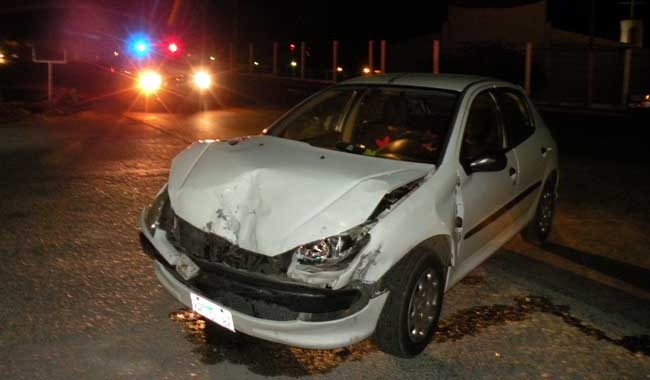

# Las memorias de AniversarioPerú - Parte 6

Si no leíste, aquí están los episodios anteriores:

* [Memorias Parte 1](http://aniversarioperu.utero.pe/2014/06/28/las-memorias-de-aniversarioperu-parte-1/).
* [Memorias Parte 2](http://aniversarioperu.utero.pe/2014/07/17/las-memorias-de-aniversarioperu-parte-2/).
* [Memorias Parte 3](http://aniversarioperu.utero.pe/2014/08/28/las-memorias-de-aniversarioperu-parte-3/).
* [Memorias Parte 4](http://aniversarioperu.utero.pe/2014/09/18/las-memorias-de-aniversarioperu-parte-4/).
* [Memorias Parte 5](http://aniversarioperu.utero.pe/2014/10/02/las-memorias-de-aniversarioperu-parte-5/).

# Punto de quiebre
Es costumbre que en los viajes con fines de colecta sean los científicos
extranjeros quienes costeen los gastos de la contraparte peruana. Se supone que
es una colaboración internacional entre dos países y es de esperarse que, en este
caso, el estudiante peruano no tenga que gastar dinero durante la expedición.

Una noche antes del viaje mientras hacía mi mochila le conté a mi madre
que al día siguiente me iba de expedición científica:

- Amá, han venido unos gringos de USA y me van a llevar de viaje a Oxapampa. Me
han dicho que me van a pagar mis gastos, me van a dar hospedaje y alimentar.
- Vas a viajar solo con dos gringos? Y si te violan?
- No creo, más bien yo estoy yendo para cuidarlos. Además les voy a
servir de guía y traductor ya que ellos no hablan castellano.
- Tú vas a ser guía? Pero tú ni siquiera conoces Lima, menos vas a conocer el 
camino a Oxapampa.

Punto para mi madre. En esa época no había smartphones, no había Whatsapp ni
Google Maps. Pero encontré una guía telefónica y arranqué los planos de Lima
que estaban al final. Entonces con mapas y mochila lista ya me sentía 
expedito para el viaje.

Los gringos habían alquilado un auto Mazda para su travesía en el Perú profundo.
Ni bien bajaron del avión, antes de salir del aeropuerto ya habían sido abordados
por una empresa que alquila autos y les hicieron firmar el contrato de varias hojas
en idioma castellano.

Los gringos parecían caídos del palto pero tenían su maña. Cuando nos
encontramos en la UNMSM para iniciar la expedición, aquel fatídico día,
encontré que el auto estaba repleto de cajas con *comida* (caramelos,
chocolates, galleta soda, galleta de vainilla, galleta coronitas, papitas lays,
etc). Para mi sorpresa no tenían mayores problemas para manejar el auto en Lima
y habían podido agenciarse *buenas provisiones* para el viaje.
Parecía que habían vaciado alguna sucursal de las tiendas Santa Isabel.

Además la maletera estaba llena de equipo de colecta, trampas, focos, cables,
redes, un grupo electrógeno, galoneras, botas, mochilas, ropa, cuerdas, y
varias cosas más.
Habían varias cosas que no entraban en la maletera y varias cajas con golosinas
estaban en parte del asiento trasero del auto y solo quedaba un espacio
reducido para sentar a una persona.

Entonces decidí que sería más cómodo ir de copiloto (puesto que yo llevaría el
mapa y señalaría el camino a seguir):

- *Mister, you in the back, me in the front*.

Y así fue como partimos al Perú profundo. Íbamos tranquilos, por lo que era la
Avenida Grau (antes que construyeran la vía expresa Grau), 
hasta que unos choferes de combis nos lisureaban y nos gritaban:

- Por aquí no. Te van a poner multa. Fuera de acá oe.

Luego de un buen tramo de seguir recibiendo gritos me di cuenta que estábamos
circulando por el carril central que estaba destinado solo para el transporte
público.
Pasado mi roche temporal los gringos decidieron tanquear el auto en un grifo
en plena Avenida Nicolás Ayllón.
Mientras llenaban el combustible el gringo que iba atrás decidió bajar para 
estirar las
piernas con su cámara Pentax colgando del cuello y aprovechar para tomar
algunas fotos. Lo que más le impresionó fueron las jabas para fruta apiladas
a manera de torres hasta una altura de tres o cuatro pisos.

Yo examinaba los planos una y otra vez tratando de encontrar nuestra ubicación
geográfica. De milagro logré guiarlos por el camino correcto y luego de un rato
ya estábamos en la Carretera Central.

El trayecto se hizo interesante una vez que pasamos Chosica. Avanzábamos unos
kilómetros y hacíamos parada para colectar arañas y observar pajaritos. En cada
parada siempre encontrábamos niños que se acercaban con curiosidad a investigar
lo que hacíamos y se quedaban maravillados de ver las arañas e insectos que
caían en las redes.
Los gringos aprovechaban para repartir caramelos.

Y así estábamos en el auto, avanzando y parando, hasta que a eso de las 4pm
ya habíamos pasado San Mateo y comenzaba el camino empinado. Se
suponía que debería haber comenzado a hacer algo de frío, por la altitud
y porque ya estaba atardeciendo.
Pero en el auto hacía calor, bajamos las ventanas y aún así hacía más calor. El
camino se hacía más empinado y hacía más calor. Los gringos se comenzaron a
incomodar por el calor. Seguimos por un par de kilómetros más y el calor se
hizo insoportable hasta que de pronto y sin previo aviso el auto murió.

El último suspiro del auto fue un sonido
proveniente del motor semejante al sonido que hace un lomo de res cuando lo 
tiran a una parrilla bien caliente.
Su última exhalación fue un hálito similar al olor del aceite quemado.

El auto se detuvo a un lado de la pista, demasiado cerca de la cuneta, y se
negó a arrancar otra vez. Levantar el capó nos reveló que el auto no podría ser
resucitado. Habían varias mangueras huérfanas que obviamente debían pertenecer a
algún lugar pero ahora solo colgaban del motor hasta casi tocar el piso.

Nunca supe si la falla mecánica fue culpa de alguna manguera del radiador mal
colocada o alguna otra falla. El viaje había sido tranquilo y no habíamos
exigido al auto. Lo cierto es que el gringo que manejaba nunca se fijó en el
indicador de temperatura del motor. Quizá hubiéramos podido parar antes que se
sobrecaliente y llegar a algún mecánico para arreglar el sobrecalentamiento del
vehículo. Yo no sabía ni michi de autos y no se me ocurrió investigar el
sobrecalentamiento.
Al fin de cuentas los tres éramos caídos del palto.

Ya se ocultaba el sol y estábamos botados cerca de Casapalca. Hacía frío.
Solo me quedó tirar dedo a los autos que pasaban. Paró un colectivo lleno de
gente y me sugirió que trate de remolcar el auto hasta La Oroya.

Luego de un buen rato paró una Toyota pickup con dos mineros que se dirigían a
su base en Doe Run. Los mineros llevaban una cadena y aceptaron de buena manera
remolcarnos. 
Ya eran más de las 6pm, me subí al Toyota y avanzábamos despacito hasta que la
cadena se rompió en Ticlio.
Uno de los mineros
tuvo que empeñar su DNI para que un kiosco le preste un perno grande con dos
tuercas enormes. Ya con la cadena parchada seguimos avanzando pero ahora un
poco más rápido ya que pasando Ticlio el camino ya no es de subida.

Lo malo que ir de bajada era que el auto siendo remolcado agarraba velocidad, y
siendo este un auto automático con el motor apagado, el freno hidráulico no
funcionaba y la única manera de detenerse era chocando con la Toyota de los
mineros.
Los dos faros delanteros quedaron rotos, el capó todo doblado, la máscara en
pedazos y parte del parachoques en el suelo. El auto había quedado hecho una
desgracia. Y la Toyota no sintió ni cosquillas.

Me bajé de la pickup y encontré a los gringos ilesos pero en estado de
desesperación. Solo atinaban a repetir "Oh my god! Oh my god!" Ya eran casi
las 9pm y aún faltaba bastante para llegar a la Oroya. Aún no se me ocurría qué
hacer y los mineros me dicen que ya habían ayudado bastante, que ya habían
perdido casi 3 horas de su tiempo y que ya se iban.
Me dijeron que en la Oroya había una grúa y me podían llevar.

Abandonar el auto con todo el equipo científico no era una opción.
Entonces les dije a los gringos que se calmen, que se metan al auto y no
salgan. Que me esperen que iba a regresar con una grúa para remolcarlos.
Y me fui con los mineros. Yo pensé que iban a estar asados por el choque pero
se pasaron todo el camino riéndose de la mala suerte de los gringos. Les
parecía una hazaña que los gringos hayan podido chocar un auto a pesar que éste
ya había sido inutilizado horas antes.

Luego de un rato llegamos a la Oroya. Los mineros me dejaron en la puerta de
una cochera, toqué el timbre y salió el dueño. Acordamos el precio por el
servicio y tuve que pagarle 50% de adelanto para que pueda echar combustible a
su grúa.
Mientras sacaba la grúa de su cochera fui corriendo dos cuadras más abajo para
separar una habitación triple en el hotel más cercano. Cuando regresé a la
cochera la grúa ya me estaba esperando.

La grúa avanzaba lentamente hasta el grifo. Se demoró una eternidad en echar
combustible, y se demoró más aún en llegar hasta el auto que había sido muerto
y rematado.
Al llegar veo que los gringos estaban dentro del auto con las puertas y
ventanas cerradas y había un vecino (no sé si de Casapalca o la Oroya) que
rodeaba y rodeaba el auto.

- Habla causa, que hay?
- Aquí amigo, quiero invitar café a los gringos pero no me quieren abrir la
puerta.
- Seguro no quieren, pero gracias, yo te acepto el café.

Mi nuevo amigo sirvió café de su termo y conversamos un rato mientras los
gringos se animaban a salir del auto. Les di reporte acerca de mis
diligencias en la Oroya y que entre hotel y grúa me estaban debiendo 140 soles.
Logramos remolcar el auto hasta La Oroya. Lo dejamos en la cochera, sacamos un
par de mochilas y fuimos al hotel a lavarnos la cara y manos. Yo estaba con
harta hambre y tuve que convencer a los gringos para ir a buscar algo de comer.

Ya eran más de las 11pm cuando salimos del hotel y todo estaba cerrado.
Encontramos una casita donde una señora nos sirvió caldo de gallina por un
precio módico. Yo había terminado mi plato pero los gringos solo habían tomado
un poco de agua. La angustia y susto los había dejado sin hambre.

- Oe gringo si no vas a comer trae para acá.

Luego de tomar dos platos y medio de caldo de gallina me di por satisfecho y
dormí como un bendito.

Al día siguiente nos despertamos con un dolor de cabeza terrible, como si
estuviéramos resaqueados o en estado de intoxicación (maldito seas Doe Run por
contaminar el aire de La Oroya).
Mi desayuno fue opíparo pero los gringos solo tomaron café. Estaban con una
cara de angustia que daba pena.
Durante el desayuno discutimos el plan a seguir y se acordó que llamaríamos a
la empresa que alquiló el auto para avisar de lo ocurrido y para que vayan
hasta a La Oroya a recoger a su auto.
También acordamos que continuaríamos el viaje usando otros medios de
transporte.

Me percaté que habían bastantes autos colectivos que llevaban hasta Tarma. Pero
esta ciudad aún estaba muy lejos de nuestro destino, Oxapampa. Queríamos llegar
aunque sea a La Merced.
Me pasé dos horas tratando de convencer a los colectiveros que nos lleven hasta
La Merced. Ofrecí pagar el precio que nos pidan siempre y cuando no sea un robo
a mano armada. Pero nadie nos quería llevar.

- En Tarma tomas otro colectivo chibolo.
- Pero tenemos harto bulto. Vamos hasta La Merced. Habla, te pago precio.
- No voy. Hasta Tarma nomás.

Ya me iba a dar por vencido cuando apareció un pata con su Toyota Station
Wagon. Un aventurero que no tenía miedo de ir mas allá de Tarma, donde ningún
colectivero había llegado jamás.
Al toque aceptó ir hasta La Merced.

Metimos todas las cajas de golosinas, mochilas, equipos, grupo electrógeno,
gringos, etc, todos los bultos entraron con la justas en el auto.
El viaje fue tranquilo y rápido, demasiado rápido para mi gusto. Este
aventurero era un trome al volante. Se conocía todas las curvas de la
carretera. Ya faltaba poco para llegar a La Merced cuando me dice:

- Si quieren los puedo llevar a Oxapampa.
- Que sí? cuanto?
- [no recuerdo el monto]
- Ya pe vamos!

Y continuamos de largo hasta Oxapampa. El viaje estaba saliendo de maravilla
hasta que pinchó una llanta en algún lugar pasando el Puente Paucartambo.

- Tienes repuesto?
- Sí tengo
- Uff, menos mal.

Era de noche y los gringos ya estaban de mejor ánimo. Ya habían recuperado el
habla y hasta se hacían bromas entre ellos. Aprovecharon la pausa para caminar
a lo largo de la carretera con sus linternas en búsqueda de arañas.

Al final llegamos a Oxapampa casi a la media noche. Por suerte encontramos un
hotelito que funcionaba las 24 horas. El aventurero colectó sus honorarios y
nos dejó su tarjeta para servicios futuros.
Salimos a comer algo pero ya estaba todo cerrado. Dimos una vuelta a toda la
plaza y solo encontramos una tiendita que vendía alitas broaster. Para mala
suerte ya habían vendido todo y estaban por cerrar. Se apiadaron de nosotros y
nos regalaron un poco de agua caliente. Esa noche la cena consistió en té con
galletas de vainilla.

Esa noche me costó trabajo dormir (por el hambre). Pensaba y pensaba en la mala
suerte que tenían estos gringos. Hice una anotación mental para comprar un
manojo de ruda al día siguiente. 

Pero lo más importante fue que me di cuenta
que el último par de días había podido comunicarme con los gringos sin
problemas. Me di cuenta que en efecto ya podía entender y hablar inglés.
Sentí que había cruzado un umbral y había dado un paso en mi lucha por
aprender ese idioma. Sentí que mi cerebro había hecho un clic y ahora ya no
tenía miedo ni roche en formar oraciones para conversar con los gringos.

Creo que lo más importante de este viaje fue este punto de quiebre. 
Sentí bastante satisfacción al haber hecho un gran avance y estar en el 
camino correcto para cumplir mi meta máxima de conseguir una beca para estudiar
el postgrado en el extranjero.

Continuará...

