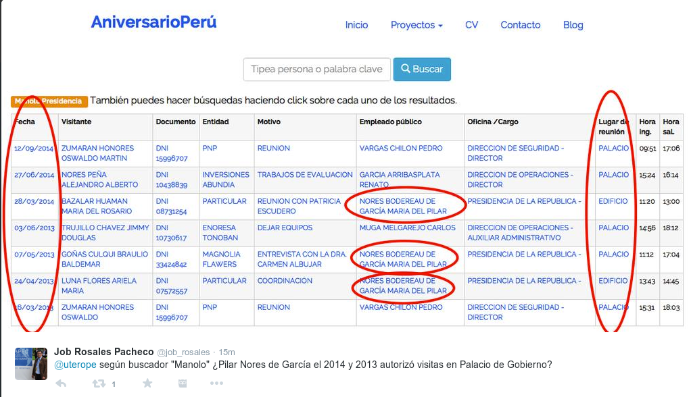

# Manolo dignidad. Sorry trolls

El [post de Martín Hidalgo sobre las visitas del
"Chocherín"](http://utero.pe/2014/11/24/exclusivo-chocherin-el-socio-de-martin-belaunde-visito-palacio-de-gobierno-33-veces/)
al Palacio de Gobierno ha causado rebotes y revuelo. Rebotes en [El
Comercio](http://elcomercio.pe/politica/gobierno/ex-gerente-antalsis-visito-33-veces-palacio-gobierno-noticia-1773688)
y revuelo por parte de trolls palaciegos.

Por ejemplo este usuario está
soprendido al encontrar que en el buscador "Manolo" figura Alan García
como "empleado público" en pleno año 2013!

Quiero informar que "Manolo, buscador de lobistas" es un
aplicativo que **replica** la información que figura en los registros
oficiales de visitas a diversas entidades estatales. O sea se copia y
reproduce fielmente la info. Si en "Manolo" figura que Alan García era
empleado público de Palacio, es por que **así figura en el registro
oficial de Palacio**, pez cuñao. 

Antes de quedar mal en tuiter, puedes
ir al registro oficial QUE [ESTÁ ESPECIFICADO BIEN CLARO EN LA
WEB](http://www.aniversarioperu.me/manolo_presidencia/) DE MANOLO!

Si lo
haces encontrarás esto ([aquí el
link](http://www.presidencia.gob.pe/visitas/consulta_visitas.php?fecha=03/12/2012&pagina=32))
y aquí te dejo la captura de pantalla.

Amigo troll, si no te gusta ese registro,
anda a Palacio de Gobierno a reclamar. Ya no hacen los trolls como
antes. Antes eran más cheveres. Aquí otro troll que no le importa pasar
roche:

En la web de Manolo dice bien claro que si no
creen deben CONSULTAR CON LA WEB ORIGINAL! Haré el trabajo por ti
causita. Aquí [está el link donde
figura](http://www.presidencia.gob.pe/visitas/consulta_visitas.php?fecha=28/03/2014&pagina=)
Pilar Nores de García. Y aquí te dejo la captura de pantalla chochera.

Vamos a hacérsela fácil: **Manolo no está
mal, lo que está mal es el registro de Palacio**. Aquí la pregunta es:
¿**Por qué** **la Dirección de Seguridad de Palacio usa los nombres de
Alan, Pilar y hasta de Chirito**, el exjefe de prensa aprista? El [post
de Martín
Hidalgo](http://utero.pe/2014/11/24/exclusivo-chocherin-el-socio-de-martin-belaunde-visito-palacio-de-gobierno-33-veces/)
trata sobre las visitas de "Chocherín", **no trata** sobre las visitas
de Alan, Pilar o Chirito. 

Por cierto, esto no invalida TODOS los
resultados ofrecidos por la Dirección de Seguridad de Palacio. De hecho,
[funcionarios de Palacio han
admitido](http://elcomercio.pe/politica/gobierno/ex-gerente-antalsis-visito-33-veces-palacio-gobierno-noticia-1773688)
que la nota de Martín Hidalgo, usando resultados de Manolo, decía la
verdad. Lo que están alegando los trolls **sólo hace que nos preguntemos
a quién están ocultando bajo los nombres de los apristas**. 

Y así podría
pasarme horas, días refutando trolls. Pero tengo mejores cosas que
hacer. Chau.
