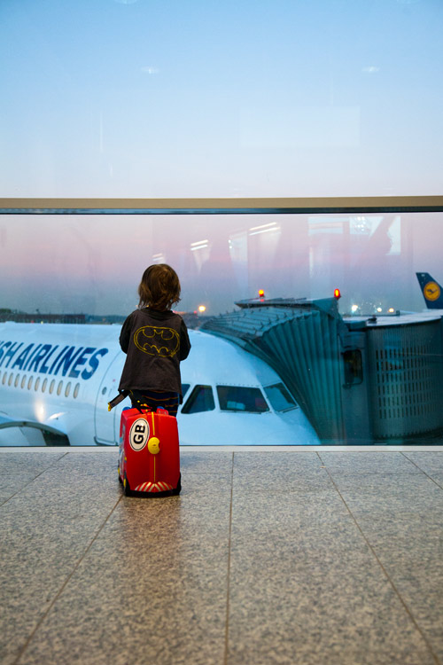

# Las memorias de AniversarioPerú - Parte 12

Si no leíste, aquí están los episodios anteriores:

* [Memorias Parte 1](http://aniversarioperu.utero.pe/2014/06/28/las-memorias-de-aniversarioperu-parte-1/): Los inicios
* [Memorias Parte 2](http://aniversarioperu.utero.pe/2014/07/17/las-memorias-de-aniversarioperu-parte-2/): El profesor de Razonamiento Verbal
* [Memorias Parte 3](http://aniversarioperu.utero.pe/2014/08/28/las-memorias-de-aniversarioperu-parte-3/): Estar en la uni es una cosa de locos
* [Memorias Parte 4](http://aniversarioperu.utero.pe/2014/09/18/las-memorias-de-aniversarioperu-parte-4/): Haciendo el trabajo de investigación/tesis
* [Memorias Parte 5](http://aniversarioperu.utero.pe/2014/10/02/las-memorias-de-aniversarioperu-parte-5/): En solo un mes, hablas inglés
* [Memorias Parte 6](http://aniversarioperu.utero.pe/2014/10/09/las-memorias-de-aniversarioperu-parte-6/): Punto de quiebre
* [Memorias Parte 7](http://aniversarioperu.utero.pe/2014/10/23/las-memorias-de-aniversarioperu-parte-7/): Iniciando la búsqueda de becas de postgrado
* [Memorias Parte 8](http://aniversarioperu.utero.pe/2014/10/30/las-memorias-de-aniversarioperu-parte-8/): Consiguiendo beca para un sueño
* [Memorias Parte 9](http://aniversarioperu.utero.pe/2014/11/13/las-memorias-de-aniversarioperu-parte-9/): Hay que ser atractivo
* [Memorias Parte 10](http://aniversarioperu.utero.pe/2014/12/12/las-memorias-de-aniversarioperu-parte-10/): Tu choteo es mi progreso
* [Memorias Parte 11](http://aniversarioperu.utero.pe/2014/12/15/las-memorias-de-aniversarioperu-parte-11/): Queremos investigación

## La hora del adiós
Pero no había llegado mi pasaje de avión. Había llegado una carta de invitación
formal para estudiar en esta universidad europea. En tal carta se detallaba los
objetivos que esperaba cumplir además del estipendio mensual que iba a recibir
(en esa época era 630 euros, ahora está por los 750 euros).
El estipendio era lo justo para vivir sin preocupaciones. Se iban alrededor de
250 euros en pagar el alquiler de departamento, agua, electricidad e internet. Y
en alimentación se podían ir otros 300 euros. Quedaban 250 euros
aproximadamente para divertirse o ahorrar.
Esa es la información que piden en la embajada antes de otorgarte la visa de
estudios.

Lo único malo de postular a la visa era el pago por derechos de trámites. Era
bien carolino, alrededor de 100 dólares. Menos mal tenía unos ahorritos, pasé
el sombrero cerca de mi tío ingeniero, llené mi formulario y postulé a la visa.

Luego de unas semanas me llamarían para la entrevista personal. Llegué a la
embajada sudando frío, practicando mentalmente las posibles respuestas que
debía dar en inglés. Buscaba la mejor manera de convencerlos que yo no pensaba
quedarme a vivir de ilegal en su país para que tengan confianza y no me nieguen
la visa.

Al final de cuentas la entrevista fue bien fácil. Todo fue en español.
Me sentaron en una oficina bien chévere y me hicieron varias preguntas. Pero
todas las preguntas eran muy generales, y eran las mismas que estaban en
el formulario.

Semanas después regresé con mi pasaporte para que le estampen la visa. Yo
saltaba en un pie de alegría.

Pasaron los meses y sustenté mi tesis para optar el título de biólogo sin
contratiempos. Solo faltaba un pequeño detalle: dar el examen de suficiencia
del idioma inglés. El temido [TOEFL](http://es.wikipedia.org/wiki/TOEFL).

Fui a la galería de libros que queda al lado de ese instituto de inglés en el
centro de Lima. En el Jirón Cusco, cerca el cruce con la Avenida Abancay. Allí
encontré un libro de preparación para el TOEFL. Era una fotocopia de segunda
mano. Era algo antiguo pero parecía útil.
En las siguientes semanas me dediqué a devorar el libro, según el cuál toda la
preparación consistía en aprender las reglas de gramática. Eran más de 300
páginas de gramática con sus ejercicios y respuestas. Me resultó divertido,
casi como aprenderse fórmulas matemáticas.

El profe pagó el TOEFL con su tarjeta de crédito y me dijo que me apareciera en
el instituto de inglés del Jirón Cusco un lunes en la mañana.
Me tomaron foto, tomaron huella digital y revisaron que no tenga ningún papel
conmigo. Me asignaron una computadora de las 6 que habían en un cuarto y me
puse a resolver el examen.

Lo resolvía con calma, con paciencia, tratando de no frikearme. Luego de dos
horas y media terminé y decido retirarme. Y para mi sorpresa yo era el primero
en terminar. Mis compañeros de examen seguían ocupados y absortos
resolviendo el examen. Por un momento pensé que algo andaba mal, que quizá me
había salteado alguna sección. Pero ya que el examen es computarizado, las
secciones van apareciendo automáticamente. No había posibilidad de haber
saltado secciones sin notarlo.

Ahora el TOEFL es un poco más complicado ya que hay una sección nueva donde
tienes que hablar frente al micrófono (lo que llaman el *speaking*).
Antes solo evaluaban lectura, escritura y capacidad de entender lo que te dice
la grabación.

Luego de poco más de un mes llegaría el resultado de mi examen TOEFL
directamente a la universidad europea. Me dijeron que el puntaje era suficiente
y yeeee! Ya estaba casi todo listo.

## Solo faltaba el pasaje de avión. 

Yo pensaba que tanta belleza no puede ser cierta. Trataba de no ilusionarme
mucho y solo creer de verdad cuando tuviera en mis manos el pasaje. Ver para
creer.

Hasta que llegó un email del profe diciendo que ya podía ir a las oficinas de
KLM en San Isidro para recoger el pasaje. Llegué a la portería del edificio y
dejé mi DNI para cambiarlo con un pase de visitante. Subí en el ascensor y me
atendieron en la oficina de KLM.

> - Vengo a recoger mi pasaje, me llamo Aniversario Perú.
> - Cómo no, deme su DNI para verificar su identidad.
> - Uy, pero el DNI se quedó abajo en recepción.
> - No tiene otro medio de identificación?
> - Tengo una copia empastada de mi tesis aquí en mi mochila. Allí está mi
    nombre completo.
> - Ok, creo que esto será suficiente.

Moraleja, la tesis te puede ayudar de la manera más inesperada.

## Algunas consideraciones prácticas

Como medida de precaución debes hacer varias averiguaciones antes de viajar.
Debes fijarte que la universidad sea respetable, que esté en los rankings
internacionales. No importa que no esté en los 10 primeros puestos, pero que esté.
No vaya a ser que estés yendo a una universidad de medio pelo.
No vaya a ser que la universidad no exista y caigas en manos de traficantes de
personas.

También es buena idea enviar emails a estudiantes de doctorado que estén 
en el departamento académico donde vayas a llegar. Puedes preguntar si conocen a
tu futuro asesor, es legal?, es buena gente?. No vaya a ser que te toque un
depravado sexual.
Fíjate en la web de la universidad, allí encontraras listados los profes, y
estudiantes de doctorado, con nombres, foto y correos electrónicos. Todo
facilito para hacer averiguaciones.

También es buena idea averiguar sobre la seguridad social del país a donde
irás. Se supone que estarás viviendo como mínimo 5 años en tu nuevo país y es
bastante probable que encuentres tu media naranja, y también es probable que
decidas iniciar tu proceso reproductivo (o sea que tengas tus chuquis). Sería conveniente
averiguar si te permitirán poner pausa a tus estudios durante y
después de tu embarazo, si te darán permiso para que atiendas a tu mujer y tu
nueva criatura (*daddy month*).

Debes tomar en cuenta que algunos países del "primer mundo" no dan tiempo libre
para que estudiantes tengan sus hijos sin apuros. Hay casos recientes donde
estudiantes se quejan de [la falta de *maternity leave*](http://the-toast.net/2014/10/27/employer-put-fml-fmla/).

También hay países donde tener hijos es bastante cómodo. Una compañera del
doctorado tuvo 2 hijos durante sus estudios. En total estuvo ausente casi 2
años entre uno y su otro hijo, nunca dejó de recibir sueldo. Claro
que mientras te ausentas solo recibes el 80% de tu sueldo. Pero es mejor que [no
recibir nada](http://the-toast.net/2014/10/27/employer-put-fml-fmla/).

Una vez que tu hijo tenga 9 meses puede comenzar a ir una guardería. Entonces tú
podrás regresar a la universidad y retomar tu tesis doctoral. También debes
tomar en cuenta que hay países como EEUU y UK donde la guardería cuesta un ojo
de la cara. Tranquilamente puedes pagar 2 mil dólares mensuales en guardería.
El sueldo que ganes como estudiante definitivamente no te alcanzará.

Si tienes suerte y llegas a un país "socialista" como lo son varios de los países
nórdicos, la guardería está subvencionada y solo pagarás un monto simbólico. Yo
estuve pagando 50 euros mensuales por una guardería donde tienen a los chibolos
8 horas diarias, 5 días a la semana y encima les dan 3 comidas diarias,
desayuno, almuerzo y bocadillo a las 2pm. Y lo mejor de todo es que no piden lista
de útiles escolares. Hacen bastantes manualidades con papel, pintan cartulinas,
hacen bonitos regalos para el día del padre, madre y todos los materiales
los pone el Estado.

# Consiguiendo departamento
El profe me había alertado que conseguir departamento en su ciudad era muy
difícil por el hecho de ser capital europea populosa. Pero era posible postular a
un departamento vía la internet. Hay empresas que se especializan en alquilar
departamentos a bajo costo a estudiantes. Te alquilan un dormitorio con
baño privado de 21 metros cuadrados en un corredor, con sala, comedor y cocina
compartidos con otros estudiantes. Ideal para hacer amistades.

Debía hacer mi solicitud de departamento al toque porque cada día que pasaba
desde la postulación se contaba como 1 punto.
Y era necesario hasta 300 puntos para recién tener opción
que te asignen un departamento disponible. Felizmente me ofrecieron un depa
teniendo menos de 200 puntos (200 días en espera).
Ni bien llegara a la ciudad debía ir a la oficina de esta empresa para pagar el
primer mes de alquiler y recoger las llaves.
Era tranquilizador el saber que dormiría bajo techo.

# La hora del adiós
Y así llegó la hora de tomar el vuelo KLM Lima->Amsterdam con conexión
posterior a la ciudad destino.

Un día antes del viaje había llegado a la casa mi madrina que no veía en años
y me dejó una propinaza de 100 dólares! Ese billete me cayó a pelo ya que
serviría para pagar el impuesto de salidas internacionales en el aeropuerto
(era algo de 31 dólares). También me sirvió para comprarme una casaca
abrigadora, comprar cosas esenciales para llevar a mi viaje como cubitos de
caldo de gallina Maggie, paquetes de emoliente con linaza, y sobres de chicha
morada La Negrita.
El vuelto sería mi bolsa de viaje.

Nunca olvidaré cuando le dije adiós con la mano a mi familia mientras entraba
al control de seguridad en el Jorge Chávez. Sentía que ya estaba listo para
enfrentarme al viejo continente, con 40 dólares en la billetera y la melodía de
"Un shipibo en España" en la mente.

Continuará...

