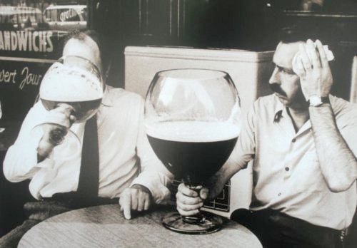

# Las memorias de AniversarioPerú - Parte 13

Si no leíste, aquí están los episodios anteriores:

* [Memorias Parte 1](http://aniversarioperu.utero.pe/2014/06/28/las-memorias-de-aniversarioperu-parte-1/): Los inicios
* [Memorias Parte 2](http://aniversarioperu.utero.pe/2014/07/17/las-memorias-de-aniversarioperu-parte-2/): El profesor de Razonamiento Verbal
* [Memorias Parte 3](http://aniversarioperu.utero.pe/2014/08/28/las-memorias-de-aniversarioperu-parte-3/): Estar en la uni es una cosa de locos
* [Memorias Parte 4](http://aniversarioperu.utero.pe/2014/09/18/las-memorias-de-aniversarioperu-parte-4/): Haciendo el trabajo de investigación/tesis
* [Memorias Parte 5](http://aniversarioperu.utero.pe/2014/10/02/las-memorias-de-aniversarioperu-parte-5/): En solo un mes, hablas inglés
* [Memorias Parte 6](http://aniversarioperu.utero.pe/2014/10/09/las-memorias-de-aniversarioperu-parte-6/): Punto de quiebre
* [Memorias Parte 7](http://aniversarioperu.utero.pe/2014/10/23/las-memorias-de-aniversarioperu-parte-7/): Iniciando la búsqueda de becas de postgrado
* [Memorias Parte 8](http://aniversarioperu.utero.pe/2014/10/30/las-memorias-de-aniversarioperu-parte-8/): Consiguiendo beca para un sueño
* [Memorias Parte 9](http://aniversarioperu.utero.pe/2014/11/13/las-memorias-de-aniversarioperu-parte-9/): Hay que ser atractivo
* [Memorias Parte 10](http://aniversarioperu.utero.pe/2014/12/12/las-memorias-de-aniversarioperu-parte-10/): Tu choteo es mi progreso
* [Memorias Parte 11](http://aniversarioperu.utero.pe/2014/12/15/las-memorias-de-aniversarioperu-parte-11/): Queremos investigación
* [Memorias Parte 12](http://aniversarioperu.utero.pe/2014/12/16/las-memorias-de-aniversarioperu-parte-12/): La hora del adiós

# El encuentro de dos mundos

El viaje fue largo y cansado. La comida del avión venía en porciones gourmet,
me quedaba con hambre.

Luego de recoger mi maleta, encontré al profe esperándome. Habíamos
intercambiado fotos con anticipación para que no sea difícil reconocernos.
Parecía cita casi a ciegas.
Antes de salir del aeropuerto, el profe me recomendó cambiar dólares por la
moneda local.

> - Deberías cambiar aunque sea parte de tu dinero.
> - Ok, cambiaré solo 40 dólares.
> - No quieres cambiar más?
> - Creo que 40 dólares será suficiente por varios días.
> - Se te acabará en un día

Y encima me cobraron impuesto a las transacciones. No recuerdo si era 10% o el
20% pero me parecía un montón!, un abuso. Solo estoy seguro que odiaré a Forex
con todo mi corazón.

Creo que el profe ya se había dado cuenta de mi minúscula bolsa de viaje. 
Luego de una semana recién recibiría el primer depósito del
estipendio en mi cuenta bancaria. Pero para eso debía
registrarme en la municipalidad, abrir una cuenta de ahorros y
esperar unos días para que sea activada.

Durante esa primera semana sin sueldo sobrevivía con préstamos diarios que me
hacía el profe. Con el primer sueldo que depositó la universidad puede
cancelar toda la deuda.

# Primera noche
La primera noche dormí en la casa del profe. A la mañana siguiente me
acomodaron en un dormitorio/estudio de la facultad, el cual estaba implementado
con los requerimientos básicos: un sofá cama, baño con ducha y escritorio. Luego de una
semana recién me mudaría a mi propio departamento en la villa universitaria.

En el segundo día conocí a algunos profes, me enseñaron los laboratorios y
oficinas. El departamento académico de ecología abarcaba un piso completo del
edificio.
Me sorprendió ver entre las oficinas había un ambiente bien grande que 
consistía en un comedor equipado
con 3 hornos microondas, 2 refrigeradoras, cocina, lavadero y varios estantes
para guardar ollas, sartenes y cubiertos.
Todos los miembros del departamento llevaban su lonchera y almorzaban juntos en
ese comedor. Algunos compraban comida de las cafeterías, para llevar, y regresaban
para almorzar en el comedor del departamento.
Algunos se ponían a cocinar allí mismo. Claro que hacían algo rápido: unos
fideos sancochados con salsa roja de lata.
Allí almorzaban (y tomaban lonchecito) todos, desde el decano hasta los
estudiantes de doctorado, pasando por el personal administrativo, profesores,
post-docs e investigadores visitantes.

Parecían la gran familia feliz. Todos paraban juntitos de 8am hasta las 4pm, de
Lunes a Viernes. Trabajaban juntos, almorzaban juntos, tomaban lonchecito
juntos y los Viernes en la noche, cheleaban juntos (pero no todos).

También aprendí la regla más importante de todo el departamento académico.
Implicaba el componente más esencial e importante de todo centro de estudios: el
café.
Era necesario dejar en uno de los estantes una bolsa de medio kilo de café
molido. Luego uno iba apuntando con palitos la cantidad de tasas que iba
consumiendo. Cuando se llegaba a los treinta palitos era necesario traer otra
bolsa de medio kilo de café y reiniciar el conteo.
Luego que apuntaran mi nombre en uno de los espacios libres del cuaderno de
control del consumo de café ya me sentía aceptado en esta nueva comunidad de
biólogos.

# Haciendo otra tesis de grado
Tal como habíamos acordado, debía comenzar a trabajar en mi tesis de grado
según los parámetros y requerimientos de esa universidad. Pero antes tuvimos
que ir a la facultad de biología para matricularme.

Resulta que la matrícula estaba abierta todo el año académico. No importaba que
el semestre ya hubiera comenzado. Igual me pude matricular. La directora de
asuntos académicos recibió mis certificados de estudios originales (aunque ella
        ya había revisado las copias que les envié por email) junto con
el resultado del
examen de inglés TOEFL. Además, escuchó la declaración de compromiso de parte del
profe donde dijo que iba a pagar la beca con parte del dinero de su proyecto
financiado (aunque todos los movimientos del dinero los hace la universidad).
Luego de darle unas cuantas veces a mis papeles, la directora sentenció:

> Ya estás inscrito. Con este papel pagas el monto del centro federado.

Luego me enteraría que esa universidad, siendo estatal, no cobraba pensión ni
matrícula a sus estudiantes, no importaba que sean europeos o peruanos. 
El único pago a realizar, una vez por semestre, era al centro federado de
estudiantes. Recuerdo que terminé pagando setenta euros al año. Una bicoca.

Pregunté si eran muy costosas las universidades privadas. Sorpresa la mía al
enterarme que no existían universidades privadas. Todas pertenecen al Estado y
no cobran a sus estudiantes! Y encima dan becas!
Cosa más rara.

Me dijeron que no me olvide de pagar la cuota al centro federado ya que era
necesario para acceder al seguro médico, el cual también era gratis!
Supuse que sería en el equivalente de ESSALUD.

Así que tuve que pisar el acelerador para poder terminar la tesis en sólo 6
meses. Todos trabajaban de Lunes a Viernes, pero yo  iba hasta Sábados y
Domingos. 
Me dieron un escritorio en un laboratorio de poco uso que más parecía depósito.
El encargado de las computadoras rescató una computadora vieja para mi uso
personal. De rato en rato había que dar un cocacho al monitor para que los
colores se dejen de distorsionar.
Recibí entrenamiento en el laboratorio para hacer varias pruebas genéticas.
Allí pasaba buena parte de mi tiempo y el resto del trabajo consistía en
analizar los datos en la computadora destartalada.
Llegaba a mi jato exhausto, tan cansado que solo atinaba a dar un
clavado en la cama y dormir hasta el día siguiente. Una vez estaba tan cansado
que era difícil dormir, la pierna me saltaba, el brazo se movía como si 
tuviera un tic molesto. Luego de ese episodio decidí tomármela un poco más
tranquilo y descansar al menos los domingos. Agarré la rutina de ir al centro
de la ciudad a tomar fotos y visitar algunos museos.

# Work hard, play hard
Mis vecinos y vecinas de la villa universitaria acostumbraban asistir al "pub
del Miércoles". Resulta que el centro federado alquilaba los días Miércoles un
local dentro de la ciudad universitaria. Había una pista de baile bien grande,
con luces de discoteca y los estudiantes vendían cerveza a precios con
descuento.
La cerveza no era de la mejor calidad, pero eso no importaba. Lo que importaba
de verdad era el bajo precio.

Fui varias veces al pub del Miércoles. Pero no me gustaba mucho ya que era a
mitad de semana. Hubiera sido genial si lo hacían los Sábados por ejemplo. Así
que dejé de ir ya que no era chévere tener sueño los jueves por la
mañana.

Allí me di cuenta que fue un craso error de mi parte llegar a Europa sin saber
bailar. O creer que sabía bailar. A las chicas les gusta hacer diversas
actividades extra curriculares. Una de ellas es aprender baile. Y hay
varios cubanos que se recursean enseñando salsa en clases bien concurridas.
En una de esas pusieron la canción "No le pegue a mi negra" de Joe Arroyo y yo
confiado saqué a bailar a la francesa que tenía a mi costado. Que roche que
roche, bailaba mucho mejor que yo. Encima bailaba salsa cubana, que más parece
salsa de salón. Parecía digna concursante del "Show de los sueños" de la
señito.

> Como así bailas tan bien?
> He tomado clases de salsa

Lo peor es que esperan que uno sea el quien dirija el baile. Yo estaba más
aturdido que cuy en tómbola sin saber qué hacer. Pero después se me pasó el
roche ya que vi pasar a mi vecina italiana y nos pusimos a bailar "Llorando se
fue" (versión lambada). Ninguno de los dos sabía bailarlo, pero hicimos el
intento.

Por eso te aconsejo que, antes de viajar, es extremadamente importante que te
defiendas en algún tipo de baile. Si sabes bailar salsa nivel *destroyer* la
haces linda.
Tendrás la ventaja que los varones europeos por lo general se niegan a bailar.
Y si lo hacen, la mayoría lo hace pésimo.

# Defensa de tesis de grado
Avanzaba la tesis lento pero seguro. Hasta que llegó el día de sustentarla.
Por ser tesis de grado, la sustentación se hace en el pequeño mini-auditorio
que tienen al final del corredor.
Además, lo bueno de tener a todos los profes, post-docs y estudiantes de
doctorado en el mismo lugar era que todos sin excepción asisten a las defensas
de tesis. Hasta el decano asiste (no es como en San Marcos que algunos tienen 
que obligar a su jurado que asista a la defensa de tesis).
Es agradable tener auditorio lleno, sentir que
tantos especímenes tienen ganas de escuchar lo que uno tiene que contar.

Lo malo de tener gente de tanto *level* en tu auditorio es a veces hacen
preguntas difíciles. Siempre son amables al hacer las preguntas, pero a veces
cuesta dar una respuesta satisfactoria.

En total fueron 45 minutos de sustentación de tesis incluyendo preguntas. Me
dijeron que había aprobado el asunto y todos contentos.
Ese día celebramos con el profe y un par de estudiantes más comiendo 
hamburguesas en una de las cafeterías de la universidad. 
Más sanos no podíamos ser.

Terminadas las hamburguesas mi profe me dijo:

> Tómate el resto de la semana libre. Son tus vacaciones.
> Pero hoy es Viernes.
> Entonces serán vacaciones cortas. Nos vemos el Lunes.

Lunes a primera hora. Oficina del profe. Discutimos el plan a seguir. Por fin
iba a comenzar a hacer lo que tanto anhelaba. Por fin iniciaría el doctorado.

Continuará...

