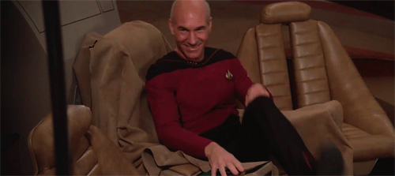

# Las memorias de AniversarioPerú - Parte 14

Si no leíste, aquí están los episodios anteriores:

* [Memorias Parte 1](http://aniversarioperu.utero.pe/2014/06/28/las-memorias-de-aniversarioperu-parte-1/): Los inicios
* [Memorias Parte 2](http://aniversarioperu.utero.pe/2014/07/17/las-memorias-de-aniversarioperu-parte-2/): El profesor de Razonamiento Verbal
* [Memorias Parte 3](http://aniversarioperu.utero.pe/2014/08/28/las-memorias-de-aniversarioperu-parte-3/): Estar en la uni es una cosa de locos
* [Memorias Parte 4](http://aniversarioperu.utero.pe/2014/09/18/las-memorias-de-aniversarioperu-parte-4/): Haciendo el trabajo de investigación/tesis
* [Memorias Parte 5](http://aniversarioperu.utero.pe/2014/10/02/las-memorias-de-aniversarioperu-parte-5/): En solo un mes, hablas inglés
* [Memorias Parte 6](http://aniversarioperu.utero.pe/2014/10/09/las-memorias-de-aniversarioperu-parte-6/): Punto de quiebre
* [Memorias Parte 7](http://aniversarioperu.utero.pe/2014/10/23/las-memorias-de-aniversarioperu-parte-7/): Iniciando la búsqueda de becas de postgrado
* [Memorias Parte 8](http://aniversarioperu.utero.pe/2014/10/30/las-memorias-de-aniversarioperu-parte-8/): Consiguiendo beca para un sueño
* [Memorias Parte 9](http://aniversarioperu.utero.pe/2014/11/13/las-memorias-de-aniversarioperu-parte-9/): Hay que ser atractivo
* [Memorias Parte 10](http://aniversarioperu.utero.pe/2014/12/12/las-memorias-de-aniversarioperu-parte-10/): Tu choteo es mi progreso
* [Memorias Parte 11](http://aniversarioperu.utero.pe/2014/12/15/las-memorias-de-aniversarioperu-parte-11/): Queremos investigación
* [Memorias Parte 12](http://aniversarioperu.utero.pe/2014/12/16/las-memorias-de-aniversarioperu-parte-12/): La hora del adiós
* [Memorias Parte 13](http://aniversarioperu.utero.pe/2014/12/19/las-memorias-de-aniversarioperu-parte-13/): El encuentro de dos mundos

# Postulando al doctorado
Bueno pues, ya había sustentado la tesis de grado que me habían pedido. Y ahora
les tocaba cumplir y dejarme comenzar el doctorado. Ya era hora de iniciar lo
bueno.

Pero me dijeron. Primero lo primero. Debes postular al doctorado. WHAT?!
Tenía que hacer un proyecto de investigación más formal, de varias páginas, que
describa los temas, metodologías y resultados esperados que tendría que
investigar durante los próximos 4 o 5 años.

Me demoré unas cuantas semanas en hacer este plan de investigación. Había que
justificar bonito el porqué era necesario investigar los temas que yo proponía.
Tenía que hacer una revisión de la literatura científica para ponerme al día de
los métodos más recientes que habían sido propuestos, y evaluar si eran
adecuados que yo los utilice en mi plan.

Una vez terminado el plan, me dijeron que espere un par de semanas ya que tenía
que exponer el plan frente al comité de facultad. Este comité tenía reuniones
mensuales y estaba conformado por el decano, profesores de las distintas
especialidades de la facultad de Biología, y representantes del gremio de
estudiantes de doctorado.

Durante esas semanas también me dediqué a investigar en qué consistía este
asunto. Pregunté al profe y a algunos estudiantes del doctorado que veía en los
pasillos.

Quien me contestó con mayor lujo de detalles fue mi pata David:

- Es fácil, solo debes explicar tu plan en 10 minutos como máximo y contestar
algunas preguntas que te hagan.
- Las preguntas son difíciles?
- Sí, bastante. Posibles preguntas son:
    - What is your name?
    - Who is your daddy?
    - Is he rich like me?

Luego me daría cuenta que David me estaba troleando, y que me había recitado
[parte de una canción](https://www.youtube.com/watch?v=qzpPy9hJYA8).

Llegado el día me encuentro con otros dos especímenes que también estaban
destinados a defender sus respectivos proyectos de doctorado ese día. Nos
comíamos las uñas de los nervios y de rato en rato nos dábamos apoyo moral. Si
bien era cierto que nosotros tres ya teníamos el financiamiento asegurado (el
profe ya había asegurado el financiamiento con su colaborador), de todos modos
el ambiente era un poco tenso.

Y de pronto se abre la puerta de la sala de reuniones y alguien dice:

- Que pase la primera víctima.
- [Nosotros casi en coro] No sabemos quién es primero.
- Que pase "Pacheco, Yoni".

Caballero, me tocó primero. Entonces entro a la sala de reuniones y todo estaba
a media luz, no veía casi nada, la luz potente del proyector de PowerPoint
apuntaba a la pared y me cegaba.
Pude divisar una mesa larguísima con aproximadamente 20 personas mirándome. 
A duras penas pude avanzar y posicionarme en frente del proyector y de suerte
no me tropecé con tanto cable cruzado.

- Puede comenzar.

Cargué mi PowerPoint, y en 10 minutos tuve que hacer mi mejor intento de
vender mi proyecto, mi mejor "pitch" como dicen los milenials.

Me hicieron un par de preguntas, y luego me dijeron gracias, puede retirarse.
Aprobé? Me aceptaron? Me chotearon? No me dijeron.

Salí del aula y me senté al costado de mis nuevos amigos mientras secaba el
sudor de mi frente. 
Ellos me miraban con cara de susto --- qué cara habré tenido en ese momento.

Luego del almuerzo me encontré con la secretaria y me dijo que debíamos iniciar
el trámite documentario ya que había sido aceptado en el programa de doctorado.
[Salta de alegría]

# Hablemos de dinero
Tenía que llenar una ficha de inscripción, adjuntar mi CV impreso, ir a la
oficina del decano para firmar el contrato. Qué? contrato?
Era un documento que también lo firmaban mi asesor y co-asesor de tesis. Allí
se especificaba los deberes y derechos del estudiante, además del tiempo máximo
de duración de los estudios.
Fue allí que me enteré que la beca incluía mi sueldo mensual más el pago de
impuestos. Ya que mi sueldo era básico, comenzaría pagando el menor porcentaje
de impuestos disponible: 27%.

A mi me parecía altísimo, pero luego me enteré que en ese país el impuesto a la
renta es escalonado. Mientras más ganas, pagas más impuestos y hay gente que
puede pagar hasta 60% de impuesto sobre su remuneración.
Claro que para pagar 60% de impuesto necesitas que tu sueldo sea mayor a 100
mil dólares al mes.

Creo que si en el Perú hubiera este tipo de impuestos tendríamos a banqueros,
CEOs, representantes de la Sociedad Nacional de Industrias, ADEX y la Confiep
marchando por la vía expresa como si fueran pulpines.

Lo bueno del contrato era que incluía un período de vacaciones anual donde
increíblemente me pagaban más. Al preguntar por qué subían el sueldo durante el
mes de vacaciones me dijeron que era para que la gente aproveche en pasear,
viajar, etc.

Mi sueldo durante el primer año del doctorado no era muy elevado. Me permitía
vivir sin preocupaciones sí, y ahorrar un poquito, y costear mi pasaje de avión
para ir de visita al Perú durante navidad. Lo bueno era que cada año
que pasaba me subían el sueldo. Y como no gastaba mucho, podía ahorrar. Tanto
así que en el tercer año mientras estaba en Lima decidí comprarme un carrito.
Era un carro de segunda, pero estaba en muy buenas condiciones. Con ese carro
pude recorrer los Andes, viajar a la ceja de selva. Era un buen carro.

Pasado ese mes de visita en el Perú, regresé a Europa para seguir estudiando y
le dejé el carro a mi hermano. Al año siguiente cuando regresé a Perú de
visita, me dio pena pedirle a mi hermano que me devuelva el carro. Así que me
compré otro. Era un Toyota, también era de segunda mano, pero más reciente
y en mucho mejor estado de conservación.

Otra vez regresé a Europa para el último año del doctorado. Así que le dejé el
auto a mi papá. Hasta ahora lo sigue usando.

# Ahora comienza lo bueno, oficina
Y así llegó el día de iniciar oficialmente el doctorado. La secretaria me llevó
hasta uno de las oficinas y pegó un sticker con mi nombre en la puerta y me
dijo:

- Esta va a ser tu oficina. Vas a tener que compartirla con estas dos personas.

Era una oficina amplia con tres escritorios, cada uno con estantes, repisas y
cajones. Uno estaba vacío, en los otros dos estaban sentadas dos europeas las
cuales se acercaron a saludar:

- Me puse nervioso y empecé a sudar. Hola, soy Aniversario Perú.
- Hola! bienvenido! Yo soy Sínica y ella es Marica.

No capté del todo qué era lo que me estaba diciendo. Tuve que disimular.
Pero inmediatamente recordé que en el momento que pegaron mi nombre en la 
puerta de la oficina, había podido ver esos nombres pegados.
"Pobrecitas, no creo que con esos nombres puedan conseguir enamorado" pensé.

- Ok, mucho gusto.
- Mira Aniversario, esta va a ser tu oficina. Aún quedan unas cositas sobre el
escritorio pero no te preocupes que Martin va a desalojar pronto.

En eso entra Martin, un pata que me miraba con cara de pocos amigos, a
terminar de
llevarse sus cachivaches.
Luego me enteraría que este pata había terminado sus estudios doctorales y que
le habían dicho que se mude a la oficina de recién egresados. Dicha oficina era
larga y angosta, compartida por varias personas que se les notaba un poco
apretados.

En cambio, mi nueva oficina era amplia, con un sofá en un costado.
Sínica y Marica
habían decorado la oficina con cuadros, había un arbolito de navidad y habían
pegado nieve falsa en las ventanas. Al medio del techo había una bola de
discoteca y un
cañón de luz roja que le apuntaba.
Entonces todos los viernes a partir de las 5pm, Sínica y Marica ponían
música, apagaban las
luces y ponían la oficina en modo discoteca. Atraídos por el ambiente tan
acogedor, y tan amables anfitrionas, llegaban otros estudiantes de doctorado
para tomarse unas chelas y disfrutar un par de horas de una buena conversación
antes de dirigirse a un bar o restaurante en el centro de la ciudad.

Por estas razones Martin me miraba con cara de pocos amigos. Yo había llegado a
desalojarlo de la mejor oficina de todo el departamento académico.

Cuando por fin Martin terminó de llevarse sus últimas chucherías, comencé a
limpiar la mesa y examinar los cajones. En eso Sínica me dice que la silla que
estaba usando era muy monse. Que tenía que cambiarla.

- Tienes que pedirle a la secretaria una silla para estudiantes de doctorado.
- Pero esta que tengo está bien.
- No, tú debes tener una silla como la mía. Mira, tiene un respaldar bien alto
hasta la cabeza. Tiene posaderas acolchonadas para apoyar los brazos. Y con
estas palancas puedes regular la altura de la silla e inclinación del
respaldar. Además, estas sillas tienen ruedas y son muy útiles para hacer
carrera de sillas en el corredor.

Fui a buscar a la secretaria y me llevó al depósito de sillas. Me dijo que solo
habían sillas de estaban un poco usaditas pero yo las veía casi nuevas. También
me dijo que si quería una silla nueva nuevecita, ella podía hacer el pedido
pero tendría que esperar unos días a que llegue en envío.

A mí me parecía un exceso de lujo, y tomé la primera silla que vi. Estaba
perfecta, nunca había tenido una silla así. Era extremadamente cómoda.

"Así debe sentirse Jean-Luc Picard
cuando se sienta en su silla en el Enterprise" pensé.

# Ahora comienza lo bueno, computadora
Solucionado el "gran problema de la silla", la secretaria me dijo que vaya a la
página web de DELL, escoja una computadora y que le envíe las especificaciones
por email.
Me dijo que la facultad tenía asignado una cantidad de dinero máxima para que
costear la computadora de cada estudiante de doctorado.

Yo no lo podía creer. La universidad me iba comprar una computadora nueva! Ya
no iba a necesitar esa computadora vieja que me dieron, la cual necesitaba
recibir cocachos en el monitor para que deje de distorsionar los colores.

Escogí una laptop DELL, la segunda más cara que había disponible, con un mouse
óptico y la memoria USB de mayor capacidad disponible en el mercado, 64
MegaBytes de capacidad.

La secretaria hizo el pedido y a los pocos días llegó un pata de DHL con mi
nueva computadora. Casi se me cae una lágrima de tanta felicidad.

# Ahora comienza lo bueno, viajes
Sínica y Marica me contaron que la facultad no tenía mucho dinero y que por
ahora **solo pagaban los costos de una conferencia internacional** a cada
estudiante. Me recomendaron que escoja bien y que escoja una conferencia lo más
lejos posible y un lugar exótico para que lo pague la universidad.

Ellas no se decidían si pedir que la facultad les pague una conferencia en
Australia o en Sudáfrica.

Me dijeron que para conferencias internacionales más cercanas, en algún país
vecino de Europa, era posible postular a financiamiento ya que los costos no
eran muy elevados.

También me recomendaron que busque cursos de doctorado en otras ciudades ya que
se podían convalidar los créditos y por lo general la universidad paga los
costos del matrícula de los cursos.

Y esta es una de las ventajas de estudiar en Europa, entre cursos y
conferencias uno puede hacer bastante turismo y conocer las capitales más
importantes del viejo continente. En particular yo no estaba muy interesado en
el turismo arquitectónico, mi mayor interés está en el turismo gastronómico y
etílico. Tuve oportunidad de poner en práctica este tipo de turismo.

Continuará...
