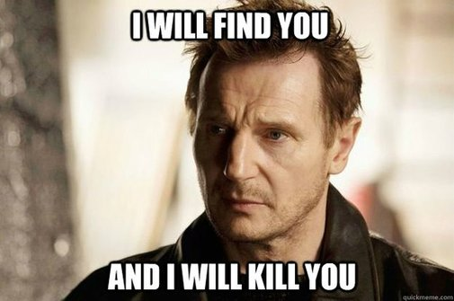

# Las memorias de AniversarioPerú - Parte 16

Si no leíste, aquí están los episodios anteriores:

* [Memorias Parte 1](http://aniversarioperu.utero.pe/2014/06/28/las-memorias-de-aniversarioperu-parte-1/): Los inicios
* [Memorias Parte 2](http://aniversarioperu.utero.pe/2014/07/17/las-memorias-de-aniversarioperu-parte-2/): El profesor de Razonamiento Verbal
* [Memorias Parte 3](http://aniversarioperu.utero.pe/2014/08/28/las-memorias-de-aniversarioperu-parte-3/): Estar en la uni es una cosa de locos
* [Memorias Parte 4](http://aniversarioperu.utero.pe/2014/09/18/las-memorias-de-aniversarioperu-parte-4/): Haciendo el trabajo de investigación/tesis
* [Memorias Parte 5](http://aniversarioperu.utero.pe/2014/10/02/las-memorias-de-aniversarioperu-parte-5/): En solo un mes, hablas inglés
* [Memorias Parte 6](http://aniversarioperu.utero.pe/2014/10/09/las-memorias-de-aniversarioperu-parte-6/): Punto de quiebre
* [Memorias Parte 7](http://aniversarioperu.utero.pe/2014/10/23/las-memorias-de-aniversarioperu-parte-7/): Iniciando la búsqueda de becas de postgrado
* [Memorias Parte 8](http://aniversarioperu.utero.pe/2014/10/30/las-memorias-de-aniversarioperu-parte-8/): Consiguiendo beca para un sueño
* [Memorias Parte 9](http://aniversarioperu.utero.pe/2014/11/13/las-memorias-de-aniversarioperu-parte-9/): Hay que ser atractivo
* [Memorias Parte 10](http://aniversarioperu.utero.pe/2014/12/12/las-memorias-de-aniversarioperu-parte-10/): Tu choteo es mi progreso
* [Memorias Parte 11](http://aniversarioperu.utero.pe/2014/12/15/las-memorias-de-aniversarioperu-parte-11/): Queremos investigación
* [Memorias Parte 12](http://aniversarioperu.utero.pe/2014/12/16/las-memorias-de-aniversarioperu-parte-12/): La hora del adiós
* [Memorias Parte 13](http://aniversarioperu.utero.pe/2014/12/19/las-memorias-de-aniversarioperu-parte-13/): El encuentro de dos mundos
* [Memorias Parte 14](http://aniversarioperu.utero.pe/2015/01/15/las-memorias-de-aniversarioperu-parte-14/): Postulando al doctorado
* [Memorias Parte 15](http://aniversarioperu.utero.pe/2015/01/30/las-memorias-de-aniversarioperu-parte-15/): Haciendo el doctorado

# Bioinformática, los inicios
Mientras hacía mi plan de estudios doctorales, antes que me acepten en el
doctorado, me di cuenta que iba a necesitar utilizar un programa de computadora
que solo se podía usar en sistemas operativos Linux o Mac.

Este programa medía tasas de evolución molecular de plantas y animales y había
sido escrito por un profe en los USA. Así que cuando recibí mi primera
laptop le borré la instalación de Windows XP y la reemplacé con Linux.

En esa época yo era completamente pulpín en cuestiones de Linux. Busqué en
Internet y descargué Chaos Linux. Lo cual resultó siendo un completo caos ya
que no logré culminar la instalación y mi computadora se quedó sin sistema
operativo y sin poder ser utilizada.

Felizmente conseguí ayuda del encargado de las computadoras de la facultad y me
recomendó que use la nueva y recién estrenada distribución de Linux llamada
Ubuntu. Parecía increíble que esta empresa sudafricana estaba dispuesta a
enviar por correo copias de Ubuntu Linux en CDs, sin costo alguno. Envié un
email, con la dirección de la facultad y el CD llegó luego de un par de
semanas.
Este pata me ayudó a instalar Ubuntu en mi laptop sin problemas. Y fue así como
aquella mañana calurosa del año 2005 usé Linux por primera vez.

# La gran defensa de tesis
La educación que uno recibe en el doctorado no consiste
en recibir datos, conceptos, de parte de los profesores. Más bien, la educación
consiste adquirir las herramientas y métodos que se necesitan para investigar.
Es decir, se aprende a aprender.

La idea de la investigación es averiguar algo nuevo, avanzar el
conocimiento humano en un área en particular, hacer un pequeño descubrimiento y
dar pasos en lo desconocido.
También es importante publicar aquellos experimentos fallidos, resultados
negativos les dicen algunos. Pero lamentablemente hay demasiadra prioridad por
publicar los descubrimientos y nula a os resultados negativos (pero esto ya
        es tema para otro post).

Por eso es que el principal entrenamiento en el doctorado consiste en que los
estudiantes adquieran la habilidad de aprender por su cuenta, la habilidad para
investigar, la habilidad para avanzar el conocimiento humano.

Ya que el deber es generar conocimiento, es imposible que tu asesor se siente
contigo a enseñarte este conocimiento que tú debes encontrar por tu cuenta. A
lo mucho podrá guiarte y darte herramientas para que encuentres el conocimiento
por tu cuenta.

Y la mejor manera que pudieron encontrar es haciendo que los estudiantes se
entrenen jugando sus partidos en canchas internacionales. 
Por eso las facultados obligan a que sus estudiantes saldrán al ruedo
y envíen sus mejores manuscritos a las revistas internacionales de buena
reputación con la finalidad de publicar sus investigaciones.
Seguro fallarán muchas veces ya que los arqueros del pórtico, el sistema
de revisión de manuscritos (por pares, alias #peerReview), son difíciles de
vencer. Solo los mejores disparos se permiten anotar. Solo se publicará
investigación que cumpla con estándares rigurosos en su metodología, ejecución
y comunicación.

#El comité de seguimiento
Los 4 o 5 años que duran el doctorado se pasan volando. La primera semana de
Enero de cada mes tocaba reunirme con mi comité de seguimiento.
Me reunía con los 3 profes que conformaban el comité para que evalúen mi
progreso. Al final de la reunión se preparaba un documento con los créditos
académicos logrados, la cantidad de
manuscritos publicados o en proceso de publicación, los cursos que ya había
llevado, etc. También se delineaba el plan a seguir para el año que iniciaba y
todos firmaban tal documento.
Así de estrictos son.

Pero no en todo eran estrictos. Recuerdo que lo más relajado de todo eran las
clases. Yo estando acostumbrado a la educación peruana, me pareció un poco
chocante que mientras el decano dictaba su clase mis compañeras Marica y Sínica
estaban sentadas en primera fila de la manera más relajada posible. Una estaba
masticando chicle y haciendo globos de rato en rato. La otra estaba tomando su
té en bolsita, se había sacado los zapatos y tenía los dos pies puestos sobre
el pupitre. Y era un aula pequeñísima, de máxima capacidad 20 alumnos sentados,
era imposible que los profes no se den cuenta de tanta desfachatez.

Aparentemente toda esta informalidad no era mal vista. Aparentemente yo estaba
acostumbrado a llevar clases en la escuela Victoriana.

Tal seguimiento de tus estudios doctorales facilita que luego de 4 o 5 años ya
tengas casi todos los objetivos cumplidos y estés expedito para defender la
tesis doctoral.

#Se busca oponente
Tal como conté en el episodio anterior, la universidad nos exige que cada año
se publique un capítulo del plan de investigación en alguna revista científica
de buena reputación (tiene que estar indexada por ISI Web of Science), ya que
no vale publicar en el "Journal of Cercado de Lima".
Entonces tu tesis doctoral consiste en grapar juntas las cuatro publicaciones,
agregarle un resumen, carátula, enviarla a empastar y listo, ya tienes
tu tesis doctoral.

Este sistema tiene la ventaja que cuando envías tu tesis para que la facultad
la evalúe, esta ya ha sido evaluada por la comunidad de científicos, en lo que
se llama revisión por pares (*pre publication peer-review*) y más importante
aún, ya que es información pública ha recibido el escrutinio de especialistas
alrededor del mundo, lo que se llama *post publication peer-review*.

Entonces la facultad "se la lleva fácil", no tiene que revisar mucho ya que
les ha llegado a las manos un producto de calidad que ha sido corregido y
evaluado varias veces.

Pero aún así, una vez que la facultad da el visto bueno hay que buscar un
oponente. El oponente es el ser más despreciable que ha existido sobre la faz
del planeta. Tiene que ser un profesor especialista en tu tema, tiene que ser
un capo, y además tiene que ser miembro de alguna universidad de otro país. La
facultad exige que el oponente sea lo más independiente posible, exige que no
haya el más mínimo conflicto de interés.
Tu pata del alma no puede ser oponente. Tampoco puede ser alguien con quien tú,
o alguno de tus asesores hayan colaborado o publicado trabajos multi
autores. Mientras sea más lejano mejor. Por eso, **la facultad exige que 
el oponente sea alguien que trabaje en otro país**.

En mi caso tuvimos que buscar oponente 8 meses antes de la fecha de defensa de
tesis. Felizmente la persona que teníamos en mente aceptó rápido. Este profe es
un australiano que trabaja en en la universidad de Edimburgo.
La facultad hace un chequeo del historial del oponente para verificar que no
hay conflicto de interés. Una vez que da el visto bueno comienza la cuenta
regresiva.

Hay que enviar el archivo de texto a la imprenta para que imprima los
ejemplares de tesis, enviar el archivo de texto al oponente para vaya
preparándose para el día de la defensa y lo más importante hay que prepararse
para defender la tesis!

Por esos meses pedía consejo a los postdocs. Pedía que me cuenten cómo hicieron
para prepararse para la defensa de tesis. La recomendación más común era que me
asegure de leer toda mi tesis. Si bien yo había hecho todos los análisis y
escrito todo el texto. Eran cosas que había hecho años atrás y ya que la
memoria es frágil, siempre es bueno un memorex. Me decían que sería rochoso si
el oponente me preguntara por cierto párrafo de la primera publicación y yo no
recordara haber escrito tal cosa.

Si bien tener tan próxima la defensa de tesis me hacía sentir con un peso menos
de encima, a la vez me hacía caer en la preocupación.
Yo había visto a mis compañeros de promociones anteriores defender
su tesis. Los había visto en aprietos, caer y levantarse para volver a caer con
las preguntas que le hacía el oponente.

# Comienza la fase final
Se supone que todo el programa de doctorado dura como mínimo 4 años y como
máximo 5. Pero en realidad es un poco menos ya que tienes que comenzar
con todos los preparativos para defensa alrededor de 6 meses que
termines tu doctorado.

Una vez que tienes oponente y tienes fecha de defensa ya no hay marcha atrás.
Se llega al punto de no retorno. Entonces aproximadamente 6 meses antes ya
tienes que tener tu tesis lista. Es decir, hay que juntar tus cuatro
publicaciones, o manuscritos, armar un resumen de 20 a 30 páginas que fusione y
resuma tus publicaciones en una idea general y coherente, imprimir todo esto y
enviarlo a la facultad para que le dé el visto bueno.

La asamblea de facultad se reúne una vez al mes y tiene que revisar tu tesis,
   evaluar al oponente, y recomendar que tu tesis inicie el proceso de
   sustentación. Luego tienes que esperar a que se reúna el consejo de
   estudiantes de doctorado donde hacen similar evaluación y dan el visto bueno
   a tu documento.

Aproximadamente 3 meses antes de la fecha de defensa hay que enviar la tesis al
oponente para que la revise al detalle, prepare sus críticas y evalúe los
puntos fuertes, puntos flacos y diseñe la mejor manera de humillarte durante el
debate cara a cara que se da durante la defensa de tesis.

En mi caso, mi oponente me pidió, que además de la tesis, le envíe copia de mis
datos originales, datos crudos ya que él quería correr independientemente todos
los análisis que hice. Quería encontrar fallas en mi procedimiento.
Mis amixeres del doctorado consideraron este pedido ser de lo más inusual. **No
lo hagas**, aconsejaron. **It is a trap!** exclamaron los más desconfiados.

Pero si parte de mi tesis ya estaba publicada, con dados crudos incluidos,
     supuse que el pedido del oponente era razonable. Además se supone que
     cualquier lector que revisa cualquier publicación científica debe tener
     acceso a los datos originales para poder replicar los resultados
     expuestos. Este proceso siendo parte de la reproducibilidad que tanto se
     necesita en la ciencia. Para esto mismo es que le ponemos tanto énfasis en
     explicar con lujo de detalle los procedimientos y metodología utilizadas
     durante los análisis de datos.

Así que envié los datos crudos al oponente, a pesar de las protestas de mis
compañeros pulpines del doctorado.
Decisión que no tuvo mayores repercusiones.

Cuando ya faltaba 1 mes para la fatídica fecha, llevé mi memoria USB
conteniendo mi tesis a la imprenta. La facultad exige que se impriman 50
ejemplares como mínimo de la tesis. La imprenta se encarga de empastar la tesis
y ponerle número ISSN. Entonces un buen día llego a mi oficina y encuentro un
par de cajas con un montón de libritos. Las copias de mi tesis. 
De las 50 copias solo conservo dos. El resto de copias fueron repartidas a los
profes y estudiantes de mi facultad. Tuve que enviar copias a las bibliotecas
de la universidad y facultad de biología y rectorado. Algunas repartí a mis
amigos y regresé al Perú con tres copias.

Una copia se ha quedado en la Unidad de Postgrado de la Facultad de Biología
de la Univ. Mayor de San Marcos. Se quedó allí cuando tuve que someter mi
diploma de PhD para que le hagan un reconocimiento oficial y emitan un
certificado diciendo que mi PhD europeo es equivalente a un doctorado emitido
por la UNMSM.

# Día D - 2
**Mi oponente llegó un dos día antes de la defensa de tesis.** 
Llegó en la tarde en
esos vuelos de Ryanair que te dejan en el aeropuerto más lejano posible. 
Fui al aeropuerto a recogerlo y de regreso tuvimos que hacer el viaje en 
bus de 2 horas  para llegar a la ciudad.
Durante las dos horas estuvimos hablando de cosas variadas pero parecía que
teníamos un acuerdo tácito de evitar hablar sobre la defensa de tesis.

Por esa época había salido la primera generación de iPhones y me enseñaba los
apps que se había descargado. Había uno que era para tocar flauta, soplaba uno
de los extremos del teléfono y se oía un sonido con grado de intensidad
dependiendo de la fuerza del soplido. Se generaban notas musicales al presionar
con los dedos sobre la pantalla.

Yo le enseñe mi Nokia que hasta ahora conservo.

Llegamos de noche a la ciudad y lo dejé en su hotel. Dijo que al día siguiente
se ocuparía de terminar de prepararse para la defensa de tesis. Entonces
quedamos vernos en la noche para ir a cenar a algún restaurante.

# Día D - 1
Para ese entonces mi asesor de tesis se había mandado mudar a otro país. Hacían
meses que no le veía su cacharro. Pero justo llegó de viaje para mi defensa, ya
que no quería gastar en hotel, lo hospedé en mi humilde departamento de
estudiante.

En la mañana me puse a planchar mi camisa, corbata, pantalón y desempolvar el
saco de mi terno. Lustré mis zapatos y me rasuré la pelusa de mi mentón.
Iba a ir bien *charly* a mi defensa.

Mi asesor llegó en la tarde y luego de instalarse en mi depa fuimos por al
centro de la ciudad para hacer hora. Encontramos un bar abierto y nos tomamos
una chela.
Como ya hacía hambre fuimos a buscar al oponente a su hotel.

Lo llevamos a cenar a un restaurante de Mongolia donde servían un bufé
todo-lo-que-puede-comer por 14 euros. Lo curioso de este restaurante era que el
bufé consistía en carnes y verduras crudas. Todo crudo. Uno se servía en un
plato y luego se lo daba al chef que vaciaba todo el plato en su plancha para
cocinarla. Una vez que todo estaba bien revuelto y cocinado, lo recibía en plato
nuevo.
El bufé incluía ensalada de frutas y helado, pero eso no pasaba por la plancha
:-( 

La cena estuvo amena y entretenida. Quizá el vino que consumimos nos ayudó a
romper un poco el hielo. Entre broma y broma le insinué al oponente que seguro
me iba a ser fácil defender la tesis y contestar sus preguntas. Hasta ahora
puedo recordar como se le borró la sonrisa del rostro y puso cara de Liam
Neeson para decir:

> No estés tan seguro de eso.

Desde ese momento le agarré miedo a los Australianos.

Acabada la cena lo acompañamos caminando hasta su hotel y nos despedimos. La
defensa de tesis sería al día siguiente a las 10:00am en punto, pero nos
encontraríamos en la universidad a las 9:00am.
El oponente prometió llegar a la universidad por sus propios medios.

Tomamos el metro y luego de una pequeña caminata llegamos a mi departamento.
Como ya eran más de las 10:00pm decidimos ir al sobre.
Pero antes nos pusimos filosóficos y conversábamos sobre la vida, el universo y
todo lo demás. Recordé que tenía una botella de whisky a medio terminar y
decidimos tomar una copita antes de dormir.

Pero la charla se alargaba, entonces decidimos tomar otra copita más de whisky
y acompañarla con chocolate negro. Y así de copita en copita casi nos
terminamos la botella.
Yo había cenado tanto que no estaba ni picado.
Pero mi asesor ya estaba medio borracho y yo comenzaba a caer
en cuenta de lo que había hecho.

> AniversarioPeru: Creo que no fue buena idea tomar whisky antes de una defensa de tesis.
> Asesor: No sé, yo no soy quien defenderá la tesis.

Se supone que mi asesor estaba para cuidarme y evitar que tome de más justo
la noche antes de tan importante día. Pero en lugar de eso, se dedicó a tomar
whisky y comer chocolate. Mi asesor fue irresponsable ;-D (más conchán).

El asunto es que esa noche no pude dormir bien. Me desperté varias veces con
ganas de vomitar. Pensé que la comida del restaurante Mongólico me había
intoxicado. Quizá los calamares no se habían cocinado lo suficiente.
Pero ahora, en retrospectiva, mirando 6 años en el pasado, me doy cuenta que lo
único que tenía eran nervios. Me estaba frikeando. Mi moría de nervios.

Yo estaba en la cama pensando, preocupándome, tratando de dormir:

> Mañana me espera un día bravo, necesito descansar.

Hasta que finalmente pude conciliar el sueño y cae profundamente dormido. Ni
bien pude cerrar los ojos, sonó el despertador. Era hora de levantarse,
     vestirme y dirigirme a la universidad para la defensa de tesis.

Me había llegado la hora de partir rumbo al matadero.

Continuará...

