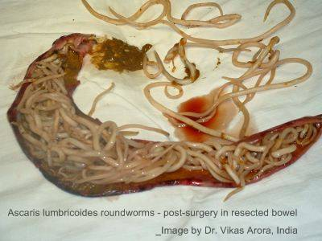

# Cinco razones por las que no debes comer cucarachas

Mis profesores del curso de Zoología II de la UNMSM me hicieron conocer las
cucarachas a profundidad.

Todos los Martes de cada semana debíamos llegar bien puntuales a las 8:00am con
un tarro conteniendo una o más cucarachas vivas. Tales cucarachas servirían
como especie modelo para aprender en vivo y en directo el funcionamiento de los
insectos.

Hacíamos que las cucarachas duerman para siempre al aplicar cloroformo. 
Luego pasaban por la bandeja de disección bajo el estereoscopio.
Era nuestro deber abrir las cucarachas con bisturí, para separar con la ayuda
de  pinzas y estiletes finos:

* el sistema digestivo (lo más fácil).
* el sistema respiratorio
* el sistema reproductor
* el sistema circulatorio, y
* el sistema nervioso.

Luego de ese semestre, mis compañeros y yo salimos expertos en la anatomía
cucarachil, y de yapa nos ganamos con información teórica y de primera mano
sobre tooooodos los parásitos que pueden albergar las cucarachas. De primera
mano ya que pudimos ver algunos de los parásitos en vivo y en directo.

Es posible que en algún momento estés contemplado obligar a adolescentes a que
coman cucarachas. O al menos chantajearlos ofreciendo un pasaje de promoción
con el fin que los adolescentes no tengan más opción que aceptar tal
degradación con el fines de ["entretenimiento puro"](http://peru21.pe/espectaculos/adolgo-aguilar-que-escolares-coman-cucarachas-no-me-parece-nada-grave-2214860?href=hdestaque4).
En este post te daré cinco razones para desanimarte de tal locura.

## 1. Las cucarachas son excelentes reservorios de salmonela multi-resistente
Un artículo en la revista *Epidemiology and Infection* (ref 1) nos cuenta que
al examinar 221 cucarachas (de desagüe y de cocina) encontraron que varias de
estas presentaban la bacteria de la salmonella. No encontraron solo una, habían
varios tipos de salmonella:

* *Salmonella bovismorbificans*
* *Salmonella oslo*
* *Salmonella typhimurium*
* *Salmonella mbandaka*
* *Salmonella braenderup*

Y cuando los científicos quisieron matar estas salmonellas con la batería usual
de antibióticos, se dieron cuenta que algunas eran duras de matar, no morían.
Eran cepas drogo-resistentes.

## 2. Las cucarachas son transportadoras de parásitos intestinales de humanos

Un estudio en la revista *Transactions of the Royal Society of Tropical
Medicine & Hygiene* (ref 2) reporta que investigadores colectaron cucarachas, les
dieron un baño en tinas, pasaron las cucarachas a otro compartimento y
examinaron el agua que quedó luego que del baño cucarachil.

Encontraron huevos de gusanos conocidos como Platelmintos y Nemátodos:

* *Taenia* spp.
* *Ascaris lumbricoides*

Quizá ya hayas oído hablar de los parásitos intestinales conocidos como tenia.
Entonces escribiré sobre el parásito más carismático, el amixer
[*Ascaris lumbricoides*](http://en.wikipedia.org/wiki/Ascaris_lumbricoides).
Esta especie de parásito se le conoce como *el gusano gigante de los humanos*.
Llega a medir hasta 35 cm en longitud. Este gusano se mete a tu cuerpo cuando
comes comida contaminada. 

No es raro que a la cucaracha, al vivir en los desagües,
se le hayan algunos huevos de *Ascaris* al cuerpo. Si esta
cucaracha luego se pasea por tu plato de comida, algunos huevos se podrán caer
dentro de tu cuchara y  así entrar a tu cuerpo.
Los huevos de *Ascaris* son recios, el jugo gástrico hiper-ácido de tu estómago
no le hace ni cosquillas.
El huevo eclosiona al llegar a tu intestino delgado y sale una pequeña larva,
   un gusanito. Esta larva es una loquilla ya que inmediatamente perfora la
   pared de tu duodeno para ingresar a tu torrente sanguíneo. El flujo de tu
   sangre la puede a tu hígado, tu corazón o pulmones.
Esta larvita crecerá y cuando cumpla 3 semanas de vida, comenzará a ascender
por tu tubo respiratorio y te hará cosquillas. Tú tendrás ganas de toser, y si
lo haces es posible que expectores la larvita. La fuerza de tu tos hará que la
larvita salga de tu sistema respiratorio y se las ingenie para
meterse por tu esófago y regresar a tu sistema digestivo. Así llegará a tu
intestino delgado y madurará, se encontrará con otros individuos de *Ascaris*,
           tendrán un *sexy time* y cada hembra de *Ascaris* podrá producir
           hasta 200 mil huevos diarios! Los cuales saldrán por tu ano. 

Se han reportados casos extremos donde individuos se tragaron muchos huevos de
*Ascaris* sin darse cuenta, y se formaron numerosos gusanos adultos en su
intestino delgado, tantos que el desafortunado individuo sufrió de oclusión intestinal.

Como anécdota recuerdo que para el curso de Zoología II debíamos ir al Camal de
Yerbateros a buscar *Ascaris*. Los chanchos que beneficiaban allí tenían
*Ascaris*. Éramos tantos estudiantes de biología que llegaban a camal pidiendo
esos parásitos que los trabajadores vieron la oportunidad de negocio.
Las últimas veces que fui, podías ver a los trabajadores recibirnos con
sonrisas en el rostro, un frasco conteniendo entre 10 y 20 *Ascaris* y la mano
extendida. A un nuevo sol cada *Ascaris*.

## 3. Las cucarachas llevan parásitos causantes de diarrea

Si vas a comer cucarachas bien lavadas con agua y jabón, no te salvas de estar
en riesgo de contraer enfermedades.

La revista *Pediatric Infectious Disease Journal* (ref 3) 
    cuenta el caso de un bebito
peruano que cayó enfermo con una diarrea terrible. Una bicicleta en bajada y
sin frenos. A este niño lo llevaron al Hospital del Niño para que le curen su
diarrea.
Los médicos encontraron que el causante era el parásito unicelular 
*Cryptosporidium*. Este bicho pertenece a un grupo de parásitos muy particular,
pertenecen  al filo Apicomplexa. 
   Estos bichos son la muerte, se reproducen por medio de "huevos" o quistes
   muy resistentes.
   Pueden pasar mucho tiempo a la intemperie expuesto a los elementos y no
   muere. Le puedes pasar desinfectantes domésticos y no mueren. Ni la lejía
   los mata!
Los investigadores reportan que fueron a la casa de este bebe y colectaron a
las cucarachas de merodeaban su hogar. Y qué creen? encontraron que estas
cucarachas eran las culpables. El tracto digestivos de las cucarachas
contenían huevos del parásito *Cryptosporidium*.

## 4. Las cucarachas transmiten Oxiuros
Un estudio en el *Journal of Entomology and Nematology* (ref 4) encontró una gran variedad de parásitos humanos en los cuerpos de
cucarachas. Parásitos al granel, para todos los gustos.

Uno de los más comunes son los Oxiuros.
Los [Oxiuros](http://es.wikipedia.org/wiki/Enterobius) también pertenecen al
grupo de los nemátodos. Son unos gusanitos poco carismáticos que no crecen
mucho, en su forma adulta pueden medir entre 1 y 4mm de longitud.
El comportamiento de estos bichos es curioso. Oxiuro macho y oxiuro hembra se
encuentran en tu intestino delgado, gilean un rato y hacen chuculún. El macho
muere (de placer?) y la hembra empieza su migración. Avanzará y avanzará hasta
llegar a la zona final de tu recto. Allí esperará a que sea de noche, estés
durmiendo, para salir por tu ano. Cuando no hay moros en la costa aprovecha
para depositar hasta 20 mil huevos en tu ano. 
Además, la hembra segrega una sustancia que causa comezón. 
Pica bien rico. Y esto es adrede. La hembra quiere que te rasques para que con
tus dedos puedas aflojar y diseminar los huevos.
**Si duermes solo ráscate con ganas. Si duermes acompañado, ráscate con
disimulo**,
   pero dile a tu pareja tendrá que lamentablemente tendrá que 
ingerir los huevos de oxiuros sin darse cuenta. Y **luego de unos días a
tu pareja también le picará el poto**.

## 5. Las cucarachas no tienen mucho valor alimenticio
Cuando uno disecta una cucaracha con el bisturí, sorprende ver que el insecto
parece un cascarón. Si bien el abdomen contiene sus intestinos, sus heces,
grasas y unos parásitos redonditos bien bonitos llamados gregarinas. No se
observa músculo.
Solo hay algo de músculo en el tórax, cerca de la unión de las patas. El resto
del tórax es casi hueco. 
Es notorio que el componente más abundante de la cucaracha es su cubierta de
color marrón caramelo. Esta cubierta es dura y crujiente (te das cuenta cuando
        le das un mordisco o cuando la pisas con el pie), y se le llama
exoesqueleto.
**Los insectos tienen el esqueleto externo, locos no?**
Este exoesqueleto es lo que les da la resistencia a golpes y caídas y está
conformado por un compuesto conocido como **quitina**. La quitina es un
carbohidrato (un azúcar) pero no es dulce! Lo malo de la quitina es que no es
digerible por la mayoría de animales, ni el humano la puede digerir.

Lo único de valor en la cucaracha es un poquito de músculo de su tórax. Esta
musculatura sí tiene proteína pero vale la pena?

Si tienes ansias de comer insectos debido a su valor nutricional. La cucaracha
no es buena elección.

En esta tabla (ref 5) verás que insectos como la larva de **la 
mosca doméstica tiene
hasta casi 3 veces más cantidad de proteínas que las cucarachas**.

ref 1: http://journals.cambridge.org/action/displayAbstract?fromPage=online&aid=4707092&fileId=S0950268800048998

ref 2: http://trstmh.oxfordjournals.org/content/102/11/1143.short

ref 3: http://journals.lww.com/pidj/Citation/1994/06000/CHILDHOOD_CRYPTOSPORIDIAL_DIARRHEA_ASSOCIATED_WITH.19.aspx

ref 4: http://www.academicjournals.org/article/article1381751794_El-Sherbini%20and%20El-Sherbini.pdf

ref 5: http://www.prairieexotics.ca/info/Nutritional_Aspects_of_Insects_as_Food.pdf
