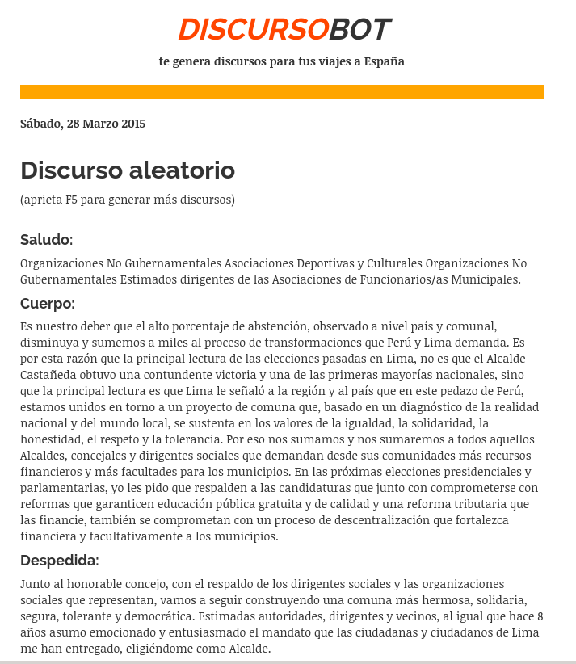

# Discursobot 3000: te elabora discursos aleatorios para tus congresos internacionales en España

Eres alcalde de alguna ciudad capital latinoamericana? El Congreso de tu país
te invita a reuniones y no te tienes tiempo para preparar discursos?
Los discursos que escribes carecen de coherencia y son ininteligible?
Tus discursos improvisados parecen ser mensajes encriptados?

Pues no te preocupes más. En este útero hemos desarrollado un algoritmo conocido
como **DiscursoBot 3000* que te elabora discursos aleatorios ideales para
conferencias internacionales de alcaldes.

Este bot escribe discursos como este:

Si te gusta viajar a España para asistir a más de una reunión, puedes ir a la
[página web de DiscursoBot](http://www.aniversarioperu.me/discursobot/) y cada vez que aprietes la tecla F5 aparecerá un
discurso completamente nuevo!

<http://www.aniversarioperu.me/discursobot/>

Ahora evitarás que se burlen de tus discursos como alcalde. DiscursoBot 3000 es
el producto que estabas esperando!

