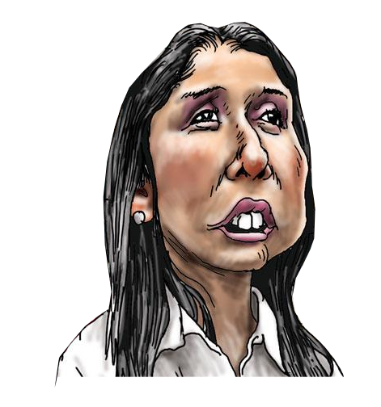

# Estudio de los tuits de los tuiteros de mayor categoría

Los tuiteros de primera categoría son gente importante que debe ser escuchada.
Ya que tienen opiniones de mayor categoría que las del resto de mortales,
estos,
son invitados en diversos medios de comunicación para que puedan iluminarnos
con su pensamiento elegante.

Algunos de estos tuiteros son tan reputados en su pensar que han sido colocados
en puestos cruciales del Estado para que puedan plasmar su pensamiento en
blanco y negro, al dictar sentencias y firmar documentos oficiales.

Es muy provechoso estudiar los escritos que nos han dejado gente significativa
en el transcurso de nuestra historia. 

Por eso, para entender la mente de estos tuiteros y civilizar mi mente al
absorber las reflexiones de estos expertos, analistas y líderes de opinión, he
decidido estudiar sus tuits.

# Te analizo tus tuits
Usando el programa de computadora conocido simplemente como **"t"**, es posible
usar una línea de comandos para descargar los 3200 tuits más recientes de
cualquier tuitero. Por ejemplo para el usuario
[https://twitter.com/ososantillana2](\@ososantillana2)

> t timeline ososantillana2 -n 3200 -l > tuits.txt

Luego de eliminar *stopwords*, es decir, palabras que no llevan ningún
significado como: "para, pero, la, más, aún, etc", eliminé *@mentions* y links
a páginas web. 
Los tuits resultantes pasaron por un pequeño script escrito en el lenguaje
Python para que se construya una
nube de palabras y se pueda visualizar aquellas que son usadas con mayor
frecuencia.

## Tuiteros de primera categoría. @ososantillana2
Leyendo [este post uterino](http://utero.pe/2015/04/08/para-ver-quien-es-quien-una-breve-seleccion-de-algunos-tuits-del-opinante-favorito-de-las-mineras-el-oso-santillana/), me entero que el usuario de tuiter 
**Miguel Enrique Santi** [https://twitter.com/ososantillana2](\@ososantillana2)
es frecuente invitado de programas noticiosos locales.

Luego de correr el script sobre los tuits de **@ososantillana2** sale esta nube
de palabras:

Pero esa imagen rectangular no me gusta. Es posible alterar el script para que
ordene las palabras dentro de alguna imagen de elección aleatoria.

Si uso esta imagen:

Me sale la nube de palabras con aquella silueta:

Vemos que a este usuario le gusta la **izquierda** y la Linterna (?). Además
tiene alguna fijación con alguna **pareja pobre** (!).

## Tuitera @NadineHeredia
Para la dama de mayor categoría, es decir la Primera Dama, podemos usar esta
caricatura de Carlín:

Y la nube de palabras basada en sus tuits (sin incluir retuits) 
nos hace sospechar que le gusta
mencionar a alguien de nombre Ollanta.

## Tuitero @jvillastein
El usuario Javier Villa Stein [https://twitter.com/jvillastein](\@jvillastein)
dice ser Doctor en Derecho y profesor principal de la UNMSM.

En este caso decidí hacer dos nubes de palabras, uno para los tuits propios y
otro para los tuits que este usuario ha hecho re-tuiteado.

Si uso esta imagen:

La nube de palabras basada en tuits propios nos indica que es una persona
muy preocupada por los DDHH de los caviares:

La nube de palabras basada en re-tuits nos indica que si quieres que te
re-tuitee tienes que mencionar las palabras mágicas: **Dr Villa Stein
caviare**.

## Tuitero @PCaterianoB
El tuitero Pedro Cateriano B. es abogado y usando esta imagen:

y los tuits propios su nube de palabras nos indica que debe ser muy amigo de
alguien de **apellido García**.

y es frecuente ver las palabras **Ministro** y **MINDEF** en sus retuiteados:

## Tuitero @eudmed
El tuitero Eugenio D\'Medina es este señor:

el cual aparenta una [fobia en contra de los **no limeños**](http://utero.pe/2015/04/10/son-limenos-los-shipibos-si-no-lo-son-no-tienen-derechos-este-analista-plantea-el-insolito-dilema/).

Si uso esta imagen:

La nube de palabras basada en tuits propios resulta ser bien aburrida:

Asumo que debe ser experto en opiniones sobre política.

La nube de palabras basada en re-tuits es más aburrida aún que mejor no la
pongo.

...

Bueno la pongo de todas maneras:

## Bonus track
También hice nubes de palabras a partir de los tuits de otros trolls:

### Utero.pe
Pare que últimamente el utero.pe ha estado muy emocionado publicando posts
sobre Castañeda. Y por qué no saca posts sobre otros alcaldes? como Villarán?
    Frejolito? Del Castillo? Bedoya? deben ser anti-castañeda.

### Municipalidad de Lima
Los tuits analizados de la Municipalidad de Lima son los de la actual gestión.
Se nota que tuitean bastante sobre Lima, obvio, pero además ha tuiteado con
frecuencia sobre Chosica, muy poco sobre el transporte, y parece que animan a
la gente a participar de algunas de sus actividades. Bueno fuera que animaran a
participar durante las reuniones del consejo.
Pero no tenían que molestarse en enviarme saludos. Gracias!

## Bonus del bonus track
El script en Python para hacer la nube de palabras es una variación del script
publicado por el estudiante de PhD, y gurú del análisis de datos, Sebastian
Raschka. Aquí su página web <http://sebastianraschka.com/>

Este es el script con mis modificaciones:

