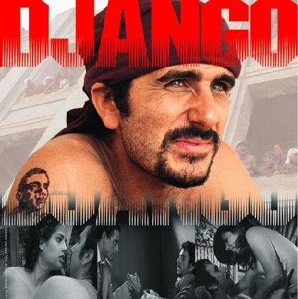
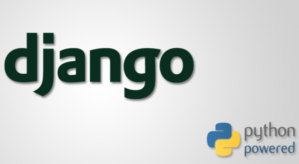
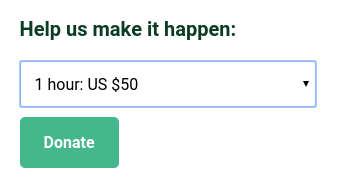
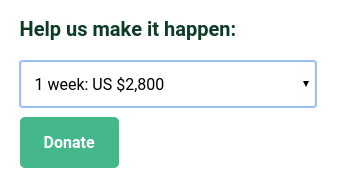

No me refiero a este Django:

Tampoco me refiero a este Django:

Este Django? Tampoco, tampoco:

Me refiero a este Django:

Django es un software de código abierto, escrito en el lenguaje Python, que
sirve para crear aplicativos web.
Está demás decir que el software es de libre uso para cualquier persona sin
tener que realizar pago alguno.

# Los inicios
Había una vez un grupo de periodistas y programadores del periódico
Lawrence Journal-World que estaban algo aburridos. Para matar el rato 
decidieron crear una serie de
herramientas digitales que les permitieran crear páginas webs de manera rápida
y eficiente.
Decidieron nombrar a este software Django, en honor al músico de jazz 
[Django Reinhardt](http://es.wikipedia.org/wiki/Django_Reinhardt).

https://www.youtube.com/watch?v=nS2ylPAUxzA

# Actualmente
Gracias al continuo trabajo de una legión de colaboradores voluntarios,
el proyecto Django
ha llegado a tal nivel de madurez que actualmente es utilizado por sitios web
como Pinterest, Instagram, Mozilla, Disqus, etc.

Django te permite crear páginas webs de manera rápida, conectarlas a una base
de datos para que pueda mostrar datos a los usuarios de manera interactiva. 
Además te permite agregar componentes fácilmente ya que en Django cada
sección del software es modular, reutilizable y asemejan *plugins*.

En este útero hemos usado Django como parte fundamental de varios proyectos: 
- base de datos sobre APDAYC: [Se la llevan fácil](http://utero.pe/2013/10/30/guia-para-intervenir-apdayc/)
- [Manolo buscador de lobistas](http://manolo.rocks)
- la web [DINIleaks](http://dinileaks.utero.pe/about/)

Además, la iniciativa de Hiperderecho y Ciudadanos por respeto
[Proyectosdeley.pe](http://proyectosdeley.pe)
también está hecha en Django.

Sin Django no seríamos nada.

# Django necesita tu ayuda
El desarrollo de Django depende principalmente de voluntarios que se animen a
donar unas horas de su esfuerzo para corregir bugs y proponer mejoras. Pero a
veces este sistema es muy lento y se hace necesario contratar a uno o más
programadores que se ocupen a tiempo completo, por unos meses, a
corregir código, revisar y auditar el código propuesto, liberar nuevas
versiones del software, etc.

La manera que tienen de conseguir dinero es hacer campañas para pedir
donaciones. Esta campaña se llama el Django Fellowship Program que acepta
donaciones de cualquier persona que tenga tarjeta de crédito desde montos de 5
dólares hasta lo máximo que tu tarjeta pueda disponer.
Cada 50 dólares donados se usará para pagarle una hora de trabajo al
programador designado.

Si quieres costear a un programador para que trabaje durante una semana a
tiempo completo puedes donar 2,800 dólares.

Ya que Django ha sido, y será, importante para desarrollo de aplicativos web en
el útero.pe, hemos tratado de devolver algo al proyecto en agradecimiento, 
mediante una donación simbólica en esta página
<https://www.djangoproject.com/fundraising/>.

La gente de Django tuvo la amabilidad de poner el logo uterino en su página de
donantes
<https://www.djangoproject.com/fundraising/>.

# Tanto ganan los programadores? 50$ por hora?
Yo también me he quedado cojudo. Tanto ganan?
Para despejar dudas, me puse a ver uno de los vídeos de la academia de
programación https://devacademy.la/ donde entrevistan a tres programadores que
dan servicios de *freelancing* a empresas en el extranjero. Y me entero que los
programadores capos, que son tan buenos que los contratan las empresas
extranjeras, pueden ganar desde 25$ la hora hasta hasta 80$, o más, por hora!

https://www.youtube.com/watch?v=Hgj19of7iyc&feature=youtu.be&t=8m56s

Mi tarifa como programador siempre ha sido lo mismo que me pagaba la PUCP
cuando fui profesor contratado, 40 soles la hora (antes de impuestos),
aproximadamente 12$ por hora.

Creo que voy a tener que subir mi tarifa.
