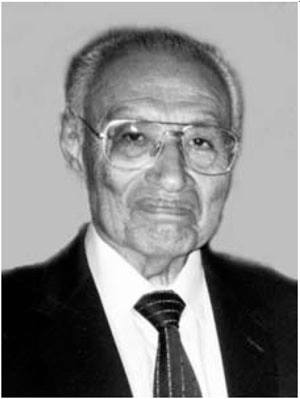
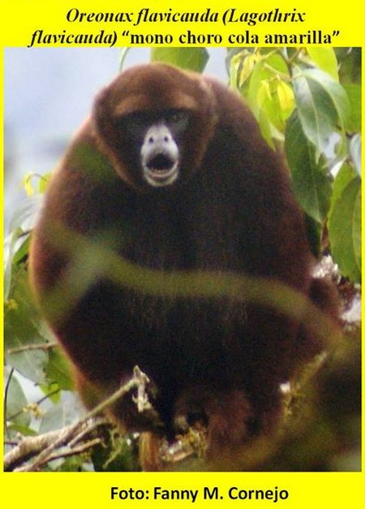
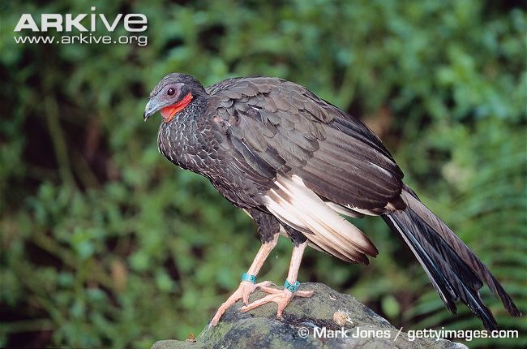

Murió el Blgo. Dr. Hernando de Macedo Ruiz Q.E.P.D.

Escribe la [Dra. Irma Franke en su Facebook](https://www.facebook.com/irmafrankeorn/photos/a.725738530866891.1073741828.725429167564494/774785462628864/?type=1&permPage=1):

> Hemos recibido la noticia del sensible fallecimiento del Dr. Macedo acaecido hace un mes.
> Fue Director del Museo de Historia Natural de la Universidad Nacional Mayor de San Marcos entre 1981 y 1985 y Jefe de la Sección de Aves y Mamíferos de este museo desde 1971. Luego de la división de esta sección fue Jefe del Departamento de Mamíferos hasta su jubilación. En 2002 fue nombrado Profesor Emérito de esa casa de estudios.
> Magnífica persona, un caballero y gran profesor, amerita una más larga revisión su paso por la biología peruana. Personalmente le debo un inmenso agradecimiento por acogerme en esta sección del museo y permitirme desarrollarme en ella para lo cual siempre conté con su incondicional apoyo.
> Hoy se realizará la misa del mes en la Iglesia Santa María Reyna (Ovalo Gutierrez, Miraflores) a las 19:00 horas.

Escribe [Gabriel Ballon Soria en su Facebook](https://www.facebook.com/photo.php?fbid=10205817068618290):

> Hoy me entere con mucha pena del fallecimiento de un gran biólogo peruano el Dr. Hernando de Macedo, sucedido aproximadamente un mes.

> Si algo debo destacar de la etapa que lo conocí, es que el Dr. De Macedo fue un profesor fantástico, recuerdo sus clases de Anatomía Comparada de Cordados, con sus libros abiertos, escritos en alemán, ingles, francés, explicándonos con detalle las tendencias sobre el tema de las distintas escuelas, espectacular!!!!.

> Si bien dentro de sus proezas más notables como investigador se destaca el haber sido redescubridor de especies que se creían extintas, como el “mono choro cola amarilla” *Lagothrix flavicauda* y la “pava aliblanca” *Penelope albipennis*, sus conocimientos en aves, mamíferos, herpetología, paleontología, motivo a muchos a continuar con los trabajos de investigación y al desarrollo de nuestras importantes colecciones en el Museo de Historia Natural.

> Dr. Hernando de Macedo, Descanse en Paz, y mi más sentido pésame a su familia.

## El mono choro cola amarilla

Es mono choro pero no tiene afiliación aprista. Tiene la cola amarilla de
manera natural, no vayas a culpar a Castañeda.

Este mono se pensó extinto desde el año 1926, hasta que el Dr. de Macedo y sus
amixers de la Universidad de Harvard lo encontraron en 1975 en Amazonas.
Encontraron un juvenil que había sido adoptada por unos vecinos. El mono vivía
como mascota.

[Mittermeiera, R.A.; Macedo Ruiz, H.; Luscombea, A. 1975. A Woolly Monkey
Rediscovered in Peru. *Oryx*, 13(01): 41-46.](http://journals.cambridge.org/action/displayAbstract?fromPage=online&aid=4960948&fileId=S0030605300012990)

Actualmente se considera a este mono en peligro de extinción. Felizmente los
amigos de [Yunkawasi](http://www.yunkawasiperu.org/) están trabajando duro para
su conservación.

## La pava aviblanca

Esta ave tiene como nombre científico *Penelope albipennis*. Los biólogos
gustan de usar nombres mitológicos para nombrar a sus especies. En este caso
escogieron *Penelope* en honor a ~Penelope Cruz~ esposa de ~Javier Bardem~
Odiseo.

Y *albipennis*. **Albo** viene del latín *albus* que significa blanco. Y
**pennis** significa pene? No seas mañoso. **Pennis** viene del latín *penna*
que significa pluma.

Entonces la traducción sería que esta ave es la Penélope de plumas blancas. Ese
nombre hace referencia a que las plumas de color blanco en la punta de sus
alas, las cuales sirve para diferenciar a esta especie de otras que están
dentro del género *Penelope*.

Esta ave se describió en el año 1878 y no se le volvió a ver durante los
siguientes 100 años. Se pensó que estaba extinta hasta que fue re-descubierta
por el Dr. de Macedo en 1977.

[de Macedo-Ruiz, H. 1979. ‘Extinct’ Bird Found in Peru. *Oryx*, 15(01): 33-38.](http://journals.cambridge.org/action/displayAbstract?fromPage=online&aid=4969020&fileId=S0030605300016355)

Lástima que no tuve la suerte de conocer al Dr. de Macedo, pero siempre oí
hablar a mis profes muy bien de él. Ya descansa en paz.
