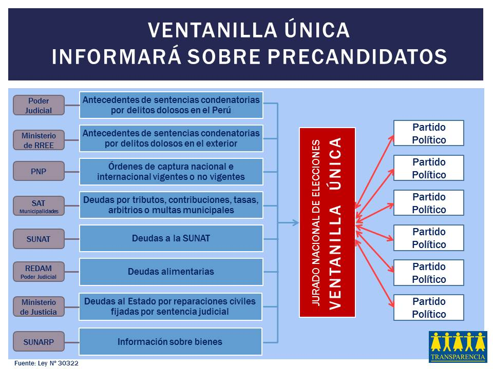
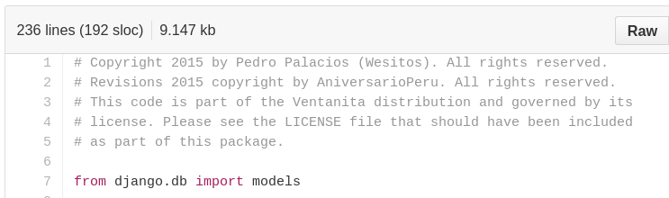
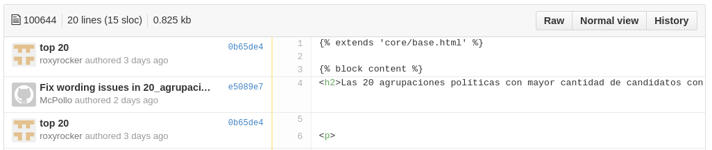
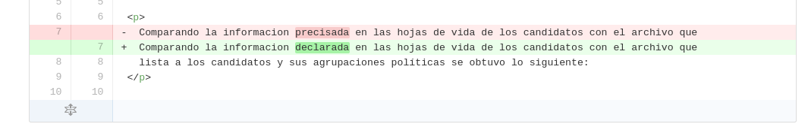
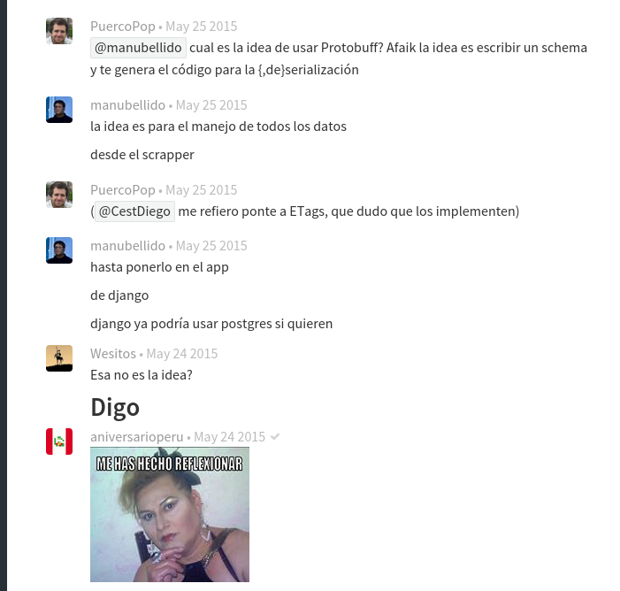

# Ventanita, el nuevo proyecto colaborativo para las elecciones presidenciales 2016

En el año 2014, este blog Utero.pe trabajó en colaboración con la Asociación
Civil Transparencia para examinar y evaluar las hojas de vida de los más de
116 mil candidatos que se presentaron a las Elecciones Regionales y Municipales
2014.
Este fue el [proyecto Verita](http://utero.pe/tag/verita/).

Los resultados fueron alarmantes. Se encontraron [casi 1400 candidatos](http://ventanita.soy/demo/1400_candidatos/)
procesados y sentenciados por una variedad de faltas y delitos:

* homicidio
* terrorismo
* táfico ilícito de drogas
* peculado
* y un largo etcétera.

En [este link](http://utero.pe/tag/verita/) puedes ver todos los posts
relacionados con el tema. Recordar es volver a vivir.

Luego de encontrar tantos delincuentes entre nuestros candidatos, muchos
pensábamos que los partidos políticos deberían hacer una mejor selección de las
personas que acogen en sus tiendas políticas.

Luego se aprovó el proyecto de ley conocido como "Ventanilla Única". Este
sistema tratará de hacer un chequeo de los pre-candidatos y buscará si tienen
sentencias, han cumplido condenas, tienen deudas a la SUNAT, son hinchas de la
U, y otros delitos más.

Se espera que la "Ventanilla Única" sirva como filtro y exponga personas que,
debido a sus roces con la ley, no son idóneas para candidatear y ser
elegidos como servidores públicos.

Chévere entonces la "Ventanilla Única" informará a los votantes y nos ayudará a
escoger mejor? No tanto.

Según la ley, "Ventanilla Única" informará solo a los partidos políticos. No
informará al resto de ciudadanos. Solo nos queda cruzar los dedos y esperar que
los partidos políticos eliminen de sus listas a aquellos candidatos malechores.

## Les presento el "Proyecto Ventanita".

> Queremos una Ventanilla Única disponible para todos, no solo para los partidos políticos.

La información debe ser libre y para todos.
Este proyecto Ventanita intenta ser una versión mejorada del proyecto Verita.
*Verita reloaded*.

Se descargarán diversas bases de datos del Estado peruano. 
Toda la información deberá ser pública y que ya haya sido publicada por alguna
entidad estatal.
Se limpiarán y normalizarán los datos y se generarán cuadros estadísticos
y gráficos que, se espera, sirvan para que los votantes evalúen la idoneidad
de sus candidatos y realicen un voto informado.

## Es un proyecto colaborativo
Hacer este tipo de cosas demanda bastante tiempo y esfuerzo. Hay que programar
algoritmos (*scrapers*) que descarguen los datos de las entidades estatales.
Se necesita programar un *scraper* para cada entidad estatal.
Luego hay que escribir algoritmos que organicen, filtren y crucen la
información descargada.
Por último, hay que programar un sitio web que muestre de manera interactiva
toda esta información al público.

Esto demandará muchas horas de trabajo para programar todo el software. Por eso
estuve pidiendo ayuda por tuiter y Facebook y gracias a San Linus, patrón de
los programadores, mi llamado tuvo eco.

Casi casi por generación espontánea se ha formado el *Ventanita team* que
consiste en 7 programadores (incluyendo una chica):

* AniversarioPeru
* Javier Olaechea
* Sudo
* McPollo
* Pedro Palacios (Wesitos)
* Roxy Rocker
* Vitoko (devsoftx)

De aquellos, no conozco personalmente a ninguno. Incluso tenemos algunos que
prefieren colaborar pero quedar en el anonimato: AniversarioPeru, McPollo y
Roxy Rocker.

## Flujo de trabajo
Estamos programando a Ventanita de manera pública usando la red social Github.
Cada persona se encarga de programar un aspecto diferente de Ventanita y de
subir su código a los repositorios que tenemos en Github.

[En este link encontrarás](https://github.com/ventanita) el repositorio pricipal 
(Ventanita/Ventanita) y tres scrapers que están actualmente bajo construcción.

## Crédito debido
En el proyecto Ventanita creemos que cada colaborador merece que se le reconozca
su trabajo. No importa si el colaborador es anónimo. Por eso, todos los archivos que
contienen código llevan un encabezado detallando qué colaborador es dueño del
copyright:

Si otro colaborador hace correcciones y/o agrega código a ese archivo, el
crédito debido aparecerá de la siguiente manera:

> \# Copyright 2015 by Fulano Mengano. All rights reserved.  
> \# Revisions 2015 copyright by Zutano Perengano. All rights reserved.

Si bien los programadores son dueños del copyright del software. Estamos usando
una licencia permisiva, open source que permite que **cualquiera** pueda
utilizar el software del proyecto Ventanita sin tener que hacer pago alguno.
Estamos usando la licencia [**WTF Public License**](https://github.com/ventanita/ventanita/blob/master/LICENSE).

Otra ventaja de usar la red social Github es que se puede ver al detalle qué
colaborador escribió cada línea de código. Por ejemplo, este código ha sido
trabajado por Roxy Rocker y McPollo.

Explorando el código en Github, podemos enterarnos que Roxy Rocker escribió
un texto para la página web de Ventanita y McPollo corrigió una palabra.

Como ven, se puede saber hasta el más mínimo detalle cada contribución de los
colaboradores.

Este es un grupo abierto. Si tienes ideas, sabes programar, tienes
experiencia programando en Django, o escribiendo scrapers, anímate, colabora y
te agregas a la lista de [colaboradores en este archivo](https://github.com/ventanita/ventanita/blob/master/CREDITS).

## En qué puedes ayudar?
[Aquí tenemos una lista de tareas](https://github.com/ventanita/ventanita/issues) por hacer. 
Están etiquetadas por nivel de dificultad:

* papayita
* masomaso
* bien yuca

También puedes contribuir con ideas, diseños, etc. Tenemos un chat (público)
donde coordinamos todo el trabajo en el proyecto Ventanita. 
[En este link](https://gitter.im/ventanita/ventanita).

Algunos discuten cosas serias y otros solo trolean. Creo que tendremos que
bloquear a aquellos que solo meten vicio.

