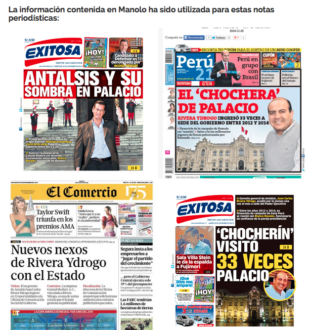
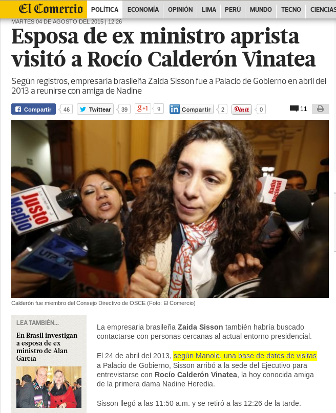
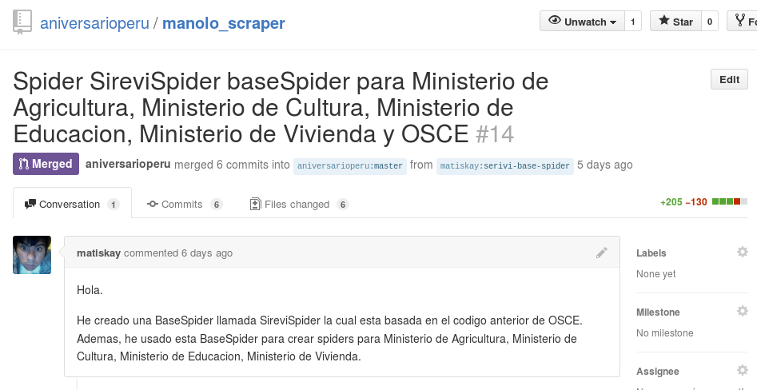
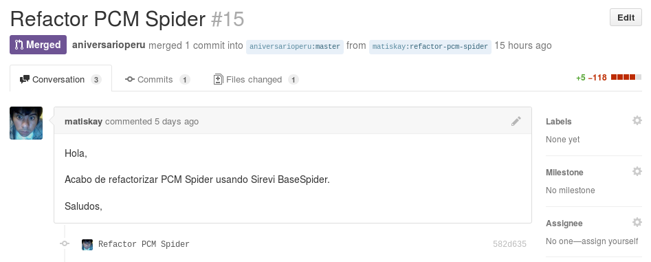
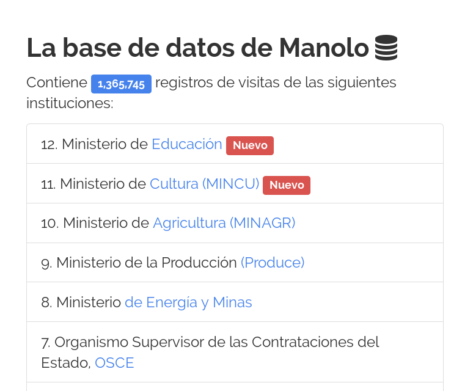
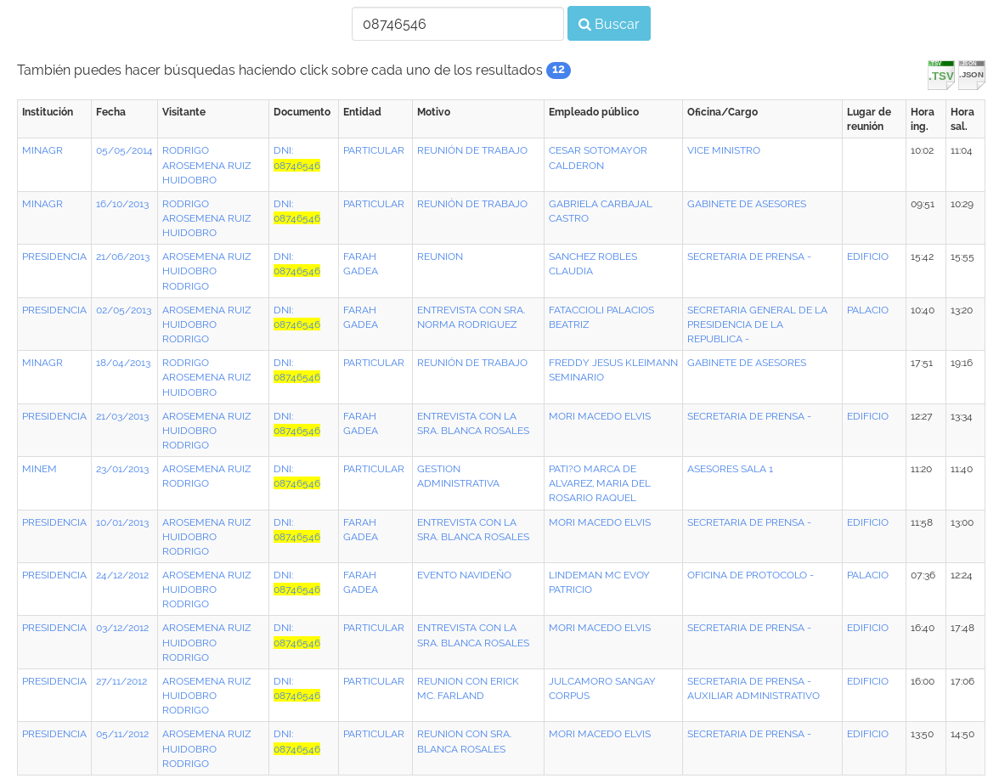
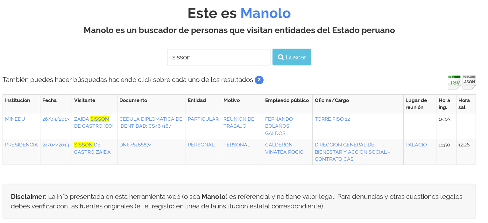

# Manolo se reporta

Seguro ya conoces la **no tan nueva** herramienta
digital denominada "Manolo, buscador de lobistas".

**"Manolo"** es un aplicativo **open source** que se encarga de cosechar los
datos que aparecen en los registros oficiales de las personas que visitan
diversas instituciones del Estado peruano.

## Manolo parece ser de utilidad
Al parecer, Manolo ha sido útil para que periodistas de medios locales
encuentren cosas interesantes.

Por ejemplo gracias a Manolo se pudieron publicar estas portadas:

Y ya van 5 medios periodísticos que por el chat me paran cargoseando para que
incluya más registros de visitas en Manolo.
No quiero mencionar los nombres de estos medios, pero... Utero.pe, El
Comercio, Exitosa, Latina y LaMula, ustedes ya saben a qué me refiero. No?

Periodistas de El Comercio estuvieron rebuscando en Manolo y encontraron que la
señora Zaida Sisson (supuestamente implicada en el caso de corrupción
 #LavaJato, tanto que le allanaron su jato en Brasil) había ido a Palacio a 
visitar a Rocio Calderón, a la amix favorix de Nadine Heredia.

Gracias a El Comercio por citar a Manolo, ya me están comenzando a caer bien.

## Agradezco
Este post tiene como finalidad agradecer la colaboración en este proyecto, de
manera desinteresada de voluntarios.
**El amigo Gustavo B.** nos regaló un potente servidor virtual donde tenemos
alojados a Manolo y todos sus spiders que se encargan de descargar la
información de las webs del Estado.
Este servidor  solo funcionará hasta fin de año y luego tendremos que pasar
sombrero otra vez. Colabórame varón, dama.

También quiero agradecer al amixer [\@matiskay](https://github.com/matiskay) 
(alias Edgar Marca).
**matiskay** es un excelente programador que ha estado contribuyendo con
código. 

Su primera contribución fue esta:

Lo cual se traduce como: **"He borrado casi 100 líneas de tu código y en
simultáneo he creado 5 Manolos"**

Yo pensé que me estaba troleando. Pero era cierto!, **matiskay** es capaz de
crear Manolos
para el Ministerio de Agricultura, Ministerio de Cultura, Ministerio de
Educación, Ministerio de Vivienda y OSCE mientras borra mi código que con tanto
esfuerzo me había costado escribir.

Días después vendría una segunda contribución.

Eso se traduce como: **"He borrado 113 líneas de tu código y ahora Manolo para
PCM está mejor"**

Definitivamente **matiskay**  es un trome.

## Nuevos hallazgos

Gracias al aporte de **matiskay**, el número de registros de visitas en la base
    de datos de Manolo ha  aumentado significativamente. **Antes teníamos 700
    mil, ahora tenemos 1.3 millones de registros de visitas** a instituciones estatales.

Mirando entre las nuevas visitas hemos encontrado algunas cositas que pueden
ser interesantes.

## Rodrigo Huidobro Arosemena Ruiz
Ya sabíamos que el señor [Rodrigo Arosemena había visitado Palacio de gobierno 8
veces](http://utero.pe/2015/07/14/por-que-esta-tan-enojada-nadine-heredia-este-hombre-es-la-respuesta/).

Pero no sabíamos que también se paseaba por el Ministerio de Agricultura y el
Ministerio de Energía y Minas.
Esto me resulta muy extraño ya que yo pensaba que el señor 
Arosemena Ruiz, Huidobro Rodrigo solo visitaba palacio para coordinar fiestas
infantiles para Ollanta y Samín (ver más detalles en [este post uterino](http://utero.pe/2015/07/14/por-que-esta-tan-enojada-nadine-heredia-este-hombre-es-la-respuesta/))

## Zaida Sisson, caso LavaJato
Esto también es nuevo para nosotros. Resulta que la sra. Zaida Sisson visitó el
Ministerio de Educación dos días después de entrevistarse con Rocío Calderón en
Palacio de Gobierno.
Esto significará algo? No sé, es chamba de los amigos periodísticos atar los
cabos, unir los puntos, hacer la conexión, etc.

## Manolo también te puede ser útil
Tal como dice el tío Curwen:

> Manolo, el buscador que le ha causado problemas a más de uno, es un proyecto independiente realizado por un hacker peruano anónimo. Aquí te explicamos para qué sirve y cómo lo puedes utilizar para empezar tus propias investigaciones.

https://www.youtube.com/watch?v=9wWfcA-c10Y

El tío Curwen sabe. Solo nos queda **difundir la información y compartir el
vídeo**.
