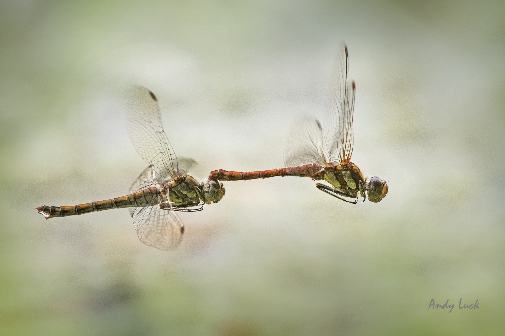

En el día de San Valentín se celebra la amistad, el amor y muchos dan rienda
suelta a sus bajas pasiones cuando ejecutan el ritual en honor al dios 
romano Cupido.

Me pareció adecuado hacer una breve y muy incompleta recopilación de la manera
que tienen algunas especies animales de realizar el acto sexual.

Si estás carente de ideas para este San Valentín quizá puedas encontrar
inspiración en algunos de los ejemplos que paso a detallar.

## Posición del caracol

Muchas especies de caracol son hermafroditas, cada individuo tiene aparato
reproductor masculino y femenino. Cuando dos caracoles tienen una cita de
apareamiento, realizan un complejo y largo cortejo donde se mueven en círculos
uno tras del otro durante horas mientras se tocan sutilmente con sus
tentáculos. Este tipo de cortejo ha sido denominado como **"danza del
apareamiento"** por algunos.

Si bien el cortejo puede parecer tierno, también tiene su parte NSFW. De
improviso ambos amantes extraen de su cuerpo el **dardo del amor** el cual es  
una estructura alargada y dura en forma de lanza que está cubierta de mucus.
Este dardo es un arpón que 
sale con mucha velocidad en dirección de su compañero de faena para tratar
de penetrar su cuerpo en donde sea. Cada contrincante tratará de evitar ser
penetrado por tal arma punzo cortante (el dardo del amor) y solo algunos serán
atravesados.

Luego que la corta batalla de dardos del amor ha terminado, recién ambos
amantes extraerán sus penes para ponerlos en contacto y realizar la
transferencia de esperma de manera recíproca. Sí, se penetran dos veces.

Se cree que la función del **dardo del amor** es introducir el mucus en el
cuerpo de su oponente para que las sustancias químicas de este estimulen el
aparato reproductor femenino de los amantes y hagan que el esperma que van a
recibir sea almacenado y utilizado en la producción de huevos.

Se cree que si los caracoles reciben esperma de varios amantes, ellos pueden
escoger cuál esperma es utilizado para fecundar sus propios huevos, dejando el
esperma de varios galanes de lado.

Se han hecho estudios donde se sabe que al caracol no le conviene ser penetrado
por tal **dardo del amor**. Esta penetración deja una herida en alguna parte
del cuerpo del animal, la cual necesita ser reparada y regenerada. Se sabe que
los caracoles que son penetrados llegan a vivir menos tiempo que los caracoles
pendex que copulan y no se dejan penetrar por **dardos del amor**.

Pero mira pues, tal dardo parece una lanza de guerra, de hecho tiene que doler:

#### Más info:
* [Being Stabbed with a Mucus Dagger Is Not Even the Worst Part of Snail Sex](
http://blogs.discovermagazine.com/inkfish/2015/03/13/being-stabbed-with-a-mucus-dagger-is-not-even-the-worst-part-of-snail-sex/#.Vr9N6HUrLBS)

## Posición de la libélula
Si te sientes acrobático puedes fijarte en esta.

Fuente Wikipedia.

La libélula es un animal depredador que se alimenta de insectos pequeños. Tiene
unos ojos grandes que le permiten verte mejor. Tiene unas alas muy grandes para
poder volar mejor (y maniobrar mejor cuando está de cacería).

La cópula de la libélula es complicada y requiere mucha preparación. Estas
especies son territoriales y una vez que un macho ha tomado posesión de un
sector del hábitat, tiene que espantar a todos los otros machos de su
territorio. La hembra al ver esto se acercará al macho con malas intenciones
(con intención de copular).

Cuando el macho detecta que tiene atractivo (o sea que hay una hembra dispuesta),
antes que comienza la cópula, tiene que eyacular su esperma desde sus genitales
que están en el extremo posterior de su abdomen. Tiene que tener cuidado que su
esperma no se desperdicie ya que tiene que colectar todo lo eyaculado y
almacenarlo en su aparato genital secundario que su está en la base de su
abdomen.

Luego de esto, recién el macho está dispuesto a dar batalla. Comienza por
maniobrar rápidamente tras la hembra y cuando pasa volando directamente sobre 
ella despliega unas tenazas del extremo de su abdomen que usa para atrapar a la 
hembra, la atrapa por el tórax, y sigue el vuelo. Es común ver al macho y
hembra volando en tándem.

Fuente foto: https://wildopeneye.wordpress.com/2014/05/19/tales-from-the-riverbank-damsels-dragons-nymphs-and-the-floods/

Luego de volar un rato el macho se posará en alguna ramita para comenzar la
transferencia de esperma. La hembra, aún estando agarrada por el macho,
    levantará y aproximará el extremo posterior de su abdomen para que sus
    genitales hagan contacto con el esperma que tiene el macho acumulado en sus
    reservorios en la base del abdomen.
Así quedarán un rato mientras terminan de transferir las células sexuales. Es
    común verlos en esta posición cuando los amantes forman con sus cuerpos un
    corazón, demostrando así que se aman de verdad.

Fuente foto: https://singaporeodonata.wordpress.com/category/macritchie-nature-trail/

#### Más info:
* [Berger, C. (2014) Dragonfiles](https://books.google.com.pe/books?id=oxRD1gAkVVsC&pg=PA36&dq=dragonfly+mating&hl=en&sa=X&ved=0ahUKEwj8meqtkPXKAhXHTSYKHSd1DmYQ6AEIGzAA#v=onepage&q=dragonfly%20mating&f=false)

## Posición del chinche de la cama

By Content Providers(s): CDC/ Harvard University, Dr. Gary Alpert; Dr. Harold Harlan; Richard Pollack. Photo Credit: Piotr Naskrecki - http://phil.cdc.gov/phil, Public Domain, https://commons.wikimedia.org/w/index.php?curid=2119254

El chinche de la cama, *Cimex lectularius*, es un insecto considerado plaga de
hoteles y hospedajes de mala muerte. Se reproducen por montones en las
hendiduras de los colchones y salen de noche a picar a los humanos durmientes
con el fin de alimentarse de su sangre.

Los chinches de la cama practican lo que se denomina como **inseminación
traumática**. Este tipo de fecundación funciona así: el macho penetra la pared
del abdomen de la hembra con su pene e inyecta su esperma en la cavidad
abdominal de la hembra. Los espermatozoides se mezclarán con la sangre del
insecto hembra (hemolinfa en este caso) y vía el torrente sanguíneo
eventualmente llegarán a los ovarios y ejecutaran la fertilización de óvulos.

La **inseminación traumática** ha evolucionado independientemente en varias
especies de invertebrados pero se desconoce aún la ventaja evolutiva de tal
adaptación.

En la foto se ve la hembra arriba y el macho abajo penetrando a la hembra a
    través de su abdomen. Nótese la ruptura del exoesqueleto en el punto de
    penetración.

Fuente foto Wikipedia

## Posición del choro

Si estás cansado y no quiere gastar muchas energías te puedes inspirar en el
choro.

Los choros son una especie de moluscos bivalvos que tienen estado de vida sésil,
o sea nunca se mueven en estado adulto.

Cuando llega la hora de la reproducción, los choros machos y hembras liberan su
espermatozoides y óvulos al agua con la esperanza que ambos gametos se
encuentren en el mar y ocurra la fecundación. Cuando esto ocurre el óvulo
fecundado se convertirá en larva veliger que nadará y nadará hasta encontrar un
lugar sólido para establecerse, convertirse en adulto y repetir todo el ciclo
de vida.

Lo bueno es que estos choros machos y hembras viven muy cerca unos de los
otros, entonces hay harta probabilidad de fecundación si todos liberan sus
gametos al agua en simultáneo. Así que cuando nades en el mar no abras mucho la
boca, no te vayas a tragar algunos de estos gametos y malograrle la
reproducción a estos choros.

#### Mas info (y vídeo del mismo acto, SFW) <http://biotechlearn.org.nz/focus_stories/farming_green_lipped_mussels/video_clips/how_mussels_spawn>

## Posición del pez payaso
Los peces payaso incluyen varias especies que viven en mutualismo con las
anémonas. Quizá la especie de pez payaso más conocida sea 
*Amphiprion ocellaris* ya que fue personaje principal de la película **Buscando
a Nemo**.

Al igual que los choros, estos peces también tienen fertilización externa,
macho y hembra liberan sus gametos al medio acuático y por lo tanto no necesita
ocurrir cópula ni penetración.

Lo interesante en estos peces es que son **hermafroditas secuenciales**. 
En un grupo determinado solo se reproducen el macho y hembra dominantes. Si la
hembra dominante es removida del grupo, el macho dominante cambia de sexo y se
vuelve hembra dominante (dominatriz dirán algunos) mientras que el resto de
machos de suben un escalón en la jerarquía.

Es probable que nuestro amigo Nemo, cuando sea adulto y si es agresivo y
dominante, se convierta en hembra. Espero que esta parte de la historia de vida
de estos peces sea retratada en la próxima secuela de Pixar, **buscando a
Dori**.

Los peces son amigos no comida.

By <a href="//commons.wikimedia.org/wiki/User:Nhobgood" title="User:Nhobgood">Nhobgood - Nick Hobgood</a> - Own work, <a href="http://creativecommons.org/licenses/by-sa/3.0" title="Creative Commons Attribution-Share Alike 3.0">CC BY-SA 3.0</a>, https://commons.wikimedia.org/w/index.php?curid=5616409
