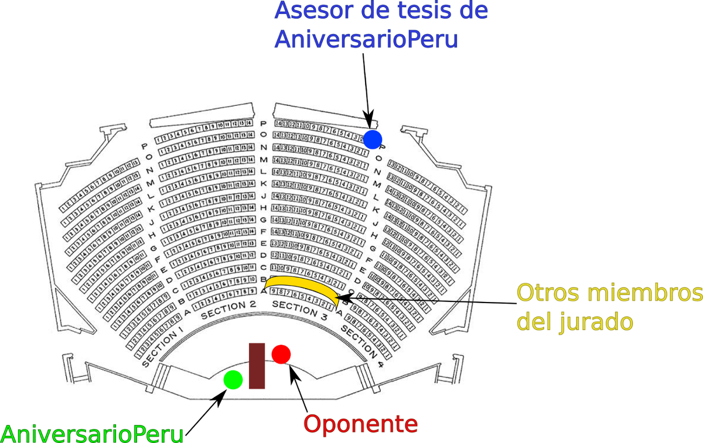

Las defensas de tesis en mi programa de doctorado tienen una estructura algo
diferente a las que uno como peruano puede estar acostumbrado.

Cuando sustenté mi tesis de biólogo en la UNMSM, expuse mi tesis por 40
minutos, luego vinieron 10 minutos de preguntas donde cada miembro del jurado
hizo una pregunta y 5 minutos de deliberación por los miembros del jurado donde
decidieron si aprobar o desaprobar la tesis.
Además, siempre uno los miembros del jurado es tu propio asesor de tesis, y se
espera que te haga una pregunta que puedas responder sin problemas. Fue roche
el mio cuando, por nervios, no pude responder la pregunta de mi
asesor. #EPIC #FAIL.

Yo pensaba que los Europeos eran cojudos por tener un sistema de defensa de
tesis tan particular:

- El tesista hace una exposición muy somera de su trabajo durante **5 minutos**.
- El oponente expone con más detalle el trabajo del tesista, tratando de
ponerlo en un contexto mayor y generalizando los resultados para que calcen en
el conocimiento actual del área de estudio. El oponente está en capacidad de
hacerlo ya que se supone que ha estudiado la tesis al derecho y al revés.
Además se recomienda que haga su exposición de tu tesis median una
presentación en PowerPoint.
- Se espera que el oponente se demore entre 20 y 30 minutos en exponer la tesis
del tesista.
- **Discusión durante aproximadamente 2 horas** entre oponente y tesista. Se supone que es un
diálogo alturado y académico donde el oponente hace todo tipo de preguntas
respecto al trabajo contenido en los 4 capítulos de la tesis. Pero en realidad
más parece una carnicería donde el tesista es flaglado con preguntas hasta que
pida perdón por haber nacido.
- Para terminar, ronda de preguntas por los miembros del jurado (1 pregunta por
 cabeza).

<iframe width="100%" height="300" src="//jsfiddle.net/aniversarioperu/zwcq9g6L/embedded/" allowfullscreen="allowfullscreen" frameborder="0"></iframe>

Cuando vi este sistema de tesis la primera vez yo pensaba:

> Qué cojudos, así no vale pe, el tesista solo expone su tesis por 5 minutos?  Se la lleva fácil.

Conforme pasaba el tiempo y asisitía a defensas de tesis de mis amixeres le iba
encontrando el chiste al asunto.
Se supone que la defensa de tesis debe consistir en la habilidad del tesista en
demostrar que puede sustentar las dicisiones que tuvo que tomar como estudiante:

- Sustentar si el diseño experimental que empleó fue el correcto.
- Defender el porqué uso tal método de análisis de datos, considerando los pros
y contras.
- Defender sus resultados a pesar de los posibles vacíos de información.
- Defender tus conclusiones a pesar que el oponente dice que puedes estar
equivocado. Defenderlas a pesar te dicen que no pueden ser robustas o 
que hayan aparecido mejores datos y/o métodos con el paso del tiemp.
- Defender tu trabajado de tesis cuando el jurado/oponente se ponen en modo
"troll" y te dice que tu trabajo es basura.

En realidad tu trabajo no es basura solo que ellos quieren ver qué argumentos
usas para defender tu tesis.

Creo que el objetivo principal es averiguar si el trabajo de tesis lo has hecho
realmente tú. Sobre todo quieren saber si hicieste al trabajo con fundamento,
          luego de evaluar métodos y procedimientos alternativos. 
**Quieren pillarte en el caso que hayas usado tales métodos por que "tu asesor
te dijo"**.
Eso sería lo peor y ameritaría desaprobación te tu tesis.

Debe ser por eso que se concentran en darle más tiempo al oponente para que
haga preguntas por casi 2 horas, sin descanso, sin piedad. Se supone que este
método de evaluacion es mejor que cuando el tesista da una charla de media hora
y solo recibe 1 pregunta de cada miembro del jurado.
Allí se estaría evaluando la capacidad de aprenderse un discurso
y desenvolverse satisfactoriamente en un estrado. Se daría mayor énfasis a la
capacidad pedagógica del tesista.

# El caso del resto de miembros del jurado
Yo andaba tan emocionado con la llegada del oponente que me había olvidado por
completo del resto de miembros del jurado!
Felizmente uno recibe ayuda y mi asesor y co-asesor habían coordinado todo.
Resulta que son cuatro los miembros del jurado y más el oponente hacen un total
de cinco verdugos.
La facultad también hace una revisión del historial de estas personas que deben
ser profesores de otras universidades. Está de más decir que deben ser
Doctores. Sin bien no es exigencia que sean profesores de universidades en el
extranjero, es necesario que no sean profesores de la misma universidad que te
dará el PhD. En última instancia es aceptable máximo uno sea de tu universidad
pero de otra facultad.
En mi caso uno de los miembros del jurado que se consiguió era de mi
universidad pero perteneciente al museo botánico. Otro de mi jurado venía de un
país cercano y había llegado a la ciudad por barco, la noche anterior.
Los otros dos jurados venían de universidades del norte del país. De mi 
misma facultad fue una profa que estuvo actuando de miembro jurado suplente en
caso algún jurado fuera falla y no llegara a tiempo a la defensa. Pero no se
requirieron de sus servicios.

# Tomen asiento en el auditorio
Mi defensa de tesis fue en esos auditorios con capacidad para 300 personas, con
butacas distribuidas en filas escalonadas a manera de mini coliseo.
La defensa es pública y van tus compañeros, mayoría de profes de la facultad,
amigos, familiares, chismosos, sapos, etc.

**Se ubican en el estrado el oponente y el tesista**, sentados en la misma mesa
pero en lados opuestos, mirándose cara a cara, dispuestos para un debate sin
cuartel, a calzón quitado.
El oponente y tesista son los actores principales del show y todos los
reflectores apuntan hacia ellos dos.

**El miembro del jurado se sienta en segunda fila** al frente del estrado.
Ellos deben observar el espectáculo y evaluar el desempeño, no solo, del
tesista, también evalúan el desempeño del oponente.
Evalúan la calidad de preguntas del oponente así como la calidad de
respuestas del tesista. Ellos son como el jurando de un encuentro de box, donde
se encargan de anotar y llevar la cuenta del puntaje de los contrincantes.

Siempre es difícil de encontrar al asesor del tesista. En la UNMSM mi asesor se
sentó al costado del jurado. En mi defensa doctoral, mi asesor se sentó en la
esquina más lejana posible del auditorio. Luego de un rato lo pude ubicar y vi
como se escondía detras de las butacas. 

Pro-tip: eso no funciona como apoyo moral a tus tesistas.

## Estrés y memoria
He demorado en escribir esta parte de la historia debido a que no recuerdo
mucho de lo acontecido.
He estado preguntando a varios colegas y no son pocos los que no pueden
recordar lo ocurrido durante sus respectivas defensas de tesis. En mi caso
puedo recordar con mayor detalle mi defensa de tesis de biólogo pero por alguna
razón me es difícil recordar la defensa de tesis doctoral.

Hay [estudios que indican que en situaciones de profundo estrés](http://www.sciencedirect.com/science/article/pii/S1074742702940803) se secretan
hormonas al torrente sanguíneo que afectan la memoria.
Se cree que estas hormonas afectan la consolidación de eventos en la memoria y
su posterior recuperación.
Mi asesor me dice que en su caso no recuerda nada de nada, que él borró
casette. Yo al menos recuerdo algo.

## Y llegó la hora
A eso de las 9:30am me dirigí hacia el auditorio acompañado del oponente y
asesor. Hicimos prueba de sonido y verificamos que la computadora del oponente
funcione con el proyector de PowerPoint.
En esos momentos aparecieron los cuatro miembros del jurado, cada uno con una
copia de mi tesis bajo el brazo, y tomaron sus posiciones.

**9:50am** entra la audiencia al recinto, mis amixeres del doctorado, profes de la
facultad y uno que otro chismoso.

**9:55am** entra la secretaria de la facultad corriendo con un ramo de flores
  hermoso dentro de un gran florero y lo pone sobre la mesa, a mi lado
  izquierdo. Risas en el auditorio. Me hizo ruborizar.

**9:57am** otra vez entra la secretaria corriendo, esta vez trayendo vasos y latas
  de agua mineral, para mí y el oponente.

**10:01am** el decano de la facultad cierra la puerta del auditorio y hace las
   presentaciones respectivas. Me invita a pasar al estrado a sustentar mi
   tesis. 
   Mi presentación de PowerPoint solo tiene 5 diapositivas.
   Expongo mi tesis de manera muy superficial por 5 minutos. En realidad solo
   se hace una presentación del grupo taxonómico de estudio.

**10:10am** le doy pase al oponente para que realice **su exposición de mi tesis**.
   El oponente se manda con una exposición interesante de los tres primeros
   capítulos de mi tesis diciendo que el cuarto es muy técnico y seguro no le
   alcanzará tiempo para exponerlo.
   El oponente logra su objetivo de coger la sustancia de mi tesis y ponerlo en
   un contexto mayor. Logra hacer encajar mi tesis como si fuera una pieza de
   aquel rompecabezas incompleto que conocemos como conocimiento de la historia
   de vida de pajaritos neotropicales.

**10:40am**
   El oponente termina de exponer y me pregunta si estoy satisfecho con su
   descripción de mi trabajo de tesis.

   > - Sí ta bien.

Mientras dice "entonces pasamos a la sesión de preguntas y discusión" me mira
con esta cara:

Yo comienzo a sudar frío.

**10:45am** comienza la masacre. El oponente comenzó con preguntas suaves.
Preguntas de introducción al tema como el número de ejemplares utilizados en
los análisis, número de caracteres utilizados, etc. Pero luego se puso en modo
chuqui, sacó su látigo y me comenzó a flagelar.

Me peguntaba cosas como esta:

> - Tú has usado este método en el capítulo II. Todos sabemos que ese método
produce resultados subóptimos en algunos casos. Crees que hiciste bien en usar
ese método? 
> - Sí
> - Queeeee? Estás seguro que hiciste bien? No hubiera sido mejor que uses este
otro método?

En ese momento mil pensamientos pasan por mi mente. *"Yo creo que hice bien. 
No puede ser que me haya equivocado tan feo. Hmm, ya tengo hambre. Pero yo
revisé los fundamentos del método y no debería tener comportamiento aberrante
con mis datos. Creo que hice bien. Pero el oponente me dice que me he
equivocado. Quizá me quiere engañar. Hmmm pero tiene cara de póker, no sé si me
está mintiendo. Pucha, esto recién comienza y ya me puso en apuros. Y si me
equivoqué realmente? digo que me he equivocado? Pero ese capítulo ya fue
publicado años atrás y ha sido citado muchas veces sin recibir críticas. Y
ahora qué respondo?"*

Yo pensaba que mi trabajo de tesis era sólido ya que me había asegurado de
ponerle buenos cimientos al examinar todos los métodos disponibles y utilizar
el más adecuado.
Y ahora viene este profe y con una sola pregunta se ha tumbado mis cimientos y
me ha dejado desmoroando en el piso. 

En ese momento entendí como debe sentirse una rata acorralada en una esquina de
la casa cuando vienes para darle en la cabeza con un escobillón.

También en ese momento logré entender lo que significa la frase ***stick to
your guns***. Solo me quedaba confiar en que había hecho lo correcto y no
dejarme vencer. Debía poner pies firmes y devolver los disparos mediante la
justificación de mis decisiones y elección de metodologías y procedimientos
durante el trabajo de tesis.

Debía usar esa estrategia de fundamentar mis decisiones a menos que me de
cuenta que haya caído en error. Uno nunca está libre de errar y es bueno
reconocer haberse equivocado si fuera el caso.
Pero uno no debe dejarse manipular por el oponente y aceptar falta cuando uno
sabe que actuó de manera correcta.

**11:45** Ya había pasado una hora de discusión con el oponente donde me
esforzaba al máximo en defender mi elección de metodologías, uso de datos,
discusión y conclusiones de cada capítulo de mi tesis.
Tanto era el nivel de estrés que ya me sentía agotado.
En un momento que tomé un poco de agua llegué a alcanzar con la mirada a mi
asesor y pensé en  hacerle señas con las cejas para que de una vez tire la
toalla. 

<object width="425" height="344"><param name="movie" value="http://swf.tubechop.com/tubechop.swf?vurl=rPd7vyrRQ1Y&start=846&end=858&cid=5692101"></param><embed src="http://swf.tubechop.com/tubechop.swf?vurl=rPd7vyrRQ1Y&start=846&end=858&cid=5692101" type="application/x-shockwave-flash" allowfullscreen="true" width="425" height="344"></embed></object>
que alguien ayude a AniversarioPeru!

**12:40pm** "el oponente mira el reloj en la pared y dice. Aún tengo más
preguntas para hacerte pero me indicaron que solo tenía 2 horas disponibles y
ya se cumplieron".

**12:41pm** el decano dice "que alguien recoja a AniversarioPeru para que
comience la ronda de preguntas por los miembros del jurado".

Tengan piedad!

**12:50pm** las preguntas de los tres primeros miembros del jurado fueron
sencillas. Solo quedaba una última pregunta del último miembro del jurado. Yo
pensaba *resiste que en 5 minutos más todo habrá terminado*.

Pero no. Este miembro del jurado tenía otros planes. Empezó a bombardearme con
preguntas las cuales yo me esforzaba en responder. Trataba de encajonarme al
clamar haber encontrado serias fallas en uno de los capítulos de la tesis. Yo
esquivaba los ganchos y devolvía *jabs*.
Hasta que finalmente me dice:

> - Yo creo que tus datos son basura, tus análisis son basura. Tu crees que se
debe tener esta clase de basura en una tesis doctoral?

En retrospectiva, luego de tantos años transcurridos, ahora sé que ese jurado
me quería dar el golpe final. Él quería destruirme al hacerme creer que mi 
trabajo era basura. 
Él estaba esperando que defienda me trabajo con fundamentos y trate de
demostrar que mi trabajo no era basura.

Quería hacerme experimentar lo que es una **defensa de tesis**.

