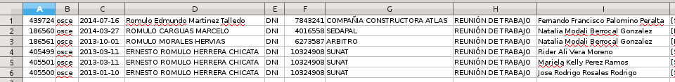
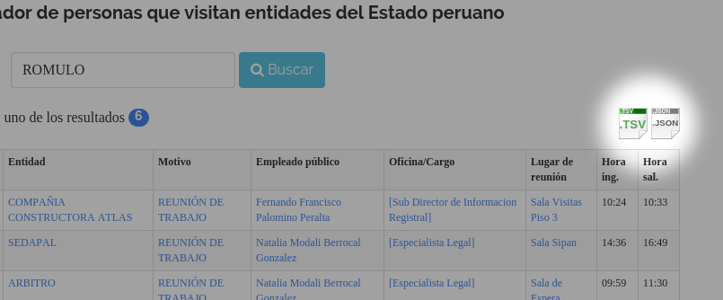

# Manolo, buscador de lobistas abre sus datos

Ustedes ya conocen a ["Manolo, buscador de lobistas"](http://manolo.rocks), quien ha servido para
encontrar numerosas visitas de alias Chocherín, 
["financista de Ollanta Humala y socio del prófugo Martín Belaunde Lossio"](http://utero.pe/2014/11/24/exclusivo-chocherin-el-socio-de-martin-belaunde-visito-palacio-de-gobierno-33-veces/),
a personal personal que trabajaba en Palacio de Gobierno:

[EXCLUSIVO: "Chocherín", el socio de Martín Belaunde, visitó palacio de gobierno 33 veces](http://utero.pe/2014/11/24/exclusivo-chocherin-el-socio-de-martin-belaunde-visito-palacio-de-gobierno-33-veces/)

Manolo es un bot que visita los portales de transparencia de las instituciones
peruanas, descarga los registros de visitas que están obligados a tener por
ley, y los acumula en una base de datos para que estén disponibles a través de
un buscador amigable al público en general.

He notado que medios de prensa escrita han utilizado "Manolo" para obtener
información y armar sus notas periodísticas. Y está bien! por esa razón Manolo
es de libre uso. A veces citaron a Manolo y a mí como "fuentes" y a veces no.
Pero no importa, no me molesto, tanto.

Estos medios han usado "Manolo" sin pagarme un solo céntimo. Pero no importa!
No pretendo cobrar ni una mandarina a los usuarios de "Manolo".
Todo lo he financiado de mi bolsillo.

Tengo algunas ideas para implementar en "Manolo" pero el factor limitante es el
servidor tan pequeño donde lo tenía alojado (con solo 512Mb de RAM).
Es por eso que hace poco hice un llamado en Tuiter por donaciones al proyecto
"Manolo" para pagar algunos gastos principalmente, y qué creen... mis llamados
fueron escuchados.

El amixer Gustavo Beathyate, 
[\@goddamnhippie](https://twitter.com/goddamnhippie),
vino al rescate y **donó un potente servidor virtual en Joyent con crédito para 2
años!**
Entonces he podido implementar una mejor base de datos (PostgreSQL) con datos
totalmente indexados (usando elasticsearch). Por eso, ahora "Manolo" es tan
rápido para devolver resultados de búsqueda.

# Datos abiertos
Sí bien "Manolo" ofrece datos que son entendibles a humanos, es necesario que
los datos también estén disponible en un formato que sea entendible a
computadoras.
Todo portal de datos abiertos que se respete debe tener esta capacidad. 

Por eso me complace en anunciar que la versión 2.4.0 de "Manolo" ahora tiene un
[API](http://manolo.rocks/api/) donde se describe la manera en que puedes
obtener los datos en formato TSV y/o JSON.
Esto te permitirá procesar rápidamente la información
para que puedas hacer cálculos estadísticos, gráficos, etc.

## Formato TSV
Si quieres obtener los datos listos para importar a Excel puedes
descargarlos en **formato TSV** (con las columnas separadas por Tabs).
Solo es cuestión de agregar `&tsv` a los resultados de búsqueda.

**1. GET** <http://manolo.rocks/search/?q=ROMULO&tsv>

Devuelve hasta 20 resultados al buscar visitas con la palabra ROMULO en
formato TSV, listos para importar a MS Excel:



**2.** También puedes hacer click sobre los íconos TSV y JSON en la
página de [resultados de búsqueda](http://manolo.rocks/search/?q=ROMULO).



## Formato JSON
Se acostumbra usar el **formato JSON** el cual puede ser importado por
herramientas como OpenRefine para hacer limpieza y normalización de
datos. Luego es posible exportar los datos desde OpenRefine a otros
formatos como CSV, TSV, MS Excel, etc. Solo es cuestión de agregar
`&json` a los resultados de búsqueda.


**3. GET** <http://manolo.rocks/search/?q=ROMULO&json>

Devuelve hasta 20 resultados al buscar visitas con la palabra ROMULO en
formato JSON:

``` {.pre-scrollable}
[
    {
        "id": 439724,
        "sha1": "f33806f07941011109c822ba4e04caaf71c35a9d",
        "full_name": "Romulo Edmundo Martinez Talledo",
        "entity": "COMPANIA CONSTRUCTORA ATLAS",
        "meeting_place": "Sala Visitas Piso 3",
        "office": "[Sub Director de Informacion Registral]",
        "host_name": "Fernando Francisco Palomino Peralta",
        "reason": "REUNION DE TRABAJO",
        "institution": "osce",
        "location": "",
        "id_number": "07843241",
        "id_document": "DNI",
        "date": "2014-07-16",
        "time_start": "10:24",
        "time_end": "10:33"
    },
    {
        "id": 186560,
        "sha1": "6a181af4414d6c6040901d6a8ec3a21ff4fe842c",
        "full_name": "ROMULO CARGUAS MARCELO",
        "entity": "SEDAPAL",
        "meeting_place": "Sala Sipan",
        "office": "[Especialista Legal]",
        "host_name": "Natalia Modali Berrocal Gonzalez",
        "reason": "REUNION DE TRABAJO",
        "institution": "osce",
        "location": "",
        "id_number": "04016558",
        "id_document": "DNI",
        "date": "2014-03-27",
        "time_start": "14:36",
        "time_end": "16:49"
    }
]
```

**4. GET** <http://manolo.rocks/search/?q=ARBITRO&page=2&json>

Devuelve siguientes 20 resultados (del 21 al 40) al buscar visitas con
la palabra ARBITRO en formato JSON. Puedes ir incrementando el número de
página para poder descargar todos los resultados. La próxima versión del
*rest\_framework* (3.1) incluirá mejores herramientas para incluir el
campo "next" en los resultados.

Ahora puedes disfrutar de lo lindo descargando datos de "Manolo" 
en formato JSON y TSV.

Y como siempre todo el código fuente de Manolo es *OpenSource* y pude ser
descargado de aquí: <https://github.com/aniversarioperu/django-manolo>
