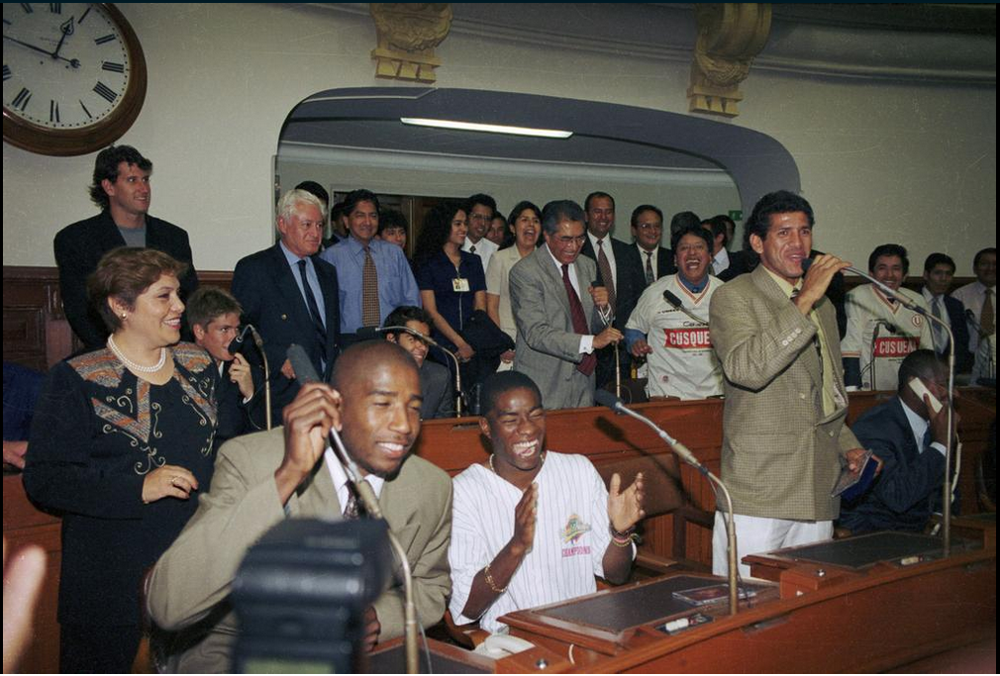

# Otorongo_pics, nuevo bot in-da-jaus

    
A mediados del 2014, el Congreso peruano puso a disposición pública su archivo
fotográfico. Miles de fotos históricas que puedes rebuscar en esta página
<http://fotografia.congreso.gob.pe/Wf_ListadoFotografico.aspx>.

Es digno de aplaudir tal iniciativa de la gente del Congreso. Especialmente a
los fotógrafos y a quienes se dieron la magna tarea de digitalizar,
contextualizar y anotar miles de fotos.

Y esta es parte importante de la excelente chamba del Congreso: anotar los
congresistas presentes en cada foto, la fecha en que se tomó la foto, y el
contexto.
Lo malo es que el [buscador](http://fotografia.congreso.gob.pe/Wf_ListadoFotografico.aspx) no busca en la totalidad de estos metadatos. 

Es excelente que las fotos estén disponibles en alta resolución. Cada foto
ocupa entre 2 y 3 Megabytes de espacio. Entonces, aún teniendo conexión de
Internet rápida, se hace bastante pesado examinar las fotos. No existe la
posibilidad de verlas en formato más pequeño (*thumbnails*).

# Sergio salva el día
Hasta que llegó el amixer Sergio Mejía, de la FISI-UNMSM. Sergio me envió
un email adjuntado los metadatos de casi 15 mil fotos, incluyendo las
direcciones URL de las fotos.

Serio me cuenta cómo le hizo para conseguir los datos:

> Analicé la ruta de una búsqueda, por ej. la foto del día 12/12/2014 y
> la comparé con la ruta de la imagen y vi que tenían relación.
> Encontré un patrón de cómo estaba guardada la imagen y cómo se generaba
> la página con los metadatos y era posible automatizar la descarga.
> Dejé mi PC prendida toda la noche para descargar.

# Nace un bot
Y ahora qué hacer con estos metadatos? Cómo hacer para visibilizar las fotos
del archivo del Congreso? para que lleguen a más usuarios y posibles
interesados en la historia de los especímenes de la
[*Panthera onca*](http://es.wikipedia.org/wiki/Panthera_onca) (otorongo).

Se me ocurrió programar un bot para Twitter que elija de manera aleatoria una
foto del archivo del Congreso y la haga pública mediante un tuit. 
Así que con
unas cuantas líneas de código en Python, una cuenta de Twitter creada,
y configurada para que funcione como un app, por
[Ernesto Cabral](http://utero.pe/author/ernestocabral/) ya tenemos nuevo bot.

Presento a [@Otorongo_pics](https://twitter.com/otorongo_pics):

@Otorongo_pics es un bot con horario de atención de 7:00am hasta la media
noche, de Lunes a Domingo. Cada media hora tuitea una foto del Congreso. Cada
tuit incluye el año, un breve texto y el link hacia la página original del
Congreso para que veas los metadatos completos, incluyendo los créditos del
fotógrafo.
Lamentablemente tanto texto no entra en un tuit.

El avatar de esta cuenta de Twitter incluye la foto de un robot que vino al
Perú y se instaló a sus anchas en la presidencia del Congreso:

Ahora puedes darle *"follow"* a 
[@Otorongo_pics](https://twitter.com/otorongo_pics) y ver una foto histórica
cada 30 minutos en tu timeline de Twitter.

También puedes dar un vistazo a las fotos que va tuiteando @Otorongo_pics desde
su página en Twitter:

Luis Bedoya ya debe haber enterrado a la mayoría de los políticos de su
promoción:

**Tantas veces Doctor** Alan García de chibolo lo acusaron diciendo que la
plata le llegaba sola:

Cuando los congresistas sacaron sus carteles:

El Congreso es crema. La U es la U:

Valentín Paniagua, antes que se le antojara se Presidente del Perú:

# Cuantas fotos por año tiene @Otorongo_pics
El bot @Otorongo_pics tiene alrededor de 15 mil fotos para tuitear, las cuales
están distribuidas así:

Existen fotos desde 1978 hasta la actualidad y la gran mayoría son del año
pasado. Sin embargo la web del Congreso dice que son 350 mil fotos en total!

De las cuales [@Otorongo_pics](https://twitter.com/otorongo_pics) solo tiene 15
mil. Alguien se anima a descargar el resto de fotos y hacer más bots similares?
Aprovecha que el código fuente de [@Otorongo_pics](https://twitter.com/otorongo_pics)
es *open source*: <https://github.com/aniversarioperu/otorongo_pics>
