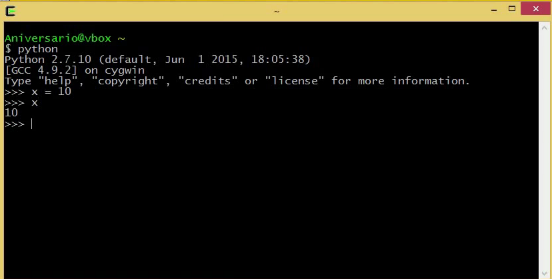

Periodismo de Datos II. Capítulo 1

Esta es la primera entrega de un tema que puede ser de tu interés.

Hace un tiempo dicté el curso uterino, online, virtual de Periodismo de Datos
I. En [este link](http://aniversarioperu.utero.pe/2014/03/23/certificado-del-curso-de-periodismo-de-datos/) podrás ver todos los capítulos.

En esa oportunidad traté de explicar el uso de software que ayude en la
descarga y procesamiento de datos.

Este segundo curso creo que será [hardcore (*particularly intense; thrillingly dangerous or erratic*)](https://en.wiktionary.org/wiki/hardcore).
Trataré de centrarme en el área de descarga de datos, ya que esta es la
actividad más importante del periodismo de datos. Sin datos *no somos nada*.

Otra novedad es que todas los capítulos serán vídeo-tutoriales. Por motivos de
trabajo necesito volverme ducho en hacer tutoriales y qué mejor manera de
experimentar y practicar que haciendo tutoriales para este curso.

Si aún no te matriculas aquí está [el formulario](https://docs.google.com/forms/d/1H4h5BUOZlDJNgwOPXgdGXLUoKhfzhh3qDjb1TxMKv58/viewform?c=0&w=1).

Ojo que el curso es gratuito pero la emisión de certificados costará 20 dólares
americanos.

Además será requisito hacer la tarea, la que consiste en contestar una o dos
preguntas que dejaré durante cada capítulo.

## Aquí va la primera entrega:

https://www.youtube.com/watch?v=vGE3GNl3aSE

## Tarea para la casa
En el vídeo verás que la línea de comandos instalada tiene el *prompt* con el
siguiente texto: **Aniversario@vbox**.

Diga usted cuál es el texto que aparece en el *prompt' de su computadora luego
de la instalación de cygwin.

Pueden enviar las repuestas por [email yoni@aniversarioperu.me](yoni@aniversarioperu.me) o
[Twitter @aniversarioperu](https://twitter.com/aniversarioperu).

