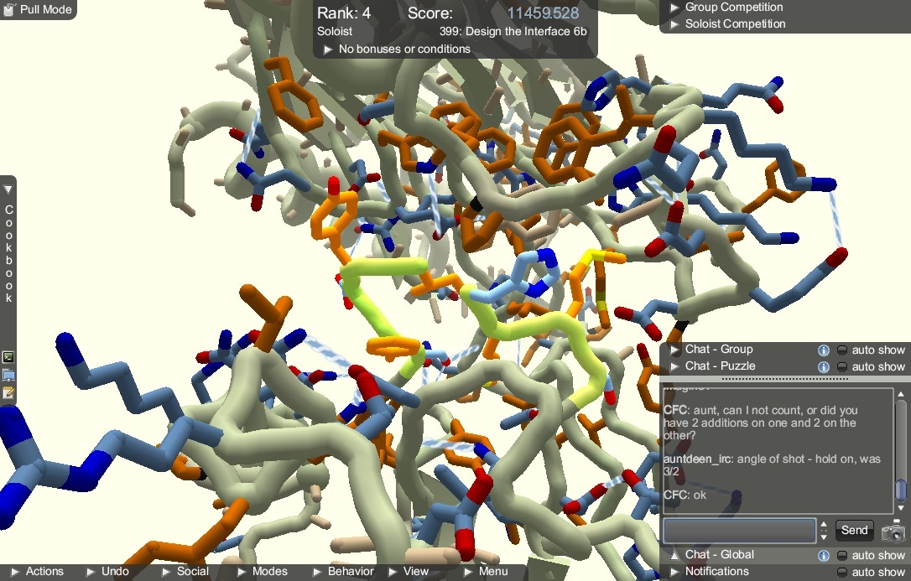

# Crowdsourcing Science FoldIt: la obra, el juego y arte de plegar proteínas.

Por Renzo Gutiérrez Loli [@renzogutlol](https://twitter.com/renzogutlol)

A mediados de la década del 1950, Frederick Sanger cocinaba en su mente
la interpretación de unos ensayos que había realizado para evaluar el
patrón de migración de pequeños fragmentos de insulina que había
obtenido mediante la digestión con tripsina. La referencia que obtuvo al
verter el extracto sobre una hoja de papel a la cual aplicó carga
eléctrica le permitió observar una distribución poco uniforme y sugirió
que esto se explicaba en la diversidad de carga eléctrica y solubilidad
entre los "fragmentos".

Poco después reagruparía estos fragmentos para deducir la estructura de
la insulina y postuló que el patrón único de migración, al que llamaría
"huellas dactilares", se explicaba en la secuencia específica de
aminoácidos que conformaba a esta hormona y que le atribuían en conjunto
propiedades electroquímicas. Estas aproximaciones le valieron el Premio
Nobel de química en 1958 y significaron la consolidación de la
bioquímica en la era moderna y el respaldo para el desarrollo de áreas
como la biología molecular, genética y genómica.

De vuelta a nuestros días podríamos decir que por más de 50 años se
conoce que la conformación tridimensional de una proteína está gobernada
por su secuencia de aminoácidos. Sin embargo, la predicción de la
estructura sigue siendo una gran interrogante que limita la comprensión
de como largas cadenas de aminoácidos se pliegan en configuraciones
específicas y desafortunadamente la tecnología aun no logra resolver y
aproximar este fenómeno a los niveles deseados, incluso para los
dominios de las proteínas más pequeñas.

Con el aporte de la bioinformática y la biología de sistemas, el diseño
de complejos algoritmos que consideren de manera ideal factores
termodinámicos y espaciales tan delicados como la energía libre, la
repulsión atómica y el ángulo de torsión en los residuos; se ha
convertido en la herramienta más visible para hacerle frente a esta
necesidad. En contraste, el limitado control de estos factores
comprometen finalmente la predicción estructural y es esta la principal
razón de la brecha entre los diseños experimentales *in silico* y su
extrapolación a sistemas biológicos.

Con este mismo panorama, en 2008 un grupo de investigadores de la
Universidad de Washington presentaba a Rosetta: un algoritmo para la
resolución de estructuras tridimensionales que daba cierta flexibilidad
en cuanto a los parámetros atómicos de repulsión que facilitarían la
búsqueda de una conformación energéticamente similar a la nativa. ¿Pero
que tenía de distinto Rosetta de los tantos otros algoritmos? La
presentación: El lanzamiento de Rosetta se hizo a través de
*FoldIt[1](#ref1)*, un vídeo juego on-line a manera de
puzzle de libre descarga con el que se pretendía comprometer a todo
público, incluyendo escolares, educadores y en general a no-científicos
con el desarrollo de estrategias que permitan resolver los misterios del
plegamiento en las proteínas.

FoldIt permite a los jugadores comprender mediante tutoriales la
importancia de las proteínas como las nanomáquinas que rigen el
equilibrio en nuestro cuerpo y retan su imaginación con diversos puzzles
en los cuales es posible editar una configuración especifica de
aminoácidos al mejor estilo de un cubo de Rubik, hasta conseguir la
conformación energéticamente más eficiente donde cada movimiento es
recompensado con puntaje de acuerdo a la estabilidad en la interacción
entre los residuos.

Al final de cada partida los jugadores pueden comparar puntajes,
participar de foros y crear grupos para la resolución de un determinado
puzzle, además de conseguir logros y participar en torneos semanales que
aumentan su visibilidad en la comunidad de *FoldIt-players*.

Con los modelos propuestos de cada partida, Rosetta puede incorporar el
patrón de movimientos en la búsqueda de una conformación
termodinámicamente más estable para las regiones propuestas como puzzles
que no son otra cosa que fragmentos reales de proteínas de alto impacto
clínico como las fibras Beta-amyloides en el mal de Alzheimer, la enzima
transcriptasa reversa del virus del sida (HIV-1)[2](#ref2),
el complejo LF-PA (Lethal factor-protective antigen) de la toxina del
anthrax y la interacción de un anticuerpo con una proteína de membrana
en el virus del herpes (HSV-1), por mencionar algunos
casos.[3](#ref3)

Recientemente se han incorporado propuestas que permitan diseñar
endonucleasas que puedan erradicar *Anopheles gambiae* o lograr que
cualquier otro mosquito participe como vector de Malaria e investigar
sobre las características estructurales de la proteína supresora de
tumores p53; y al igual que en los casos anteriores se busca la
participación de los FoldIt-players alrededor del mundo para generar los
mejores modelos.

En pocas palabras cada partida de FoldIt proporciona nuevas perspectivas
sobre la naturaleza celular y molecular en estas enfermedades, además de
generar alcances sobre regiones que pueden ser de utilidad en el diseño
de vacunas y/o drogas con potencial terapéutico.

En palabras de Zoran Popovic y David Baker, fundadores del proyecto
FoldIt, la clave para el éxito de su algoritmo radicaba en la habilidad
de los seres humanos de reconocer patrones y la amplia variedad de
métodos exploratorios que adoptamos ante un problema.

> *Consideramos que el razonamiento espacial humano podría mejorar el
muestreo del espacio conformacional en las proteínas y que la búsqueda
de configuraciones óptimas por métodos estocásticos pueden ser
remplazados por la habilidad humana de toma de
decisiones[4](#ref4)*

De esta forma, los seres humanos tenemos la capacidad de generar más
estrategias ante un problema que las que pueda hacer una computadora
limitada a un código fuente. Y en estos detalles radica la clave de la
estrategia *crowdsourcing*.

**VIDEO 1: FoldIt. An online folding protein game. Speaker: David Baker.
Nature Video [https://vimeo.com/40106186](https://vimeo.com/40106186)**

Los resultados de los 2 primeros años de este proyecto fueron objeto de
una publicación en Nature[5](#ref5) donde se destaca la
participación de los más de 57 000 FoldIt-players alrededor del mundo,
convirtiéndose en uno de los esfuerzos colectivos interdisciplinarios
más extensos en el panorama científico y que sin duda ha tenido un
impacto significativo en el trabajo de diversos grupos de investigación
en todo el mundo.

El grupo de Popovic y Baker señala que el impresionante potencial de un
marco de investigación conformado por el híbrido humano-computador
propuesto a través de un videojuego masivo.

> El enfoque de FoldIt debe ser fácilmente extendido a otras áreas en los
cuales pueda usarse la habilidad sensorial y tridimensional de los seres
humanos en la resolución de problemas. Finalmente nuestros resultados
indican que el progreso científico es posible si se canaliza incluso la
pequeña proporción de energía invertida en jugar
videojuegos.[6](#ref6)

Son diversas las iniciativas que se han generado bajo este concepto y se
ha demostrado que el fenómeno de *crowdsourcing* no es excluyente a
otras áreas de la ciencia: propuestas de ecología de poblaciones como
*Hummingbirds at Home[7](#ref7)* también se valen de la
participación de *‘citizen scientists’* de distintas partes del mundo para
la recolección de datos de diversidad de picaflores, tarea que en la
práctica real llega a ser insondable incluso para pequeñas áreas.

**VIDEO2: Hummingbirds at Home
Tutorial**[**https://vimeo.com/60793789**](https://vimeo.com/60793789)

Para el caso particular de FoldIt, este videojuego ha servido como base
para la planificación de proyectos de complementación/implementación de
contenidos en ciencias naturales en algunos colegios del Perú, dándole
la oportunidad a escolares de fortalecer sus aptitudes hacia una carrera
de ciencias mediante una alternativa lúdica y entretenida.

¿Podría estar el próximo Frederick Sanger alistándose para un nuevo y
tedioso día de clases en algún colegio de nuestro Perú? Es probable, y
sin la motivación ni las herramientas necesarias, el destino del capital
científico humano podría terminar en el irremediable anonimato. Sin
embargo, en la era de la información, cambiar el panorama de la ciencia
en nuestro país podría estar a una partida de distancia. ¿Te animas a
jugar?

De [este link](http://fold.it/portal/) puedes descargar el juego y comenzar a doblar proteínas.

Por Renzo Gutiérrez Loli (@renzogutlol)

<a name="ref1">1.</a> FoldIt. Solve puzzles for science. Disponible
en: http://fold.it/portal/info/science

<a name="ref2">2.</a> Firas Khatib, Frank DiMaio, Foldit Contenders
Group, Foldit Void Crushers Group, Seth Cooper, Maciej Kazmierczyk,
Miroslaw Gilski, Szymon Krzywda, Helena Zabranska, Iva Pichova, James
Thompson, Mariusz Jaskolski, David Baker (2011). Crystal structure of a
monomeric retroviral protease solved by protein folding game players.
Nature Structural and Molecular Biology 18, 1175-1177, 2011.

<a name="ref3">3.</a> Rosetta@Home Disease-related Research by
Rosetta. Disponible en:
[http://boinc.bakerlab.org/rosetta/rah\_medical\_relevance.php](http://boinc.bakerlab.org/rosetta/rah_medical_relevance.php)

<a name="ref4">4.</a> Seth Cooper, Adrien Treuille, Janos Barbero,
Andrew Leaver-Fay, Kathleen Tuite, Firas Khatib, Alex Cho Snyder,
Michael Beenen, David Salesin, David Baker, Zoran Popović, \>57,000
Foldit players (2010). The challenge of designing scientific discovery
games. International Conference on the Foundations of Digital Games,
2010.

<a name="ref5">5.</a> Seth Cooper, Firas Khatib, Ilya Makedon, Hao Lu,
Janos Barbero, David Baker, James Fogarty, Zoran Popović and the Foldit
players (2010). Predicting protein structures with a multiplayer online
game. Nature, 466(7307), 756-760.

<a name="ref6">6.</a> Seth Cooper, Firas Khatib, Ilya Makedon, Hao Lu,
Janos Barbero, David Baker, James Fogarty, Zoran Popović, Foldit players
(2011). Analysis of Social Gameplay Macros in the Foldit Cookbook.
Foundations of Digital Games, 2011.

<a name="ref7">7.</a> Audubon Hummingbirds at Home. Disponible en:
http://www.hummingbirdsathome.org/
