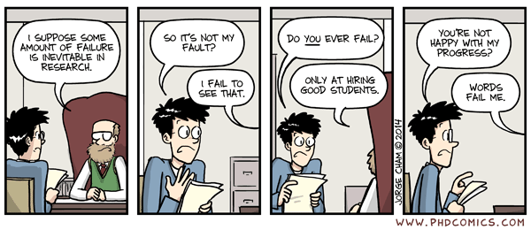
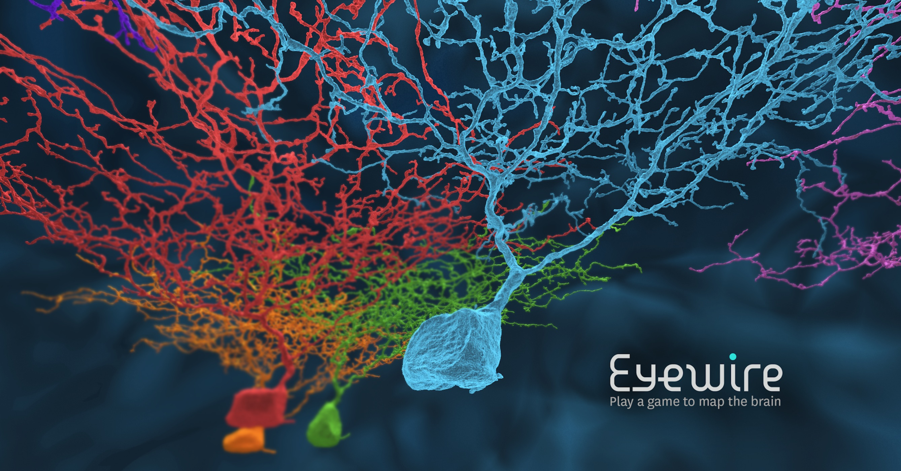
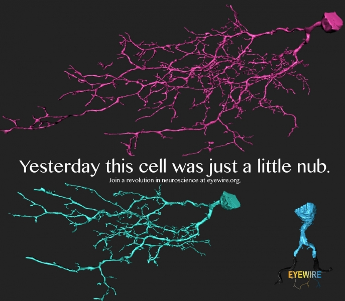

# Crowdsourcing Science II: Eyewire, un juego para mapear el cerebro

# Por Renzo Gutiérrez Loli [\@renzogutlol](https://twitter.com/renzogutlol)

Al igual que el fenómeno generado por *FoldIt* que presentamos en la
entrega anterior (puedes ver el [artículo aquí: FoldIt](http://utero.pe/2015/02/16/crowdsourcing-science-foldit-la-obra-el-juego-y-arte-de-plegar-proteinas/)),
existen muchas otras herramientas de libre acceso que utilizan al
híbrido humano-computador para la resolución de preguntas científicas,
valiéndose de la compleja capacidad humana de toma de decisiones y el
diseño estratégico tridimensional que adoptamos ante un problema.

En la actualidad, los *citizen scientists* se han convertido en una parte
no presencial pero infinitamente necesaria en grupos de investigación
que ejecutan proyectos a gran escala. Si bien hasta finales del siglo
XX, el paradigma de la investigación involucraba normalmente esfuerzos
colectivos de distintos grupos alrededor del mundo, como lo fue en su
momento el Proyecto Genoma Humano, la discusión siempre estuvo
restringida a profesionales.

El poder de la Internet ha hecho posible que la participación de no
especialistas tenga cada vez mayor impacto en las labores de
investigación, hasta convertirse en muchos casos en una necesidad
inherente. Tal como sugiere Zoran Popovic, co-creador de FoldIt, en un
futuro no muy lejano es posible que las publicaciones científicas se
basen en esfuerzos comunitarios tan extensos que desvirtúen toda
filiación:

> “Si las cosas van según lo planeado, es muy probable que las listas
> masivas de autoría tras un artículo sean una práctica común en el
> futuro.”[1](#ref1)

La factibilidad de generar una gran cantidad de datos en poco tiempo es
una cualidad con la que sueña cualquier jefe de laboratorio. Sin
embargo, en la realidad, la obtención de datos toma tiempo; tanto en la
recolección como en la capacitación para la generación de los mismos.
Sin mencionar que esto tiene un costo que no en todos los escenarios es
cubierto fácilmente por el siempre modesto presupuesto.

Afortunadamente, es posible obtener datos personalizados gracias a la
participación voluntaria de millones de personas, logrando así
aproximaciones experimentales que habrían tomado varios meses de
trabajo.

Al igual que FoldIt también hay otras historias que nos muestran el
poder de la herramienta *crowdsourcing*. A mediados del año 2000,
Sebastian Seung, un físico teórico recién graduado en Harvard, llegaba
al departamento de Ciencias Cognitivas y del Cerebro del MIT para una
estancia postdoctoral. Seung había abandonado años atrás la bizarra
discusión en torno a la Teoría de las Cuerdas y se aventuró en darle un
nuevo sentido a su vida académica.

Tal como lo menciona en una entrevista a The New York Times, Seung se
mostró inicialmente interesado en describir físicamente los fenómenos
que tomaban lugar en el cerebro y estaba especialmente motivado por los
desafíos que la Neurociencia, un área emergente de la biología, había
propuesto en las últimas décadas y que la tecnología, a pesar de generar
una gran cantidad de datos, había fracasado en resolver.

> “Hemos fallado en resolver preguntas sencillas. La gente quiere saber
> que es la conciencia; quieren que descubramos el origen de la
> esquizofrenia.
> Y ni siquiera podemos entender porque una neurona responde en una
> dirección y no en la opuesta.” [2](#ref2)

Seung había encontrado en esta limitante el sustrato ideal para formular
sus primeras preguntas y adentrarse en el misterioso mundo del cerebro,
que hasta entonces había sido traicionero con muchos de sus colegas en
el MIT.

Y no era para menos, cuando pensamos en el cerebro, podemos abrir sin
querer una caja de pandora. Es un órgano complejo que gobierna procesos
tan delicados como el movimiento, el aprendizaje; y en general toda
percepción que tenemos de nuestro entorno es asimilada por este
enmarañado de redes complejas. Y como en toda organización, hay unidades
elementales que en conjunto hacen posible la ejecución de cualquier
tarea.

En el caso particular del cerebro, las neuronas son las unidades básicas
estructurales y se comunican unas a otras por estímulos eléctricos y
químicos en un proceso denominado sinapsis.

Pero, ¿qué tanto sabemos de nuestro cerebro? Sabemos, por ejemplo,
¿cuantas neuronas tenemos? La respuesta es sí[3](#ref3), pero
es un número tan insondable que probablemente no estamos familiarizados
con su magnitud, así que pongámoslo de esta forma: si cada neurona de
nuestro cerebro fuera una persona, podríamos poblar la ciudad de Lima
casi 11 mil veces.[4](#ref4)

Ahora bien, si nos preguntamos por la cantidad de sinapsis que alberga
este órgano, tendríamos que llevar la apuesta a otro nivel. Considerando
que solo una neurona realiza entre 1 000 y 10 000
sinapsis[5](#ref5), podemos tener una idea del impresionante
desafío que implica la búsqueda de una aproximación funcional de este
sistema.

En pocas palabras, sabemos poco o casi nada de nuestro cerebro. Ya que
generar un perfil físico de todas las redes que toman lugar en él
implicaría, para el mejor equipo de profesionales equipados con
tecnología de punta, cientos de horas de trabajo abnegado solo para
reconstruir una sola neurona. Dicho de otra forma, el Conectoma, o el
diagrama del cableado de nuestro cerebro, es conjuntamente con el
Proyecto Genoma Humano, una de las propuestas más ambiciosas de nuestra
época y en él descansan respuestas para muchas de las interrogantes que
arrastramos de décadas atrás.

A pesar de estar consciente de este panorama, Seung decidió apostar por
este descabellado rompecabezas. Fue así que, junto a otros colaboradores
en Princeton, empezó en 2006 una batalla por un diseño experimental sin
precedentes y casi 6 años después, en 2010, *EyeWire* era presentado
como la primera gran herramienta para hacerle frente al desafío del
Conectoma.

**[Video 1. <https://www.youtube.com/watch?v=DKzfxzM-CqI> ]**

Distinto a la naturaleza de su propósito, EyeWire es otro videojuego que
convoca a la característica innata de los seres humanos por competir y
resolver tareas, canalizando estas aptitudes en la generación de
resultados. Donde una vez más el ejército de escolares y no-científicos
son el componente más valorado de esta plataforma.

Pero, ¿Cómo funciona? El equipo de Seung generó una colección de
microfotografías de distintos planos del cerebro que apiladas unas a
otras permiten generar un perfil tridimensional a manera de bloques. Sin
embargo, es difícil encontrar las relaciones espaciales entre una imagen
y la siguiente. Es decir, si en una de las fotografías se logra
identificar una célula, encontrar la continuación de esta en la
siguiente foto es una tarea bastante complicada y para el caso
particular de una neurona se sabe que las extensiones a manera de brazos
tienen distribuciones muy diversas. Es precisamente aquí donde los
modelos generados por computadora han mostrado una gran cantidad de
incongruencias.

**[Video 2. Modelando una neurona, paso a paso
<https://www.youtube.com/watch?v=HS0kqc2Y5ss> ]**

Afortunadamente, la inteligencia espacial de un ser humano sobrepasa las
limitaciones de cualquier algoritmo y, de esta forma, es posible modelar
las extensiones de una neurona con mayor precisión. Sin embargo,
analizar uno a uno cada bloque sería una tarea extenuante para un solo
grupo de especialistas, además de ser logísticamente inviable.

De este modo, EyeWire ha reclutado a más de 160 mil jugadores repartidos
en 145 países que día a día colaboran en generar nuevas perspectivas
sobre el paradigma funcional y estructural de nuestro cerebro,
analizando en cada partida los bloques restantes. De esta forma se
resuelven las extensiones de cada neurona proporcionando datos
espaciales que se pueden correlacionar entre sí.

Gracias a este apoyo, la tarea de mapear la totalidad del conectoma
está más cerca de convertirse en una realidad. Dejando de lado su
espíritu visionario, Seung está convencido que de continuar con esta
metodología es muy probable contar con el primer perfil completo y
funcional del conectoma dentro de los próximos 30
años.[6](#ref6)

Actualmente existen equipos de jugadores dispersos en varias partes del
mundo participando en eventos como *Neuropia[7](#ref7)* donde
se suman esfuerzos en la resolución o en el rediseño de una matriz
neuronal. A través de este evento el 12 de marzo último, los creadores
compartieron con satisfacción que las primeras 100 células habían sido
resueltas.[8](#ref8)

Y los réditos también alcanzan a estos héroes anónimos de la ciencia:
pueden convertir un pasatiempo en una herramienta complementaria con
fines académicos y en el mejor de los casos, esta participación remota
puede ser la piedra angular *en la consolidación de una vocación
científica.*

> “Nuestro objetivo final es que cualquier persona sin distinción de edad
> u ocupación tenga la oportunidad de jugar y que eventualmente se
> convierta en un candidato al Premio Nobel.”[9](#ref9)*

De esta forma miles de personas, desde escolares a jubilados, forman
parte de esta gran búsqueda por entendernos un poco más a nosotros
mismos. Sin embargo, el universo de jugadores peruanos es muy reducido,
y en general la participación de nuestro país en esta gran revolución
tecnológica sigue siendo muy discreta.

¿El ingenio peruano hará su aparición? ¿Te atreves a tomar la posta?
Puedes empezar a jugar aquí: <https://eyewire.org/signup>

Por Renzo Gutiérrez Loli [\@renzogutlol](https://twitter.com/renzogutlol)

<a name="ref1">1.</a> New York Times, Science (2010) In a videogame,
Tackling the complexities of Protein Folding. Disponible en:
<http://www.nytimes.com/2010/08/05/science/05protein.html>

<a name="ref2">2.</a> All the circuits are busy: Enterview to Sebastian
Seung. The New York Times (2014). Disponible en:
<http://www.nytimes.com/2014/05/27/science/all-circuits-are-busy.html>

<a name="ref3">3.</a> Azevedo, F. A., Carvalho, L. R., Grinberg, L. T.,
Farfel, J. M., Ferretti, R. E., Leite, R. E., ... & Herculano‐Houzel, S.
(2009). Equal numbers of neuronal and nonneuronal cells make the human
brain an isometrically scaled‐up primate brain. Journal of Comparative
Neurology, 513(5), 532-541.

<a name="ref4">4.</a> Aproximación considerando la población de Lima
como 8 millones de habitantes.

<a name="ref5">5.</a> Washington University. Brain Facts and Figures.
‘Number of synapses for a typical neuron’ Disponible en:
<http://faculty.washington.edu/chudler/facts.html#neuron>

<a name="ref6">6.</a> Connectome: How the brain’s wiring makes us who
we are by Sebastian Seung. Disponible en:
<http://connectomethebook.com/>

<a name="ref7">7.</a> Eyewire, countdown to Neuropia: Phase 2 complete!
Disponible en:
<http://blog.eyewire.org/countdown-to-neuropia-phase-2-complete/>

<a name="ref8">8.</a> Eyewire, 100 cells completed. Disponible en:
<http://blog.eyewire.org/100-cells-complete/>

<a name="ref9">9.</a> Foldit: Competitive Protein Folding for Medical
Science. Disponible en:
<http://www.engr.washington.edu/facresearch/highlights/cse_foldit.html>

