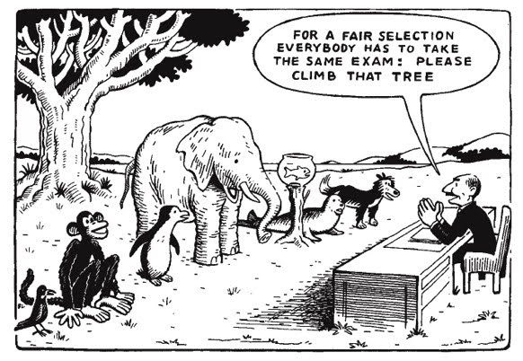
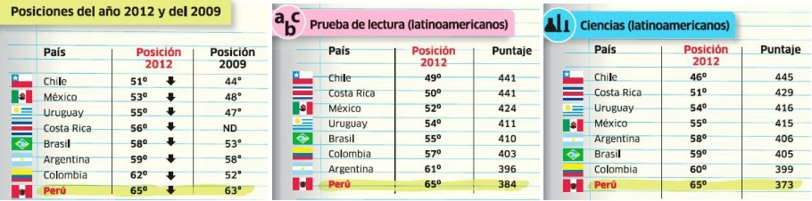
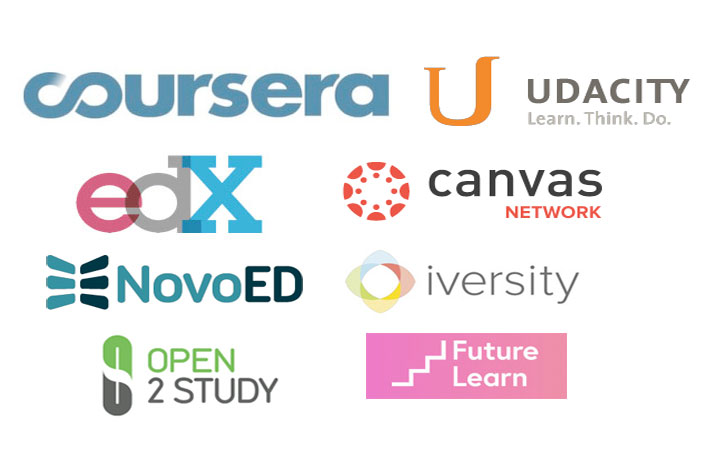
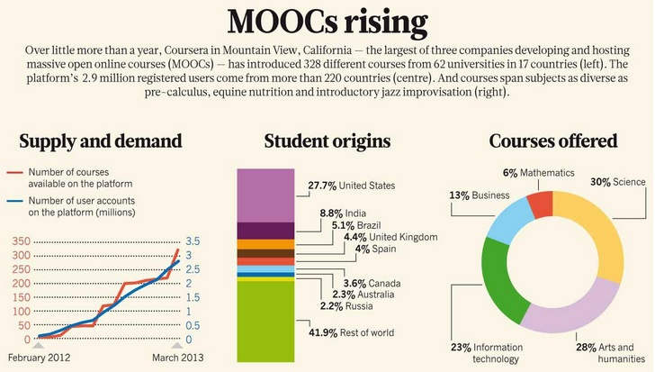
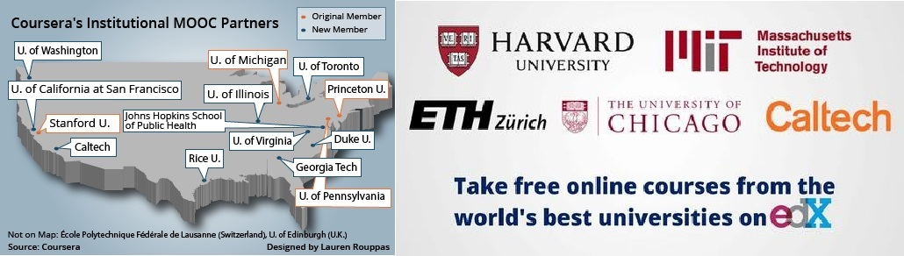

# Blended Learning: El fenómeno MOOC y las oportunidades de la educación por Internet.

Por Renzo Gutiérrez Loli [\@renzogutlol](https://twitter.com/renzogutlol)

Las lecciones de ciencias naturales, esencialmente a nivel de la
educación básica regular han mantenido por décadas los mismos
componentes de alcance pedagógico: un texto referencial del curso, que
haga las veces de guía y de lectura complementaria a las clases, en
algunos casos el soporte multimedia y la atención icónica a un
instructor o docente que pueda fomentar la consolidación de estos
conocimientos a través de asignaciones o tareas. Independientemente de
que esta dinámica de aprendizaje tiende a ser efectiva, existen aún una
gran cantidad de limitantes para en la ejecución de este modelo ya que
se asume al educando como un grupo homogéneo con habilidades similares.

En la realidad ocurre todo lo contrario. No es difícil observar que en
un salón de clases converge una red compleja de competencias que en
adición a la condición socioeconómica y al limitado acceso a fuentes de
información, reconocen al alumno como un ente con habilidades únicas y
distintas a las de sus pares. Por esta razón la metodología tradicional
de enseñanza es insuficiente para explotar las aptitudes de la totalidad
de los estudiantes.

**(FIG 1) [‘Para una selección justa, todos tomarán el mismo examen:
Trepen ese árbol!’]**

Es probablemente esta falta de versatilidad en las herramientas de
aprendizaje lo que ha contribuido a que el estudiante promedio genere un
rechazo a sus cursos de ciencias naturales, ignore el impacto de las
ciencias básicas en su entorno y que eventualmente abandone
tempranamente una vocación relacionada a estas
áreas.[1](#note1)

Paralelamente, en Latinoamérica y en otras regiones en vías de
desarrollo, la educación es una lucha social. Las carencias en las vías
de información y el acceso a tecnología son los retos más grandes a los
que se enfrenta a una transformación real en la educación pública. Por
citar un ejemplo concreto, el nivel de alfabetización en Sri Lanka, una
isla al sur de la India, es del 91% de la población. Sin embargo, el
nivel de ‘alfabetización tecnológica’ apenas alcanza el
20.3%[2](#note2), es decir que apenas una quinta parte de la
población reconoce o ha tenido contacto con alguna plataforma
tecnológica con la que puede complementar su educación o
autocapacitarse. Este panorama condena a los alumnos de esta nación a un
bajo rendimiento, muy a pesar de los esfuerzos en alfabetización y
capacitación docente que se han implementado en la última
década.[3](#note3)

Estas evidencias señalan una vez más la insuficiencia de la pedagogía
tradicional para hacer efectivo el aprendizaje y destaca la necesidad
del desarrollo de parques tecnológicos que respalden de manera tácita
cualquier política educativa. Partiendo de esta observación, la falta de
infraestructura tecnológica es una constante en las regiones en vías en
desarrollo que comparten a su vez una baja calidad educativa.

Es en este limbo de carencias y oportunidades donde la Internet cumple
un rol critico como vector de información. A pesar de que el acceso a
internet se entiende como la adquisición de un servicio y se le asocia a
la realidad económica de cada región, algunas cifras demuestran que la
penetrabilidad de la Internet es una característica inherente de varias
naciones en vías de desarrollo y que no necesariamente aseguran mejoras
en la calidad educativa. Por ejemplo para el caso de Perú, el costo del
acceso a internet representa el 3.9% del PBI per cápita, ubicándonos por
debajo de países como Uruguay, Venezuela, Chile y Argentina donde la
internet es visiblemente más cara[4](#note4); sin embargo la
contraparte señala que hacia 2012, Perú sigue ocupando el último lugar
en estándares educativos en Latinoamérica según el informe PISA para ese
año.[5](#note5) En pocas palabras, tenemos más posibilidades
de acceder a internet, por ende a información, pero esto no se traduce
en mejoras a nivel educativo.

**(FIG 2) [Fuente: OCDE, Informe Pisa 2012.]**

Por esta razón la necesidad de una herramienta que pueda conciliar la
tecnología con el aprendizaje (*Blended Learning*) se hace cada vez más
necesaria para hacer frente a los desafíos de una educación más
inclusiva, que sea gestora y promotora de conocimiento, y cuyos
productos no se limiten al carácter netamente formativo.

Hacia noviembre de 2012 el diario norteamericano *The New York Times*
dedicaba un extenso artículo[6](#note6) donde hacía eco a un
fenómeno sin precedentes en la persecución de los objetivos de la
educación tradicional, que había empezado apenas meses atrás. Los cursos
MOOC (Massive Online Open Courses) se presentaban como una herramienta
novedosa para el soporte didáctico, y que a diferencia de los cursos
tradicionales que involucraban un costo por matrícula, un creditaje en
función a los contenidos y donde el límite de inscripción está limitado
a unas pocas vacantes para ‘asegurar’ la interacción con el instructor.
Los MOOCs son en esencia todo lo contrario: son cursos gratuitos, no
necesariamente involucran un creditaje y tienen carácter masivo. A pesar
de ello, pocas personas parecían estar al tanto de este tipo de
aprendizaje y la aplicación de los MOOCs parecía confinarse a los
procesos de capacitación continua ofrecidos por algunas empresas para
sus trabajadores.

**(FIG 3) [Plataformas de MOOCs: Coursera, edX, NovoEd, Udacity entre
otras.]**

Poco menos de 3 años después, los MOOCs cuentan en la actualidad con más
de 5 millones de estudiantes con distintos rangos de edad dispersos en
todo el mundo. Entre ellos escolares, universitarios, docentes y
autodidactas que encuentran en esta herramienta una oportunidad
inmejorable para complementar su educación o simplemente saciar su
curiosidad. La característica *self-paced* de los cursos ofrecidos bajo
esta modalidad permite a los estudiantes avanzar a un ritmo en función a
su grado de experiencia. Es presumiblemente esta cualidad la que explica
la gran acogida a estas plataformas y que sigue creando adeptos a un
ritmo considerablemente mayor al de Facebook en sus inicios.

Plataformas como Coursera, edX y Udacity por mencionar algunas,
presentan cada mes una gran diversidad de cursos gratuitos dirigidos a
todo público con lecciones con distintos niveles de profundidad y
complejidad. Ciencias naturales, genética, matemáticas, lenguajes de
programación, ciencias sociales, económicas y antropológicas son solo
algunas de las áreas en la que se pueden navegar para encontrar un curso
a la medida de la experiencia y a los objetivos que considere el usuario
para sí mismo a corto-mediano plazo. Cada curso cuenta con contenidos
semanales respaldados por video-lecturas, ensayos, evaluaciones finales
por capítulo y material complementario con los que se puede aprovechar
al máximo los contenidos.

No obstante, el *networking* entre los participantes es un componente
esencial para consolidar el aprendizaje, por esta razón cada módulo
cuenta con un foro donde una vez finalizada la lección los estudiantes
pueden plasmar sus dudas, impresiones y fomentar la discusión en torno a
tópicos de interés común, con el respaldo y la asistencia de los
instructores. Esta herramienta fomenta el pensamiento crítico desde un
clima multidisciplinario para la resolución de un problema, y es a este
nivel donde tanto escolares como profesionales se enriquecen con los
distintos enfoques con los que se puede abordar una pregunta. Por esta
razón muchos de los cursos ofrecidos por estas plataformas le asignan
una parte importante de la calificación final del curso a la
participación en los foros.

**(FIG 4) [Características de los MOOCs. Fuente: Scientific American
2013]**

El dogmatismo de la educación tradicional invita a repetir el ideal
prejuicioso que sugiere ‘ningún curso por internet se comparará a la
experiencia de una clase presencial’ y esto es en parte cierto. Sin
embargo un estudio publicado recientemente en la prestigiosa revista
*Cell* se destaca el impacto positivo del uso de MOOCs como como un
recurso para fomentar el interés en un nuevo tema y como una herramienta
con carácter introductorio (pre-clases) que proporcionan al estudiante
la información necesaria con la que posteriormente pueda discutir a
profundidad los mismos tópicos en la escuela. En conjunto estas
observaciones se tradujeron en un rendimiento más uniforme en las
evaluaciones, sumado a que los alumnos pudieron conseguir los objetivos
trazados por el docente para la unidad o módulo.[7](#note7)

No por nada las universidades más prestigiosas han reconocido el valor
de esta herramienta y han abierto sus puertas a través de estas
plataformas online, donde ofrecen una amplia gama de cursos cuyos
contenidos son actualizados constantemente.

**(FIG 5) [Harvard, Stanford, Princeton, MIT, Duke, Rice y otras
instituciones con MOOCs.]**

Por si fuera poco, los instructores son miembros reales del staff de
profesores de estas instituciones muchos de ellos con reconocida
trayectoria académica y no ‘community managers’ como aun sostienen
algunos escépticos. Destaca por ejemplo Robert Shiller, profesor
principal de la Escuela de Ciencias Económicas de Yale University y
Premio Nobel de Economía 2013, que estará feliz de darte una clase
introductoria de Finanzas y Mercados Capitales a través de
Coursera.[8](#note8)

Finalmente, a pesar de que el aprendizaje por MOOCs se vale de la
confianza de recursos intangibles, los objetivos que persigue este
modelo educativo no pueden ser más reales. En palabras de la cofundadora
de Coursera, Daphne Koller, la educación aun es un privilegio en pleno
siglo XXI.

> “En algunos lugares como Sudáfrica, no se accede fácilmente a la
> educación. Allí el sistema educativo, tanto el elemental como el
> superior, se estableció históricamente para la minoría blanca durante el
> *apartheid*. Como consecuencia de ello en la actualidad no existen
> suficientes vacantes para muchos de los que desean y merecen una
> educación de alta calidad.”

Sin ir muy lejos, esta misma situación se vive con otros matices en
varios rincones de nuestro país, donde la desigualdad es el principal
factor de retroceso en la ejecución de cualquier proyecto social llámese
salud, tecnología o educación. Sin embargo, en esta dificultad descansa
también una gran oportunidad. La dinámica del aprendizaje gratuito por
MOOCs trata de rescatar la mística del carácter inalienable de la
educación y de lograr implementarse al sistema tradicional podríamos dar
pie a la construcción de un nuevo paradigma que enfrente directamente
los principales problemas del escenario nacional.

En primer término, el acceso a educación se establecería verdaderamente
como un derecho fundamental donde cualquier persona con la capacidad y
motivación necesaria, podría desarrollar y potenciar sus habilidades
para mejorar autónomamente su calidad de vida, la de su familia y la de
su comunidad. En segundo lugar, se fomentaría el aprendizaje continuo.
Es desalentador que para muchos el aprendizaje termine al completar la
escuela o la universidad, cuando se ha demostrado que la capacitación es
clave para optimizar las utilidades de un oficio o profesión.

Finalmente, se impulsaría una ola de innovación y emprendimiento, ya que
en todas partes hay talento que desaparece en el más injusto anonimato
al estar condicionados a la pobreza o a la falta de oportunidades. No es
difícil imaginar que si se pudiera ofrecer una educación inclusiva, de
calidad y que vaya de la mano con las tecnologías de la información,
esta sería capaz de producir la próxima gran idea a nivel científico o
social que podría hacer del Perú un lugar mejor para todos.

Por Renzo Gutiérrez Loli (@renzogutlol)

<a id="note1">[1]</a> Handelsman, J., Miller, S., & Pfund, C. (2007).
Scientific teaching. Macmillan.

<a id="note2">[2]</a> UNICEF (2013). Sri Lanka Statistics. Disponible
en http://www.unicef.org/infobycountry/sri\_lanka\_statistics.html

<a id="note3">[3]</a> Department of Census and Statistics Sri Lanka,
(2009). Computer Literacy Survey - 2009. Recuperado de http://www.
statistics.gov.lk/CLS/BuletinComputerLiteracy\_2009. pdf

<a id="note4">[4]</a> International Telecomunication Union. (2013)
Measuring the Information Society. Place des Nations CH-1211 Geneva
Switzerland. ISBN 978-92-61-14401-2.

<a id="note5">[5]</a> Organización para la Cooperación y el Desarrollo
Económicos (OCDE). (2012) Resultados de PISA 2012 en foco. Programa para
la Evaluación Internacional de Alumnos. Disponible en:
http://www.oecd.org/pisa/keyfindings/PISA2012\_Overview\_ESP-FINAL.pdf

<a id="note6">[6]</a> Pappano, L. (2 de noviembre de 2012), The Year of
the MOOC. The New York Times. Disponible en:
http://www.nytimes.com/2012/11/04/education/edlife/massive-open-online-courses-are-multiplying-at-a-rapid-pace.html?\_r=0

<a id="note7">[7]</a> Stockwell, B. R., Stockwell, M. S., Cennamo, M.,
& Jiang, E. (2015). Blended Learning Improves Science Education. Cell,
162(5), 933-936.

<a id="note8">[8]</a> Financial Markets, Yale University. Offered
through Coursera. Disponible en
https://es.coursera.org/learn/financial-markets

