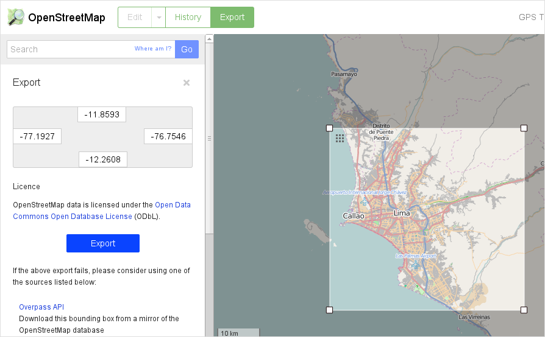
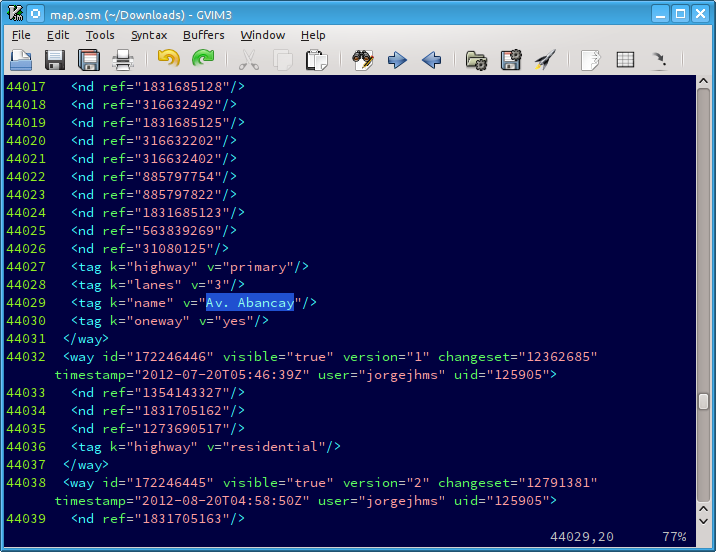

# Zonas álgidas del tráfico de Lima via tuiter

[OpenStreeMap](http://www.openstreetmap.org/) es una iniciativa que provee
mapas del mundo en formato abierto para que sea utilizable haciendo
procesamiento de datos. La mayoría de esta información ha sido proporcionada
por voluntarios.

Es posible descargar las coordenadas de las calles, avenidas, edificios,
negocios, etc que se encuentran la ciudad de tu interés.

Fui a la página de OpenStreeMap y descargé los datos para Lima en formato XML.
Se selecciona dentro de un rectángulo el área que necesitas y se hace click en
"Export". 

El archivo resultante contiente texto en formato XML y ve así:

Luego es necesario hacer un poquito de *data mining* para extraer las
coordenadas geográficas de cada calle, jirón y avenida de la ciudad de Lima.
Estas coordenadas serán muy útiles para lo que viene a continuación.

Se me ocurrió buscar en Twitter aquellos tuits georeferenciados que hayan sido
emitidos desde alguna de las calles o avenidas de Lima. Como ya tengo las
coordenadas, se usar el API 1.1 de tuiter para pedir tuits que hayan sido
emitidos en las cercanías de cada coordenada geográfica.

